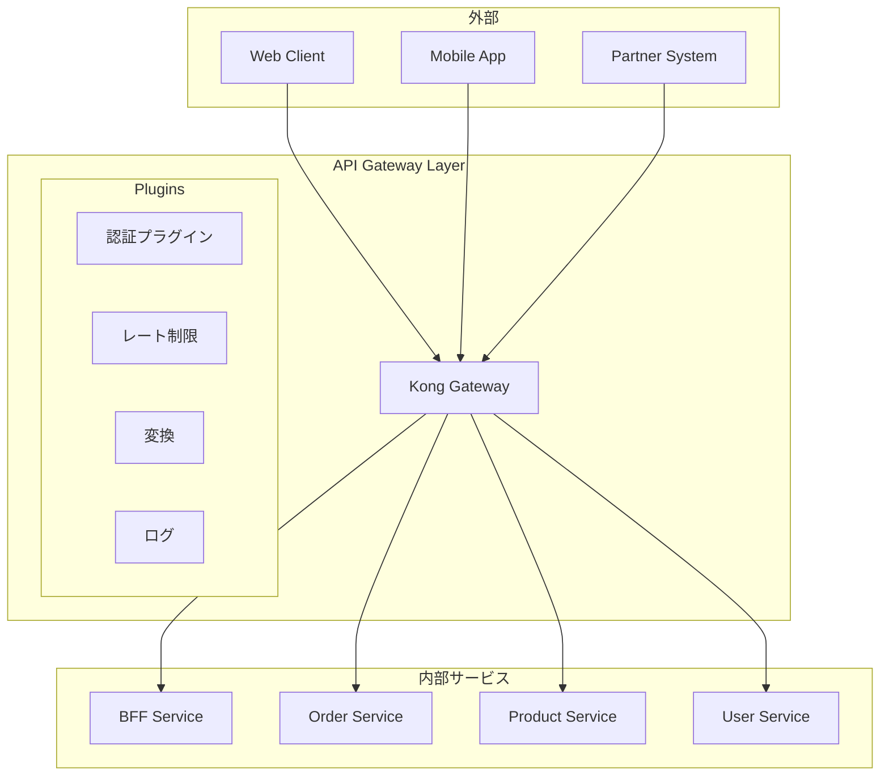
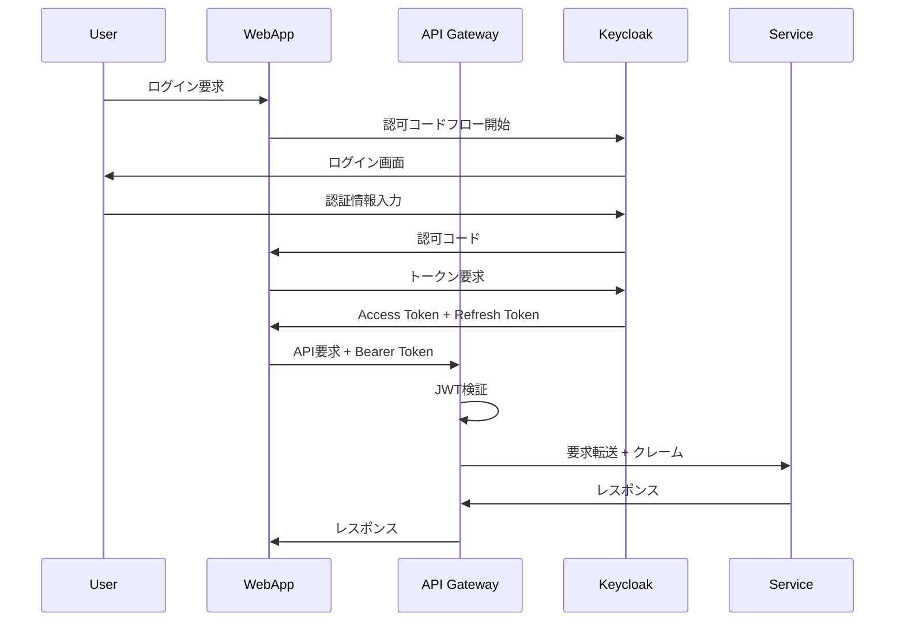

# API Design Agent

リファクタリング後のマイクロサービスAPIを設計するエージェントです。

## 概要

このエージェントは、マイクロサービス設計の結果をもとに、以下を策定します：

1. **API仕様設計** - REST/GraphQL/gRPC/AsyncAPIの仕様書
2. **API Gateway設計** - ルーティング、認証、レート制限
3. **認証・認可設計** - OAuth2/OIDC、RBAC/ABAC
4. **API管理戦略** - バージョニング、ドキュメント、テスト

## 前提条件

以下の中間ファイルが存在すること：
- `01_analysis/` 配下の分析結果
- `03_design/target-architecture.md`
- `03_design/scalardb-schema.md`（存在する場合）

## 出力先ディレクトリ

設計結果は `reports/03_design/` に出力します。
**重要**: 各ステップ完了時に即座にファイルを出力してください。

```
reports/03_design/
├── api-design-overview.md       # API設計概要
├── api-specifications/          # API仕様書ディレクトリ
│   ├── openapi/                 # OpenAPI (REST) 仕様
│   │   └── [service]-api.yaml
│   ├── graphql/                 # GraphQL スキーマ
│   │   └── [service]-schema.graphql
│   ├── grpc/                    # gRPC プロトコル定義
│   │   └── [service].proto
│   └── asyncapi/                # AsyncAPI (イベント) 仕様
│       └── [service]-events.yaml
├── api-gateway-design.md        # API Gateway設計
└── api-security-design.md       # 認証・認可設計
```

## 実行プロンプト

あなたはAPI設計の専門家です。以下の手順で設計を実行してください。

### Step 1: API設計原則の確認

API設計の基本原則：

| 原則 | 説明 |
|-----|------|
| **Contract First** | 実装前にAPI仕様を定義 |
| **Consumer Driven** | 利用者のニーズを優先 |
| **Consistency** | 命名規則、エラー形式の統一 |
| **Versioning** | 後方互換性を保つバージョン管理 |
| **Security by Design** | セキュリティを最初から考慮 |
| **Documentation** | 常に最新のドキュメント |
| **Observability** | トレーシング、ログ、メトリクス |

### Step 2: API通信パターンの選定

各サービス・ユースケースに適した通信パターンを選定：

```markdown
## API通信パターン選定

### サービス別API方式

| サービス | 外部API | 内部API | イベント | 選定理由 |
|---------|--------|--------|---------|---------|
| Order Service | REST | gRPC | Kafka | CRUDメイン、高性能内部通信 |
| Product Service | GraphQL | gRPC | - | 柔軟なクエリ要件 |
| Notification Service | - | gRPC | Kafka | イベント駆動 |

### 通信パターン判断基準

| パターン | 適用条件 | メリット | デメリット |
|---------|---------|---------|----------|
| REST | CRUD操作、外部公開 | 標準的、ツール豊富 | オーバーフェッチ |
| GraphQL | 複雑なクエリ、BFF | 柔軟、効率的 | 学習コスト |
| gRPC | 内部通信、高性能 | 高速、型安全 | ブラウザ非対応 |
| AsyncAPI | イベント駆動 | 疎結合、スケーラブル | 複雑性 |
```

### Step 3: REST API設計（OpenAPI）

#### 3.1 URL設計

```yaml
# URL設計規則
paths:
  # リソース（複数形）
  /orders:
    get: 注文一覧取得
    post: 注文作成

  /orders/{orderId}:
    get: 注文詳細取得
    put: 注文更新
    delete: 注文削除

  # サブリソース
  /orders/{orderId}/items:
    get: 注文明細一覧
    post: 注文明細追加

  # アクション（動詞が必要な場合）
  /orders/{orderId}/actions/cancel:
    post: 注文キャンセル
```

#### 3.2 OpenAPI仕様テンプレート

```yaml
openapi: 3.1.0
info:
  title: "[Service Name] API"
  version: "1.0.0"
  description: |
    [サービスの説明]
  contact:
    name: API Support
    email: api-support@example.com

servers:
  - url: https://api.example.com/v1
    description: Production
  - url: https://api-staging.example.com/v1
    description: Staging

tags:
  - name: orders
    description: 注文関連API

paths:
  /orders:
    get:
      summary: 注文一覧取得
      operationId: listOrders
      tags: [orders]
      parameters:
        - $ref: '#/components/parameters/PageSize'
        - $ref: '#/components/parameters/PageToken'
        - name: status
          in: query
          schema:
            $ref: '#/components/schemas/OrderStatus'
      responses:
        '200':
          description: 成功
          content:
            application/json:
              schema:
                $ref: '#/components/schemas/OrderListResponse'
        '400':
          $ref: '#/components/responses/BadRequest'
        '401':
          $ref: '#/components/responses/Unauthorized'

    post:
      summary: 注文作成
      operationId: createOrder
      tags: [orders]
      security:
        - bearerAuth: []
      requestBody:
        required: true
        content:
          application/json:
            schema:
              $ref: '#/components/schemas/CreateOrderRequest'
      responses:
        '201':
          description: 作成成功
          content:
            application/json:
              schema:
                $ref: '#/components/schemas/Order'
        '400':
          $ref: '#/components/responses/BadRequest'
        '409':
          $ref: '#/components/responses/Conflict'

components:
  securitySchemes:
    bearerAuth:
      type: http
      scheme: bearer
      bearerFormat: JWT

  parameters:
    PageSize:
      name: pageSize
      in: query
      schema:
        type: integer
        minimum: 1
        maximum: 100
        default: 20
    PageToken:
      name: pageToken
      in: query
      schema:
        type: string

  schemas:
    Order:
      type: object
      required: [id, customerId, status, createdAt]
      properties:
        id:
          type: string
          format: uuid
        customerId:
          type: string
          format: uuid
        status:
          $ref: '#/components/schemas/OrderStatus'
        items:
          type: array
          items:
            $ref: '#/components/schemas/OrderItem'
        totalAmount:
          type: integer
          description: 合計金額（円）
        createdAt:
          type: string
          format: date-time
        updatedAt:
          type: string
          format: date-time

    OrderStatus:
      type: string
      enum: [PENDING, CONFIRMED, SHIPPED, DELIVERED, CANCELLED]

    Error:
      type: object
      required: [code, message]
      properties:
        code:
          type: string
          description: エラーコード
        message:
          type: string
          description: エラーメッセージ
        details:
          type: array
          items:
            type: object
            properties:
              field:
                type: string
              reason:
                type: string

  responses:
    BadRequest:
      description: リクエスト不正
      content:
        application/json:
          schema:
            $ref: '#/components/schemas/Error'
    Unauthorized:
      description: 認証エラー
      content:
        application/json:
          schema:
            $ref: '#/components/schemas/Error'
    Conflict:
      description: 競合エラー
      content:
        application/json:
          schema:
            $ref: '#/components/schemas/Error'
```

#### 3.3 エラーレスポンス設計

```markdown
## エラーレスポンス標準

### HTTPステータスコード

| コード | 意味 | 使用場面 |
|-------|-----|---------|
| 400 | Bad Request | バリデーションエラー |
| 401 | Unauthorized | 認証エラー |
| 403 | Forbidden | 認可エラー |
| 404 | Not Found | リソース不在 |
| 409 | Conflict | 競合（楽観ロック失敗等） |
| 422 | Unprocessable Entity | ビジネスルール違反 |
| 429 | Too Many Requests | レート制限超過 |
| 500 | Internal Server Error | サーバーエラー |
| 503 | Service Unavailable | サービス一時停止 |

### エラーレスポンス形式

```json
{
  "code": "ORDER_ALREADY_CANCELLED",
  "message": "注文は既にキャンセルされています",
  "details": [
    {
      "field": "orderId",
      "reason": "Order with id '123' is already in CANCELLED status"
    }
  ],
  "traceId": "abc123xyz",
  "timestamp": "2024-01-15T10:30:00Z"
}
```
```

### Step 4: GraphQL設計

#### 4.1 スキーマ設計

```graphql
# schema.graphql

"""
注文サービス GraphQL スキーマ
"""

type Query {
  """注文を取得"""
  order(id: ID!): Order

  """注文一覧を取得"""
  orders(
    filter: OrderFilter
    pagination: PaginationInput
  ): OrderConnection!

  """顧客の注文を取得"""
  ordersByCustomer(customerId: ID!): [Order!]!
}

type Mutation {
  """注文を作成"""
  createOrder(input: CreateOrderInput!): CreateOrderPayload!

  """注文をキャンセル"""
  cancelOrder(input: CancelOrderInput!): CancelOrderPayload!

  """注文ステータスを更新"""
  updateOrderStatus(input: UpdateOrderStatusInput!): UpdateOrderStatusPayload!
}

type Subscription {
  """注文ステータス変更を購読"""
  orderStatusChanged(orderId: ID!): OrderStatusChangedEvent!
}

# Types
type Order implements Node {
  id: ID!
  customer: Customer!
  status: OrderStatus!
  items: [OrderItem!]!
  totalAmount: Money!
  createdAt: DateTime!
  updatedAt: DateTime!
}

type OrderItem {
  id: ID!
  product: Product!
  quantity: Int!
  unitPrice: Money!
  subtotal: Money!
}

type OrderConnection {
  edges: [OrderEdge!]!
  pageInfo: PageInfo!
  totalCount: Int!
}

type OrderEdge {
  node: Order!
  cursor: String!
}

enum OrderStatus {
  PENDING
  CONFIRMED
  SHIPPED
  DELIVERED
  CANCELLED
}

# Inputs
input CreateOrderInput {
  customerId: ID!
  items: [OrderItemInput!]!
  shippingAddress: AddressInput!
}

input OrderItemInput {
  productId: ID!
  quantity: Int!
}

input OrderFilter {
  status: [OrderStatus!]
  customerId: ID
  createdAfter: DateTime
  createdBefore: DateTime
}

# Payloads
type CreateOrderPayload {
  order: Order
  errors: [UserError!]!
}

type UserError {
  field: [String!]
  message: String!
  code: String!
}

# Scalars
scalar DateTime
scalar Money
```

#### 4.2 GraphQL設計原則

```markdown
## GraphQL設計原則

### 命名規則
- Query: `order`, `orders`, `ordersByCustomer`（名詞）
- Mutation: `createOrder`, `updateOrder`, `cancelOrder`（動詞+名詞）
- Subscription: `orderStatusChanged`（過去分詞+Event）

### ペイロードパターン
- Mutation結果は専用Payloadタイプを返す
- errorsフィールドでユーザー向けエラーを返す
- 成功時もエラー時も同じ型で返す

### ページネーション
- Relay Connection仕様に準拠
- edges, pageInfo, totalCountを含む

### N+1問題対策
- DataLoaderパターンを使用
- @defer, @streamディレクティブの活用
```

### Step 5: gRPC設計

#### 5.1 Protocol Buffers定義

```protobuf
// order_service.proto

syntax = "proto3";

package order.v1;

option java_multiple_files = true;
option java_package = "com.example.order.v1";
option go_package = "github.com/example/order/v1;orderv1";

import "google/protobuf/timestamp.proto";
import "google/protobuf/empty.proto";

// 注文サービス
service OrderService {
  // 注文を作成
  rpc CreateOrder(CreateOrderRequest) returns (CreateOrderResponse);

  // 注文を取得
  rpc GetOrder(GetOrderRequest) returns (Order);

  // 注文一覧を取得
  rpc ListOrders(ListOrdersRequest) returns (ListOrdersResponse);

  // 注文をキャンセル
  rpc CancelOrder(CancelOrderRequest) returns (Order);

  // 注文ステータスをストリーミング
  rpc WatchOrderStatus(WatchOrderStatusRequest) returns (stream OrderStatusEvent);
}

// メッセージ定義
message Order {
  string id = 1;
  string customer_id = 2;
  OrderStatus status = 3;
  repeated OrderItem items = 4;
  int64 total_amount = 5;  // 金額は最小単位（円）
  google.protobuf.Timestamp created_at = 6;
  google.protobuf.Timestamp updated_at = 7;
}

message OrderItem {
  string id = 1;
  string product_id = 2;
  int32 quantity = 3;
  int64 unit_price = 4;
}

enum OrderStatus {
  ORDER_STATUS_UNSPECIFIED = 0;
  ORDER_STATUS_PENDING = 1;
  ORDER_STATUS_CONFIRMED = 2;
  ORDER_STATUS_SHIPPED = 3;
  ORDER_STATUS_DELIVERED = 4;
  ORDER_STATUS_CANCELLED = 5;
}

// リクエスト/レスポンス
message CreateOrderRequest {
  string customer_id = 1;
  repeated CreateOrderItem items = 2;
  Address shipping_address = 3;
}

message CreateOrderItem {
  string product_id = 1;
  int32 quantity = 2;
}

message CreateOrderResponse {
  Order order = 1;
}

message GetOrderRequest {
  string id = 1;
}

message ListOrdersRequest {
  int32 page_size = 1;
  string page_token = 2;
  OrderFilter filter = 3;
}

message OrderFilter {
  repeated OrderStatus statuses = 1;
  string customer_id = 2;
}

message ListOrdersResponse {
  repeated Order orders = 1;
  string next_page_token = 2;
  int32 total_count = 3;
}

message CancelOrderRequest {
  string id = 1;
  string reason = 2;
}

message WatchOrderStatusRequest {
  string order_id = 1;
}

message OrderStatusEvent {
  string order_id = 1;
  OrderStatus previous_status = 2;
  OrderStatus current_status = 3;
  google.protobuf.Timestamp changed_at = 4;
}

message Address {
  string postal_code = 1;
  string prefecture = 2;
  string city = 3;
  string street = 4;
  string building = 5;
}
```

#### 5.2 gRPC設計原則

```markdown
## gRPC設計原則

### バージョニング
- パッケージ名にバージョンを含める: `order.v1`
- 破壊的変更時は新バージョン作成: `order.v2`

### フィールド番号
- 1-15: 頻繁に使用するフィールド（1バイト）
- 16以降: それ以外のフィールド
- 削除したフィールド番号は再利用しない

### エラーハンドリング
- google.rpc.Statusを使用
- 詳細エラーはdetailsフィールドで返す

### ストリーミング
- Server Streaming: 大量データ、リアルタイム更新
- Client Streaming: バッチ処理
- Bidirectional: チャット、リアルタイム同期
```

### Step 6: AsyncAPI設計（イベント駆動）

```yaml
# order-events.asyncapi.yaml

asyncapi: 3.0.0
info:
  title: Order Events API
  version: 1.0.0
  description: 注文サービスが発行するイベント

servers:
  production:
    host: kafka.example.com:9092
    protocol: kafka
    description: Production Kafka

channels:
  order.created:
    address: order.created
    messages:
      orderCreated:
        $ref: '#/components/messages/OrderCreated'

  order.status.changed:
    address: order.status.changed
    messages:
      orderStatusChanged:
        $ref: '#/components/messages/OrderStatusChanged'

  order.cancelled:
    address: order.cancelled
    messages:
      orderCancelled:
        $ref: '#/components/messages/OrderCancelled'

operations:
  publishOrderCreated:
    action: send
    channel:
      $ref: '#/channels/order.created'
    summary: 注文作成イベントを発行

  publishOrderStatusChanged:
    action: send
    channel:
      $ref: '#/channels/order.status.changed'
    summary: 注文ステータス変更イベントを発行

components:
  messages:
    OrderCreated:
      name: OrderCreated
      title: 注文作成イベント
      contentType: application/json
      payload:
        $ref: '#/components/schemas/OrderCreatedPayload'
      headers:
        $ref: '#/components/schemas/EventHeaders'

    OrderStatusChanged:
      name: OrderStatusChanged
      title: 注文ステータス変更イベント
      contentType: application/json
      payload:
        $ref: '#/components/schemas/OrderStatusChangedPayload'
      headers:
        $ref: '#/components/schemas/EventHeaders'

    OrderCancelled:
      name: OrderCancelled
      title: 注文キャンセルイベント
      contentType: application/json
      payload:
        $ref: '#/components/schemas/OrderCancelledPayload'
      headers:
        $ref: '#/components/schemas/EventHeaders'

  schemas:
    EventHeaders:
      type: object
      required: [eventId, eventType, timestamp, source]
      properties:
        eventId:
          type: string
          format: uuid
        eventType:
          type: string
        timestamp:
          type: string
          format: date-time
        source:
          type: string
        correlationId:
          type: string
          format: uuid

    OrderCreatedPayload:
      type: object
      required: [orderId, customerId, items, totalAmount]
      properties:
        orderId:
          type: string
          format: uuid
        customerId:
          type: string
          format: uuid
        items:
          type: array
          items:
            $ref: '#/components/schemas/OrderItemPayload'
        totalAmount:
          type: integer

    OrderStatusChangedPayload:
      type: object
      required: [orderId, previousStatus, currentStatus]
      properties:
        orderId:
          type: string
          format: uuid
        previousStatus:
          $ref: '#/components/schemas/OrderStatus'
        currentStatus:
          $ref: '#/components/schemas/OrderStatus'
        reason:
          type: string

    OrderCancelledPayload:
      type: object
      required: [orderId, reason]
      properties:
        orderId:
          type: string
          format: uuid
        reason:
          type: string
        cancelledBy:
          type: string

    OrderItemPayload:
      type: object
      properties:
        productId:
          type: string
        quantity:
          type: integer
        unitPrice:
          type: integer

    OrderStatus:
      type: string
      enum: [PENDING, CONFIRMED, SHIPPED, DELIVERED, CANCELLED]
```

### Step 7: API Gateway設計

**このステップ完了時に出力**: `reports/03_design/api-gateway-design.md`

```markdown
## API Gateway設計

### アーキテクチャ



### ルーティング設計

| パス | バックエンド | 認証 | レート制限 |
|-----|------------|-----|----------|
| `/api/v1/orders/*` | Order Service | JWT | 100 req/min |
| `/api/v1/products/*` | Product Service | API Key | 1000 req/min |
| `/api/v1/users/*` | User Service | JWT | 50 req/min |
| `/graphql` | BFF Service | JWT | 200 req/min |
| `/partner/v1/*` | Partner API | mTLS | 500 req/min |

### Kong設定例（DB-less）

```yaml
# kong.yml
_format_version: "3.0"

services:
  - name: order-service
    url: http://order-service:8080
    routes:
      - name: order-route
        paths:
          - /api/v1/orders
        strip_path: false
    plugins:
      - name: jwt
      - name: rate-limiting
        config:
          minute: 100
          policy: local
      - name: correlation-id
        config:
          header_name: X-Correlation-ID
          generator: uuid

  - name: graphql-service
    url: http://bff-service:8080
    routes:
      - name: graphql-route
        paths:
          - /graphql
        methods:
          - POST
    plugins:
      - name: jwt
      - name: request-size-limiting
        config:
          allowed_payload_size: 1  # MB

consumers:
  - username: web-app
    jwt_secrets:
      - key: web-app-key
        algorithm: RS256

  - username: partner-system
    keyauth_credentials:
      - key: partner-api-key-xxx
```

### レート制限戦略

| クライアント種別 | 制限 | 超過時の対応 |
|---------------|-----|------------|
| 一般ユーザー | 100 req/min | 429 + Retry-After |
| プレミアムユーザー | 500 req/min | 429 + Retry-After |
| パートナー | 1000 req/min | 429 + 担当者通知 |
| 内部サービス | 制限なし | - |
```

### Step 8: 認証・認可設計

**このステップ完了時に出力**: `reports/03_design/api-security-design.md`

```markdown
## 認証・認可設計

### 認証方式

| 方式 | 用途 | 実装 |
|-----|-----|-----|
| JWT (OAuth2) | ユーザー認証 | Keycloak |
| API Key | パートナー認証 | Kong |
| mTLS | サービス間認証 | Istio |
| Service Account | 内部バッチ | Kubernetes SA |

### OAuth2フロー



### JWTクレーム設計

```json
{
  "sub": "user-123",
  "iss": "https://auth.example.com",
  "aud": ["order-service", "product-service"],
  "exp": 1704067200,
  "iat": 1704063600,
  "roles": ["customer", "premium"],
  "permissions": ["orders:read", "orders:create"],
  "tenant_id": "tenant-abc",
  "metadata": {
    "customer_tier": "gold"
  }
}
```

### 認可（RBAC）設計

| ロール | 権限 | 説明 |
|-------|-----|------|
| admin | `*:*` | 全権限 |
| operator | `orders:*`, `products:read` | 運用担当 |
| customer | `orders:read:own`, `orders:create` | 一般顧客 |
| partner | `orders:read`, `products:read` | パートナー |
| viewer | `*:read` | 閲覧のみ |

### スコープ設計

```yaml
scopes:
  orders:read: 注文の参照
  orders:create: 注文の作成
  orders:update: 注文の更新
  orders:delete: 注文の削除
  orders:read:own: 自分の注文のみ参照
  products:read: 商品の参照
  products:write: 商品の作成・更新
  users:read: ユーザー情報の参照
  users:write: ユーザー情報の更新
```
```

### Step 9: API バージョニング戦略

```markdown
## APIバージョニング戦略

### バージョニング方式

| 方式 | 例 | 採用 |
|-----|---|-----|
| URLパス | `/api/v1/orders` | ✅ 推奨 |
| クエリパラメータ | `?version=1` | - |
| ヘッダー | `Accept-Version: v1` | - |
| Accept | `Accept: application/vnd.example.v1+json` | - |

### 採用方式: URLパスバージョニング

**理由:**
- 明示的で分かりやすい
- キャッシュしやすい
- ドキュメント化しやすい
- API Gatewayでルーティングしやすい

### バージョン管理ルール

| ルール | 説明 |
|-------|------|
| メジャーバージョン | 破壊的変更時にインクリメント（v1 → v2） |
| 後方互換性 | フィールド追加は同一バージョン内で可 |
| 非推奨期間 | 旧バージョンは最低6ヶ月間サポート |
| サンセット | Sunset ヘッダーで廃止日を通知 |

### 非推奨通知

```http
HTTP/1.1 200 OK
Deprecation: true
Sunset: Sat, 01 Jul 2025 00:00:00 GMT
Link: </api/v2/orders>; rel="successor-version"
```
```

### Step 10: API設計概要の出力

**最終出力**: `reports/03_design/api-design-overview.md`

### Step 11: Mermaid図の検証

出力したファイルのMermaid図を検証し、エラーがあれば修正：

```bash
# 出力ファイルのMermaid検証
/fix-mermaid ./reports/03_design
```

**検証項目:**
- [ ] サブグラフ名が引用符で囲まれている（例: `subgraph "API Gateway Layer"`）
- [ ] sequenceDiagramの参加者名が有効（スペースを含む場合はエイリアス使用）
- [ ] 日本語ラベルが引用符で囲まれている
- [ ] sequenceDiagramの予約語（BOX等）が回避されている

```markdown
## API設計概要

### サービス別API一覧

| サービス | REST | GraphQL | gRPC | Events | 仕様書 |
|---------|------|---------|------|--------|-------|
| Order Service | ✅ | - | ✅ | ✅ | [OpenAPI](./api-specifications/openapi/order-api.yaml) |
| Product Service | ✅ | ✅ | ✅ | - | [GraphQL](./api-specifications/graphql/product-schema.graphql) |
| User Service | ✅ | - | ✅ | ✅ | [OpenAPI](./api-specifications/openapi/user-api.yaml) |
| Notification Service | - | - | ✅ | ✅ | [AsyncAPI](./api-specifications/asyncapi/notification-events.yaml) |

### エンドポイント総覧

| エンドポイント | メソッド | サービス | 認証 | 説明 |
|--------------|--------|---------|-----|------|
| `/api/v1/orders` | GET | Order | JWT | 注文一覧 |
| `/api/v1/orders` | POST | Order | JWT | 注文作成 |
| `/api/v1/orders/{id}` | GET | Order | JWT | 注文詳細 |
| `/api/v1/products` | GET | Product | API Key | 商品一覧 |
| `/graphql` | POST | BFF | JWT | GraphQLエンドポイント |

### 共通仕様

- 認証: OAuth2 (JWT)
- エラー形式: RFC 7807 Problem Details
- ページネーション: Cursor-based
- 日時形式: ISO 8601 (UTC)
- 言語: Accept-Languageヘッダーで切り替え
```

## 出力フォーマット

### api-design-overview.md

API設計概要（設計原則、サービス別API一覧、エンドポイント総覧、共通仕様）

### api-specifications/

各サービスのAPI仕様書（OpenAPI、GraphQL、gRPC、AsyncAPI）

### api-gateway-design.md

API Gateway設計（アーキテクチャ、ルーティング、レート制限、Kong設定）

### api-security-design.md

認証・認可設計（認証方式、OAuth2フロー、JWT設計、RBAC）

## ツール活用ガイドライン

### コード解析

```bash
# 既存APIの抽出
mcp__serena__find_symbol で Controller/Handler クラスを検索
mcp__serena__get_symbols_overview でエンドポイント一覧を取得
```

### 仕様書検証

```bash
# OpenAPI検証
npx @stoplight/spectral-cli lint openapi.yaml

# GraphQLスキーマ検証
npx graphql-inspector validate schema.graphql

# AsyncAPI検証
npx @asyncapi/cli validate asyncapi.yaml
```

### ドキュメント生成

```bash
# OpenAPI → HTML
npx @redocly/cli build-docs openapi.yaml

# GraphQL → ドキュメント
npx graphql-markdown schema.graphql

# AsyncAPI → HTML
npx @asyncapi/cli generate fromTemplate asyncapi.yaml @asyncapi/html-template
```

## アンチパターン

| アンチパターン | 問題 | 推奨 |
|--------------|-----|-----|
| 動詞URL | `/getOrders`, `/createOrder` | リソース名 + HTTPメソッド |
| ネストが深いURL | `/users/1/orders/2/items/3` | 最大2階層まで |
| バージョンなし | 破壊的変更時に問題 | URLパスでバージョン管理 |
| 曖昧なエラー | `{"error": "failed"}` | 構造化エラーレスポンス |
| 認証情報をURLに | `?token=xxx` | Authorizationヘッダー |

## 参考資料

- [OpenAPI Specification](https://spec.openapis.org/oas/latest.html)
- [GraphQL Specification](https://spec.graphql.org/)
- [gRPC Documentation](https://grpc.io/docs/)
- [AsyncAPI Specification](https://www.asyncapi.com/docs/reference/specification/latest)
- [Google API Design Guide](https://cloud.google.com/apis/design)
- [Microsoft REST API Guidelines](https://github.com/microsoft/api-guidelines)
