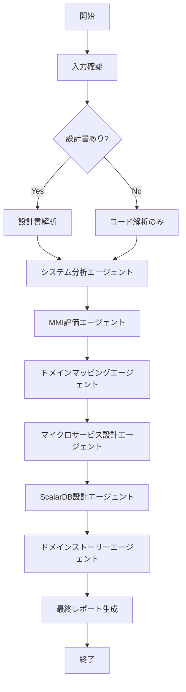

# System Refactoring Orchestrator

既存システムをマイクロサービスアーキテクチャにリファクタリングするための統合エージェントです。

## 概要

このスキルは、既存の設計書やコードを分析し、以下のプロセスを通じてマイクロサービスアーキテクチャへの変換計画を策定します：

1. **システム分析** - 既存コードと設計書の解析
2. **MMI評価** - Modularity Maturity Indexによる成熟度評価
3. **ドメインマッピング** - ビジネスドメインとコードの紐付け
4. **マイクロサービス設計** - ターゲットアーキテクチャの策定
5. **ScalarDB設計** - 分散トランザクション・データアーキテクチャの策定
6. **ドメインストーリー** - 各ドメインのユースケース整理

## 使用方法

```
/refactor-system [対象パス] [オプション]
```

### オプション
- `--analyze-only` - 分析のみ実行（設計書生成なし）
- `--skip-mmi` - MMI評価をスキップ
- `--domain=[ドメイン名]` - 特定ドメインのみ対象
- `--output=[出力パス]` - 出力先ディレクトリ指定（デフォルト: `reports/`）

## 出力ファイル構造

```
reports/
├── 00_summary/
│   └── executive_summary.md          # エグゼクティブサマリー
├── 01_analysis/
│   ├── ubiquitous_language.md        # ユビキタス言語集
│   ├── actors_roles_permissions.md   # アクター・ロール・権限
│   ├── domain_code_mapping.md        # ドメイン-コード対応表
│   └── current_system_overview.md    # 現行システム概要
├── 02_evaluation/
│   ├── mmi_overview.md               # MMI全体サマリー
│   ├── mmi_by_module.md              # モジュール別MMI
│   └── mmi_improvement_plan.md       # MMI改善計画
├── 03_design/
│   ├── domain_analysis.md            # ドメイン分析
│   ├── system_mapping.md             # システムマッピング
│   ├── target_architecture.md        # ターゲットアーキテクチャ
│   ├── transformation_plan.md        # 変換計画
│   ├── operations_feedback.md        # 運用・フィードバック計画
│   ├── scalardb_architecture.md      # ScalarDBアーキテクチャ設計
│   ├── scalardb_schema.md            # ScalarDBスキーマ設計
│   ├── scalardb_transaction.md       # ScalarDBトランザクション設計
│   └── scalardb_migration.md         # ScalarDBマイグレーション計画
└── 04_stories/
    └── [domain]_story.md             # ドメイン別ストーリー
```

## 実行フロー



## 処理詳細

**重要**: 各Phaseは完了時に即座に対応するファイルを `reports/` ディレクトリに出力します。
最後にまとめて出力するのではなく、解析中にリアルタイムでファイルを生成してください。

### Phase 1: 入力収集と初期分析

1. 出力ディレクトリの作成: `mkdir -p reports/{00_summary,01_analysis,02_evaluation,03_design,04_stories,graph/data,99_appendix}`
2. 対象ディレクトリのスキャン
3. 設計書ファイルの特定（`.md`, `.docx`, `.xlsx`, `.pdf` など）
4. ソースコードの構造解析
5. 使用技術スタックの特定

**Phase 1完了時に出力**: `reports/00_summary/project_metadata.json`

### Phase 2: システム分析

Taskツールで `system-analyzer` エージェントを起動し、以下を実行：
- ユビキタス言語の抽出
- アクター・ロール・権限の整理
- ドメイン境界の初期推定

**Phase 2完了時に出力**:
- `reports/01_analysis/system-overview.md`
- `reports/01_analysis/ubiquitous-language.md`
- `reports/01_analysis/actors-roles-permissions.md`
- `reports/01_analysis/domain-code-mapping.md`

### Phase 3: MMI評価

Taskツールで `mmi-evaluator` エージェントを起動し、以下を評価：
- **Cohesion（凝集度）** - 30%
- **Coupling（結合度）** - 30%
- **Independence（独立性）** - 20%
- **Reusability（再利用性）** - 20%

**Phase 3完了時に出力**:
- `reports/02_evaluation/mmi-overview.md`
- `reports/02_evaluation/mmi-by-module.md`
- `reports/02_evaluation/mmi-improvement-plan.md`

### Phase 4: ドメインマッピング

Taskツールで `domain-mapper` エージェントを起動し、以下を実行：
- 設計書の概念とコードの対応付け
- ドメインタイプの分類（Pipeline/Blackboard/Dialogue）
- マイクロサービス境界の分類（Process/Master/Integration/Supporting）

**Phase 4完了時に出力**:
- `reports/03_design/domain-analysis.md`
- `reports/03_design/context-map.md`
- `reports/03_design/system-mapping.md`

### Phase 5: マイクロサービス設計

Taskツールで `microservice-architect` エージェントを起動し、以下を策定：
- コンテキストマップ
- マクロアーキテクチャ
- データストレージ設計
- 移行計画

**Phase 5完了時に出力**:
- `reports/03_design/target-architecture.md`
- `reports/03_design/transformation-plan.md`
- `reports/03_design/operations-feedback.md`

### Phase 6: ScalarDB設計

Taskツールで `scalardb-architect` エージェントを起動し、以下を策定：
- **デプロイモード選定** - ScalarDB Core（ライブラリ）vs Cluster（サーバー）
- **ストレージバックエンド設計** - 各サービスに適したDB選定（PostgreSQL, DynamoDB, Cassandra等）
- **スキーマ設計** - Namespace、テーブル定義、パーティションキー、クラスタリングキー
- **トランザクション設計** - Consensus Commit、Two-Phase Commit、Sagaパターン
- **マイグレーション計画** - 既存DBからの移行戦略

**Phase 6完了時に出力**:
- `reports/03_design/scalardb-architecture.md`
- `reports/03_design/scalardb-schema.md`
- `reports/03_design/scalardb-transaction.md`
- `reports/03_design/scalardb-migration.md`

### Phase 7: ドメインストーリー

Taskツールで `domain-storyteller` エージェントを起動し、各ドメインについて：
- アクター特定
- ワークアイテム整理
- アクティビティフロー記述
- 例外シナリオ検討

**Phase 7完了時に出力**: `reports/04_stories/[domain]-story.md`

### Phase 8: エグゼクティブサマリー

全Phaseの結果を統合し、エグゼクティブサマリーを作成。

**Phase 8完了時に出力**: `reports/00_summary/executive-summary.md`

## 依存スキル

このスキルは以下のサブスキルを使用します：
- `/analyze-system` - システム分析
- `/evaluate-mmi` - MMI評価
- `/map-domains` - ドメインマッピング
- `/design-microservices` - マイクロサービス設計
- `/design-scalardb` - ScalarDB設計（分散トランザクション・データアーキテクチャ）
- `/create-domain-story` - ドメインストーリー作成

## 使用例

### 基本的な使用

```
/refactor-system ./src
```

### 特定ドメインのみ分析

```
/refactor-system ./src --domain=Order
```

### 分析のみ実行

```
/refactor-system ./src --analyze-only
```

## 注意事項

- 大規模なコードベースの場合、処理に時間がかかる場合があります
- 中間ファイルは `reports/` に保存されます
- 既存の出力ファイルは上書きされます（バックアップ推奨）
- 設計書がない場合でもコードから推論可能ですが、精度が低下する可能性があります
