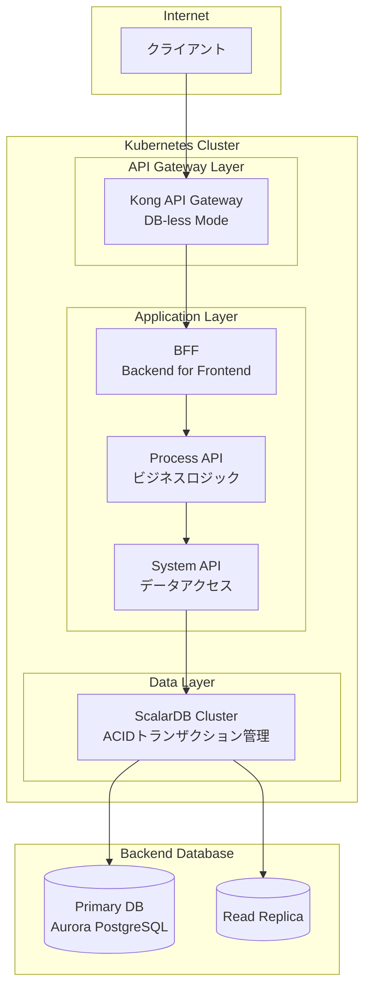
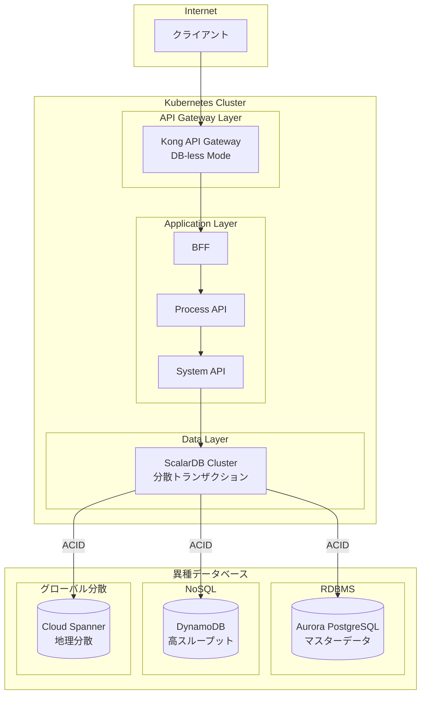
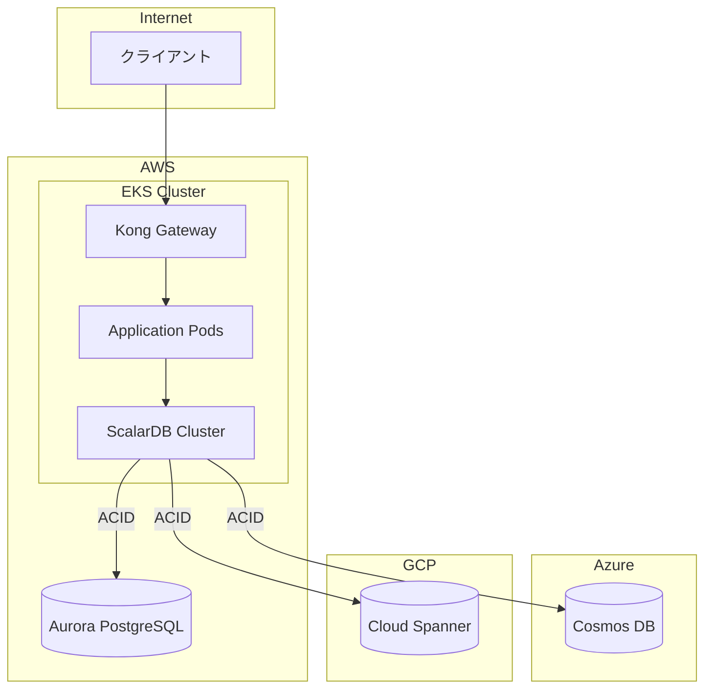
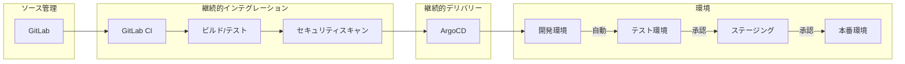

# ScalarDB Cluster サイジング見積もりスキル

このスキルは、ScalarDB Clusterを中心としたシステム全体のサイジングと費用見積もりを行う。

## 見積もりフロー

```
1. 要件ヒアリング（質問で情報収集）
   ↓
2. 環境タイプ選択（Dev/Test/Staging/Production）
   ↓
3. アーキテクチャパターン選択
   ↓
4. 各コンポーネントサイジング
   ↓
5. 費用算出
   ↓
6. Markdown + HTML出力
```

## 1. 要件ヒアリング

情報が不足している場合、以下の質問を選択肢形式で提示する。一度に多くの質問をせず、3-4問ずつ段階的に確認する。

### 必須ヒアリング項目

#### 環境タイプ
```
Q: 見積もる環境を選択してください
A) 開発環境 - 開発者が機能開発・単体テストを行う環境
B) テスト環境 - QAチームが結合テスト・E2Eテストを行う環境
C) ステージング環境 - 本番同等構成でリリース前検証を行う環境
D) 本番環境 - 実際のユーザーがアクセスする環境
E) 全環境セット - CI/CDパイプライン含む全環境
```

#### クラウドプロバイダー
```
Q: 使用するクラウドを選択してください
A) AWS - Amazon Web Services
B) Azure - Microsoft Azure
C) GCP - Google Cloud Platform
D) マルチクラウド - 複数クラウドを併用
```

#### ScalarDB Cluster ライセンス
```
Q: ScalarDB Cluster のライセンス形態を選択してください
A) 直接契約 Standard - ¥100,000/Pod/月（基本機能）
B) 直接契約 Premium - ¥200,000/Pod/月（高度な機能・優先サポート）
C) AWS Marketplace Pay-as-you-go Standard - $1.40/Pod/時間（約¥153,300/Pod/月）
D) AWS Marketplace Pay-as-you-go Premium - $2.80/Pod/時間（約¥306,600/Pod/月）※推定

※ ライセンス費用はPod数に応じて課金されます
※ AWS Marketplace版はAWS請求に一本化、短期利用に最適
※ 直接契約は長期利用でコスト効率良好
※ 詳細はScalar社営業担当にお問い合わせください
```

#### AWS Marketplace利用時の注意
```
AWS Marketplace Pay-as-you-go 利用時の制約:
- リソース制限: 各Pod最大 2 vCPU / 4 GB memory
- 制限超過時: Podが自動停止
- 課金単位: 1 Pod = 1単位 (2 vCPU / 4 GB memory)
- 計算方法: max(vCPU/2, memory/4GB) で単位数を決定

メリット:
- AWS請求に一本化
- 契約手続き不要
- 短期利用・PoC向け
- いつでもキャンセル可能

デメリット:
- 長期利用では直接契約より割高
- リソース制限あり
```

#### 性能要件（本番/ステージング向け）
```
Q: 想定するトランザクション量を選択してください
A) 小規模 - 〜500 TPS
B) 中規模 - 〜2,000 TPS
C) 大規模 - 〜10,000 TPS
D) 超大規模 - 10,000 TPS以上（具体的な数値を入力）
```

#### 可用性要件（本番向け）
```
Q: 目標可用性を選択してください
A) 99.0% - 年間ダウンタイム87.6時間まで許容
B) 99.9% - 年間ダウンタイム8.76時間まで許容
C) 99.95% - 年間ダウンタイム4.38時間まで許容
D) 99.99% - 年間ダウンタイム52分まで許容
```

#### ScalarDB v3.17 最適化設定（本番/ステージング向け）
```
Q: ScalarDB v3.17 クライアントサイド最適化を有効にしますか？
A) 有効にする（推奨）- 最大2倍の性能向上、900〜2,400 TPS/Pod
B) 有効にしない - 従来性能、500〜2,000 TPS/Pod
C) 検討中 - 最適化の有無で両パターン試算

※ 最適化設定（アプリケーション側）:
  - scalar.db.cluster.client.piggyback_begin.enabled=true
  - scalar.db.cluster.client.write_buffering.enabled=true
※ サーバー側推奨設定:
  - scalar.db.consensus_commit.async_commit.enabled=true
  - scalar.db.consensus_commit.one_phase_commit.enabled=true（単一DB時）
```

#### Transaction Metadata Decoupling（新規構築時オプション）
```
Q: Transaction Metadata Decoupling を使用しますか？
A) 使用する - メタデータを別テーブルに分離（テーブル設計がシンプル）
B) 使用しない（デフォルト）- 従来構成（既存システム互換）

※ Decouplingの特徴:
  - アプリケーションテーブルにメタデータカラムが追加されない
  - 既存テーブルには適用不可（スキーマ作成時に設定が必要）
  - 総ストレージサイズは変わらない
```

#### デプロイ戦略（本番向け）
```
Q: デプロイ戦略を選択してください
A) Rolling Update - 標準的なローリングアップデート
B) Blue/Green - 2系統を切り替える方式（ダウンタイムゼロ）
C) Canary - 段階的にトラフィックを移行する方式
D) A/B Testing対応 - 機能フラグによるA/Bテスト対応
```

#### バックエンドデータベース構成パターン
```
Q: データベース構成パターンを選択してください
A) 単一データベース - 1種類のデータベースのみ使用（シンプル構成）
B) 異種複数データベース - 複数種類のデータベースを併用（ScalarDBの真価を発揮）
C) マルチリージョン構成 - 地理分散されたデータベース構成
```

#### バックエンドデータベース（単一構成の場合）
```
Q: バックエンドデータベースを選択してください
[AWS]
A) Aurora PostgreSQL - 高可用性RDBMS（推奨）
B) Aurora MySQL - MySQL互換の高可用性RDBMS
C) RDS PostgreSQL - 標準的なPostgreSQL
D) DynamoDB - NoSQL（高スケール・書き込みヘビー向け）

[Azure]
A) Azure Database for PostgreSQL - 高可用性PostgreSQL
B) Azure SQL Database - SQL Server互換
C) Cosmos DB - NoSQL（グローバル分散向け）

[GCP]
A) AlloyDB - 高性能PostgreSQL互換（推奨）
B) Cloud SQL for PostgreSQL - 標準的なPostgreSQL
C) Cloud Spanner - グローバル分散SQL
```

#### バックエンドデータベース（異種複数構成の場合）
```
Q: 使用するデータベースの組み合わせを選択してください（複数選択可）
[AWS]
A) Aurora PostgreSQL + DynamoDB - RDBMS + NoSQL（推奨パターン）
B) Aurora PostgreSQL + Aurora MySQL - 異種RDBMS
C) Aurora PostgreSQL + DocumentDB - RDBMS + Document DB
D) カスタム組み合わせ - 独自の組み合わせを指定

[Azure]
A) Azure PostgreSQL + Cosmos DB - RDBMS + NoSQL（推奨パターン）
B) Azure PostgreSQL + Azure SQL - 異種RDBMS
C) カスタム組み合わせ - 独自の組み合わせを指定

[GCP]
A) AlloyDB + Cloud Spanner - 高性能RDBMS + グローバル分散SQL（推奨パターン）
B) Cloud SQL PostgreSQL + Firestore - RDBMS + NoSQL
C) カスタム組み合わせ - 独自の組み合わせを指定

[マルチクラウド]
A) Aurora PostgreSQL (AWS) + Cosmos DB (Azure) - クラウド間分散
B) AlloyDB (GCP) + DynamoDB (AWS) - 高性能 + 高スケール
C) カスタム組み合わせ - 独自の組み合わせを指定
```

#### アーキテクチャパターン
```
Q: アプリケーションアーキテクチャを選択してください
A) 標準構成 - API Gateway + BFF + Process API + System API（推奨）
B) シンプル構成 - API Gateway + Backend API
C) マイクロサービス構成 - 複数のドメインサービス + Event Driven
D) カスタム構成 - 独自のアーキテクチャを指定
```

#### API Gateway
```
Q: API Gatewayを選択してください
A) Kong OSS (DB-less) - 高機能OSS API Gateway、DB-lessモード（推奨）
B) Kong Enterprise (DB-less) - 商用版Kong、高度な機能・サポート付き
C) Kong OSS (PostgreSQL) - PostgreSQLバックエンド構成
D) Kong Enterprise (PostgreSQL) - 商用版Kong、PostgreSQLバックエンド
E) AWS API Gateway - AWSマネージド
F) Azure API Management - Azureマネージド
G) Google Cloud Endpoints / Apigee - GCPマネージド
H) Nginx Ingress - シンプルなIngress Controller
I) 不要 - API Gatewayを使用しない
```

#### Kong構成詳細（Kongを選択した場合）
```
Q: Kongの構成モードを選択してください
A) DB-less (declarative) - 設定をYAML/JSONで管理、GitOps親和性高い（推奨）
B) PostgreSQL - 従来型、Admin API経由で動的設定変更可能
C) Hybrid Mode - Control PlaneとData Planeを分離

※ DB-lessモードの特徴:
- 設定ファイルをGitで管理可能
- 起動時に設定をロード
- Admin APIは読み取り専用
- Kubernetes環境に最適
```

#### 監視システム
```
Q: 監視システムを選択してください
A) Prometheus + Grafana - OSSスタック（推奨）
B) Datadog - SaaSモニタリング
C) New Relic - APM中心のSaaS
D) CloudWatch / Azure Monitor / Cloud Monitoring - クラウドネイティブ
E) 既存の監視システムを使用
```

#### ScalarDB Analytics（オプション）
```
Q: ScalarDB Analytics（分析クエリ機能）を使用しますか？
A) 使用しない - OLTPのみ
B) 使用する（Amazon EMR） - AWS環境でSparkベースの分析
C) 使用する（Databricks） - Azure/AWS環境でDatabricks使用
D) 使用する（両方検討） - EMRとDatabricksを比較検討
```

#### ScalarDB Analytics環境（Analyticsを選択した場合）
```
Q: ScalarDB Analytics のワークロードを選択してください
A) 軽量分析 - アドホッククエリ、〜100GBデータ、同時1-5クエリ
B) 標準分析 - 定期レポート、〜1TBデータ、同時5-10クエリ
C) 大規模分析 - 複雑な分析、〜10TBデータ、同時10-20クエリ
D) メモリ集約型 - 大規模結合/集計、10TB+データ

※ ScalarDB Analyticsは読み取り専用です
※ Spark 3.4または3.5が必要です
```

#### ScalarDB Analytics Spark実行環境（Analyticsを選択した場合）
```
Q: Spark実行環境の詳細を選択してください

[Amazon EMR]
A) EMR on EC2 - 標準的なEMRクラスター
B) EMR Serverless - サーバーレス実行（断続的ワークロード向け）

[Databricks]
A) All-purpose Cluster - インタラクティブ分析向け
B) Job Cluster - 定期バッチ処理向け
C) SQL Warehouse - SQLクエリ専用（JDBC接続）

※ DatabricksはAccess Mode「No isolation shared」が必須
```

## 2. 環境別デフォルト構成

### 開発環境
```yaml
purpose: "開発者の機能開発・単体テスト"
kubernetes:
  nodes: 2
  node_type: small (2vCPU/8GB)
scalardb:
  replicas: 2
  resources: {cpu: 500m, memory: 1Gi}
database:
  size: minimal
  ha: false
api_gateway: optional
monitoring: minimal
ci_cd: required
estimated_cost_multiplier: 0.1x
```

### テスト環境
```yaml
purpose: "QAチームの結合テスト・E2Eテスト"
kubernetes:
  nodes: 3
  node_type: medium (4vCPU/16GB)
scalardb:
  replicas: 3
  resources: {cpu: 1, memory: 2Gi}
database:
  size: small
  ha: false
api_gateway: required
monitoring: standard
ci_cd: required
estimated_cost_multiplier: 0.3x
```

### ステージング環境
```yaml
purpose: "本番同等構成でのリリース前検証"
kubernetes:
  nodes: 3-5
  node_type: production_equivalent
scalardb:
  replicas: 3-5
  resources: {cpu: 2, memory: 4Gi}
database:
  size: production_equivalent
  ha: true (single AZ)
api_gateway: required (production config)
monitoring: full
ci_cd: required
estimated_cost_multiplier: 0.5x
```

### 本番環境
```yaml
purpose: "実際のユーザーがアクセスする環境"
kubernetes:
  nodes: 5+
  node_type: large (8vCPU/32GB+)
  multi_az: true
scalardb:
  replicas: 5+
  resources: {cpu: 2, memory: 4Gi}
  pdb: {minAvailable: 3}
database:
  size: based_on_requirements
  ha: true (multi AZ)
  read_replicas: optional
api_gateway: required (HA)
monitoring: full + alerting
ci_cd: required
blue_green_canary: optional
estimated_cost_multiplier: 1.0x
```

## 3. コンポーネント別サイジング

### 3.1 ScalarDB Cluster Pod数計算

詳細は `references/scalardb-cluster-sizing.md` を参照。

```
Pod数 = max(
  性能要件Pod数,
  可用性要件Pod数,
  最小Pod数
)

性能要件Pod数 = ceil(目標TPS / TPS_per_Pod)
可用性要件Pod数 = 障害許容Pod数 + ceil(必要処理能力 / (1 - 障害時低下率))
```

TPS/Pod目安:
| ワークロード | 従来 | v3.17最適化有効 |
|------------|------|----------------|
| 読み取りヘビー | 1,500-3,000 | 2,000-4,000 |
| バランス型 | 800-1,500 | **900-2,400** |
| 書き込みヘビー | 300-800 | 500-1,200 |

※ v3.17最適化 = piggyback_begin + write_buffering + async_commit

### 3.2 Kubernetes Node数計算

```
必要Node数 = ceil(総Pod数 / Node_Capacity) × 冗長係数

Node_Capacity = (Node_CPU - System_Reserved) / Pod_CPU_Request
冗長係数 = 1.3〜1.5（障害時のリスケジュール余裕）
```

### 3.3 バックエンドDBサイジング

詳細は `references/database-sizing.md` を参照。

## 4. 費用算出

### 4.1 為替レート

```
USD/JPY = 150円（見積もり時点の想定レート）
※実際のレートは変動するため、参考値として使用
```

### 4.2 主要コンポーネント月額費用目安

詳細は `references/cost-reference.md` を参照。

#### AWS費用目安（円/月）※ScalarDBライセンス込み

**直接契約 Standard ライセンス（¥100,000/Pod/月）の場合:**
| コンポーネント | 開発(2Pod) | テスト(3Pod) | ステージング(3Pod) | 本番(5Pod) |
|--------------|-----------|-------------|------------------|-----------|
| ScalarDB License | ¥200,000 | ¥300,000 | ¥300,000 | ¥500,000 |
| EKS クラスター | ¥11,000 | ¥11,000 | ¥11,000 | ¥11,000 |
| EC2 (Node) | ¥22,500 | ¥67,500 | ¥112,500 | ¥225,000 |
| Aurora PostgreSQL | ¥9,000 | ¥27,000 | ¥60,000 | ¥120,000 |
| Kong OSS (EKS上) | ¥0 | ¥0 | ¥0 | ¥0 |
| ALB | ¥3,000 | ¥4,500 | ¥7,500 | ¥15,000 |
| **合計目安** | **¥245,500** | **¥410,000** | **¥491,000** | **¥871,000** |

**直接契約 Premium ライセンス（¥200,000/Pod/月）の場合:**
| コンポーネント | 開発(2Pod) | テスト(3Pod) | ステージング(3Pod) | 本番(5Pod) |
|--------------|-----------|-------------|------------------|-----------|
| ScalarDB License | ¥400,000 | ¥600,000 | ¥600,000 | ¥1,000,000 |
| インフラ費用 | ¥45,500 | ¥110,000 | ¥191,000 | ¥371,000 |
| **合計目安** | **¥445,500** | **¥710,000** | **¥791,000** | **¥1,371,000** |

**AWS Marketplace Pay-as-you-go Standard（$1.40/Pod/時間）の場合:**
| コンポーネント | 開発(2Pod) | テスト(3Pod) | ステージング(3Pod) | 本番(5Pod) |
|--------------|-----------|-------------|------------------|-----------|
| ScalarDB License | ¥306,600 | ¥459,900 | ¥459,900 | ¥766,500 |
| インフラ費用 | ¥45,500 | ¥110,000 | ¥191,000 | ¥371,000 |
| **合計目安** | **¥352,100** | **¥569,900** | **¥650,900** | **¥1,137,500** |

※ AWS Marketplace Pay-as-you-go: $1.40/Pod/時間 × 730時間 = $1,022/Pod/月 ≈ ¥153,300/Pod/月
※ 参照: https://aws.amazon.com/marketplace/pp/prodview-jx6qxatkxuwm4

### 4.3 費用削減オプション

- Reserved Instances: 〜40% 削減
- Savings Plans: 〜30% 削減
- Spot Instances (開発/テスト): 〜70% 削減

## 5. 出力フォーマット

### 5.1 Markdown出力

見積もり結果を構造化されたMarkdownで出力。セクション:
1. エグゼクティブサマリー
2. 要件概要
3. アーキテクチャ図（Mermaid）
4. コンポーネント別構成（**サイジング根拠を含む**）
5. 費用内訳
6. 推奨事項

### 5.2 サイジング根拠の記載（必須）

各コンポーネントのサイジングには、必ず算出根拠を記載する。

#### ScalarDB Cluster Pod数の根拠記載例
```markdown
**Pod数計算根拠**:
- 性能要件: 2,000 TPS ÷ 1,000 TPS/Pod（バランス型ワークロード）= 2 pods
- 可用性要件 (99.95%): 障害時も4pod稼働必要 → 最低5 pods
- 異種DB構成オーバーヘッド (+10-20%): +1 pod
- **合計: 6 pods**
```

#### Kubernetes Node数の根拠記載例
```markdown
**Node数計算根拠**:
- ScalarDB Pool: 6 pods × 2vCPU = 12vCPU必要 → r6i.2xlarge(8vCPU) × 2 = 16vCPU + 冗長1台 = 3台
- Application Pool: 12 pods × 1vCPU = 12vCPU必要 → m6i.xlarge(4vCPU) × 4 = 16vCPU + 冗長1台 = 5台
- System Pool: 監視・Ingress等 → m6i.large × 2台
- **合計: 10 nodes**
```

#### バックエンドDB構成の根拠記載例
```markdown
**データベース構成根拠**:
- Aurora PostgreSQL: マスターデータ（ユーザー、商品、注文）の参照整合性・複雑なクエリに最適
- DynamoDB: セッション管理・イベントログの高スループット書き込みに最適
- ScalarDBにより異種DB間でACIDトランザクションを実現
```

#### インスタンスサイズの根拠記載例
```markdown
**Aurora インスタンスサイズ根拠**:
- 想定TPS: 2,000 TPS
- ScalarDBオーバーヘッド: 1更新あたり約5倍のI/O → 実効10,000 IOPS
- db.r6g.2xlarge: 最大20,000 IOPS対応、64GiBメモリでワーキングセット格納可能
```

```markdown
**DynamoDB キャパシティ根拠**:
- 書き込み: 1,000 TPS × ceil(2KB/1KB) = 2,000 WCU（ScalarDBオーバーヘッド込み）
- Coordinator: 1,000 TPS × 1 WCU = 1,000 WCU
- 読み取り: 1,000 TPS × ceil(2KB/4KB) × 1（強整合性）= 1,000 RCU
- **合計: 3,000 WCU + 1,000 RCU → 余裕を見て4,000 WCU + 2,000 RCU**
```

### 5.3 アーキテクチャ構成の根拠記載（必須）

アーキテクチャ選択の理由を明記する。

#### アーキテクチャパターンの根拠記載例
```markdown
**アーキテクチャ構成根拠**:
- 標準4層構成（API Gateway + BFF + Process API + System API）を採用
  - 理由: 責務の分離、スケーラビリティ、チーム分割の柔軟性
- Kong Enterprise (DB-less)を選択
  - 理由: GitOps親和性、Admin API不要、Kong Manager/Vitals/RBAC等のエンタープライズ機能
- Prometheus + Grafanaを選択
  - 理由: OSSでコスト効率良好、ScalarDB公式でPrometheus対応
```

#### 異種DB構成の根拠記載例
```markdown
**異種複数データベース構成の理由**:
| データ種別 | データベース | 選定理由 |
|----------|------------|---------|
| ユーザー情報 | Aurora PostgreSQL | 参照整合性、複雑なJOINクエリ対応 |
| 注文・在庫 | Aurora PostgreSQL | トランザクション整合性、外部キー制約 |
| セッション | DynamoDB | 高スループット読み書き、低レイテンシ |
| イベントログ | DynamoDB | 大量書き込み、TTLによる自動削除 |

→ ScalarDBにより、Aurora ↔ DynamoDB間でACIDトランザクションを実現
```

### 5.4 HTML出力

`scripts/generate_html.py` を使用してHTML形式のレポートを生成。
または、Markdown内容をHTML形式でも出力。

HTMLには以下を含める:
- 見やすいテーブルスタイル
- アーキテクチャ図
- サイジング根拠セクション
- 費用グラフ（可能であれば）
- 印刷対応スタイル

## 6. 標準アーキテクチャパターン

デフォルトアーキテクチャ（明示的指定がない場合）:

### 単一データベース構成



### 異種複数データベース構成（ScalarDBの真価）



### マルチクラウド構成



## 7. CI/CD パイプライン構成

全環境で CI/CD を考慮:



### CI/CDツール（標準構成）
```
Q: CI/CDツールを選択してください
A) GitLab CI + ArgoCD - GitOps標準構成（推奨）
B) GitHub Actions + ArgoCD - GitHub環境向け
C) Azure DevOps + ArgoCD - Azure環境向け
D) Jenkins + ArgoCD - 既存Jenkins環境向け
E) カスタム構成 - 独自のCI/CD構成
```

### 標準CI/CD構成
- **ソース管理**: GitLab（標準）
- **CI**: GitLab CI
- **CD**: ArgoCD (GitOps)
- **コンテナレジストリ**: GitLab Container Registry / Harbor
- **Helm Charts**: ScalarDB Helm Charts

## 8. 質問テンプレート

情報が不足している場合、AskUserQuestion ツールで以下の形式で質問:

```json
{
  "questions": [
    {
      "question": "見積もる環境タイプを選択してください",
      "header": "環境",
      "options": [
        {"label": "開発環境", "description": "開発者が機能開発・単体テストを行う環境"},
        {"label": "テスト環境", "description": "QAチームが結合テスト・E2Eテストを行う環境"},
        {"label": "ステージング環境", "description": "本番同等構成でリリース前検証"},
        {"label": "本番環境", "description": "実際のユーザーがアクセスする環境"}
      ],
      "multiSelect": false
    }
  ]
}
```

## 参照ファイル

- `references/scalardb-cluster-sizing.md` - ScalarDB Cluster詳細サイジング（オーバーヘッド計算含む）
- `references/scalardb-analytics-sizing.md` - ScalarDB Analytics詳細サイジング（EMR/Databricks）
- `references/database-sizing.md` - バックエンドDB詳細サイジング（AWS/Azure/GCP）
- `references/kubernetes-sizing.md` - Kubernetes詳細サイジング（EKS/AKS/GKE）
- `references/cost-reference.md` - 費用参照テーブル
- `scripts/generate_html.py` - HTMLレポート生成スクリプト
