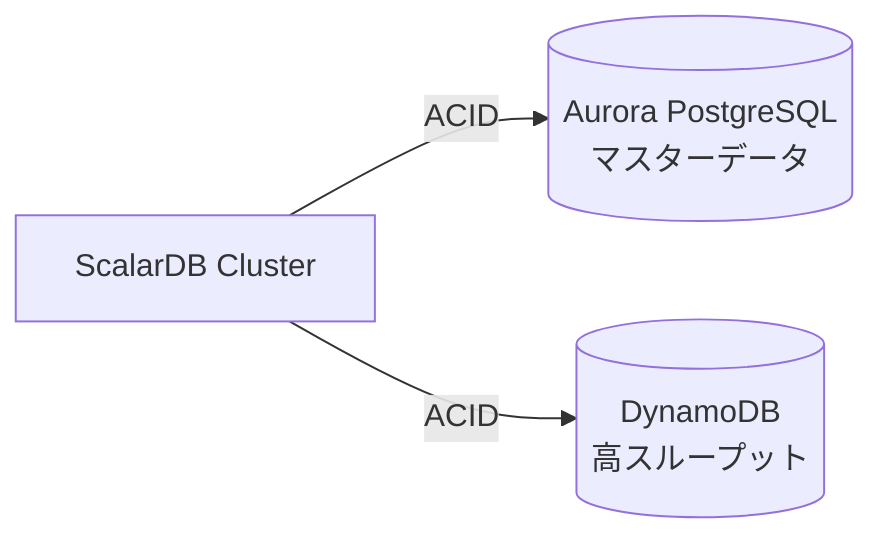
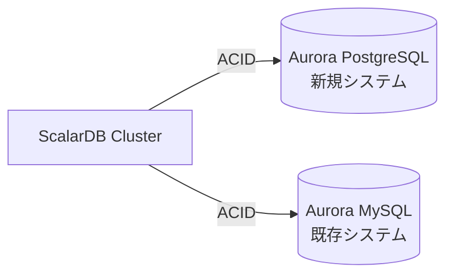
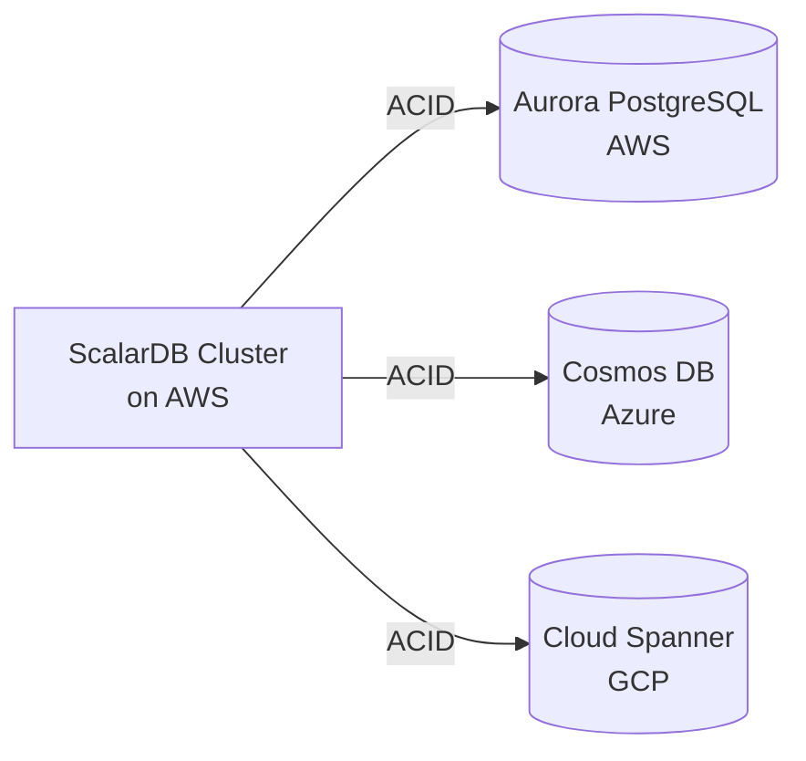

# バックエンドデータベース サイジング詳細リファレンス

## 1. ScalarDB サポートデータベース一覧（v3.17時点）

### 1.1 リレーショナルデータベース（RDBMS）

| データベース | サポートバージョン | 備考 |
|-------------|-------------------|------|
| Oracle Database | 19c, 21c, 23ai | エンタープライズ向け |
| IBM Db2 | 11.5, 12.1 | 3.16で追加 |
| MySQL | 8.0, 8.4 | 最も広く利用 |
| PostgreSQL | 13〜17 | OSS標準 |
| Amazon Aurora MySQL | 2, 3 | AWS専用 |
| Amazon Aurora PostgreSQL | 13〜17 | AWS専用 |
| MariaDB | 10.11, 11.4 | MySQL互換 |
| SQL Server | 2017, 2019, 2022 | Microsoft製 |
| SQLite | 3 | 軽量・組み込み用途 |

### 1.2 分散RDBMS

| データベース | サポートバージョン | 備考 |
|-------------|-------------------|------|
| TiDB | 6.5, 7.5, 8.5 | MySQL互換NewSQL |
| YugabyteDB | 2 | PostgreSQL互換NewSQL |
| AlloyDB | 15, 16 | GCP専用PostgreSQL互換 |

### 1.3 NoSQLデータベース

| データベース | サポートバージョン | 備考 |
|-------------|-------------------|------|
| Amazon DynamoDB | - | AWS専用Key-Value |
| Apache Cassandra | 3.0, 3.11, 4.1, 5.0 | Wide-column store |
| Azure Cosmos DB for NoSQL | - | Azure専用マルチモデル |

### 1.4 オブジェクトストレージ（プライベートプレビュー）

| ストレージ | 備考 |
|-----------|------|
| Amazon S3 | AWS |
| Azure Blob Storage | Azure |
| Google Cloud Storage | GCP |

---

## 2. クラウド別マネージドサービスマッピング

### 2.1 AWS

| カテゴリ | ScalarDBサポートDB | AWSマネージドサービス |
|---------|-------------------|----------------------|
| RDBMS | MySQL | Amazon RDS for MySQL |
| RDBMS | PostgreSQL | Amazon RDS for PostgreSQL |
| RDBMS | Oracle | Amazon RDS for Oracle |
| RDBMS | SQL Server | Amazon RDS for SQL Server |
| RDBMS | MariaDB | Amazon RDS for MariaDB |
| 分散RDBMS | Aurora MySQL | Amazon Aurora MySQL |
| 分散RDBMS | Aurora PostgreSQL | Amazon Aurora PostgreSQL |
| NoSQL | DynamoDB | Amazon DynamoDB |
| NoSQL | Cassandra | Amazon Keyspaces |
| Object Storage | S3 | Amazon S3 |

### 2.2 Azure

| カテゴリ | ScalarDBサポートDB | Azureマネージドサービス |
|---------|-------------------|------------------------|
| RDBMS | MySQL | Azure Database for MySQL |
| RDBMS | PostgreSQL | Azure Database for PostgreSQL |
| RDBMS | SQL Server | Azure SQL Database |
| RDBMS | MariaDB | Azure Database for MariaDB |
| 分散RDBMS | PostgreSQL (Hyperscale) | Azure Database for PostgreSQL - Hyperscale (Citus) |
| NoSQL | Cosmos DB | Azure Cosmos DB for NoSQL |
| NoSQL | Cassandra | Azure Cosmos DB for Apache Cassandra |
| Object Storage | Blob | Azure Blob Storage |

### 2.3 GCP

| カテゴリ | ScalarDBサポートDB | GCPマネージドサービス |
|---------|-------------------|----------------------|
| RDBMS | MySQL | Cloud SQL for MySQL |
| RDBMS | PostgreSQL | Cloud SQL for PostgreSQL |
| RDBMS | SQL Server | Cloud SQL for SQL Server |
| 分散RDBMS | AlloyDB | AlloyDB for PostgreSQL |
| 分散RDBMS | - | Cloud Spanner (※ScalarDB非サポート) |
| NoSQL | Cassandra | - (自前構築またはAstra DB) |
| Object Storage | GCS | Google Cloud Storage |

---

## 3. AWS データベース詳細サイジング

### 3.1 Amazon RDS（MySQL / PostgreSQL / MariaDB）

#### インスタンスクラス

| カテゴリ | インスタンスファミリー | 特徴 | 最大vCPU | 最大メモリ |
|---------|---------------------|------|---------|----------|
| 汎用 | db.m5, db.m6i, db.m6g, db.m7g | バランス型 | 96 | 384 GiB |
| 汎用（高帯域） | db.m6in, db.m6idn | 高I/O | 128 | 512 GiB |
| メモリ最適化 | db.r5, db.r6i, db.r6g, db.r7g | 高メモリ | 96 | 768 GiB |
| メモリ最適化（大容量） | db.x2g | 超高メモリ | 64 | 1 TiB |
| バースト可能 | db.t3, db.t4g | 開発・テスト向け | 8 | 32 GiB |

#### ストレージオプション

| ストレージタイプ | 最大容量 | IOPS | スループット | ユースケース |
|---------------|---------|------|-------------|-------------|
| gp2（汎用SSD） | 64 TiB | 16,000 | 250 MiB/s | 一般的なワークロード |
| gp3（汎用SSD） | 64 TiB | 16,000（プロビジョニング可能） | 1,000 MiB/s | コスト効率重視 |
| io1/io2（プロビジョンドIOPS） | 64 TiB | 256,000 | 4,000 MiB/s | 高I/Oワークロード |

#### 環境別推奨

| 環境 | インスタンスクラス | vCPU | メモリ | 月額目安(USD) |
|-----|-----------------|------|-------|--------------|
| 開発 | db.t4g.micro | 2 | 1 GiB | $15 |
| テスト | db.t4g.medium | 2 | 4 GiB | $50 |
| ステージング | db.r6g.large | 2 | 16 GiB | $150 |
| 本番（小） | db.r6g.xlarge | 4 | 32 GiB | $300 |
| 本番（中） | db.r6g.2xlarge | 8 | 64 GiB | $600 |

### 3.2 Amazon Aurora（MySQL / PostgreSQL）

#### インスタンスクラス

| カテゴリ | インスタンスファミリー | 特徴 | 最大vCPU | 最大メモリ |
|---------|---------------------|------|---------|----------|
| メモリ最適化（Graviton4） | db.r8g | 最新・高性能 | 48xlarge相当 | 1.5 TiB |
| メモリ最適化（Graviton3） | db.r7g | バランス型 | 16xlarge相当 | 512 GiB |
| メモリ最適化（Intel） | db.r7i | Intel最新 | 48xlarge相当 | 1.5 TiB |
| Optimized Reads | db.r8gd | ローカルNVMe付き | 24xlarge相当 | 768 GiB |
| バースト可能 | db.t4g | 開発向け | 2xlarge | 32 GiB |

#### Aurora固有の特徴

| 項目 | 仕様 |
|-----|------|
| ストレージ | 自動スケーリング（最大128 TiB） |
| レプリケーション | 最大15リードレプリカ |
| 書き込みスループット | 最大200,000 writes/sec |
| フェイルオーバー | 通常30秒以内 |

#### Aurora Serverless v2

| 項目 | 仕様 |
|-----|------|
| 最小ACU | 0.5 ACU |
| 最大ACU | 256 ACU（1 ACU ≈ 2 GiBメモリ） |
| スケーリング | 数秒で自動スケール |
| ユースケース | 変動するワークロード、開発環境 |

#### 環境別推奨

| 環境 | インスタンスクラス | vCPU | メモリ | 月額目安(USD) |
|-----|-----------------|------|-------|--------------|
| 開発 | db.t4g.medium | 2 | 4 GiB | $60 |
| テスト | db.r6g.large | 2 | 16 GiB | $180 |
| ステージング | db.r6g.xlarge | 4 | 32 GiB | $360 |
| 本番（小） | db.r6g.xlarge | 4 | 32 GiB | $360 |
| 本番（中） | db.r6g.2xlarge | 8 | 64 GiB | $720 |
| 本番（大） | db.r6g.4xlarge | 16 | 128 GiB | $1,440 |

### 3.3 Amazon DynamoDB

#### キャパシティユニット計算

| 操作 | ユニット | サイズ | 備考 |
|-----|---------|-------|------|
| 読み取り（強い整合性） | 1 RCU | 4 KB/秒 | - |
| 読み取り（結果整合性） | 0.5 RCU | 4 KB/秒 | 2倍効率 |
| 読み取り（トランザクション） | 2 RCU | 4 KB/秒 | **ScalarDB使用時** |
| 書き込み | 1 WCU | 1 KB/秒 | - |
| 書き込み（トランザクション） | 2 WCU | 1 KB/秒 | **ScalarDB使用時** |

#### キャパシティ計算式

```
必要RCU = (読み取り回数/秒) × ceil(アイテムサイズ/4KB) × 整合性係数
必要WCU = (書き込み回数/秒) × ceil(アイテムサイズ/1KB)

※整合性係数: 強い整合性=1, 結果整合性=0.5, トランザクション=2
```

#### パーティション制限

| 項目 | 制限 |
|-----|------|
| 単一パーティションRCU | 3,000 RCU/秒 |
| 単一パーティションWCU | 1,000 WCU/秒 |
| 単一パーティションサイズ | 10 GB |
| 単一アイテムサイズ | 400 KB |

#### 環境別推奨

| 環境 | キャパシティモード | RCU/WCU or 目安 | 月額目安(USD) |
|-----|-----------------|----------------|--------------|
| 開発 | オンデマンド | 〜100 req/s | $25 |
| テスト | オンデマンド | 〜500 req/s | $100 |
| ステージング | プロビジョンド | 500 RCU/500 WCU | $200 |
| 本番 | オンデマンド/プロビジョンド | 要件次第 | $500〜 |

### 3.4 Amazon Keyspaces（Cassandra互換）

#### キャパシティユニット

| 操作 | ユニット | サイズ | 備考 |
|-----|---------|-------|------|
| 読み取り（LOCAL_QUORUM） | 1 RCU | 4 KB | - |
| 読み取り（LOCAL_ONE） | 0.5 RCU | 4 KB | 2倍効率 |
| 書き込み | 1 WCU | 1 KB | - |

#### デフォルトクォータ

| 項目 | 制限 |
|-----|------|
| テーブル単位の最大WCU | 40,000 WCU |
| アカウント全体の最大WCU | 80,000 WCU |
| オンデマンド初期スループット | 4,000 WRU / 12,000 RRU |

---

## 4. Azure データベース詳細サイジング

### 4.1 Azure Database for MySQL / PostgreSQL（Flexible Server）

#### サービスティア

| ティア | VMシリーズ | ユースケース | vCPU範囲 | メモリ比率 |
|-------|-----------|-------------|---------|----------|
| Burstable | B-series | 開発・テスト | 1〜20 | 可変 |
| General Purpose | D-series | 本番（バランス型） | 2〜96 | 4 GiB/vCPU |
| Business Critical | E-series | 高性能本番 | 2〜96 | 8 GiB/vCPU |

#### General Purpose（Ddsv5シリーズ）詳細

| サイズ | vCPU | メモリ | 最大IOPS | 最大スループット |
|-------|------|-------|---------|-----------------|
| D2ds_v5 | 2 | 8 GiB | 3,200 | 125 MiB/s |
| D4ds_v5 | 4 | 16 GiB | 6,400 | 250 MiB/s |
| D8ds_v5 | 8 | 32 GiB | 12,800 | 500 MiB/s |
| D16ds_v5 | 16 | 64 GiB | 20,000 | 750 MiB/s |
| D32ds_v5 | 32 | 128 GiB | 20,000 | 900 MiB/s |
| D48ds_v5 | 48 | 192 GiB | 20,000 | 900 MiB/s |
| D64ds_v5 | 64 | 256 GiB | 20,000 | 900 MiB/s |

#### Business Critical（Edsv5シリーズ）詳細

| サイズ | vCPU | メモリ | 最大IOPS | 最大スループット |
|-------|------|-------|---------|-----------------|
| E2ds_v5 | 2 | 16 GiB | 5,000 | 250 MiB/s |
| E4ds_v5 | 4 | 32 GiB | 10,000 | 500 MiB/s |
| E8ds_v5 | 8 | 64 GiB | 18,000 | 750 MiB/s |
| E16ds_v5 | 16 | 128 GiB | 28,000 | 1,000 MiB/s |
| E32ds_v5 | 32 | 256 GiB | 38,000 | 1,250 MiB/s |
| E48ds_v5 | 48 | 384 GiB | 48,000 | 1,500 MiB/s |
| E64ds_v5 | 64 | 504 GiB | 64,000 | 2,000 MiB/s |

#### 環境別推奨

| 環境 | SKU | vCPU | メモリ | 月額目安(USD) |
|-----|-----|------|-------|--------------|
| 開発 | B1ms | 1 | 2 GiB | $25 |
| テスト | D2s_v3 | 2 | 8 GiB | $100 |
| ステージング | D4s_v3 | 4 | 16 GiB | $200 |
| 本番（小） | E4s_v5 | 4 | 32 GiB | $350 |
| 本番（中） | E8s_v5 | 8 | 64 GiB | $700 |
| 本番（大） | E16s_v5 | 16 | 128 GiB | $1,400 |

### 4.2 Azure SQL Database

#### 購入モデル

| モデル | 説明 | 推奨用途 |
|-------|------|---------|
| DTUベース | CPU・メモリ・I/Oの混合単位 | シンプルな要件 |
| vCoreベース | 個別リソース指定 | 詳細な制御が必要 |

#### DTU/vCore変換目安

```
Basic/Standard: 100 DTU ≈ 1 vCore
Premium: 125 DTU ≈ 1 vCore
```

#### vCoreベース詳細

| ティア | vCPU範囲 | メモリ比率 | 特徴 |
|-------|---------|----------|------|
| General Purpose | 2〜128 | 5.1 GiB/vCore | バランス型 |
| Business Critical | 2〜128 | 5.1 GiB/vCore | インメモリOLTP対応 |
| Hyperscale | 2〜128 | 5.1 GiB/vCore | 100TBまでスケール |

### 4.3 Azure Cosmos DB

#### キャパシティモード

| モード | 特徴 | 最小スループット | 最大スループット | 課金 |
|-------|------|-----------------|-----------------|------|
| サーバーレス | 自動スケール | 0 | 5,000 RU/s | RU消費量 |
| プロビジョンド（手動） | 固定スループット | 400 RU/s | 1,000,000 RU/s | 時間単位 |
| プロビジョンド（自動スケール） | 自動調整 | 最大の10% | 設定した最大値 | 時間単位 |

#### Request Unit（RU）の目安

| 操作 | 消費RU（1KBアイテム） |
|-----|---------------------|
| ポイント読み取り（1項目） | 1 RU |
| 書き込み | 5 RU |
| クエリ（単純） | 2〜3 RU |
| クエリ（複雑・スキャン） | 10〜100+ RU |

#### パーティション制限

| 項目 | 制限 |
|-----|------|
| 論理パーティション最大サイズ | 20 GB |
| 単一論理パーティション最大RU | 10,000 RU/s |
| 単一アイテム最大サイズ | 2 MB |

#### 環境別推奨

| 環境 | RU/s | 月額目安(USD) |
|-----|------|--------------|
| 開発 | 400 RU/s | $25 |
| テスト | 1,000 RU/s | $60 |
| ステージング | 4,000 RU/s | $240 |
| 本番 | 10,000+ RU/s | $600+ |

---

## 5. GCP データベース詳細サイジング

### 5.1 Cloud SQL（MySQL / PostgreSQL / SQL Server）

#### エディションとマシンシリーズ

| エディション | マシンシリーズ | 特徴 | 最大vCPU | 最大メモリ |
|------------|--------------|------|---------|----------|
| Enterprise Plus | N2 | バランス型 | 96 | 624 GiB |
| Enterprise Plus | C4A | 高性能 | 128 | 864 GiB |
| Enterprise | N4 | コスト効率 | 96 | 624 GiB |

#### カスタムマシンタイプ

| 項目 | 制限 |
|-----|------|
| vCPU | 1、または2〜96の偶数 |
| メモリ比率 | 1 vCPU : 0.9〜6.5 GiB |
| 命名規則 | `db-custom-{vCPU}-{メモリMB}` |

#### ストレージパフォーマンス詳細

| ストレージサイズ | 読み取りIOPS | 書き込みIOPS | スループット |
|---------------|-------------|-------------|-------------|
| 10 GB | 300 | 300 | 4.8 MiB/s |
| 100 GB | 3,000 | 3,000 | 48 MiB/s |
| 500 GB | 15,000 | 15,000 | 240 MiB/s |
| 1 TB | 30,000 | 30,000 | 480 MiB/s |
| 4 TB | 100,000 | 30,000 | 1,200 MiB/s |

#### ネットワークスループット計算

```
ネットワークスループット = 250 MiB/s × vCPU数
※ディスクスループットはネットワークスループットに制限される
```

#### 環境別推奨

| 環境 | マシンタイプ | vCPU | メモリ | 月額目安(USD) |
|-----|------------|------|-------|--------------|
| 開発 | db-f1-micro | 1 | 0.6 GiB | $10 |
| テスト | db-custom-2-8192 | 2 | 8 GiB | $100 |
| ステージング | db-custom-4-16384 | 4 | 16 GiB | $200 |
| 本番（小） | db-custom-8-32768 | 8 | 32 GiB | $400 |
| 本番（中） | db-custom-16-65536 | 16 | 64 GiB | $800 |

### 5.2 AlloyDB for PostgreSQL

#### 概要

| 項目 | 仕様 |
|-----|------|
| PostgreSQL互換 | PostgreSQL 15, 16 |
| アーキテクチャ | コンピュートとストレージの分離 |
| 最大vCPU | 128 |
| 最大メモリ | 864 GiB |
| 最大リードレプリカ | 20 |

#### パフォーマンス特性

| 項目 | Cloud SQL比較 |
|-----|--------------|
| トランザクション性能 | 最大4倍 |
| 分析クエリ性能 | 最大100倍（カラムナエンジン使用時） |
| フェイルオーバー時間 | 60秒以内 |
| SLA | 99.99% |

#### カラムナエンジン

- デフォルトでメモリの30%を使用
- 分析クエリを自動的に最適化
- OLTPとOLAPの混合ワークロードに最適

#### 環境別推奨

| 環境 | vCPU | メモリ | 月額目安(USD) |
|-----|------|-------|--------------|
| 開発 | 2 | 16 GiB | $200 |
| テスト | 4 | 32 GiB | $400 |
| ステージング | 8 | 64 GiB | $800 |
| 本番（小） | 8 | 64 GiB | $800 |
| 本番（中） | 16 | 128 GiB | $1,600 |
| 本番（大） | 32 | 256 GiB | $3,200 |

---

## 6. データベース選定ガイド

### 6.1 データベースタイプ別Pros/Cons

#### RDBMS（MySQL / PostgreSQL）

**Pros:**
- SQL標準準拠: 複雑なクエリ、JOIN、トランザクション制御が可能
- 運用ノウハウの蓄積: エンジニアの確保が容易
- ツールエコシステム: 監視、バックアップ、マイグレーションツールが豊富
- ACID保証: ネイティブでACIDトランザクションをサポート
- **ScalarDBオーバーヘッド: 低**（既にACID対応のため追加オーバーヘッドが少ない）

**Cons:**
- 垂直スケーリング中心: 水平スケールが困難
- 単一障害点: マスターノードの障害が全体に影響
- コスト: 高性能インスタンスは高額
- スキーマ変更: 大規模テーブルのスキーマ変更に時間がかかる

**最適なユースケース:**
- トランザクション整合性が重要なアプリケーション
- 複雑なクエリや集計が必要なケース
- データ量が中程度（〜数TB）のシステム

#### 分散RDBMS（Aurora / AlloyDB）

**Pros:**
- 高可用性: 自動フェイルオーバー、複数AZレプリケーション
- 読み取りスケール: リードレプリカの追加でスケールアウト
- ストレージ自動スケール: 容量管理の負担軽減
- パフォーマンス: 同等のRDSより高速（Aurora: 最大5倍、AlloyDB: 最大4倍）

**Cons:**
- ベンダーロックイン: 特定クラウドに依存
- コスト: 通常のRDSより高額
- 書き込みスケール: 書き込みは単一ライターに限定

**最適なユースケース:**
- 高可用性が必須のミッションクリティカルシステム
- 読み取りヘビーなワークロード
- AlloyDB: OLTPとOLAPの混合ワークロード

#### DynamoDB

**Pros:**
- 無限スケール: 設計上の上限なし
- 低レイテンシ: 一桁ミリ秒のレスポンス
- フルマネージド: 運用負荷ほぼゼロ
- サーバーレス対応: オンデマンドモードで使用量ベース課金
- グローバルテーブル: マルチリージョン対応

**Cons:**
- **ScalarDBオーバーヘッド: 高**（ACID保証のための追加処理）
- クエリ制限: セカンダリインデックス以外のクエリは非効率
- コスト予測困難: 使用パターンによってコストが大きく変動
- トランザクション制限: 最大100アイテム/25アイテム（読み取り/書き込み）

**最適なユースケース:**
- Key-Valueアクセスパターンが主体
- 極めて高いスケーラビリティが必要
- サーバーレスアーキテクチャとの組み合わせ

#### Azure Cosmos DB

**Pros:**
- マルチモデル: SQL、MongoDB、Cassandra、Gremlin、Table APIをサポート
- グローバル分散: ワンクリックでマルチリージョン展開
- 5つの整合性レベル: 要件に応じた整合性選択
- SLA: 99.999%の可用性SLA（マルチリージョン書き込み時）

**Cons:**
- コスト: RU課金が高額になりやすい
- 学習コスト: RUモデルの理解が必要
- Azureロックイン
- パーティション制限: 論理パーティション20GB制限

#### Cassandra / Amazon Keyspaces

**Pros:**
- 書き込み性能: 書き込みに最適化されたアーキテクチャ
- 線形スケール: ノード追加で性能が線形にスケール
- 高可用性: マスターレスアーキテクチャで単一障害点なし

**Cons:**
- **ScalarDBオーバーヘッド: 高**（ACID保証のための追加処理）
- クエリ制限: パーティションキーベースのアクセスのみ効率的
- 運用複雑性: セルフマネージドの場合、運用負荷が高い

### 6.2 ユースケース別推奨データベース

| ユースケース | AWS | Azure | GCP |
|------------|-----|-------|-----|
| ECサイト（在庫・注文） | Aurora PostgreSQL | PostgreSQL Flexible | AlloyDB |
| 金融システム（決済） | Aurora PostgreSQL | Azure SQL (BC) | AlloyDB |
| IoTプラットフォーム | DynamoDB | Cosmos DB | - |
| ゲームバックエンド | DynamoDB | Cosmos DB | - |
| マルチテナントSaaS | Aurora PostgreSQL | SQL Hyperscale | AlloyDB |
| 分析連携 | Aurora + Redshift | Cosmos DB + Synapse | AlloyDB |

### 6.3 ScalarDB固有の考慮事項

| データベースタイプ | ScalarDBオーバーヘッド | 理由 |
|------------------|---------------------|------|
| RDBMS | 低 | ネイティブACIDを活用 |
| 分散RDBMS | 低〜中 | ネイティブACIDを活用、分散調整あり |
| DynamoDB | 高 | Coordinator記録、2PC実装 |
| Cosmos DB | 中 | 整合性レベルに依存 |
| Cassandra | 高 | Coordinator記録、2PC実装 |
| オブジェクトストレージ | 非常に高 | 全操作がメタデータ管理を伴う |

---

## 7. 異種複数データベース構成（Multi-Storage Transaction）

ScalarDBの真価は異種データベース間での分散ACIDトランザクションにある。

### 7.1 推奨構成パターン

#### パターン1: RDBMS + NoSQL（最も一般的）



**ユースケース:**
- マスターデータ（ユーザー、商品）はRDBMS
- トランザクションログ、イベントはNoSQL
- 異なる特性のデータを統合管理

**費用目安（本番環境）:**
| コンポーネント | 構成 | 月額(USD) |
|--------------|------|----------|
| Aurora PostgreSQL | db.r6g.2xlarge | $720 |
| DynamoDB | 10,000 RCU/WCU | $600 |
| **合計** | | **$1,320** |

#### パターン2: 異種RDBMS



**ユースケース:**
- レガシーMySQLシステムとの統合
- 段階的マイグレーション
- 異なるデータモデルの共存

#### パターン3: マルチクラウド構成



**ユースケース:**
- ベンダーロックイン回避
- 地理的分散とデータ主権対応
- マルチクラウドBCP

### 7.2 異種DB構成のScalarDB Pod要件

複数データベースを使用する場合、ScalarDB Clusterの負荷が増加する。

| データベース数 | 追加オーバーヘッド | 推奨Pod増加率 |
|--------------|-----------------|--------------|
| 2 | +10-20% | +1-2 pods |
| 3 | +20-30% | +2-3 pods |
| 4+ | +30-50% | +3+ pods |

### 7.3 異種DB構成のネットワーク考慮事項

| 構成 | レイテンシ目安 | 追加費用 |
|-----|--------------|---------|
| 同一リージョン・同一VPC | <1ms | なし |
| 同一リージョン・異VPC | 1-2ms | VPC Peering費用 |
| クロスリージョン | 20-100ms | データ転送費用 |
| クロスクラウド | 30-150ms | Interconnect + 転送費用 |

### 7.4 異種DB構成のトランザクション性能

2フェーズコミットのため、単一DBより遅延増加:

| 構成 | レイテンシ増加 | TPS影響 |
|-----|--------------|--------|
| 単一DB | 基準 | 基準 |
| 2 DB（同一リージョン） | +5-10ms | -10-20% |
| 2 DB（クロスリージョン） | +40-200ms | -30-50% |
| 3+ DB | +10-30ms (同一) | -20-40% |

**推奨**: 高TPSが必要な場合は同一リージョン内に配置

---

## 8. 高可用性構成オプション

### 8.1 Multi-AZ構成

| クラウド | サービス | 追加費用 |
|---------|---------|---------|
| AWS | Aurora | なし（含む） |
| AWS | RDS | 約2倍 |
| Azure | PostgreSQL Flexible | Zone redundant: +約30% |
| GCP | Cloud SQL | Regional: +約2倍 |

### 8.2 リードレプリカ

| クラウド | 最大数 | 費用 |
|---------|-------|------|
| AWS Aurora | 15 | 同サイズインスタンス費用 |
| Azure PostgreSQL | 5 | 同サイズ費用 |
| GCP Cloud SQL | 制限なし | 同サイズ費用 |
| AlloyDB | 20 | 同サイズ費用 |

---

## 9. ストレージサイジング

### 9.1 ScalarDBオーバーヘッド込み計算

```
必要ストレージ = 元データサイズ × (1 + オーバーヘッド率) × 成長率

例: 100GBの元データ、200%オーバーヘッド、年20%成長
    100GB × 3.0 × 1.2 = 360GB（初年度）
```

### 9.2 バックアップストレージ

| クラウド | サービス | バックアップ保持 | 費用 |
|---------|---------|---------------|------|
| AWS | Aurora | 35日まで無料 | 超過分 $0.021/GB |
| Azure | PostgreSQL | 7日無料、最大35日 | 超過分課金 |
| GCP | Cloud SQL | 7日自動 | $0.08/GB |

---

## 10. GCPにおける制限事項

### 10.1 ScalarDBサポート状況

| サービス | ScalarDBサポート | 備考 |
|---------|-----------------|------|
| Cloud SQL for MySQL | ○ | MySQL 8.0, 8.4 |
| Cloud SQL for PostgreSQL | ○ | PostgreSQL 13〜17 |
| Cloud SQL for SQL Server | ○ | SQL Server 2017, 2019, 2022 |
| AlloyDB | ○ | PostgreSQL 15, 16 |
| Cloud Spanner | × | 将来的な対応の可能性 |
| Cloud Bigtable | × | Cassandra代替として検討可能性 |
| GCS | ○（プレビュー） | オブジェクトストレージ |

### 10.2 Cassandra on GCP

GCPにはCassandraのマネージドサービスがないため、以下の選択肢を検討:

1. **GKE上でCassandraを自己運用**
2. **DataStax Astra DB**（SaaSとして利用）
3. **他のクラウドのCassandraサービスを利用**

---

## 参照リンク

- [ScalarDB Documentation](https://scalardb.scalar-labs.com/docs/)
- [Amazon RDS Instance Types](https://aws.amazon.com/rds/instance-types/)
- [Amazon Aurora Instance Types](https://aws.amazon.com/rds/aurora/instance-types/)
- [DynamoDB Pricing](https://aws.amazon.com/dynamodb/pricing/)
- [Azure Database for MySQL Service Tiers](https://learn.microsoft.com/en-us/azure/mysql/flexible-server/concepts-service-tiers-storage)
- [Azure Cosmos DB Throughput](https://learn.microsoft.com/en-us/azure/cosmos-db/throughput-serverless)
- [Cloud SQL Machine Series Overview](https://cloud.google.com/sql/docs/mysql/machine-series-overview)
- [AlloyDB Sizing Recommendations](https://cloud.google.com/alloydb/docs/use-sizing-recommendations)
