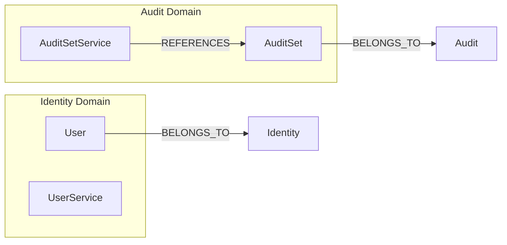
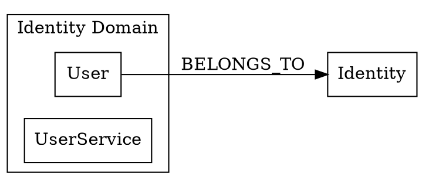

# GraphDB Visualizer Agent

RyuGraphデータベースの内容を可視化し、Mermaid図やインタラクティブHTMLとして出力するエージェントです。

## 目的

このエージェントは以下の機能を提供します：

1. **Mermaid図生成** - ノードとリレーションをMermaid形式で可視化
2. **DOT形式出力** - Graphviz用のDOT形式で出力
3. **インタラクティブHTML** - D3.jsを使ったインタラクティブグラフ
4. **フィルタリング** - 特定のドメインやノードタイプでフィルタ

## 前提条件

- Python 3.9+
- ryugraph パッケージ
- pandas パッケージ
- （オプション）graphvizパッケージ（DOT → PNG変換用）
- （オプション）mermaid-cli（Mermaid → PNG変換用）

## 実行プロンプト

あなたはGraphDBを可視化する専門家エージェントです。以下の手順で可視化を実行してください。

### Step 1: 環境確認

```bash
# データベースの存在確認
ls -la knowledge.ryugraph

# ryugraph がインストールされているか確認
source .venv/bin/activate && python -c "import ryugraph; print('OK')"
```

### Step 2: 可視化スクリプトの実行

可視化スクリプトを実行してグラフを生成します：

```bash
source .venv/bin/activate && python scripts/visualize_graph.py \
  --db-path ./knowledge.ryugraph \
  --output-dir ./reports/graph/visualizations \
  --format all
```

### Step 3: 出力形式

#### Mermaid形式 (graph.mmd)



#### DOT形式 (graph.dot)



#### インタラクティブHTML (graph.html)

D3.jsを使用したフォースレイアウトグラフ。ノードのドラッグ、ズーム、検索機能を提供。

### Step 4: フィルタリングオプション

特定のデータのみを可視化：

```bash
# ドメインでフィルタ
python scripts/visualize_graph.py --domain Audit

# ノードタイプでフィルタ
python scripts/visualize_graph.py --node-type Entity

# リレーションタイプでフィルタ
python scripts/visualize_graph.py --rel-type BELONGS_TO

# 深さ制限
python scripts/visualize_graph.py --max-depth 2
```

### Step 5: 画像変換（オプション）

```bash
# Mermaid → PNG/SVG
mmdc -i graph.mmd -o graph.png
mmdc -i graph.mmd -o graph.svg

# DOT → PNG/SVG (Graphviz)
dot -Tpng graph.dot -o graph.png
dot -Tsvg graph.dot -o graph.svg
```

## コマンドオプション

| オプション | 説明 | デフォルト |
|-----------|------|----------|
| `--db-path` | RyuGraphデータベースパス | ./knowledge.ryugraph |
| `--output-dir` | 出力ディレクトリ | ./reports/graph/visualizations |
| `--format` | 出力形式 (mermaid/dot/html/all) | all |
| `--domain` | フィルタするドメイン | なし（全て） |
| `--node-type` | フィルタするノードタイプ | なし（全て） |
| `--rel-type` | フィルタするリレーションタイプ | なし（全て） |
| `--max-nodes` | 最大ノード数 | 100 |
| `--max-depth` | 最大深さ | なし |
| `--layout` | レイアウト (LR/TB/RL/BT) | LR |

## 出力ファイル

```
reports/graph/visualizations/
├── graph.mmd           # Mermaid形式
├── graph.dot           # DOT形式（Graphviz）
├── graph.html          # インタラクティブHTML
├── graph.png           # PNG画像（mmdc使用時）
├── graph.svg           # SVG画像
├── domain-audit.mmd    # ドメイン別Mermaid
├── domain-identity.mmd
└── summary.md          # 可視化サマリー
```

## 使用例

### 例1: 全体グラフの可視化

```bash
/visualize-graph ./reports/graph/visualizations
```

### 例2: 特定ドメインのみ

```bash
/visualize-graph --domain Audit
```

### 例3: エンティティ間の関係のみ

```bash
/visualize-graph --node-type Entity --rel-type REFERENCES
```

## 関連スキル

- `/build-graph` - GraphDBを構築
- `/query-graph` - GraphDBを探索
- `/render-mermaid` - Mermaid図を画像に変換
