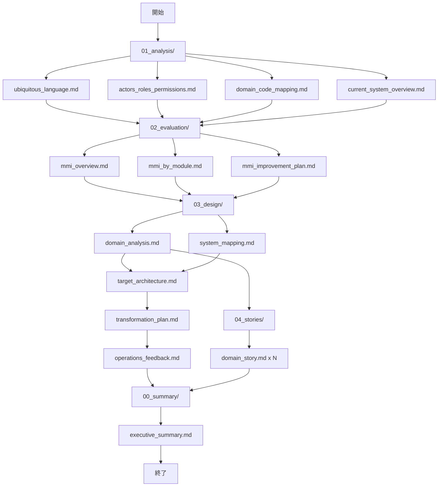

# 出力ファイル構造テンプレート

このテンプレートは、リファクタリングエージェントが生成する中間ファイルと最終成果物の構造を定義します。

## ディレクトリ構造

```
reports/
├── 00_summary/
│   ├── executive_summary.md          # エグゼクティブサマリー
│   └── project_metadata.json         # プロジェクトメタデータ
├── 01_analysis/
│   ├── ubiquitous_language.md        # ユビキタス言語集
│   ├── actors_roles_permissions.md   # アクター・ロール・権限
│   ├── domain_code_mapping.md        # ドメイン-コード対応表
│   └── current_system_overview.md    # 現行システム概要
├── 02_evaluation/
│   ├── mmi_overview.md               # MMI全体サマリー
│   ├── mmi_by_module.md              # モジュール別MMI
│   └── mmi_improvement_plan.md       # MMI改善計画
├── 03_design/
│   ├── domain_analysis.md            # ドメイン分析
│   ├── system_mapping.md             # システムマッピング
│   ├── target_architecture.md        # ターゲットアーキテクチャ
│   ├── transformation_plan.md        # 変換計画
│   ├── scalardb_*.md                 # ScalarDB設計（オプション）
│   └── operations_feedback.md        # 運用・フィードバック計画
├── 04_stories/
│   └── [domain]_story.md             # ドメイン別ストーリー
├── graph/
│   ├── data/                         # GraphDB用CSVファイル
│   ├── schema.md                     # グラフスキーマ
│   └── statistics.md                 # 統計情報
└── 99_appendix/
    ├── glossary.md                   # 用語集
    ├── references.md                 # 参考資料
    └── change_log.md                 # 変更履歴
```

## ファイル生成順序



## ファイル依存関係

| ファイル | 依存ファイル |
|---------|------------|
| mmi_overview.md | current_system_overview.md, domain_code_mapping.md |
| domain_analysis.md | ubiquitous_language.md, actors_roles_permissions.md |
| system_mapping.md | domain_code_mapping.md, mmi_by_module.md |
| target_architecture.md | domain_analysis.md, system_mapping.md, mmi_improvement_plan.md |
| [domain]_story.md | domain_analysis.md, actors_roles_permissions.md |
| executive_summary.md | すべてのファイル |

## メタデータ形式

### project_metadata.json

```json
{
    "project": {
        "name": "[プロジェクト名]",
        "version": "1.0.0",
        "created_at": "2024-01-01T00:00:00Z",
        "updated_at": "2024-01-01T00:00:00Z"
    },
    "source": {
        "path": "[対象パス]",
        "type": "[monolith/modular/mixed]",
        "languages": ["TypeScript", "Python"],
        "frameworks": ["Next.js", "FastAPI"]
    },
    "analysis": {
        "status": "completed",
        "modules_count": 10,
        "domains_count": 5,
        "average_mmi": 65.5
    },
    "agents": {
        "system_analyzer": {
            "status": "completed",
            "completed_at": "2024-01-01T00:00:00Z"
        },
        "mmi_evaluator": {
            "status": "completed",
            "completed_at": "2024-01-01T00:00:00Z"
        },
        "domain_mapper": {
            "status": "completed",
            "completed_at": "2024-01-01T00:00:00Z"
        },
        "microservice_architect": {
            "status": "completed",
            "completed_at": "2024-01-01T00:00:00Z"
        },
        "domain_storyteller": {
            "status": "in_progress",
            "domains_completed": ["Order", "Customer"],
            "domains_pending": ["Inventory"]
        }
    }
}
```

## 各ファイルの必須セクション

### executive_summary.md

```markdown
# エグゼクティブサマリー

## 評価概要
## 主要な発見事項
## 推奨アクション
## リスクと課題
## 次のステップ
```

### ubiquitous_language.md

```markdown
# ユビキタス言語集

## 概要
## 用語定義
### コアドメイン
### サブドメイン
## 略語・頭字語
## 同義語・類義語マッピング
```

### mmi_overview.md

```markdown
# MMI評価概要

## エグゼクティブサマリー
## 全体所見
## スコア分布
## 軸別平均スコア
## 主要な課題
## 推奨アクション
```

### target_architecture.md

```markdown
# ターゲットアーキテクチャ

## アーキテクチャ概要
## サービスカタログ
## サービス詳細設計
## 通信設計
## データアーキテクチャ
## セキュリティ設計
## 可観測性設計
```

## バリデーションルール

### 必須チェック

- [ ] すべてのセクションが存在する
- [ ] Mermaid図が正しくレンダリングされる
- [ ] 表が正しくフォーマットされている
- [ ] ファイル間の参照が有効である

### 整合性チェック

- [ ] ユビキタス言語の用語が一貫している
- [ ] MMIスコアの計算が正しい
- [ ] ドメイン名が全ファイルで統一されている
- [ ] サービス間の依存関係に矛盾がない

### 品質チェック

- [ ] 具体的な根拠が記載されている
- [ ] 改善提案が実行可能である
- [ ] リスクと対策が明記されている
- [ ] 用語の定義が明確である
