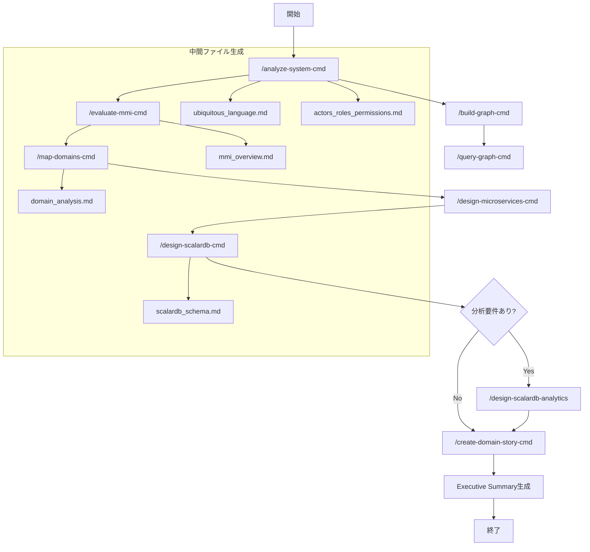
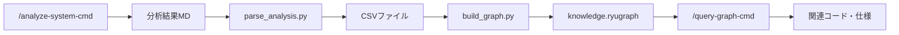
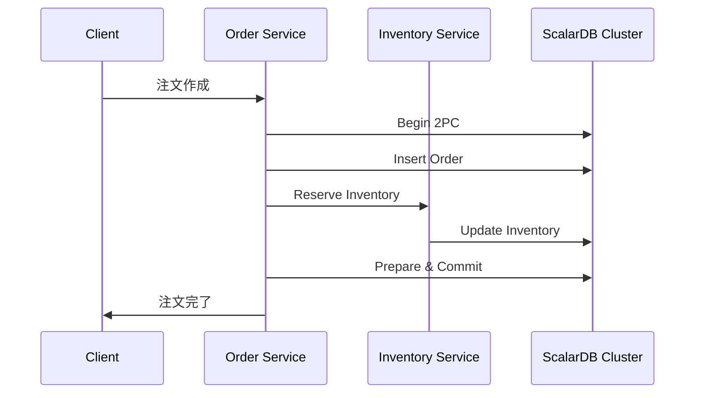

# Refactoring Agent for Claude Code

既存システムをマイクロサービスアーキテクチャにリファクタリングするための Claude Code エージェント群です。

## 概要

このツールキットは、以下のプロセスを自動化・支援します：

1. **既存システムの分析** - コードと設計書からドメイン知識を抽出
2. **MMI評価** - Modularity Maturity Index によるモジュール成熟度評価
3. **ドメインマッピング** - ビジネスドメインとコードの紐付け
4. **マイクロサービス設計** - ターゲットアーキテクチャと移行計画の策定
5. **ScalarDB設計** - ScalarDB Clusterを使用した分散トランザクション設計
6. **分析基盤設計** - ScalarDB Analyticsを使用したHTAP基盤設計
7. **ドメインストーリー作成** - 各ドメインのビジネスプロセス可視化

## 前提条件

- [Claude Code CLI](https://docs.anthropic.com/claude-code) がインストールされていること
- 対象プロジェクトへのアクセス権限

## インストール

```bash
# このリポジトリをクローン
git clone https://github.com/wfukatsu/refactoring-agent-for-claude-code.git
cd refactoring-agent-for-claude-code

# Claude Code でプロジェクトを開く
claude
```

## クイックスタート

### 1. フルリファクタリング分析

対象ディレクトリに対して、すべての分析・設計工程を実行します。

```bash
/refactor-system-cmd ./path/to/your/project
```

### 2. 出力確認

分析結果は `reports/` ディレクトリに出力されます。

```
reports/
├── 00_summary/
│   └── executive_summary.md          # エグゼクティブサマリー
├── 01_analysis/
│   ├── ubiquitous_language.md        # ユビキタス言語集
│   ├── actors_roles_permissions.md   # アクター・ロール・権限
│   ├── domain_code_mapping.md        # ドメイン-コード対応表
│   └── current_system_overview.md    # 現行システム概要
├── 02_evaluation/
│   ├── mmi_overview.md               # MMI全体サマリー
│   ├── mmi_by_module.md              # モジュール別MMI
│   └── mmi_improvement_plan.md       # MMI改善計画
├── 03_design/
│   ├── domain_analysis.md            # ドメイン分析
│   ├── system_mapping.md             # システムマッピング
│   ├── target_architecture.md        # ターゲットアーキテクチャ
│   ├── transformation_plan.md        # 変換計画
│   ├── operations_feedback.md        # 運用・フィードバック計画
│   ├── scalardb_architecture.md      # ScalarDB Clusterアーキテクチャ設計
│   ├── scalardb_schema.md            # ScalarDBスキーマ設計
│   ├── scalardb_transaction.md       # ScalarDBトランザクション設計
│   ├── scalardb_migration.md         # ScalarDBマイグレーション計画
│   └── scalardb_analytics_*.md       # ScalarDB Analytics設計（オプション）
├── 04_stories/
│   └── [domain]_story.md             # ドメイン別ストーリー
└── graph/                            # ナレッジグラフ用データ
    ├── data/                         # CSVファイル
    ├── schema.md                     # グラフスキーマ
    └── statistics.md                 # 統計情報

<プロジェクトルート>/
└── knowledge.ryugraph/               # RyuGraphデータベース
```

## 利用可能なスキル

### メインオーケストレーター

| コマンド | 説明 |
|---------|------|
| `/refactor-system-cmd` | 統合リファクタリングエージェント。全工程を順次実行 |

### 個別スキル

| コマンド | 説明 |
|---------|------|
| `/analyze-system-cmd` | システム分析。ユビキタス言語、アクター、ドメイン-コード対応表を抽出 |
| `/evaluate-mmi-cmd` | MMI評価。モジュール成熟度を4軸で評価 |
| `/map-domains-cmd` | ドメインマッピング。境界づけられたコンテキストとコンテキストマップを作成 |
| `/design-microservices-cmd` | マイクロサービス設計。ターゲットアーキテクチャと移行計画を策定 |
| `/design-scalardb-cmd` | ScalarDB Cluster設計。分散トランザクション、スキーマ設計、マイグレーション計画を策定 |
| `/design-scalardb-analytics` | ScalarDB Analytics設計。分析基盤、データカタログ、クエリ最適化を策定 |
| `/create-domain-story-cmd` | ドメインストーリー作成。ビジネスプロセスを物語形式で整理 |

### ナレッジグラフスキル

| コマンド | 説明 |
|---------|------|
| `/build-graph-cmd` | RyuGraphデータベースを構築。分析結果からナレッジグラフを生成 |
| `/query-graph-cmd` | グラフを探索。自然言語またはCypherでクエリを実行 |

### ユーティリティスキル

| コマンド | 説明 |
|---------|------|
| `/render-mermaid` | Mermaid図をPNGとSVGの両方に変換 |
| `/fix-mermaid` | Mermaid図のシンタックスエラーを修正 |

## 使用例

### 基本的な使用

```bash
# プロジェクト全体を分析
/refactor-system-cmd ./src

# 分析のみ実行（設計書生成なし）
/refactor-system-cmd ./src --analyze-only

# 出力先を指定
/refactor-system-cmd ./src --output=./my-output/
```

### 個別スキルの使用

```bash
# システム分析のみ
/analyze-system-cmd ./src

# MMI評価のみ
/evaluate-mmi-cmd ./src

# 特定ドメインのストーリー作成（インタラクティブ）
/create-domain-story-cmd --domain=Order

# ドメインマッピング
/map-domains-cmd ./src

# ScalarDB Clusterを使用したデータアーキテクチャ設計
/design-scalardb-cmd ./src

# ScalarDB Analyticsを使用した分析基盤設計
/design-scalardb-analytics ./src
```

### ナレッジグラフの使用

```bash
# ナレッジグラフを構築（分析結果から）
/build-graph-cmd ./src

# グラフを探索（自然言語）
/query-graph-cmd 「注文」に関連するクラスを教えて

# グラフを探索（Cypher）
/query-graph-cmd MATCH (e:Entity)-[:HAS_TERM]->(t:UbiquitousTerm) RETURN e, t LIMIT 10
```

### Mermaid図の変換

```bash
# reports/ 内の全Mermaid図を PNG と SVG に変換
/render-mermaid ./reports/
```

### 特定ドメインのみ対象

```bash
# Order と Customer ドメインのみ分析
/refactor-system-cmd ./src --domain=Order,Customer
```

## MMI（Modularity Maturity Index）評価

### 評価軸

| 軸 | 重み | 説明 | スコア基準 |
|---|-----|------|----------|
| **Cohesion** | 30% | 単一責務性 | 5=完全単責、0=責務不明瞭 |
| **Coupling** | 30% | 疎結合性 | 5=独立、0=強結合+循環依存 |
| **Independence** | 20% | デプロイ独立性 | 5=完全独立、0=一体化 |
| **Reusability** | 20% | 再利用性 | 5=汎用、0=再利用不可 |

### 計算式

```
MMI = (0.3×Cohesion + 0.3×Coupling + 0.2×Independence + 0.2×Reusability) / 5 × 100
```

### 成熟度レベル

| スコア | レベル | 説明 |
|-------|-------|------|
| 80-100 | 高成熟 | マイクロサービス化の準備完了 |
| 60-80 | 中成熟 | 一部改善でマイクロサービス化可能 |
| 40-60 | 低中成熟 | 大幅なリファクタリングが必要 |
| 0-40 | 未成熟 | モノリス分解の計画策定から |

## ドメイン分類

### ビジネス構造軸

| タイプ | 特徴 | 例 |
|-------|-----|-----|
| **Pipeline** | 順序的なデータ/処理フロー | 注文処理、ワークフロー |
| **Blackboard** | 共有データへの協調的アクセス | 在庫管理、予約システム |
| **Dialogue** | 双方向のインタラクション | チャット、通知システム |

### マイクロサービス境界軸

| カテゴリ | 責務 | 特徴 |
|---------|-----|------|
| **Process** | ビジネスプロセスの実行 | ステートフル、サガ管理 |
| **Master** | マスタデータの管理 | CRUD中心、データ整合性 |
| **Integration** | 外部システム連携 | アダプタ、変換処理 |
| **Supporting** | 横断的機能の提供 | 認証、ログ、通知 |

## ドメインストーリーテリング

対話的にビジネスプロセスを引き出し、可視化します。

### 3つの構成要素

| 要素 | 説明 |
|-----|------|
| **アクター** | 登場人物（人、役割、システム） |
| **ワークアイテム** | 扱うモノや情報 |
| **アクティビティ** | 実行する行動 |

### 7段階のプロセス

1. **舞台設定** - スコープを決定
2. **物語開始** - 最初のアクターと行動を特定
3. **展開** - 時系列でアクティビティの連鎖を追跡
4. **確認** - 整理した内容をレビュー
5. **例外検討** - うまくいかないパターンを確認
6. **可視化** - Mermaid図を生成
7. **クロージング** - 調整確認と終了判断

## ワークフロー



## ナレッジグラフ

分析結果をRyuGraphデータベースに格納し、ドメイン知識を探索可能にします。

### セットアップ

```bash
# RyuGraphのインストール
pip install ryugraph pandas
```

### グラフ構築ワークフロー



### スキルによる構築

```bash
# 1. システム分析を実行（必須）
/analyze-system-cmd ./src

# 2. グラフを構築
/build-graph-cmd ./src

# 3. グラフを探索
/query-graph-cmd 顧客に関連するエンティティを教えて
```

### 手動でのグラフ構築

```bash
# 1. 分析結果からCSVを生成
python scripts/parse_analysis.py \
  --input-dir ./reports/01_analysis \
  --output-dir ./reports/graph/data

# 2. GraphDBを構築
python scripts/build_graph.py \
  --data-dir ./reports/graph/data \
  --db-path ./knowledge.ryugraph

# 3. クエリを実行
python scripts/query_graph.py \
  --db-path ./knowledge.ryugraph \
  --interactive
```

### クエリ例

```bash
# 自然言語クエリ
/query-graph-cmd 「注文」に関連するすべてのクラスを教えて
/query-graph-cmd 在庫管理ドメインのエンティティ一覧

# Cypherクエリ
/query-graph-cmd MATCH (e:Entity)-[:BELONGS_TO]->(d:Domain) RETURN e.name, d.name
/query-graph-cmd MATCH (a:Actor)-[:PERFORMS]->(act:Activity) RETURN a, act
/query-graph-cmd MATCH (t:UbiquitousTerm) WHERE t.name CONTAINS '注文' RETURN t
```

### グラフスキーマ

| ノードタイプ | 説明 | 主なプロパティ |
|------------|------|--------------|
| Entity | ドメインエンティティ | name, description |
| UbiquitousTerm | ユビキタス言語 | name, definition, examples |
| Actor | アクター | name, role |
| Domain | ドメイン | name, type, category |
| Activity | アクティビティ | name, description |

| リレーションシップ | 説明 |
|------------------|------|
| HAS_TERM | エンティティがユビキタス用語を持つ |
| BELONGS_TO | エンティティがドメインに属する |
| PERFORMS | アクターがアクティビティを実行する |
| DEPENDS_ON | エンティティが他のエンティティに依存する |

## ScalarDB設計

ScalarDB Clusterを使用して、マイクロサービス間の分散トランザクションを実現するデータアーキテクチャを設計します。

### ScalarDB Clusterとは

ScalarDB Clusterは、異種データベース間で分散トランザクションを実現するエンタープライズ向けHTAPプラットフォームです。gRPCベースの集中型トランザクションコーディネーターとして動作し、マイクロサービスアーキテクチャに最適化されています。

| 機能 | 説明 |
|-----|------|
| **Consensus Commit** | 単一ストレージでのACIDトランザクション |
| **Two-Phase Commit** | 複数ストレージ間の分散トランザクション |
| **Multi-Storage** | 異種DB間のアトミック操作（PostgreSQL + DynamoDB等） |
| **gRPC API** | 高性能なサービス間通信 |
| **SQL/GraphQL** | 標準的なクエリインターフェース |
| **High Availability** | クラスター構成による高可用性 |

### サポートストレージ

| カテゴリ | データベース |
|---------|------------|
| **JDBC** | MySQL, PostgreSQL, Oracle, SQL Server, Db2 |
| **NoSQL** | Cassandra, DynamoDB, Cosmos DB, YugabyteDB |
| **Object Storage** | S3, Azure Blob, GCS |

### 使用方法

```bash
# マイクロサービス設計後にScalarDB Cluster設計を実行
/design-scalardb-cmd ./src

# 分析要件がある場合はScalarDB Analytics設計も実行
/design-scalardb-analytics ./src
```

### 出力ファイル

| ファイル | 内容 |
|---------|------|
| `scalardb_architecture.md` | クラスター構成、接続方式、セキュリティ設計 |
| `scalardb_schema.md` | Namespace、テーブル定義、パーティション戦略 |
| `scalardb_transaction.md` | トランザクションパターン、Saga設計、例外処理 |
| `scalardb_migration.md` | フェーズ別計画、データ移行手順、ロールバック |
| `scalardb_analytics_*.md` | 分析基盤設計（Analytics使用時） |

### トランザクションパターン



## ScalarDB Analytics

ScalarDB Analyticsを使用して、HTAP（Hybrid Transactional/Analytical Processing）アーキテクチャの分析基盤を設計します。

### 主要機能

| 機能 | 説明 |
|-----|------|
| **Federated Query** | 複数DBにまたがる統合クエリ |
| **Spark SQL** | Apache Sparkによる分散処理 |
| **Data Catalog** | 論理スキーマの一元管理 |
| **Read Consistency** | トランザクション状態を考慮した読み取り |

### 使用方法

```bash
# 分析要件がある場合に実行
/design-scalardb-analytics ./src
```

## 入力ファイル形式

以下の形式の設計書・ドキュメントを解析できます：

- Markdown (`.md`)
- Word (`.docx`) ※テキスト抽出
- Excel (`.xlsx`) ※テーブルデータ
- PDF (`.pdf`) ※テキスト抽出
- PlantUML (`.puml`)
- ソースコード（各種言語）

## 設定

### 出力先の変更

```bash
/refactor-system-cmd ./src --output=./custom-output/
```

### スキップオプション

```bash
# MMI評価をスキップ
/refactor-system-cmd ./src --skip-mmi

# ドメインストーリーをスキップ
/refactor-system-cmd ./src --skip-stories
```

## トラブルシューティング

### 設計書が見つからない場合

コードのみから推論を行いますが、精度が低下する可能性があります。可能な限り設計書を用意してください。

### 大規模コードベースの場合

処理に時間がかかる場合があります。`--domain` オプションで対象を絞ることを推奨します。

### 言語が非対応の場合

Serenaツールが対応していない言語の場合、Grep/Glob による基本的な解析のみとなります。

## ファイル構成

```
refactoring-agent-for-claude-code/
├── README.md                              # このファイル
├── CLAUDE.md                              # プロジェクト設定
├── .claude/
│   ├── settings.json                      # スキル登録
│   ├── commands/                          # コマンド定義
│   │   ├── refactor-system-cmd.md        # メインオーケストレーター
│   │   ├── analyze-system-cmd.md         # システム分析
│   │   ├── evaluate-mmi-cmd.md           # MMI評価
│   │   ├── map-domains-cmd.md            # ドメインマッピング
│   │   ├── design-microservices-cmd.md   # マイクロサービス設計
│   │   ├── create-domain-story-cmd.md    # ドメインストーリー
│   │   ├── init-output-cmd.md            # 出力初期化
│   │   ├── design-scalardb-cmd.md        # ScalarDB Cluster設計
│   │   ├── build-graph-cmd.md            # グラフ構築
│   │   └── query-graph-cmd.md            # グラフ探索
│   ├── skills/                            # スキル定義
│   │   ├── refactor-system/
│   │   ├── analyze-system/
│   │   ├── evaluate-mmi/
│   │   ├── map-domains/
│   │   ├── design-microservices/
│   │   ├── design-scalardb/              # ScalarDB Cluster設計スキル
│   │   ├── design-scalardb-analytics/    # ScalarDB Analytics設計スキル
│   │   ├── create-domain-story/
│   │   ├── init-output/
│   │   ├── fix-mermaid/
│   │   ├── render-mermaid/
│   │   ├── build-graph/                  # グラフ構築スキル
│   │   └── query-graph/                  # グラフ探索スキル
│   └── templates/
│       └── output-structure.md           # 出力構造テンプレート
├── scripts/                               # ユーティリティスクリプト
│   ├── parse_analysis.py                 # 分析結果パーサー
│   ├── build_graph.py                    # グラフ構築スクリプト
│   └── query_graph.py                    # グラフクエリスクリプト
└── reports/                               # 分析結果出力先
```

## 参考資料

- [ScalarDB Documentation](https://scalardb.scalar-labs.com/docs/)
- [ScalarDB Analytics](https://scalardb.scalar-labs.com/docs/latest/scalardb-analytics/)
- [RyuGraph Documentation](https://ryugraph.io/docs/)
- [Modularity Maturity Index テンプレート](https://github.com/wfukatsu/Prompt-Templates/blob/main/system-design/modularity-maturity-index.md)
- [Domain-Driven Transformation テンプレート](https://github.com/wfukatsu/Prompt-Templates/blob/main/system-design/domain-driven-transformation.md)
- [Domain Storytelling テンプレート](https://github.com/wfukatsu/Prompt-Templates/blob/main/system-design/domain-storytelling.md)
- [Domain Refactoring Agent テンプレート](https://github.com/wfukatsu/Prompt-Templates/blob/main/system-design/domain-refactering-agent.md)

## ライセンス

MIT License

## 貢献

Issue や Pull Request を歓迎します。

---

Created with Claude Code
