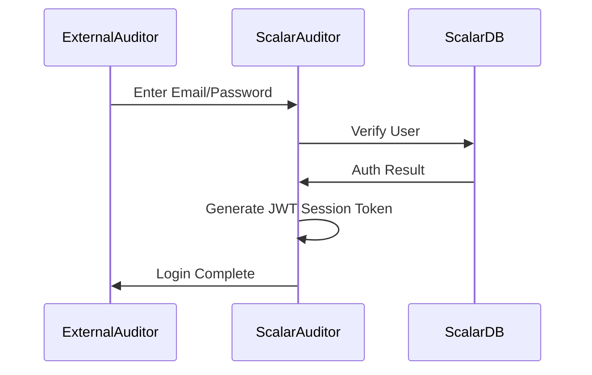

# アクター・ロール・権限

## アクター一覧

### 人間アクター

| アクター | 説明 | 主な操作 |
|---------|------|---------|
| Audit Admin | 監査管理者。組織のシステム管理責任者 | ユーザー管理、監査セット管理、外部監査人管理 |
| General User | 一般ユーザー。BOXアカウントを持つ組織メンバー | ファイル追加、イベント閲覧、監査アクセスログ閲覧 |
| External Auditor | 外部監査人。外部組織からの監査担当者 | ファイル監査、プレビュー、ダウンロード |

### システムアクター

| システム | 説明 | 連携方法 |
|---------|------|---------|
| BOX Platform | クラウドストレージサービス | OAuth 2.0 / Client Credentials Grant |
| ScalarDB | 分散データベース | JDBC/クラスタ接続 |
| ScalarDL | 分散台帳（改ざん検知） | Client SDK |
| Event Listener | イベント収集バッチ | 定期実行（EventListener.java） |

## ロール定義

| ロール | 説明 | 権限セット | コード参照 |
|-------|------|-----------|-----------|
| `AUDIT_ADMIN` | 監査管理者ロール | 全管理機能、イベント閲覧、ファイル追加 | `UserRoles.AUDIT_ADMIN` |
| `GENERAL_USER` | 一般ユーザーロール | ファイル追加、イベント閲覧、プレビュー/ダウンロード | `UserRoles.GENERAL_USER` |
| `EXTERNAL_AUDITOR` | 外部監査人ロール | 割当ファイルの閲覧、プレビュー/ダウンロード | `UserRoles.EXTERNAL_AUDITOR` |

### 監査セットコラボレーターロール

| ロール | 説明 | 権限レベル | コード参照 |
|-------|------|-----------|-----------|
| `OWNER` | 監査セットオーナー | 完全な管理権限 | `CollaboratorUserRoles.OWNER` |
| `CO_OWNER` | 共同オーナー | オーナーに準ずる権限 | `CollaboratorUserRoles.CO_OWNER` |
| `MEMBER` | メンバー | 読み取り・限定編集 | `CollaboratorUserRoles.MEMBER` |
| `REVIEWER` | レビュアー | 読み取り専用 | `CollaboratorUserRoles.REVIEWER` |

## 権限マトリックス

### 基本機能

| 機能 | Audit Admin | General User | External Auditor |
|------|:-----------:|:------------:|:----------------:|
| BOX統合メニューからアクセス | ○ | ○ | × |
| Web UIログイン | ○ | ○ | ○ |
| 所有/共有ファイルを監査セットに追加 | ○ | ○ | × |
| 所有/共有フォルダを監査セットに追加 | ○ | ○ | × |

### ユーザー管理

| 機能 | Audit Admin | General User | External Auditor |
|------|:-----------:|:------------:|:----------------:|
| ユーザーロールの追加/変更 | ○ | × | × |
| 外部監査人の作成 | ○ | × | × |
| 外部監査人情報の更新 | ○ | × | × |
| 外部監査人/グループの削除 | ○ | × | × |

### 監査セット管理

| 機能 | Audit Admin | General User | External Auditor |
|------|:-----------:|:------------:|:----------------:|
| 監査セットの作成 | ○ | × | × |
| 監査セット詳細の更新 | ○ | × | × |
| 監査セットの削除 | ○ | × | × |
| 監査セットオーナーの変更 | ○ | × | × |
| 外部監査人を監査セットに割当 | ○ | × | × |

### 監査グループ管理

| 機能 | Audit Admin | General User | External Auditor |
|------|:-----------:|:------------:|:----------------:|
| 監査グループの作成 | ○ | × | × |
| 監査グループの更新 | ○ | × | × |

### ファイル・イベント操作

| 機能 | Audit Admin | General User | External Auditor |
|------|:-----------:|:------------:|:----------------:|
| ファイルイベント履歴の閲覧 | ○ | ○ | ○ |
| 全イベント履歴の閲覧 | ○ | × | × |
| 監査アクセスログの閲覧 | × | ○ | × |
| ファイルのプレビュー | × | ○ | ○ |
| ファイルのダウンロード | × | ○ | ○ |
| 所有/共有ファイル詳細の閲覧 | ○ | ○ | N/A |
| 監査割当ファイル詳細の閲覧 | N/A | N/A | ○ |

## ロール遷移ルール

| 現在のロール | 操作 | 変更後のロール |
|------------|------|---------------|
| AUDIT_ADMIN | ロール変更 | GENERAL_USER |
| GENERAL_USER | ロール変更 | AUDIT_ADMIN |
| AUDIT_ADMIN | ロール追加 | AUDIT_ADMIN + GENERAL_USER |
| GENERAL_USER | ロール追加 | GENERAL_USER + AUDIT_ADMIN |
| AUDIT_ADMIN + GENERAL_USER | AUDIT_ADMIN削除 | GENERAL_USER |
| AUDIT_ADMIN + GENERAL_USER | GENERAL_USER削除 | AUDIT_ADMIN |

## 認証・認可フロー

### 組織ユーザー認証フロー（BOX OAuth 2.0）

```mermaid
sequenceDiagram
    participant U as User
    participant App as ScalarAuditor
    participant BOX as BOXPlatform

    U->>App: Login Request
    App->>BOX: OAuth2.0 Redirect
    U->>BOX: Enter BOX Credentials
    BOX->>App: Return Auth Code
    App->>BOX: Get Access Token
    BOX->>App: Issue Token
    App->>App: Generate JWT Session Token
    App->>U: Login Complete
```

### 外部監査人認証フロー



### イベントログ取得フロー（バックグラウンド）

```mermaid
sequenceDiagram
    participant EL as EventListener
    participant BOX as BOXPlatform
    participant DB as ScalarDB
    participant DL as ScalarDL

    EL->>BOX: Client Credentials Auth
    BOX->>EL: Access Token
    EL->>BOX: Get Event Logs
    BOX->>EL: Event Data
    EL->>DB: Save Events
    EL->>DL: Register Asset for Tampering Detection
```

## 実装上のセキュリティ考慮点

### 認証メカニズム

1. **BOX OAuth 2.0** - 組織ユーザーの認証
2. **Client Credentials Grant** - イベントログ取得用サービス認証
3. **JWT** - アプリケーション内セッション管理
4. **パスワード認証** - 外部監査人用

### 認可チェックポイント

| レイヤー | 実装箇所 | チェック内容 |
|---------|---------|------------|
| Controller | `*Controller.java` | APIエンドポイント保護 |
| Service | `*Service.java` | ビジネスロジック権限確認 |
| Security | `security/` パッケージ | JWT検証、ロールベース認可 |
