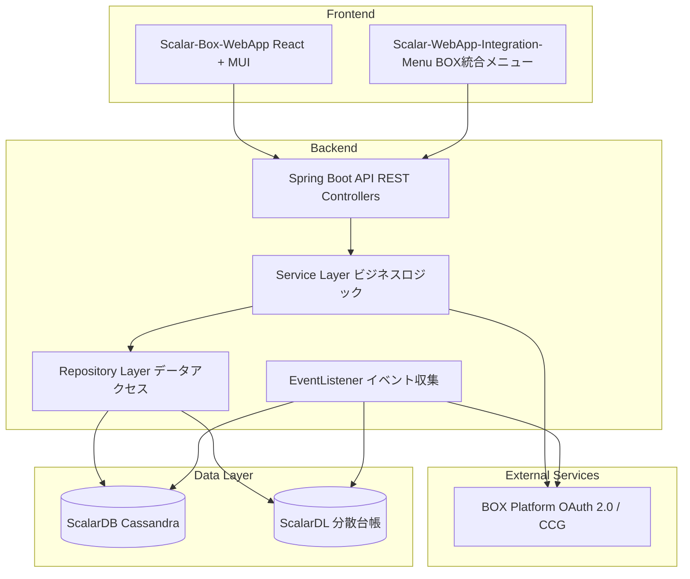

# 現行システム概要

## 評価日
2025-12-25

## 対象システム
Scalar Auditor for BOX

## 概要
BOXアプリケーションと統合された監査ログ管理システム。ユーザーイベントログをBOX外部で保存・分析し、外部監査人がファイル監査を行えるようにする。

## 技術スタック

### バックエンド

| 技術 | バージョン | 用途 |
|-----|----------|------|
| Java | 17 | プログラミング言語 |
| Spring Boot | 3.2.1 | Webアプリケーションフレームワーク |
| Spring Security | (依存) | 認証・認可 |
| Lombok | (依存) | コード生成 |
| Gradle | - | ビルドツール |

### 外部サービス連携

| 技術 | バージョン | 用途 |
|-----|----------|------|
| Box Java SDK | 4.4.0 | BOX API連携 |
| ScalarDL Client SDK | 3.10.0 | 分散台帳連携（改ざん検知） |
| ScalarDB Cluster SDK | 3.14.0 | 分散データベース連携 |

### 認証・セキュリティ

| 技術 | バージョン | 用途 |
|-----|----------|------|
| JWT (jjwt) | 0.11.5 | トークンベース認証 |
| Spring Security | (依存) | セキュリティフレームワーク |

### その他ライブラリ

| 技術 | バージョン | 用途 |
|-----|----------|------|
| Gson | 2.10.1 | JSON処理 |
| minimal-json | 0.9.5 | 軽量JSON処理 |
| SpringDoc OpenAPI | 2.3.0 | API ドキュメント |
| Spring Mail | (依存) | メール送信 |
| Spring Validation | (依存) | バリデーション |

### フロントエンド

| 技術 | バージョン | 用途 |
|-----|----------|------|
| React | 18.2.0 | UIフレームワーク |
| Vite | 5.0.8 | ビルドツール |
| MUI (Material-UI) | 5.15.x | UIコンポーネント |
| Redux Toolkit | 2.1.0 | 状態管理 |
| React Router | 6.22.0 | ルーティング |
| Axios | 1.6.7 | HTTP クライアント |
| i18next | 23.11.2 | 国際化 |
| box-ui-elements | 19.0.0 | BOX UI統合 |
| Formik | 2.4.5 | フォーム管理 |
| Tailwind CSS | 3.4.1 | CSSフレームワーク |

### データベース

| 技術 | バージョン | 用途 |
|-----|----------|------|
| Cassandra | (ScalarDB経由) | データストレージ |
| ScalarDB | 3.14.0 | 分散トランザクション管理 |
| ScalarDL | 3.10.0 | 改ざん検知・台帳管理 |

### インフラ

| 技術 | 用途 |
|-----|------|
| Kubernetes | コンテナオーケストレーション |
| Docker | コンテナ化 |

## アーキテクチャ概要



## モジュール構成（バックエンド）

| モジュール | 責務 | ファイル数 |
|----------|------|----------|
| controller | REST API エンドポイント | 9 |
| service | ビジネスロジック | 10 |
| business | ビジネス処理補助 | 8 |
| repository | データアクセス | 21 |
| model | エンティティ定義 | 20 |
| dto | データ転送オブジェクト | 47 |
| responsedto | レスポンス用DTO | 18 |
| security | 認証・認可 | 5 |
| config | 設定 | 1 |
| constant | 定数・Enum | 11 |
| exception | 例外処理 | 3 |
| utility | ユーティリティ | 4 |

## 主要ドメイン

### 1. 監査セット管理 (AuditSet)
- AuditSet - 監査対象ファイル/フォルダのグループ
- AuditSetItem - 監査セット内のアイテム
- AuditSetCollaborators - 監査セットの協力者

### 2. 監査グループ管理 (AuditGroup)
- AuditGroup - ユーザーのグループ化
- UserAuditGroup - ユーザーとグループの関連

### 3. ユーザー管理 (User)
- User - システムユーザー
- RoleUser - ロール定義
- Organization - 組織

### 4. イベントログ (Events)
- Events - イベントログ
- EnterpriseEventLogs - エンタープライズイベント
- AuditorLogs - 監査人ログ

### 5. ファイル/アイテム管理 (Item)
- Item - ファイル/フォルダ情報
- ItemStatus - アイテム状態
- ItemsBySha1 - ハッシュによるアイテム検索

## 外部連携

| 連携先 | 連携方式 | 用途 | 実装箇所 |
|-------|---------|------|---------|
| BOX Platform | OAuth 2.0 | ユーザー認証、ファイル操作 | business/, service/ |
| BOX Platform | Client Credentials Grant | イベントログ取得 | EventListener.java |
| ScalarDB Cluster | gRPC/JDBC | データ永続化 | repository/ |
| ScalarDL | Client SDK | 改ざん検知、アセット管理 | ScalardlRepository.java |
| SMTP Server | Spring Mail | メール通知 | (設定による) |

## 課題・技術的負債

| 課題 | 深刻度 | 影響範囲 | 推奨対応 |
|-----|-------|---------|---------|
| 巨大なServiceクラス | 高 | 保守性 | ドメイン分割 |
| EventListener.javaの肥大化（31KB） | 高 | 可読性・保守性 | 責務分離 |
| UserService.javaの肥大化（53KB） | 高 | 可読性・保守性 | 責務分離 |
| AuditSetService/ItemServiceの肥大化 | 高 | 可読性・保守性 | 責務分離 |
| JSONフィールドでの関連管理 | 中 | データ整合性 | 正規化検討 |
| 多数のDTO（65種類以上） | 低 | 複雑性 | DTO統合検討 |
| BOX連携ロジックの分散 | 中 | 保守性 | 統合レイヤー化 |
| テストカバレッジ不明 | 中 | 品質 | テスト拡充 |
| 多数のリポジトリ依存（各サービス5-10個） | 中 | 結合度 | ファサードパターン導入 |
| トランザクション境界の曖昧さ | 高 | データ整合性 | サガパターン検討 |

## プロジェクト構造

```
scalar-event-log-fetcher-main/
├── Scalar-Box-Event-Log-Tool/       # バックエンド（Spring Boot）
│   ├── src/main/java/
│   │   └── com/scalar/events_log_tool/application/
│   ├── build.gradle
│   ├── scalardb.properties
│   └── client.properties
├── Scalar-Box-WebApp/                # フロントエンド（React）
│   ├── src/
│   └── package.json
├── Scalar-WebApp-Integration-Menu/   # BOX統合メニュー
│   ├── src/
│   └── package.json
├── Scalar-Box-Event-Log-Tool-Setup/  # セットアップスクリプト
├── ScalarDL-Event-Log-Fetcher-Setup/ # ScalarDLセットアップ
├── K8s-scalardb-cluster/             # Kubernetes設定
├── Documentation/                     # ドキュメント
└── README.md
```

## 備考

- Spring Bootの標準的なレイヤードアーキテクチャを採用
- ScalarDB/ScalarDLによる分散トランザクションとデータ整合性確保
- BOX APIとの統合が密結合
