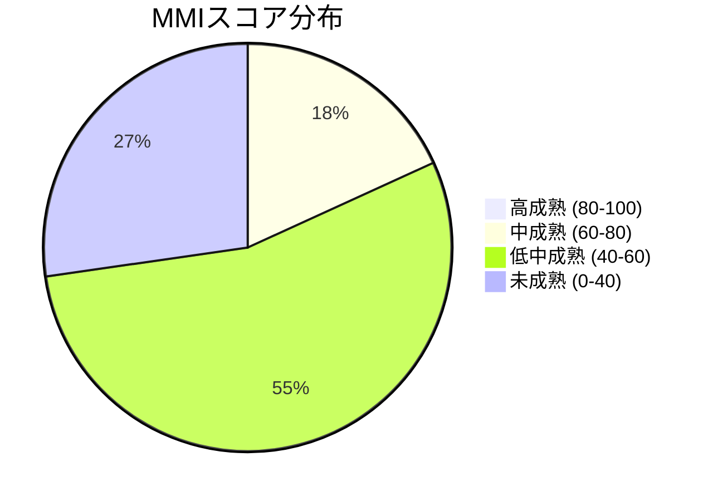
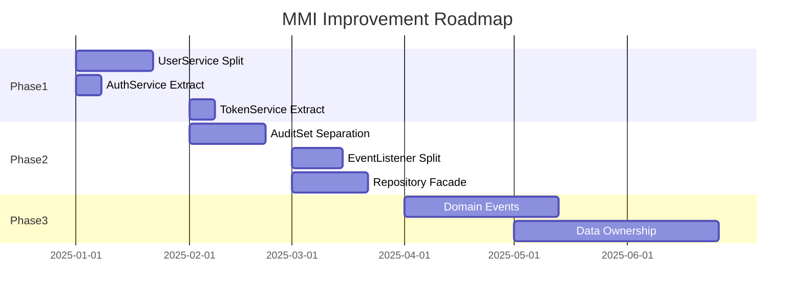

# MMI評価概要

## エグゼクティブサマリー

- **評価日**: 2025-12-25
- **対象システム**: Scalar Auditor for BOX (Backend)
- **評価モジュール数**: 10（主要サービス）+ 1（EventListener）
- **平均MMI**: 48/100
- **成熟度レベル**: 低中成熟（マイクロサービス化には大幅なリファクタリングが必要）

## 全体所見

Scalar Auditor for BOXは、Spring Bootの標準的なレイヤードアーキテクチャを採用しており、基本的な構造は整っています。しかし、以下の重大な課題があります：

1. **巨大なサービスクラス**: UserService（1,118行）、AuditSetItemService（902行）、AuditSetService（845行）が肥大化
2. **過剰な依存関係**: UserServiceは11個のリポジトリに依存
3. **責務の混在**: 認証、ユーザー管理、監査セット管理などが密結合
4. **EventListenerの肥大化**: 548行のイベント取得ロジック

## スコア分布

## 軸別平均スコア

| 評価軸 | 重み | 平均スコア | 評価 |
|-------|-----|----------|------|
| Cohesion（凝集度） | 30% | 2.4/5 | 複数責務が混在するクラスが多い |
| Coupling（結合度） | 30% | 2.2/5 | 多数のリポジトリ依存、サービス間循環の可能性 |
| Independence（独立性） | 20% | 2.6/5 | 共有DBへの強い依存 |
| Reusability（再利用性） | 20% | 2.7/5 | BOX API依存が強い、環境依存あり |

## 主要モジュール評価サマリー

| モジュール | 行数 | リポジトリ依存 | MMI | 成熟度 |
|----------|-----|--------------|-----|--------|
| EventLogService | 221 | 2 | 66 | 中成熟 |
| FolderService | 114 | 1(Service) | 62 | 中成熟 |
| CommonService | 32 | 0 | 58 | 低中成熟 |
| AuditSetCollaboratorService | 287 | 4 | 54 | 低中成熟 |
| AssetService | 198 | 1 | 52 | 低中成熟 |
| FileService | 554 | 6 | 50 | 低中成熟 |
| AuditGroupService | 438 | 5 | 46 | 低中成熟 |
| AuditSetService | 845 | 9 | 38 | 未成熟 |
| AuditSetItemService | 902 | 7 | 36 | 未成熟 |
| UserService | 1,118 | 11 | 28 | 未成熟 |
| EventListener | 548 | 多数 | 32 | 未成熟 |

**平均MMI**: 48

## 主要な課題

### 1. UserServiceの著しい肥大化（深刻度: 高）
- **状況**: 1,118行、30+メソッド、11リポジトリ依存
- **混在責務**:
  - ユーザーCRUD
  - 認証・ログイン
  - トークン管理
  - パスワードリセット・OTP
  - メール送信
  - 監査セット関連処理
  - 監査グループ関連処理
- **影響**: 保守困難、テスト困難、変更影響範囲大
- **推奨MMI改善効果**: +25-30

### 2. AuditSetService/AuditSetItemServiceの肥大化（深刻度: 高）
- **状況**: 合計1,747行、複雑なビジネスロジック
- **問題**: 監査セット作成・管理・アイテム追加が密結合
- **推奨MMI改善効果**: +15-20

### 3. 過剰なリポジトリ依存（深刻度: 中）
- **状況**: 主要サービスが平均5-10個のリポジトリに直接依存
- **問題**: 結合度が高く、変更影響が大きい
- **推奨MMI改善効果**: +10-15

### 4. EventListenerの責務過多（深刻度: 中）
- **状況**: イベント取得、パース、保存を単一クラスで実行
- **問題**: 単一障害点、テスト困難
- **推奨MMI改善効果**: +10-15

### 5. 共有データベース（深刻度: 中）
- **状況**: 全サービスが同一ScalarDB/Cassandraを共有
- **問題**: マイクロサービス化の最大障壁
- **推奨対応**: データ所有権の定義から開始

## 推奨アクション

### 優先度: 高（即時対応）

| アクション | 対象 | 工数目安 | 期待効果 |
|----------|------|---------|---------|
| UserService分割 | UserService | 2-3週間 | MMI +25-30 |
| AuthService抽出 | UserService | 1週間 | 認証ロジック独立 |
| TokenService抽出 | UserService | 1週間 | トークン管理独立 |

### 優先度: 中（1-3ヶ月）

| アクション | 対象 | 工数目安 | 期待効果 |
|----------|------|---------|---------|
| AuditSet責務分離 | AuditSetService, AuditSetItemService | 2-3週間 | MMI +15-20 |
| EventListener分割 | EventListener | 1-2週間 | MMI +10-15 |
| リポジトリファサード | 全サービス | 2-3週間 | 結合度低下 |

### 優先度: 低（長期）

| アクション | 対象 | 工数目安 | 期待効果 |
|----------|------|---------|---------|
| ドメインイベント導入 | サービス間連携 | 1-2ヶ月 | 疎結合化 |
| データ所有権定義 | 全DB | 2-3ヶ月 | MS化準備 |
| CQRS導入 | 読み取り多いモジュール | 1-2ヶ月 | スケーラビリティ |

## 改善ロードマップ

## 目標MMI

| フェーズ | 目標MMI | 目標成熟度 |
|---------|--------|----------|
| 現状 | 48 | 低中成熟 |
| Phase 1完了後 | 58 | 低中成熟（上限） |
| Phase 2完了後 | 68 | 中成熟 |
| Phase 3完了後 | 78+ | 中成熟（上限）→ MS化準備完了 |

## 次のステップ

1. 詳細なモジュール別評価（mmi_by_module.md）の確認
2. 改善計画の詳細（mmi_improvement_plan.md）の確認
3. ドメイン分析の実施（/map-domains）
