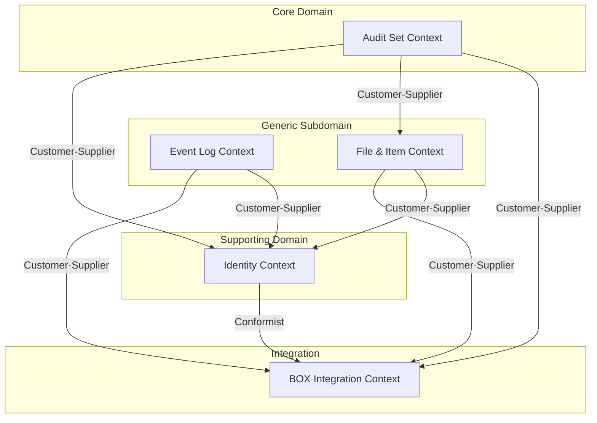

# ドメイン分析

## ドメイン一覧

Scalar Auditor for BOXを分析した結果、以下の5つの主要ドメインを特定しました。

| # | ドメイン名 | ドメインタイプ | サービスカテゴリ | コアドメイン |
|---|----------|--------------|----------------|------------|
| 1 | Identity & Access | Dialogue | Supporting | No |
| 2 | Audit Set Management | Blackboard | Process | Yes |
| 3 | Event Log | Pipeline | Master/Reference | Yes |
| 4 | File & Item | Hybrid | Master/Reference | No |
| 5 | BOX Integration | Pipeline | Integration | No |

---

## ドメインタイプ分類

### 1. Identity & Access Domain（Dialogue型）

**特徴チェック**:
- [x] リアルタイムの双方向通信（ログイン/認証）
- [x] イベント駆動（トークン更新）
- [x] 非同期処理（OTPメール送信）
- [x] セッション管理

**含まれる機能**:
- ユーザー認証（BOX OAuth / パスワード認証）
- トークン管理（JWT発行・更新）
- ロール管理
- パスワードリセット・OTP

**対応コード**:
- `UserService`（認証部分）
- `security/` パッケージ
- `UserRepository`, `RoleUserRepository`, `UserTokenRepository`

### 2. Audit Set Management Domain（Blackboard型）

**特徴チェック**:
- [x] 共有リソースへの同時アクセス（監査セット）
- [x] 競合状態の管理（コラボレーター権限）
- [x] 複数のエージェントが協調（組織ユーザー、外部監査人）
- [x] 状態の一貫性が重要

**含まれる機能**:
- 監査セットCRUD
- 監査セットアイテム管理
- コラボレーター管理
- 監査グループ管理
- 監査セット検証

**対応コード**:
- `AuditSetService`, `AuditSetItemService`
- `AuditSetCollaboratorService`, `AuditGroupService`
- `AssetService`（ScalarDL連携）

### 3. Event Log Domain（Pipeline型）

**特徴チェック**:
- [x] 明確な入力と出力（BOXイベント → 保存済みログ）
- [x] 処理の順序が重要（時系列）
- [x] データが変換されながら流れる（BOX形式 → 内部形式）
- [x] 並列処理可能（イベントタイプ別）

**含まれる機能**:
- イベント取得（BOX API）
- イベントパース・変換
- イベント保存（ScalarDB/DL）
- イベント検索・フィルタリング

**対応コード**:
- `EventListener`
- `EventLogService`
- `EventsRepository`, `ItemEventsRepository`

### 4. File & Item Domain（Hybrid型）

**特徴チェック**:
- Pipeline: ファイルバージョン履歴の追跡
- Blackboard: ファイル状態の共有（改ざんステータス）
- Dialogue: 監査人のファイルアクセスログ

**含まれる機能**:
- ファイル情報取得
- ファイルバージョン管理
- ファイルコピー（同一ハッシュ）検出
- 改ざんステータス管理
- 監査人アクセスログ

**対応コード**:
- `FileService`, `FolderService`
- `ItemRepository`, `ItemsBySha1Repository`, `ItemStatusRepository`
- `AuditorLogsRepository`

### 5. BOX Integration Domain（Pipeline型）

**特徴チェック**:
- [x] 明確な入力と出力（BOX API呼び出し）
- [x] プロトコル変換（REST → 内部モデル）
- [x] データフォーマット変換
- [x] エラーハンドリング・リトライ

**含まれる機能**:
- BOX認証（OAuth 2.0, CCG）
- BOXファイル/フォルダ操作
- BOXイベント取得
- BOXユーザー情報取得

**対応コード**:
- `business/` パッケージ
- `utility/BoxUtility`
- BOX SDK連携部分

---

## サービスカテゴリ分類

### Process Domain

| ドメイン | 理由 |
|---------|------|
| Audit Set Management | 監査ワークフロー、状態遷移、ビジネスルール集約 |

### Master/Reference Domain

| ドメイン | 理由 |
|---------|------|
| Event Log | イベントデータのCRUD、参照整合性 |
| File & Item | ファイル/アイテムマスタ管理 |

### Integration Domain

| ドメイン | 理由 |
|---------|------|
| BOX Integration | 外部API連携、プロトコル変換 |

### Supporting Domain

| ドメイン | 理由 |
|---------|------|
| Identity & Access | 認証・認可、横断的関心事 |

---

## 境界づけられたコンテキスト

### 1. Identity Context

#### 概要
ユーザーの認証・認可を担当。組織ユーザー（BOX認証）と外部監査人（パスワード認証）の2種類の認証方式をサポート。

#### ユビキタス言語

| 用語 | 定義 | 他コンテキストとの違い |
|-----|------|---------------------|
| User | 認証されたシステム利用者 | Audit: Collaborator/Auditor |
| Role | ユーザーの権限セット | Audit: CollaboratorRole |
| Token | 認証済みセッション識別子 | - |
| Organization | ユーザーが所属する組織 | - |

#### 含まれるエンティティ
- User（認証情報含む）
- RoleUser
- UserToken
- UserOtp
- Organization

#### 提供する機能
- ログイン/ログアウト
- トークン発行・更新
- ユーザーCRUD
- ロール管理
- パスワードリセット

#### 依存するコンテキスト
- BOX Integration: BOX OAuth認証

---

### 2. Audit Set Context

#### 概要
監査の中核となるコンテキスト。監査セット（監査対象ファイル/フォルダのグループ）のライフサイクル管理を担当。

#### ユビキタス言語

| 用語 | 定義 | 他コンテキストとの違い |
|-----|------|---------------------|
| AuditSet | 監査対象アイテムの集合 | - |
| AuditSetItem | 監査セット内のファイル/フォルダ | File: Item |
| Collaborator | 監査セットへのアクセス権保持者 | Identity: User |
| AuditGroup | 外部監査人のグループ | Identity: Organization |
| Validation | 監査セット全体の改ざん検証 | File: TamperingStatus |

#### 含まれるエンティティ
- AuditSet
- AuditSetItem
- AuditSetCollaborators
- AuditGroup
- UserAuditGroup
- AuditGrpAuditSetMapping

#### 提供する機能
- 監査セットCRUD
- アイテム追加/削除（部分選択含む）
- コラボレーター管理
- 監査グループ管理
- 監査セット検証

#### 依存するコンテキスト
- Identity: ユーザー情報取得
- File & Item: ファイル詳細取得
- BOX Integration: ファイル一覧取得

---

### 3. Event Log Context

#### 概要
BOXからのイベントログを収集・保存・検索するコンテキスト。監査証跡の中核。

#### ユビキタス言語

| 用語 | 定義 | 他コンテキストとの違い |
|-----|------|---------------------|
| Event | BOXで発生したファイル操作の記録 | - |
| EventType | 操作の種類（UPLOAD, MODIFY等） | - |
| ItemEvent | 特定アイテムに関連するイベント | - |

#### 含まれるエンティティ
- Events
- EnterpriseEventLogs
- ItemEvents
- SystemEventDates
- PositionTracker

#### 提供する機能
- イベント取得（BOXから）
- イベント保存
- イベント検索（日付、ユーザー、タイプ、ファイル）
- イベント履歴表示

#### 依存するコンテキスト
- BOX Integration: イベントAPI呼び出し
- Identity: ユーザー情報（誰が操作したか）

---

### 4. File & Item Context

#### 概要
ファイル/フォルダの詳細情報と改ざん検知状態を管理するコンテキスト。

#### ユビキタス言語

| 用語 | 定義 | 他コンテキストとの違い |
|-----|------|---------------------|
| Item | ファイルまたはフォルダ | Audit: AuditSetItem |
| FileCopy | 同一ハッシュのファイル群 | - |
| FileVersion | ファイルの特定バージョン | - |
| TamperingStatus | 改ざん検知結果 | Audit: Validation |
| AuditorLog | 外部監査人の操作ログ | Event: Event |

#### 含まれるエンティティ
- Item
- ItemsBySha1
- ItemStatus
- AuditorLogs

#### 提供する機能
- ファイル/フォルダ詳細取得
- ファイルバージョン一覧
- ファイルコピー検出
- 改ざんステータス管理
- 監査人操作ログ記録

#### 依存するコンテキスト
- BOX Integration: ファイル情報取得
- Identity: 監査人情報

---

### 5. BOX Integration Context

#### 概要
BOX APIとの連携を担当するコンテキスト。他のコンテキストからBOXへのアクセスを抽象化。

#### ユビキタス言語

| 用語 | 定義 | 他コンテキストとの違い |
|-----|------|---------------------|
| BoxConnection | BOX APIへの接続 | - |
| AccessToken | BOX API認証トークン | Identity: Token |
| BoxFile/BoxFolder | BOX上のファイル/フォルダ | File: Item |
| BoxEvent | BOX Enterprise Event | Event: Event |

#### 含まれるエンティティ
- （外部システム連携のため、内部エンティティなし）

#### 提供する機能
- BOX認証（OAuth 2.0）
- BOX認証（Client Credentials Grant）
- ファイル/フォルダ情報取得
- イベントストリーム取得
- ファイルプレビュー/ダウンロードURL取得

#### 依存するコンテキスト
- なし（外部連携ポイント）

---

## コンテキストマップ

### コンテキスト間関係

| 上流 | 下流 | 関係パターン | 説明 |
|-----|------|------------|------|
| BOX Integration | Identity | Conformist | BOX認証仕様に従う |
| BOX Integration | Event Log | Customer-Supplier | BOXがイベント形式を決定 |
| BOX Integration | File & Item | Customer-Supplier | BOXがファイル情報形式を決定 |
| BOX Integration | Audit Set | Customer-Supplier | BOXがファイル一覧形式を決定 |
| Identity | Audit Set | Customer-Supplier | ユーザー情報を提供 |
| Identity | Event Log | Customer-Supplier | ユーザー情報を提供 |
| Identity | File & Item | Customer-Supplier | 監査人情報を提供 |
| File & Item | Audit Set | Customer-Supplier | ファイル詳細を提供 |

### Anti-corruption Layer 推奨箇所

| 箇所 | 理由 | 実装提案 |
|-----|------|---------|
| BOX Integration ↔ 他コンテキスト | BOX API変更への耐性 | BoxAdapterService |
| Identity ↔ Audit Set | ユーザーモデルの違い | UserMappingService |

---

## 課題と推奨事項

### 課題1: コンテキスト境界の曖昧さ

**現状**: `UserService`がIdentityとAudit Setの両方にまたがる責務を持つ

**推奨**: UserServiceを分割し、Identity Contextに属する部分とAudit Set Contextへの連携部分を明確に分離

### 課題2: 共有データベース

**現状**: 全コンテキストが同一のScalarDB/Cassandraを共有

**推奨**:
1. 短期: 論理的なスキーマ分離（テーブルプレフィックス）
2. 中期: コンテキストごとのキースペース分離
3. 長期: 物理的なデータベース分離

### 課題3: BOX依存の分散

**現状**: BOX SDK呼び出しが複数のサービスに分散

**推奨**: BOX Integration Contextへの集約、Anti-corruption Layerの導入

### 課題4: イベントの同期的処理

**現状**: EventListenerが同期的にイベントを処理

**推奨**:
1. イベント取得と保存の分離
2. メッセージキュー導入（将来）
3. 非同期処理への移行
