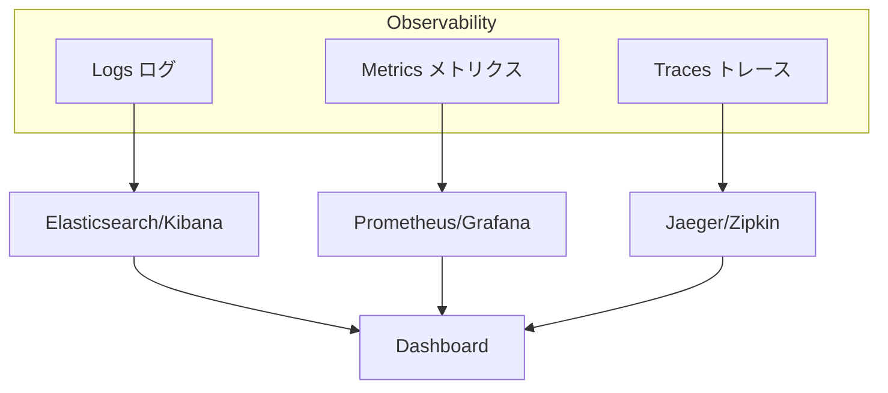
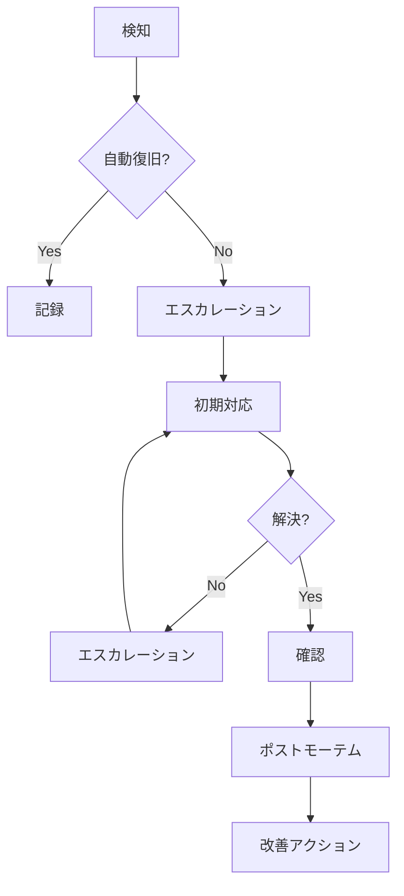
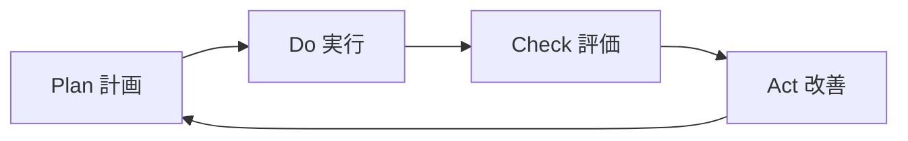

# 運用・フィードバック計画

## 可観測性戦略

### 3つの柱



### ログ戦略

#### 構造化ログフォーマット

```json
{
    "timestamp": "2024-01-15T10:30:00.000Z",
    "level": "INFO",
    "service": "auditset-service",
    "traceId": "abc123",
    "spanId": "def456",
    "userId": "user-789",
    "action": "CREATE_AUDIT_SET",
    "message": "Audit set created successfully",
    "metadata": {
        "auditSetId": "as-001",
        "itemCount": 5
    }
}
```

#### ログレベル設計

| レベル | 用途 | 保持期間 | アラート |
|-------|------|---------|---------|
| ERROR | 障害、例外 | 90日 | 即座 |
| WARN | 異常兆候、リトライ | 30日 | 5分以内 |
| INFO | 操作記録、監査 | 365日 | なし |
| DEBUG | 開発・調査用 | 7日 | なし |

#### サービス別ログ設定

| サービス | デフォルトレベル | 特記事項 |
|---------|----------------|---------|
| identity-service | INFO | 認証失敗はWARN |
| auditset-service | INFO | 検証結果は必ずINFO |
| eventlog-service | INFO | バッチ完了はINFO |
| fileitem-service | INFO | 改ざん検知はWARN |
| box-integration-service | INFO | API失敗はWARN |

### メトリクス戦略

#### REDメソッド（サービス向け）

| メトリクス | 説明 | Prometheus式 |
|----------|------|-------------|
| Rate | リクエストレート | `rate(http_requests_total[5m])` |
| Errors | エラーレート | `rate(http_requests_total{status=~"5.."}[5m])` |
| Duration | レイテンシ | `histogram_quantile(0.99, rate(http_request_duration_seconds_bucket[5m]))` |

#### USEメソッド（リソース向け）

| メトリクス | 説明 | 対象 |
|----------|------|-----|
| Utilization | 使用率 | CPU, Memory, Disk |
| Saturation | 飽和度 | Queue depth, Thread pool |
| Errors | エラー | Connection errors, Timeouts |

#### カスタムビジネスメトリクス

| メトリクス | 説明 | アラート閾値 |
|----------|------|------------|
| audit_sets_created_total | 監査セット作成数 | - |
| audit_sets_validated_total | 検証完了数 | - |
| events_fetched_total | イベント取得数 | - |
| tampering_detected_total | 改ざん検知数 | > 0 |
| box_api_calls_total | BOX API呼び出し数 | - |
| box_api_errors_total | BOX APIエラー数 | > 10/min |

### 分散トレーシング

#### トレースコンテキスト伝播

```
Client → Gateway → Service A → Service B → Database
   |         |          |           |          |
   └─────────┴──────────┴───────────┴──────────┘
                    Trace ID: abc-123
                    Span IDs: 1 → 2 → 3 → 4
```

#### サンプリング設定

| 環境 | サンプリングレート | 理由 |
|-----|------------------|------|
| 開発 | 100% | フルデバッグ |
| ステージング | 50% | 性能テスト |
| 本番 | 10% | コスト最適化 |
| エラー時 | 100% | 障害分析 |

---

## SLO/SLI設計

### サービスレベル定義

#### Identity Service

| SLI | 計算式 | SLO | SLA |
|-----|-------|-----|-----|
| 可用性 | 成功リクエスト / 全リクエスト | 99.95% | 99.9% |
| レイテンシ (p99) | 99%ile応答時間 | < 200ms | < 500ms |
| エラー率 | エラー / 全リクエスト | < 0.1% | < 0.5% |

#### Audit Set Service

| SLI | 計算式 | SLO | SLA |
|-----|-------|-----|-----|
| 可用性 | 成功リクエスト / 全リクエスト | 99.9% | 99.5% |
| レイテンシ (p99) | 99%ile応答時間 | < 500ms | < 1s |
| 検証成功率 | 成功検証 / 全検証 | 99.99% | 99.9% |

#### Event Log Service

| SLI | 計算式 | SLO | SLA |
|-----|-------|-----|-----|
| 可用性 | 成功リクエスト / 全リクエスト | 99.9% | 99.5% |
| イベント遅延 | BOX発生〜保存完了 | < 5min | < 15min |
| 取りこぼし率 | 未取得イベント / 全イベント | < 0.01% | < 0.1% |

#### File Item Service

| SLI | 計算式 | SLO | SLA |
|-----|-------|-----|-----|
| 可用性 | 成功リクエスト / 全リクエスト | 99.9% | 99.5% |
| レイテンシ (p99) | 99%ile応答時間 | < 300ms | < 1s |
| 改ざん検知精度 | 正確な検知 / 全検知 | 100% | 100% |

#### BOX Integration Service

| SLI | 計算式 | SLO | SLA |
|-----|-------|-----|-----|
| 可用性 | 成功リクエスト / 全リクエスト | 99.5%* | 99%* |
| レイテンシ (p99) | 99%ile応答時間 | < 2s | < 5s |

*BOX API SLAに依存

### エラーバジェット

| サービス | 月間エラーバジェット | 計算 |
|---------|-------------------|------|
| Identity | 21.6分 | 43,200分 × 0.05% |
| Audit Set | 43.2分 | 43,200分 × 0.1% |
| Event Log | 43.2分 | 43,200分 × 0.1% |
| File Item | 43.2分 | 43,200分 × 0.1% |
| BOX Integration | 216分 | 43,200分 × 0.5% |

### SLOダッシュボード

```
┌────────────────────────────────────────────────────────┐
│                    SLO Dashboard                        │
├────────────────────────────────────────────────────────┤
│ Identity Service                                        │
│ ■■■■■■■■■■■■■■■■■■■■□□□□□ 99.97% / 99.95% ✓           │
│ Error Budget: 18.2min remaining                         │
├────────────────────────────────────────────────────────┤
│ Audit Set Service                                       │
│ ■■■■■■■■■■■■■■■■■■■■■■■□□ 99.92% / 99.9% ✓            │
│ Error Budget: 35.1min remaining                         │
├────────────────────────────────────────────────────────┤
│ Event Log Service                                       │
│ ■■■■■■■■■■■■■■■■■■■■■□□□□ 99.85% / 99.9% ⚠            │
│ Error Budget: 8.5min remaining                          │
└────────────────────────────────────────────────────────┘
```

---

## インシデント管理

### 重大度定義

| レベル | 名称 | 定義 | 応答時間 | 解決目標 |
|-------|-----|------|---------|---------|
| P1 | Critical | サービス全体停止 | 15分 | 1時間 |
| P2 | High | 主要機能停止 | 30分 | 4時間 |
| P3 | Medium | 一部機能低下 | 2時間 | 24時間 |
| P4 | Low | 軽微な影響 | 24時間 | 1週間 |

### インシデント対応フロー



### オンコールローテーション

| 週 | プライマリ | セカンダリ |
|---|----------|----------|
| Week 1 | チームA | チームB |
| Week 2 | チームB | チームC |
| Week 3 | チームC | チームA |

### エスカレーションマトリックス

| 経過時間 | P1 | P2 | P3 |
|---------|----|----|-----|
| 0分 | オンコール担当 | オンコール担当 | チケット作成 |
| 15分 | チームリード | - | - |
| 30分 | マネージャー | チームリード | - |
| 1時間 | ディレクター | マネージャー | オンコール担当 |
| 4時間 | VP | ディレクター | チームリード |

### ポストモーテムテンプレート

```markdown
# インシデントレポート: [タイトル]

## 概要
- 発生日時: YYYY-MM-DD HH:MM - HH:MM
- 影響範囲: [影響を受けたサービス/ユーザー]
- 重大度: P[1-4]

## タイムライン
| 時刻 | イベント |
|-----|---------|
| HH:MM | 検知 |
| HH:MM | 対応開始 |
| HH:MM | 解決 |

## 根本原因
[原因の詳細説明]

## 影響
- ユーザー影響: [詳細]
- ビジネス影響: [詳細]

## 改善アクション
| アクション | 担当者 | 期限 | ステータス |
|----------|-------|------|----------|

## 教訓
[学んだこと]
```

---

## 継続的改善サイクル

### PDCAサイクル



### 定期レビュー

| 頻度 | レビュー内容 | 参加者 |
|-----|------------|-------|
| 毎日 | SLOダッシュボード確認 | オンコール担当 |
| 週次 | インシデント振り返り | チーム全員 |
| 月次 | SLO達成度評価 | チームリード、マネージャー |
| 四半期 | アーキテクチャレビュー | 全ステークホルダー |

### 改善指標

| カテゴリ | 指標 | 現状 | 6ヶ月目標 | 12ヶ月目標 |
|---------|-----|------|----------|----------|
| 信頼性 | MTBF | 168h | 336h | 720h |
| 復旧性 | MTTR | 2h | 30min | 15min |
| 変更 | デプロイ頻度 | 月1回 | 週1回 | 日1回 |
| 変更 | リードタイム | 2週間 | 3日 | 1日 |
| 変更 | 変更失敗率 | 10% | 5% | 2% |

### フィードバックループ

```
┌─────────────────────────────────────────────────────┐
│                  Feedback Loops                       │
├─────────────────────────────────────────────────────┤
│                                                       │
│  ┌─────────┐     ┌─────────┐     ┌─────────┐       │
│  │ Monitor │ ──▶ │ Analyze │ ──▶ │ Improve │       │
│  └─────────┘     └─────────┘     └─────────┘       │
│       ▲                               │              │
│       └───────────────────────────────┘              │
│                                                       │
│  Short Loop (minutes): Auto-scaling, Circuit Breaker │
│  Medium Loop (hours): Incident Response              │
│  Long Loop (weeks): Architecture Evolution           │
│                                                       │
└─────────────────────────────────────────────────────┘
```

---

## キャパシティプランニング

### 現状キャパシティ

| リソース | 現状使用量 | 上限 | 使用率 |
|---------|----------|-----|-------|
| CPU | 4 cores | 8 cores | 50% |
| Memory | 8 GB | 16 GB | 50% |
| Storage | 100 GB | 500 GB | 20% |
| DB Connections | 50 | 100 | 50% |

### 成長予測

| 指標 | 現状 | 6ヶ月後 | 12ヶ月後 |
|-----|------|--------|---------|
| ユーザー数 | 1,000 | 2,000 | 5,000 |
| 監査セット数 | 500 | 1,000 | 3,000 |
| イベント/日 | 10,000 | 25,000 | 100,000 |
| ファイル数 | 50,000 | 100,000 | 300,000 |

### サービス別リソース計画

#### Identity Service

| 期間 | インスタンス | CPU | Memory | 理由 |
|-----|------------|-----|--------|------|
| 現在 | 2 | 1 core | 2 GB | 冗長性確保 |
| 6ヶ月後 | 2 | 2 cores | 4 GB | ユーザー増 |
| 12ヶ月後 | 3 | 2 cores | 4 GB | 可用性向上 |

#### Audit Set Service

| 期間 | インスタンス | CPU | Memory | 理由 |
|-----|------------|-----|--------|------|
| 現在 | 2 | 2 cores | 4 GB | 検証処理負荷 |
| 6ヶ月後 | 3 | 2 cores | 4 GB | 監査セット増 |
| 12ヶ月後 | 4 | 4 cores | 8 GB | 大規模検証対応 |

#### Event Log Service

| 期間 | インスタンス | CPU | Memory | 理由 |
|-----|------------|-----|--------|------|
| 現在 | 2 | 1 core | 2 GB | バッチ処理 |
| 6ヶ月後 | 2 | 2 cores | 4 GB | イベント増 |
| 12ヶ月後 | 3 | 2 cores | 8 GB | 履歴データ増 |

#### File Item Service

| 期間 | インスタンス | CPU | Memory | 理由 |
|-----|------------|-----|--------|------|
| 現在 | 2 | 2 cores | 4 GB | ScalarDL処理 |
| 6ヶ月後 | 2 | 2 cores | 4 GB | 安定 |
| 12ヶ月後 | 3 | 4 cores | 8 GB | ファイル増 |

#### BOX Integration Service

| 期間 | インスタンス | CPU | Memory | 理由 |
|-----|------------|-----|--------|------|
| 現在 | 2 | 1 core | 2 GB | API呼び出し |
| 6ヶ月後 | 2 | 1 core | 2 GB | 安定 |
| 12ヶ月後 | 2 | 2 cores | 4 GB | 並列呼び出し増 |

### データベースキャパシティ

| サービス | 現状 | 6ヶ月後 | 12ヶ月後 | 成長戦略 |
|---------|------|--------|---------|---------|
| Identity DB | 10 GB | 15 GB | 30 GB | 垂直スケール |
| Audit Set DB | 50 GB | 100 GB | 300 GB | シャーディング検討 |
| Event Log DB | 200 GB | 500 GB | 1.5 TB | パーティショニング |
| File Item DB | 100 GB | 200 GB | 500 GB | 垂直スケール |

### スケーリング戦略

#### 水平スケーリング（推奨）

```yaml
# HPA設定例
apiVersion: autoscaling/v2
kind: HorizontalPodAutoscaler
metadata:
  name: auditset-service-hpa
spec:
  scaleTargetRef:
    apiVersion: apps/v1
    kind: Deployment
    name: auditset-service
  minReplicas: 2
  maxReplicas: 10
  metrics:
  - type: Resource
    resource:
      name: cpu
      target:
        type: Utilization
        averageUtilization: 70
  - type: Resource
    resource:
      name: memory
      target:
        type: Utilization
        averageUtilization: 80
```

#### スケーリングトリガー

| トリガー | 閾値 | アクション |
|---------|-----|----------|
| CPU使用率 | > 70% | スケールアウト |
| CPU使用率 | < 30% | スケールイン |
| メモリ使用率 | > 80% | スケールアウト |
| リクエストキュー | > 100 | スケールアウト |
| レイテンシ (p99) | > 1s | スケールアウト |

### コスト見積もり

| 期間 | Compute | Storage | Network | Total/月 |
|-----|---------|---------|---------|---------|
| 現在 | $500 | $100 | $50 | $650 |
| 6ヶ月後 | $800 | $200 | $100 | $1,100 |
| 12ヶ月後 | $1,500 | $500 | $200 | $2,200 |

---

## アラート設計

### アラートルール

| サービス | 条件 | 重大度 | 通知先 |
|---------|------|-------|-------|
| 全サービス | 可用性 < 99% (5min) | P2 | Slack + PagerDuty |
| 全サービス | エラー率 > 5% (5min) | P2 | Slack + PagerDuty |
| 全サービス | レイテンシ p99 > 2s | P3 | Slack |
| Identity | 認証失敗 > 100/min | P3 | Slack |
| Audit Set | 検証失敗 > 10/hour | P2 | Slack + PagerDuty |
| Event Log | イベント取得遅延 > 30min | P2 | Slack + PagerDuty |
| File Item | 改ざん検知 | P1 | Slack + PagerDuty + Email |
| BOX Integration | API失敗率 > 10% | P3 | Slack |

### アラート抑制

| ルール | 説明 |
|-------|------|
| 計画メンテナンス | メンテナンス時間帯は抑制 |
| 重複抑制 | 同一アラートは15分間抑制 |
| 依存抑制 | 上流障害時は下流アラート抑制 |

### 通知チャネル

| チャネル | 用途 | 対象 |
|---------|------|-----|
| Slack #alerts | 全アラート | エンジニア全員 |
| Slack #critical | P1/P2 | オンコール + リード |
| PagerDuty | P1/P2 | オンコール担当 |
| Email | P1 + 日次サマリー | マネージャー |

---

## 運用ランブック

### 一般的なトラブルシューティング

#### サービス応答なし

```
1. Pod状態確認: kubectl get pods -l app=<service>
2. ログ確認: kubectl logs <pod-name> --tail=100
3. リソース確認: kubectl top pods
4. 再起動: kubectl rollout restart deployment/<service>
```

#### 高レイテンシ

```
1. メトリクス確認: Grafana → Service Dashboard
2. トレース確認: Jaeger → 該当トレースID
3. DB確認: 遅いクエリ特定
4. スケールアウト: kubectl scale deployment/<service> --replicas=N
```

#### BOX API障害

```
1. BOXステータス確認: status.box.com
2. 接続テスト: curl https://api.box.com/2.0/users/me
3. トークン確認: 期限切れチェック
4. フォールバック: キャッシュからの応答有効化
```

### 定期タスク

| タスク | 頻度 | 担当 |
|-------|------|------|
| ログローテーション | 日次 | 自動 |
| バックアップ検証 | 週次 | オンコール |
| セキュリティパッチ | 月次 | インフラチーム |
| 災害復旧訓練 | 四半期 | 全チーム |
