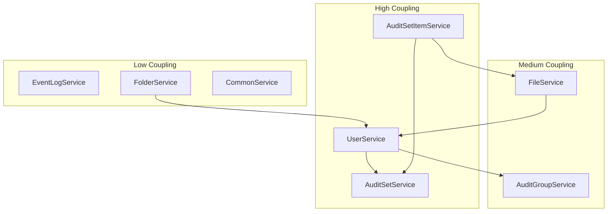
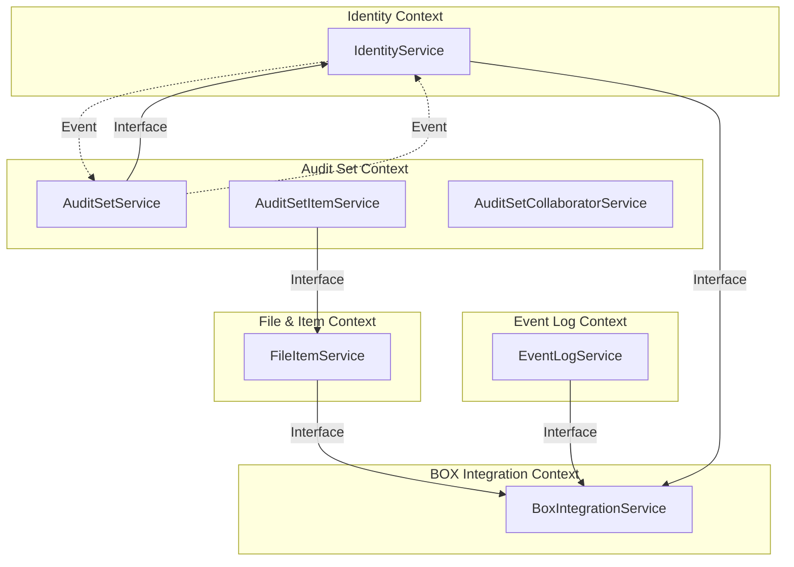

# システムマッピング

## 現行システム → ドメインマッピング

### パッケージ/クラス → コンテキスト対応表

| パッケージ/クラス | 現在の責務 | 対応コンテキスト | 移行優先度 |
|----------------|----------|----------------|----------|
| **service/UserService** | ユーザー管理全般 | Identity + Audit Set | 高（分割必要） |
| service/AuditSetService | 監査セット管理 | Audit Set | 中 |
| service/AuditSetItemService | 監査セットアイテム管理 | Audit Set | 中 |
| service/AuditSetCollaboratorService | コラボレーター管理 | Audit Set | 低 |
| service/AuditGroupService | 監査グループ管理 | Audit Set | 低 |
| service/EventLogService | イベント検索 | Event Log | 低 |
| service/FileService | ファイル情報取得 | File & Item | 中 |
| service/FolderService | フォルダ情報取得 | File & Item | 低 |
| service/AssetService | ScalarDL連携 | File & Item | 中 |
| **EventListener** | イベント取得・保存 | Event Log + BOX Integration | 高（分割必要） |
| business/* | BOX連携 | BOX Integration | 中 |
| security/* | 認証・認可 | Identity | 低 |

### リポジトリ → コンテキスト対応表

| リポジトリ | 対応コンテキスト | データ所有権 |
|----------|----------------|------------|
| UserRepository | Identity | Owner |
| RoleUserRepository | Identity | Owner |
| UserTokenRepository | Identity | Owner |
| UserOptRepository | Identity | Owner |
| OrganizationRepository | Identity | Owner |
| AuditSetRepository | Audit Set | Owner |
| AuditSetItemRepository | Audit Set | Owner |
| AuditSetCollaboratorsRepository | Audit Set | Owner |
| AuditGroupRepository | Audit Set | Owner |
| UserAuditGroupRepository | Audit Set | Owner |
| AuditGrpAuditSetMappingRepository | Audit Set | Owner |
| EventsRepository | Event Log | Owner |
| ItemEventsRepository | Event Log | Owner |
| EnterpriseEventLogsRepository | Event Log | Owner |
| SystemEventDatesRepository | Event Log | Owner |
| PositionTrackerRepository | Event Log | Owner |
| ItemRepository | File & Item | Owner |
| ItemsBySha1Repository | File & Item | Owner |
| ItemStatusRepository | File & Item | Owner |
| AuditorLogsRepository | File & Item | Owner |
| ScalardlRepository | File & Item | Owner |

---

## トランザクション境界分析

### 現状のトランザクション境界

| 操作 | 関係するエンティティ | 現在の境界 | 問題点 |
|-----|-------------------|----------|--------|
| ユーザー削除 | User, AuditSetCollaborators, UserAuditGroup, AuditorLogs | 単一トランザクション | 過大な範囲 |
| 監査セット作成 | AuditSet, AuditSetCollaborators | 単一トランザクション | 適切 |
| アイテム追加 | AuditSetItem, ItemStatus | 単一トランザクション + BOX API | 外部連携混在 |
| 監査セット検証 | 全AuditSetItem, ScalarDL | 長時間トランザクション | 大量データで問題 |

### 推奨トランザクション境界

#### Identity Context

```
トランザクション境界: User + RoleUser + UserToken
分離: AuditSetCollaborators, UserAuditGroupはイベント経由で通知
```

#### Audit Set Context

```
トランザクション1: AuditSet + AuditSetCollaborators（作成時）
トランザクション2: AuditSetItem（個別追加）
トランザクション3: AuditGroup + UserAuditGroup
分離: ユーザー削除時はイベント受信で対応
```

#### Event Log Context

```
トランザクション: Events（バッチ）
分離: 他コンテキストへの影響なし（参照のみ）
```

---

## データ移行計画

### Phase 1: 論理分離（スキーマレベル）

```
現状: coordinator.* テーブル
    ↓
移行後:
├── identity.user
├── identity.role_user
├── identity.user_token
├── auditset.audit_set
├── auditset.audit_set_item
├── eventlog.events
├── eventlog.item_events
├── fileitem.item
├── fileitem.items_by_sha1
└── ...
```

### Phase 2: アプリケーション分離

```
現状: 単一Spring Bootアプリケーション
    ↓
移行後:
├── identity-service/
│   └── 独自のDB接続
├── auditset-service/
│   └── 独自のDB接続
├── eventlog-service/
│   └── 独自のDB接続
├── fileitem-service/
│   └── 独自のDB接続
└── box-integration-service/
    └── （DBなし、連携のみ）
```

### Phase 3: 物理分離（将来）

```
各サービスが独自のCassandraクラスタまたはキースペースを持つ
```

---

## 依存関係分析

### 現在の依存関係グラフ



### 問題のある依存関係

| 依存 | 問題 | 解決策 |
|-----|------|--------|
| FileService → UserService | Identity Contextへの直接依存 | インターフェース経由に変更 |
| FolderService → UserService | 同上 | 同上 |
| AuditSetItemService → AuditSetService | 循環依存の可能性 | 共通インターフェース抽出 |
| UserService → AuditSetRepository | コンテキスト越境 | イベント駆動に変更 |

### 推奨依存関係



---

## 移行準備度評価

### コンテキスト別評価

| コンテキスト | 準備度 | 理由 | 推奨アクション |
|------------|-------|------|--------------|
| Event Log | 高 | 依存少、読み取り中心 | そのまま分離可能 |
| File & Item | 中 | BOX依存あるが分離可能 | インターフェース整備後に分離 |
| BOX Integration | 中 | 外部連携で独立性高い | Anti-corruption Layer整備 |
| Audit Set | 低 | 複雑な依存関係 | 段階的な責務分離が必要 |
| Identity | 低 | 他コンテキストへの影響大 | 慎重な分離計画が必要 |

### 移行順序推奨

```
Step 1: Event Log Context
    └── 理由: 依存が少なく、リスク低

Step 2: BOX Integration Context
    └── 理由: 外部連携の抽象化が他に波及

Step 3: File & Item Context
    └── 理由: BOX Integration完了後に分離容易

Step 4: Identity Context
    └── 理由: インターフェース定義後に分離

Step 5: Audit Set Context
    └── 理由: 最後にコアドメインを分離
```

### リスク評価

| リスク | 影響度 | 発生確率 | 対策 |
|-------|-------|---------|------|
| トランザクション整合性の問題 | 高 | 中 | Sagaパターン導入 |
| パフォーマンス低下 | 中 | 中 | API最適化、キャッシュ |
| データ重複 | 中 | 高 | データ所有権の厳格化 |
| 移行中の障害 | 高 | 低 | 段階的移行、ロールバック計画 |

---

## 推奨アーキテクチャ（将来像）

```
┌─────────────────────────────────────────────────────────────┐
│                       API Gateway                            │
└─────────────────────────────────────────────────────────────┘
                              │
        ┌─────────────────────┼─────────────────────┐
        │                     │                     │
        ▼                     ▼                     ▼
┌───────────────┐   ┌───────────────┐   ┌───────────────┐
│   Identity    │   │  Audit Set   │   │  Event Log   │
│   Service     │   │   Service    │   │   Service    │
└───────┬───────┘   └───────┬───────┘   └───────┬───────┘
        │                   │                   │
        ▼                   ▼                   ▼
┌───────────────┐   ┌───────────────┐   ┌───────────────┐
│   Identity    │   │  Audit Set   │   │  Event Log   │
│      DB       │   │      DB      │   │      DB      │
└───────────────┘   └───────────────┘   └───────────────┘

        ┌─────────────────────┼─────────────────────┐
        │                     │                     │
        ▼                     ▼                     ▼
┌───────────────┐   ┌───────────────┐   ┌───────────────┐
│  File & Item  │   │     BOX      │   │   Message    │
│   Service     │   │  Integration │   │    Queue     │
└───────┬───────┘   └───────┬───────┘   └───────────────┘
        │                   │
        ▼                   ▼
┌───────────────┐   ┌───────────────┐
│  File & Item  │   │   BOX API    │
│      DB       │   │  (External)  │
└───────────────┘   └───────────────┘
```
