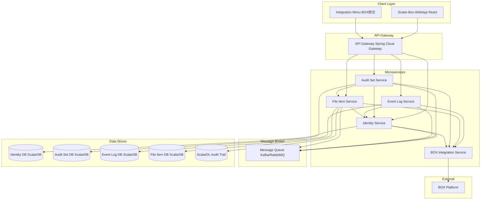
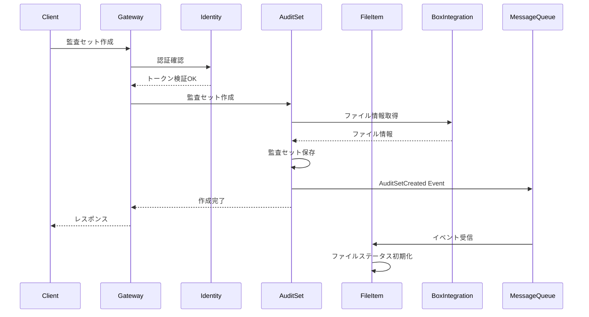
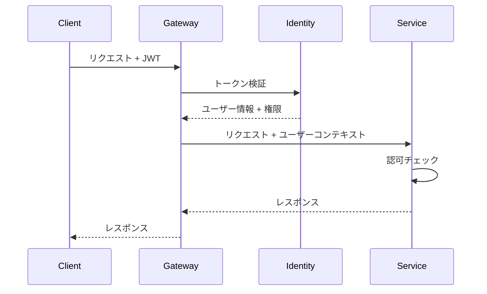

# ターゲットアーキテクチャ

## 設計思想

### 基本原則

| 原則 | 本システムでの適用 |
|-----|------------------|
| Single Responsibility | 5つのコンテキスト = 5つのサービス |
| Loose Coupling | イベント駆動による疎結合化 |
| High Cohesion | ドメイン別のデータ所有権 |
| Business Capability | 監査ワークフローに沿った分割 |
| Design for Failure | Circuit Breaker、Retry、Fallback |
| Evolutionary Design | Strangler Fig パターンでの段階的移行 |

### 設計制約

- ScalarDB/ScalarDLの継続使用（分散トランザクション要件）
- BOX API依存の維持（外部システム）
- 既存フロントエンドとの互換性維持

---

## アーキテクチャ図

### 全体構成



### 通信フロー



---

## サービスカタログ

| サービス名 | ポート | 責務 | 技術スタック |
|----------|-------|------|------------|
| identity-service | 8081 | 認証・認可・ユーザー管理 | Spring Boot, JWT |
| auditset-service | 8082 | 監査セット・コラボレーター管理 | Spring Boot |
| eventlog-service | 8083 | イベント収集・検索 | Spring Boot |
| fileitem-service | 8084 | ファイル情報・改ざん検知 | Spring Boot, ScalarDL |
| box-integration-service | 8085 | BOX API連携 | Spring Boot, BOX SDK |
| api-gateway | 8080 | ルーティング・認証 | Spring Cloud Gateway |

---

## サービス詳細設計

### 1. Identity Service

#### 基本情報
- サービスID: `identity-service`
- 対応コンテキスト: Identity Context
- ドメインタイプ: Dialogue
- サービスカテゴリ: Supporting

#### 責務
- ユーザー認証（BOX OAuth / パスワード）
- JWT発行・検証
- ユーザーCRUD
- ロール管理
- パスワードリセット・OTP

#### API設計

| エンドポイント | メソッド | 説明 |
|-------------|--------|------|
| POST /auth/login | POST | ログイン |
| POST /auth/token/refresh | POST | トークン更新 |
| GET /users | GET | ユーザー一覧 |
| POST /users | POST | ユーザー作成 |
| PUT /users/{id} | PUT | ユーザー更新 |
| DELETE /users/{id} | DELETE | ユーザー削除 |
| PUT /users/{id}/roles | PUT | ロール更新 |
| POST /auth/password/reset | POST | パスワードリセット |

#### 発行イベント

| イベント名 | 発行条件 | 購読者 |
|----------|---------|-------|
| UserCreated | ユーザー作成時 | - |
| UserDeleted | ユーザー削除時 | AuditSet, FileItem |
| UserRoleChanged | ロール変更時 | AuditSet |

#### データモデル
```
User (id, email, name, password, roleJson, orgId, ...)
RoleUser (userId, roleId)
UserToken (userId, accessToken, refreshToken, ...)
UserOtp (userId, otp, expiry)
Organization (id, name, ...)
```

---

### 2. Audit Set Service

#### 基本情報
- サービスID: `auditset-service`
- 対応コンテキスト: Audit Set Context
- ドメインタイプ: Blackboard
- サービスカテゴリ: Process (Core Domain)

#### 責務
- 監査セットCRUD
- 監査セットアイテム管理
- コラボレーター管理
- 監査グループ管理
- 監査セット検証

#### API設計

| エンドポイント | メソッド | 説明 |
|-------------|--------|------|
| GET /audit-sets | GET | 監査セット一覧 |
| POST /audit-sets | POST | 監査セット作成 |
| PUT /audit-sets/{id} | PUT | 監査セット更新 |
| DELETE /audit-sets/{id} | DELETE | 監査セット削除 |
| POST /audit-sets/{id}/items | POST | アイテム追加 |
| DELETE /audit-sets/{id}/items/{itemId} | DELETE | アイテム削除 |
| GET /audit-sets/{id}/collaborators | GET | コラボレーター一覧 |
| PUT /audit-sets/{id}/collaborators | PUT | コラボレーター更新 |
| POST /audit-sets/{id}/validate | POST | 検証実行 |
| GET /audit-groups | GET | 監査グループ一覧 |
| POST /audit-groups | POST | 監査グループ作成 |

#### 発行イベント

| イベント名 | 発行条件 | 購読者 |
|----------|---------|-------|
| AuditSetCreated | 監査セット作成時 | - |
| AuditSetItemAdded | アイテム追加時 | FileItem |
| AuditSetValidated | 検証完了時 | - |
| CollaboratorAdded | コラボレーター追加時 | - |

#### 購読イベント

| イベント名 | 発行者 | 処理内容 |
|----------|-------|---------|
| UserDeleted | Identity | コラボレーターから削除 |

#### データモデル
```
AuditSet (id, name, description, ownerId, aclJson, ...)
AuditSetItem (auditSetId, itemId, itemType, ...)
AuditSetCollaborators (auditSetId, userId, role)
AuditGroup (id, name, memberListJson)
UserAuditGroup (userId, auditGroupId)
```

---

### 3. Event Log Service

#### 基本情報
- サービスID: `eventlog-service`
- 対応コンテキスト: Event Log Context
- ドメインタイプ: Pipeline
- サービスカテゴリ: Master/Reference

#### 責務
- BOXイベント取得（バッチ）
- イベント保存
- イベント検索・フィルタリング

#### API設計

| エンドポイント | メソッド | 説明 |
|-------------|--------|------|
| GET /events | GET | イベント検索（フィルタ付き） |
| GET /events/by-item/{itemId} | GET | アイテム別イベント |
| GET /events/by-user/{userId} | GET | ユーザー別イベント |

#### 内部処理

| 処理名 | スケジュール | 説明 |
|-------|------------|------|
| EventFetchJob | 定期実行 | BOXからイベント取得・保存 |

#### データモデル
```
Events (yyyyMMdd, eventId, timestamp, userId, itemId, eventType, ...)
ItemEvents (itemId, eventId, ...)
EnterpriseEventLogs (logId, ...)
PositionTracker (id, position)
```

---

### 4. File Item Service

#### 基本情報
- サービスID: `fileitem-service`
- 対応コンテキスト: File & Item Context
- ドメインタイプ: Hybrid
- サービスカテゴリ: Master/Reference

#### 責務
- ファイル/フォルダ情報取得
- ファイルバージョン管理
- 改ざん検知（ScalarDL連携）
- 監査人操作ログ

#### API設計

| エンドポイント | メソッド | 説明 |
|-------------|--------|------|
| GET /files/{id} | GET | ファイル詳細 |
| GET /files/{id}/versions | GET | バージョン一覧 |
| GET /files/{id}/copies | GET | 同一ハッシュファイル |
| GET /files/{id}/status | GET | 改ざんステータス |
| POST /files/{id}/validate | POST | 改ざん検証 |
| GET /folders/{id} | GET | フォルダ詳細 |
| GET /auditor-logs | GET | 監査人操作ログ |
| POST /auditor-logs | POST | 操作ログ記録 |

#### 購読イベント

| イベント名 | 発行者 | 処理内容 |
|----------|-------|---------|
| AuditSetItemAdded | AuditSet | ファイルステータス初期化 |
| UserDeleted | Identity | 関連ログ処理 |

#### データモデル
```
Item (id, name, sha1Hash, ...)
ItemsBySha1 (sha1Hash, itemId)
ItemStatus (itemId, tamperingStatus)
AuditorLogs (logId, userId, itemId, action, ...)
```

---

### 5. BOX Integration Service

#### 基本情報
- サービスID: `box-integration-service`
- 対応コンテキスト: BOX Integration Context
- ドメインタイプ: Pipeline
- サービスカテゴリ: Integration

#### 責務
- BOX API認証（OAuth / CCG）
- ファイル/フォルダ情報取得
- イベントストリーム取得
- プレビュー/ダウンロードURL生成

#### API設計（内部向け）

| エンドポイント | メソッド | 説明 |
|-------------|--------|------|
| GET /box/files/{id} | GET | ファイル情報取得 |
| GET /box/folders/{id} | GET | フォルダ情報取得 |
| GET /box/folders/{id}/items | GET | フォルダ内アイテム |
| GET /box/events | GET | イベント取得 |
| GET /box/files/{id}/preview | GET | プレビューURL |
| GET /box/files/{id}/download | GET | ダウンロードURL |

#### 外部連携

| 連携先 | 認証方式 | 用途 |
|-------|---------|------|
| BOX API | OAuth 2.0 | ユーザー操作 |
| BOX API | Client Credentials | イベント取得 |

---

## 通信設計

### 同期通信

| 呼び出し元 | 呼び出し先 | パターン | 用途 |
|----------|----------|---------|------|
| Gateway | Identity | REST | 認証確認 |
| AuditSet | Identity | REST | ユーザー情報取得 |
| AuditSet | FileItem | REST | ファイル情報取得 |
| AuditSet | BoxIntegration | REST | BOXファイル一覧 |
| FileItem | BoxIntegration | REST | ファイル詳細 |
| EventLog | BoxIntegration | REST | イベント取得 |

### 非同期通信

| イベント | 発行者 | 購読者 | 用途 |
|---------|-------|-------|------|
| UserDeleted | Identity | AuditSet, FileItem | ユーザー削除の連携 |
| AuditSetItemAdded | AuditSet | FileItem | ステータス初期化 |

### Circuit Breaker設定

| サービス | 閾値 | タイムアウト | フォールバック |
|---------|-----|------------|--------------|
| BoxIntegration | 50% | 5秒 | キャッシュ返却 |
| Identity | 30% | 2秒 | 認証拒否 |
| FileItem | 40% | 3秒 | 空データ返却 |

---

## データアーキテクチャ

### データ所有権

| データ | 所有サービス | アクセス方式 |
|-------|------------|------------|
| User, Role | Identity | API経由のみ |
| AuditSet, Collaborator | AuditSet | API経由のみ |
| Events | EventLog | API経由のみ |
| Item, ItemStatus | FileItem | API経由のみ |

### データ複製戦略

| 元データ | 複製先 | 同期方式 | 用途 |
|---------|-------|---------|------|
| User (id, name) | AuditSet | Event | 表示用キャッシュ |
| Item (id, name) | AuditSet | Event | 表示用キャッシュ |

---

## セキュリティ設計

### 認証・認可



### サービス間認証

| 方式 | 用途 |
|-----|------|
| mTLS | サービス間通信 |
| API Key | 内部サービス識別 |

---

## 可観測性設計

### ログ

| レベル | 用途 | 保持期間 |
|-------|------|---------|
| ERROR | 障害検知 | 90日 |
| WARN | 異常検知 | 30日 |
| INFO | 監査 | 365日 |
| DEBUG | デバッグ | 7日 |

### メトリクス

| メトリクス | 説明 | アラート閾値 |
|----------|------|------------|
| request_latency_p99 | 99%ile レイテンシ | > 500ms |
| error_rate | エラー率 | > 1% |
| cpu_usage | CPU使用率 | > 80% |
| memory_usage | メモリ使用率 | > 85% |

### トレーシング

| 項目 | 実装 |
|-----|------|
| Trace ID | 全リクエストに付与 |
| Span | サービス間呼び出し |
| Sampling | 10% |
