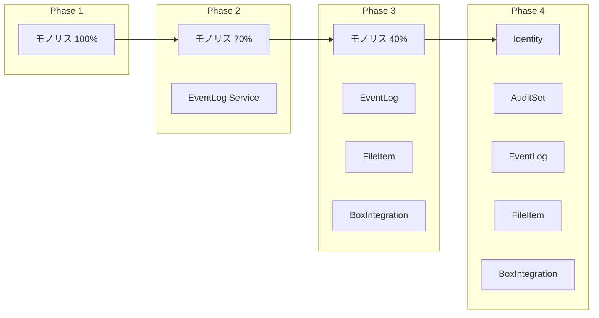
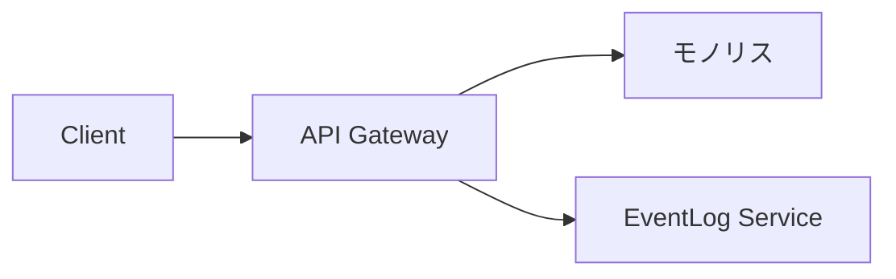
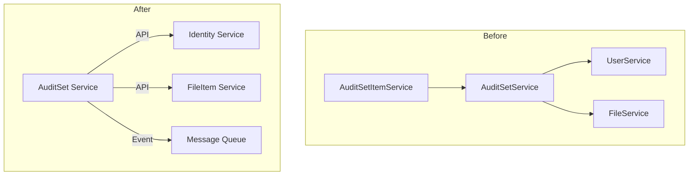

# 変換計画

## 移行戦略

### アプローチ: Strangler Fig Pattern

既存のモノリスを段階的にマイクロサービスに置き換える戦略を採用します。



### 移行優先順位

| 順位 | サービス | 理由 |
|-----|---------|------|
| 1 | Event Log | 依存少、リスク低、独立性高 |
| 2 | BOX Integration | 外部連携の抽象化、他サービスの前提 |
| 3 | File Item | BOX Integration完了後に分離容易 |
| 4 | Identity | インターフェース整備後に分離 |
| 5 | Audit Set | 最後にコアドメインを分離 |

---

## フェーズ概要

| フェーズ | 期間 | 目標 | 成果物 |
|---------|-----|------|-------|
| Phase 0 | 1ヶ月 | 準備 | 開発環境、CI/CD、共通基盤 |
| Phase 1 | 2ヶ月 | 基盤構築 | API Gateway、EventLog Service |
| Phase 2 | 2ヶ月 | 連携層分離 | BOX Integration、File Item Service |
| Phase 3 | 2ヶ月 | 認証分離 | Identity Service |
| Phase 4 | 3ヶ月 | コア分離 | Audit Set Service、モノリス廃止 |

**合計期間**: 約10ヶ月

---

## Phase 0: 準備（1ヶ月）

### 目標
- 開発環境の整備
- CI/CDパイプラインの構築
- 共通ライブラリの整備

### タスク

| タスク | 担当 | 期間 | 成果物 |
|-------|-----|------|-------|
| Kubernetes環境構築 | インフラ | 1週間 | 開発/ステージングクラスタ |
| CI/CDパイプライン構築 | DevOps | 1週間 | GitHub Actions/Jenkins |
| 共通ライブラリ作成 | 開発 | 2週間 | scalar-common-lib |
| API Gateway設計 | アーキテクト | 1週間 | 設計書 |
| メッセージキュー選定・構築 | インフラ | 1週間 | Kafka/RabbitMQ |

### 共通ライブラリ内容

```
scalar-common-lib/
├── security/           # JWT処理、認可
├── exception/          # 共通例外
├── dto/               # 共通DTO
├── logging/           # 構造化ログ
├── tracing/           # 分散トレーシング
└── metrics/           # メトリクス
```

---

## Phase 1: 基盤構築（2ヶ月）

### 目標
- API Gatewayの導入
- Event Log Serviceの分離

### API Gateway導入



**ルーティング設定**:
```yaml
routes:
  - path: /api/events/**
    service: eventlog-service
  - path: /api/**
    service: monolith
```

### Event Log Service分離

#### 分離対象

| 現行クラス | 移行先 | 備考 |
|----------|-------|------|
| EventListener | eventlog-service/EventFetchJob | バッチ処理 |
| EventLogService | eventlog-service/EventQueryService | 検索API |
| EventsRepository | eventlog-service | データ移行 |
| ItemEventsRepository | eventlog-service | データ移行 |

#### 移行手順

1. **Week 1-2**: 新サービス雛形作成
   - Spring Boot プロジェクト作成
   - データベース接続設定
   - 共通ライブラリ導入

2. **Week 3-4**: ビジネスロジック移行
   - EventQueryService実装
   - EventFetchJob実装
   - 単体テスト作成

3. **Week 5-6**: 統合テスト・並行稼働
   - モノリスと新サービス両方にトラフィック
   - 結果比較・検証

4. **Week 7-8**: 切り替え・安定化
   - トラフィック100%を新サービスへ
   - モノリスから該当コード削除

### 成果物

- eventlog-service（稼働中）
- API Gateway（稼働中）
- 共通ライブラリ v1.0

---

## Phase 2: 連携層分離（2ヶ月）

### 目標
- BOX Integration Serviceの分離
- File Item Serviceの分離

### BOX Integration Service分離

#### 分離対象

| 現行クラス | 移行先 |
|----------|-------|
| business/* | box-integration-service |
| utility/BoxUtility | box-integration-service |
| BOX SDK連携部分 | box-integration-service |

#### Anti-corruption Layer

```java
// 新サービスでのインターフェース
public interface BoxFileAdapter {
    BoxFileInfo getFileInfo(String fileId, String accessToken);
    List<BoxItem> getFolderItems(String folderId, String accessToken);
    BoxEvent[] getEvents(String position);
}
```

### File Item Service分離

#### 分離対象

| 現行クラス | 移行先 |
|----------|-------|
| FileService | fileitem-service |
| FolderService | fileitem-service |
| AssetService | fileitem-service |
| ItemRepository等 | fileitem-service |
| ScalardlRepository | fileitem-service |

#### 依存関係の解消

```
Before: FileService → UserService
After:  FileItem Service → Identity Service (API)
```

### 成果物

- box-integration-service（稼働中）
- fileitem-service（稼働中）
- eventlog-service（BOX Integration経由に変更）

---

## Phase 3: 認証分離（2ヶ月）

### 目標
- Identity Serviceの分離
- 認証・認可の一元化

### Identity Service分離

#### 分離対象

| 現行クラス | 移行先 |
|----------|-------|
| UserService（認証部分） | identity-service/AuthService |
| UserService（CRUD部分） | identity-service/UserManagementService |
| security/* | identity-service |
| UserRepository等 | identity-service |

#### UserService分割詳細

```
UserService（現行）
    ↓
identity-service/
├── AuthenticationService
│   ├── login()
│   ├── getToken()
│   └── getNewAccessToken()
├── UserCrudService
│   ├── createUser()
│   ├── editUser()
│   └── deleteUser()
├── TokenService
│   └── トークン管理
└── PasswordResetService
    └── OTP・パスワードリセット
```

### イベント発行の実装

```java
// UserCrudServiceでの実装
@Transactional
public void deleteUser(Long userId) {
    userRepository.delete(userId);
    eventPublisher.publish(new UserDeletedEvent(userId));
}
```

### 成果物

- identity-service（稼働中）
- 全サービスがIdentity Service経由で認証
- イベント駆動連携の開始

---

## Phase 4: コア分離（3ヶ月）

### 目標
- Audit Set Serviceの分離
- モノリスの廃止

### Audit Set Service分離

#### 分離対象

| 現行クラス | 移行先 |
|----------|-------|
| AuditSetService | auditset-service |
| AuditSetItemService | auditset-service |
| AuditSetCollaboratorService | auditset-service |
| AuditGroupService | auditset-service |
| AuditSetRepository等 | auditset-service |

#### 複雑な依存の解消



### モノリス廃止手順

1. **Week 1-4**: 監査セットロジック移行
2. **Week 5-6**: 統合テスト
3. **Week 7-8**: 並行稼働
4. **Week 9-10**: 段階的切り替え
5. **Week 11-12**: モノリス停止・クリーンアップ

### 成果物

- auditset-service（稼働中）
- モノリス廃止完了
- 全マイクロサービス稼働

---

## リスク管理

### 技術リスク

| リスク | 影響 | 確率 | 対策 |
|-------|-----|-----|------|
| 分散トランザクションの整合性 | 高 | 中 | Sagaパターン、補償トランザクション |
| パフォーマンス低下 | 中 | 中 | キャッシュ、API最適化 |
| サービス間通信障害 | 高 | 低 | Circuit Breaker、Retry |
| データ移行の失敗 | 高 | 低 | 段階的移行、ロールバック計画 |

### 組織リスク

| リスク | 影響 | 確率 | 対策 |
|-------|-----|-----|------|
| スキル不足 | 中 | 中 | トレーニング、外部支援 |
| 工数見積もり超過 | 中 | 高 | バッファ確保、スコープ調整 |
| ステークホルダーの理解不足 | 中 | 中 | 定期報告、デモ |

### ロールバック計画

| フェーズ | ロールバック方法 | 所要時間 |
|---------|----------------|---------|
| Phase 1 | API Gatewayルーティング変更 | 5分 |
| Phase 2 | 同上 | 5分 |
| Phase 3 | 認証ルート切り替え | 15分 |
| Phase 4 | モノリス再起動 | 30分 |

---

## 成功指標

### 技術指標

| 指標 | 現状 | Phase 2目標 | 最終目標 |
|-----|------|------------|---------|
| 平均デプロイ頻度 | 月1回 | 週1回 | 日1回 |
| デプロイリードタイム | 2時間 | 30分 | 10分 |
| 変更失敗率 | 10% | 5% | 2% |
| MTTR | 2時間 | 30分 | 15分 |

### ビジネス指標

| 指標 | 現状 | 最終目標 |
|-----|------|---------|
| システム可用性 | 99.5% | 99.9% |
| API レスポンスタイム | 500ms | 200ms |
| 新機能開発リードタイム | 2ヶ月 | 2週間 |

### MMI指標

| 指標 | 現状 | 最終目標 |
|-----|------|---------|
| 平均MMI | 48 | 80+ |
| 未成熟モジュール数 | 3 | 0 |
