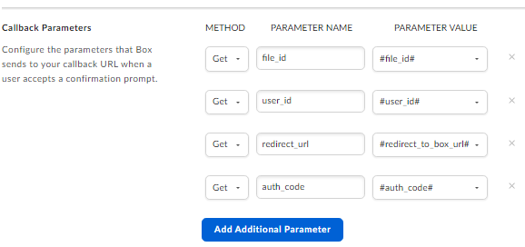

## Setup of ‘Scalar Auditor for BOX’ (User OAuth 2.0 Authentication)

### Overview

- **Box App:** Scalar Auditor for BOX operates under OAuth 2.0 with both User and Client Authentication.
- This authentication type allows developers to publish applications to the App Center or integrate them into the Box Web App.
- The app is designed as the Scalar File Auditing Tool, utilizing the BOX API with OAuth 2.0 authentication to gather essential information related to users, files, or folders.

### Steps to Create the App

#### Create a New App in Box Developer Console:

1. Navigate to the Box Developer Console.
2. Click on "Create New App".
3. Enter the name "Scalar Auditor for BOX", add a description, and select the purpose as "Integration".
   - App Category Selection:
     - External System Integration: File Auditing Tool by Scalar Inc.

#### Authentication Method Selection

- Choose "User Authentication (OAuth 2.0)".

#### Configuration:

1. Go to the Configuration tab.
2. Configure OAuth 2.0 Redirect URI and  CORS Domains(check in front end doc).
3. Save Client ID and Client Secret provided under OAuth 2.0 credentials.
4. Application Scopes:
   - Define necessary application scopes:
     - Write all files and store in box.
     - Manage users.
     - Manage groups.
     - Manage enterprise properties.
5. Enable "Make API calls using as-user header" in Advanced Features.

#### Integrations Tab:

1. Click on "Create New Web App Integration".
2. Fill in the Integration Name and Description.
   - App Info Section:
     - Integration Name: Scalar Auditor for BOX
     - Description: This tool serves the purpose of detecting tampering within files and folders.
     - Supported File Extensions: Support all file extensions
     - Permissions Requirement: Download permissions are required.
   - Integration Scopes:
     - The file/folder from which this integration is invoked
   - Integration Type: Both

Configure Callback Configuration settings.
- Integration Status: Set the status to "Development".
- Please include the four parameters as depicted in the snapshot below.

#### App Center Tab:

- Add short and long descriptions.
- Upload app screenshots and an app icon.

### Approval Process:

**Box Admin Console:**

1. Navigate to the Box Admin Console.
2. Custom Apps Manager:
   - Go to the "Apps" tab and select "Custom Apps Manager".
3. In the User Authentication App tab, click on the "Add App" button.
4. Paste the Client ID of the Scalar Auditor for BOX (User OAuth 2.0 Authentication) and click "Next".
5. Check the application scopes and approve the app.