# 出力ファイルリファレンス

Refactoring Agent が生成する各出力ファイルの詳細な解説です。

---

## 目次

1. [出力ディレクトリ構造](#出力ディレクトリ構造)
2. [00_summary - エグゼクティブサマリー](#00_summary---エグゼクティブサマリー)
3. [01_analysis - システム分析](#01_analysis---システム分析)
4. [02_evaluation - MMI評価](#02_evaluation---mmi評価)
5. [03_design - 設計ドキュメント](#03_design---設計ドキュメント)
6. [04_stories - ドメインストーリー](#04_stories---ドメインストーリー)
7. [05_estimate - コスト見積もり](#05_estimate---コスト見積もり)
8. [graph - ナレッジグラフ](#graph---ナレッジグラフ)
9. [99_appendix - 付録](#99_appendix---付録)

---

## 出力ディレクトリ構造

```
reports/
├── 00_summary/                          # エグゼクティブサマリー
│   ├── executive_summary.md             # 経営層向けサマリー
│   ├── project_metadata.json            # プロジェクトメタデータ
│   └── full-report.html                 # 統合HTMLレポート
│
├── 01_analysis/                         # システム分析結果
│   ├── system-overview.md               # システム概要
│   ├── ubiquitous-language.md           # ユビキタス言語集
│   ├── actors-roles-permissions.md      # アクター・ロール・権限
│   └── domain-code-mapping.md           # ドメイン-コード対応表
│
├── 02_evaluation/                       # MMI評価結果
│   ├── mmi-overview.md                  # MMI全体サマリー
│   ├── mmi-by-module.md                 # モジュール別MMI
│   └── mmi-improvement-plan.md          # MMI改善計画
│
├── 03_design/                           # 設計ドキュメント
│   ├── domain-analysis.md               # ドメイン分析
│   ├── context-map.md                   # コンテキストマップ
│   ├── system-mapping.md                # システムマッピング
│   ├── target-architecture.md           # ターゲットアーキテクチャ
│   ├── transformation-plan.md           # 変換計画
│   ├── operations-feedback.md           # 運用・フィードバック計画
│   ├── scalardb-architecture.md         # ScalarDBアーキテクチャ
│   ├── scalardb-schema.md               # ScalarDBスキーマ
│   ├── scalardb-transaction.md          # ScalarDBトランザクション
│   ├── scalardb-migration.md            # ScalarDBマイグレーション
│   ├── scalardb-analytics-architecture.md  # Analytics基盤（オプション）
│   ├── scalardb-analytics-queries.md       # Analyticsクエリ（オプション）
│   └── scalardb-analytics-catalog.md       # データカタログ（オプション）
│
├── 04_stories/                          # ドメインストーリー
│   └── [domain]-story.md                # ドメイン別ストーリー
│
├── 05_estimate/                         # コスト見積もり
│   ├── cost-summary.md                  # コストサマリー
│   ├── infrastructure-detail.md         # インフラ詳細
│   ├── license-requirements.md          # ライセンス要件
│   └── cost-assumptions.md              # 前提条件
│
├── graph/                               # ナレッジグラフ
│   ├── data/                            # CSVデータ
│   ├── visualizations/                  # 可視化ファイル
│   ├── schema.md                        # グラフスキーマ
│   └── statistics.md                    # 統計情報
│
└── 99_appendix/                         # 付録
    └── ...
```

---

## 00_summary - エグゼクティブサマリー

### executive_summary.md

**目的:** 経営層・意思決定者向けの概要レポート

**生成タイミング:** 全フェーズ完了後

**構造:**

```markdown
# エグゼクティブサマリー

## 1. プロジェクト概要
- 分析対象システム名
- 分析実施日
- 分析範囲（ファイル数、行数）

## 2. 主要な発見事項
- システムの現状評価
- 主要なリスクと課題
- マイクロサービス化の適性

## 3. MMIスコアサマリー
| 指標 | スコア | 評価 |
|-----|-------|-----|
| 全体MMI | 58/100 | 中成熟 |
| Cohesion | 3.2/5 | ... |
| Coupling | 2.8/5 | ... |
| Independence | 2.5/5 | ... |
| Reusability | 2.9/5 | ... |

## 4. 推奨アーキテクチャ
- 推奨マイクロサービス数
- 主要サービス一覧
- データストア構成

## 5. 移行ロードマップ
| フェーズ | 期間 | 主な作業 |
|--------|-----|---------|
| Phase 1 | 1-3ヶ月 | ... |
| Phase 2 | 3-6ヶ月 | ... |

## 6. コスト概算
- 初期投資
- 月額運用費
- ライセンス費用

## 7. リスクと軽減策
| リスク | 影響度 | 軽減策 |
|-------|-------|-------|
| ... | 高 | ... |

## 8. 次のステップ
1. ...
2. ...
```

**活用方法:**
- 経営層への報告資料として使用
- プロジェクト承認の判断材料
- 予算確保のための根拠資料

---

### project_metadata.json

**目的:** 分析のメタデータをJSON形式で保存

**生成タイミング:** `/analyze-system` 実行時

**構造:**

```json
{
  "project_name": "scalar-event-log-fetcher",
  "analysis_date": "2025-01-12T10:30:00Z",
  "target_path": "./src",
  "statistics": {
    "total_files": 245,
    "total_lines": 32500,
    "languages": {
      "java": 180,
      "typescript": 45,
      "xml": 20
    }
  },
  "design_documents": {
    "found": true,
    "count": 12,
    "types": ["md", "xlsx", "pdf"]
  },
  "modules_identified": 8,
  "entities_extracted": 45,
  "ubiquitous_terms": 128
}
```

**活用方法:**
- 分析の再現性確保
- 他ツールとの連携
- 変更追跡

---

### full-report.html

**目的:** 全レポートを統合したHTML形式のドキュメント

**生成タイミング:** `/compile-report` 実行時

**特徴:**
- 単一HTMLファイルで全情報を閲覧可能
- 目次からの内部リンク
- Mermaid図のレンダリング済み
- 印刷・PDF化に対応

**活用方法:**
- ステークホルダーへの配布
- オフラインでの閲覧
- アーカイブ保存

---

## 01_analysis - システム分析

### system-overview.md

**目的:** 対象システムの技術的概要

**生成タイミング:** `/analyze-system` Step 3

**構造:**

```markdown
# システム概要

## 1. 技術スタック

### バックエンド
| 項目 | 技術 | バージョン |
|-----|-----|----------|
| 言語 | Java | 17 |
| フレームワーク | Spring Boot | 3.2.0 |
| ビルドツール | Gradle | 8.5 |

### フロントエンド
| 項目 | 技術 | バージョン |
|-----|-----|----------|
| 言語 | TypeScript | 5.3 |
| フレームワーク | React | 18.2 |

### データストア
| 種別 | 技術 | 用途 |
|-----|-----|-----|
| RDB | PostgreSQL | メインDB |
| NoSQL | DynamoDB | イベントログ |

## 2. アーキテクチャパターン

- **全体構成:** モノリシック（一部モジュラー）
- **レイヤー構成:** Controller → Service → Repository
- **通信方式:** REST API, gRPC（一部）

## 3. モジュール構成

```
src/
├── application/          # アプリケーション層
│   ├── controller/       # REST API エンドポイント
│   ├── service/          # ビジネスロジック
│   └── dto/              # データ転送オブジェクト
├── domain/               # ドメイン層
│   ├── model/            # エンティティ
│   └── repository/       # リポジトリインターフェース
└── infrastructure/       # インフラ層
    └── persistence/      # DB実装
```

## 4. 外部連携

| 連携先 | 方式 | 用途 |
|-------|-----|-----|
| Box API | REST | ファイル管理 |
| ScalarDL | gRPC | 改ざん検知 |

## 5. 依存関係図

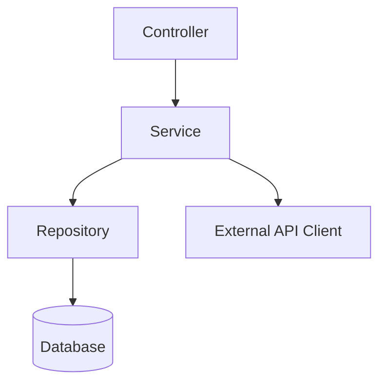
```

**活用方法:**
- 新規メンバーのオンボーディング
- 技術選定の判断材料
- 後続フェーズの入力情報

---

### ubiquitous-language.md

**目的:** ドメインで使用されるビジネス用語の辞書

**生成タイミング:** `/analyze-system` Step 4

**構造:**

```markdown
# ユビキタス言語集

## 概要

- 抽出元: 設計書 + ソースコード
- 総用語数: 128
- カテゴリ数: 8

## 用語一覧

### 監査関連 (Audit)

| 用語 | 日本語 | 定義 | コード上の表現 | 使用箇所 |
|-----|-------|-----|--------------|---------|
| AuditSet | 監査セット | 監査対象ファイルの集合 | `AuditSet.java` | AuditSetService, AuditSetController |
| AuditGroup | 監査グループ | 監査者のグループ | `AuditGroup.java` | AuditGroupService |
| Tampering | 改ざん | ファイルの不正な変更 | `TamperingStatusType` | ItemStatus, ValidationService |

### ユーザー関連 (User)

| 用語 | 日本語 | 定義 | コード上の表現 | 使用箇所 |
|-----|-------|-----|--------------|---------|
| ExternalAuditor | 外部監査者 | 組織外の監査担当者 | `UserRoles.EXTERNAL_AUDITOR` | UserService |
| Collaborator | コラボレーター | 監査セットの共同作業者 | `AuditSetCollaborators.java` | CollaboratorService |

### イベント関連 (Event)

| 用語 | 日本語 | 定義 | コード上の表現 | 使用箇所 |
|-----|-------|-----|--------------|---------|
| EventLog | イベントログ | システム操作の記録 | `EnterpriseEventLogs.java` | EventLogService |
| EventType | イベント種別 | 操作の分類 | `EventType.java` (enum) | EventLogBusiness |

## 用語間の関係

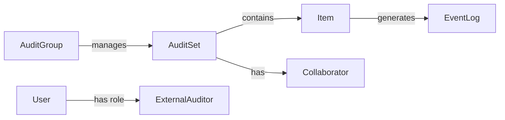

## 未定義用語（要確認）

以下の用語はコードに存在しますが、定義が不明確です：

- `PositionTracker` - 用途不明
- `ItemsBySha1` - ハッシュ関連？
```

**活用方法:**
- チーム内のコミュニケーション統一
- 新規メンバーの学習資料
- 要件定義の基礎資料

**読み方のポイント:**
- 「定義」列でビジネス上の意味を確認
- 「使用箇所」列で実装の広がりを把握
- 「未定義用語」は要ヒアリング項目

---

### actors-roles-permissions.md

**目的:** システムに関わる人物・役割・権限の整理

**生成タイミング:** `/analyze-system` Step 5

**構造:**

```markdown
# アクター・ロール・権限

## 1. アクター一覧

### 人間アクター

| アクター | 説明 | 主な操作 |
|---------|-----|---------|
| 一般ユーザー | Box企業アカウントのユーザー | 監査セット作成、ファイル追加 |
| 外部監査者 | 組織外の監査担当者 | ファイル閲覧、検証実行 |
| 管理者 | システム管理者 | ユーザー管理、権限設定 |

### システムアクター

| アクター | 説明 | 主な操作 |
|---------|-----|---------|
| Box API | 外部ファイルストレージ | ファイル取得、イベント通知 |
| ScalarDL | 改ざん検知エンジン | 台帳記録、検証 |
| Event Scheduler | バッチ処理 | 定期イベント取得 |

## 2. ロール定義

| ロール | 権限レベル | 説明 |
|-------|----------|-----|
| ADMIN | 最高 | 全機能へのアクセス |
| GENERAL_USER | 中 | 自身のリソースの管理 |
| EXTERNAL_AUDITOR | 限定 | 割り当てられた監査セットのみ |
| VIEWER | 最低 | 閲覧のみ |

## 3. 権限マトリクス

| 機能 | ADMIN | GENERAL_USER | EXTERNAL_AUDITOR | VIEWER |
|-----|-------|--------------|------------------|--------|
| 監査セット作成 | ✓ | ✓ | - | - |
| 監査セット閲覧 | ✓ | ✓（自身のみ） | ✓（割当のみ） | ✓ |
| ファイル追加 | ✓ | ✓ | - | - |
| ファイル検証 | ✓ | ✓ | ✓ | - |
| ユーザー管理 | ✓ | - | - | - |
| 監査グループ作成 | ✓ | ✓ | - | - |
| イベントログ閲覧 | ✓ | ✓（自身のみ） | ✓（割当のみ） | - |

## 4. 認証・認可フロー

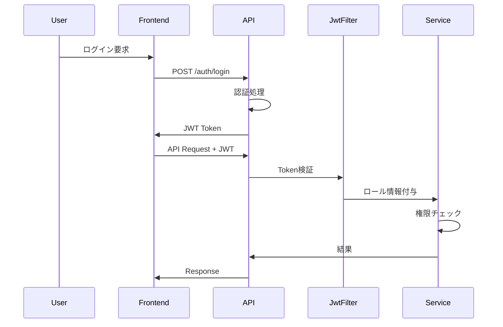

## 5. コード上の実装

| 概念 | 実装クラス | 実装方式 |
|-----|----------|---------|
| ロール定義 | `UserRoles.java` | Enum |
| 権限チェック | `SecurityConfig.java` | Spring Security |
| JWT処理 | `JwtHelper.java`, `JwtAuthFilter.java` | カスタムフィルター |
```

**活用方法:**
- セキュリティ設計のレビュー
- マイクロサービス分割時の認可設計
- テストケースの作成

---

### domain-code-mapping.md

**目的:** 設計上の概念と実装コードの対応関係

**生成タイミング:** `/analyze-system` Step 6

**構造:**

```markdown
# ドメイン-コード対応表

## 1. エンティティ対応

| ドメイン概念 | クラス名 | パッケージ | 備考 |
|------------|---------|----------|-----|
| 監査セット | AuditSet | model | JPA Entity |
| 監査グループ | AuditGroup | model | JPA Entity |
| 監査項目 | AuditSetItem | model | JPA Entity |
| ユーザー | User | model | JPA Entity |
| イベントログ | EnterpriseEventLogs | model | JPA Entity |

## 2. サービス対応

| ビジネス機能 | サービスクラス | 主要メソッド |
|------------|--------------|-------------|
| 監査セット管理 | AuditSetService | create, update, delete, findById |
| ファイル検証 | FileService | verifyItem, getVersions |
| イベント取得 | EventLogService | fetchEvents, getByItem |
| ユーザー認証 | UserService | authenticate, register |

## 3. リポジトリ対応

| エンティティ | リポジトリ | カスタムクエリ |
|------------|----------|--------------|
| AuditSet | AuditSetRepository | findByOwner, findByCollaborator |
| AuditGroup | AuditGroupRepository | findByUser |
| User | UserRepository | findByEmail, findByBoxId |

## 4. API対応

| ユースケース | エンドポイント | コントローラー |
|------------|--------------|--------------|
| 監査セット一覧取得 | GET /api/audit-sets | AuditSetController |
| 監査セット作成 | POST /api/audit-sets | AuditSetController |
| ファイル追加 | POST /api/audit-sets/{id}/items | AuditSetItemController |
| ファイル検証 | POST /api/files/{id}/verify | FileController |

## 5. 設計書にあるがコードにない概念

| 概念 | 設計書の記載 | 状況 |
|-----|------------|-----|
| 監査レポート | 要件定義書 p.15 | 未実装 |
| 一括検証 | ユースケース図 UC-12 | 部分実装 |

## 6. コードにあるが設計書にない概念

| クラス/機能 | 推測される用途 | 要確認 |
|-----------|--------------|-------|
| PositionTracker | イベント取得位置の追跡？ | ✓ |
| ItemsBySha1 | ハッシュによるファイル検索？ | ✓ |
| SystemEventDates | システムイベントの日付管理？ | ✓ |

## 7. 依存関係マップ

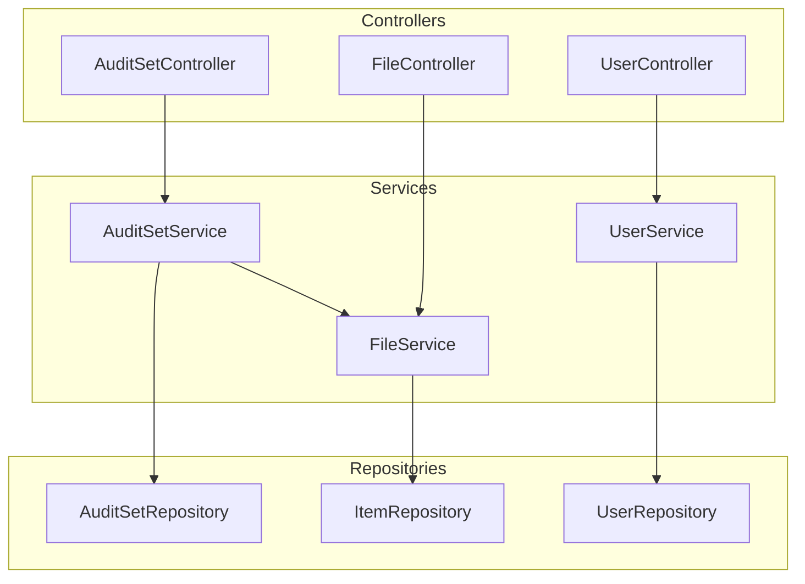
```

**活用方法:**
- コードレビューの効率化
- 影響範囲の特定
- 設計と実装の乖離の発見

---

## 02_evaluation - MMI評価

### mmi-overview.md

**目的:** システム全体のモジュール成熟度サマリー

**生成タイミング:** `/evaluate-mmi` Step 3

**構造:**

```markdown
# MMI評価サマリー

## 1. 全体スコア

| 指標 | スコア | 評価 |
|-----|-------|-----|
| **総合MMI** | **58/100** | **中成熟** |

## 2. 軸別スコア

| 軸 | スコア (0-5) | 重み | 加重スコア | 評価 |
|---|------------|-----|----------|-----|
| Cohesion（凝集度） | 3.2 | 30% | 0.96 | 中 |
| Coupling（結合度） | 2.5 | 30% | 0.75 | 低中 |
| Independence（独立性） | 2.8 | 20% | 0.56 | 中 |
| Reusability（再利用性） | 3.0 | 20% | 0.60 | 中 |

**計算式:** MMI = (0.96 + 0.75 + 0.56 + 0.60) / 5 × 100 = 57.4 ≈ 58

## 3. スコア分布

```
モジュール別MMIスコア分布

80-100 (高成熟)    : ██ 2モジュール
60-80  (中成熟)    : ████ 4モジュール
40-60  (低中成熟)  : ███ 3モジュール
0-40   (未成熟)    : █ 1モジュール
```

## 4. 評価サマリー

### 強み
- ✓ Controller層とService層の責務分離が明確
- ✓ リポジトリパターンによるデータアクセスの抽象化
- ✓ DTOによる層間のデータ分離

### 弱み
- ✗ Service間の直接依存が多い（循環依存あり）
- ✗ 共有データベースへの依存
- ✗ 外部API呼び出しがService層に散在

## 5. マイクロサービス化への適性

| 観点 | 評価 | コメント |
|-----|-----|---------|
| 分割容易性 | 中 | Service層の整理が必要 |
| データ分離 | 低 | 共有DBの解消が課題 |
| 通信パターン | 中 | 一部非同期化が必要 |

**総合判定:** リファクタリング後にマイクロサービス化可能
```

**活用方法:**
- 現状把握の定量的根拠
- 改善の優先順位付け
- 経営層への報告

**スコアの解釈:**

| スコア範囲 | レベル | 意味 | 推奨アクション |
|----------|-------|-----|--------------|
| 80-100 | 高成熟 | マイクロサービス化準備完了 | 即座に分割可能 |
| 60-80 | 中成熟 | 一部改善で分割可能 | 短期リファクタリング後に分割 |
| 40-60 | 低中成熟 | 大幅なリファクタリング必要 | 中期計画で段階的改善 |
| 0-40 | 未成熟 | モノリス分解から着手 | 長期計画でアーキテクチャ刷新 |

---

### mmi-by-module.md

**目的:** モジュール単位の詳細評価

**生成タイミング:** `/evaluate-mmi` Step 3

**構造:**

```markdown
# モジュール別MMI評価

## 1. AuditSetModule

### スコア
| 軸 | スコア | 根拠 |
|---|-------|-----|
| Cohesion | 4 | 監査セット管理に集中 |
| Coupling | 3 | UserService, FileServiceへの依存 |
| Independence | 3 | 単独デプロイには共有DBの解消が必要 |
| Reusability | 2 | 監査ドメイン固有のロジック |

**MMI: 62/100 (中成熟)**

### 依存関係
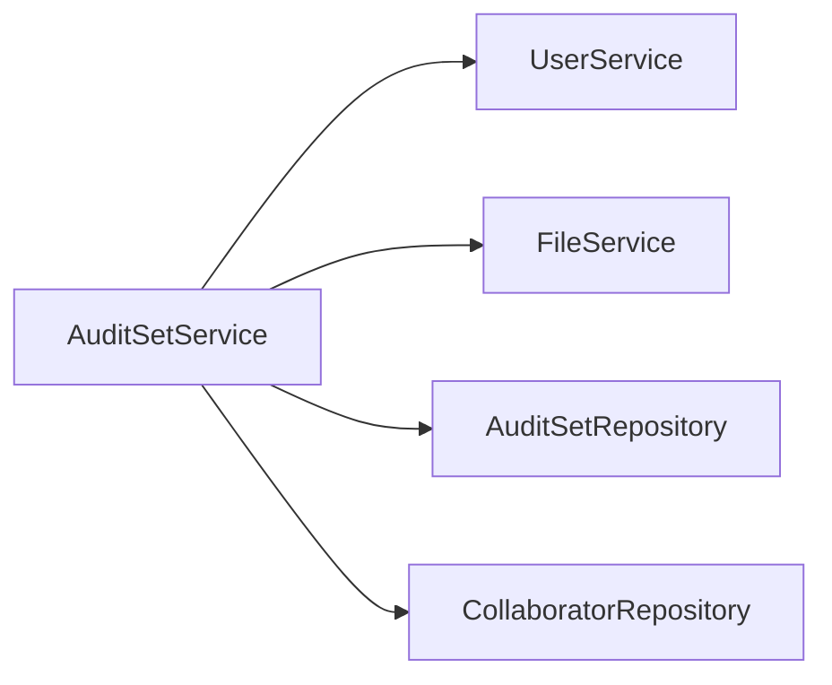

### 改善提案
1. UserServiceへの依存をイベント駆動に変更
2. FileServiceとの直接依存を解消（API経由に変更）

---

## 2. UserModule

### スコア
| 軸 | スコア | 根拠 |
|---|-------|-----|
| Cohesion | 4 | ユーザー管理に集中 |
| Coupling | 4 | 外部依存が少ない |
| Independence | 4 | 単独デプロイ可能 |
| Reusability | 3 | 認証ロジックは汎用的 |

**MMI: 76/100 (中成熟・上位)**

### 依存関係
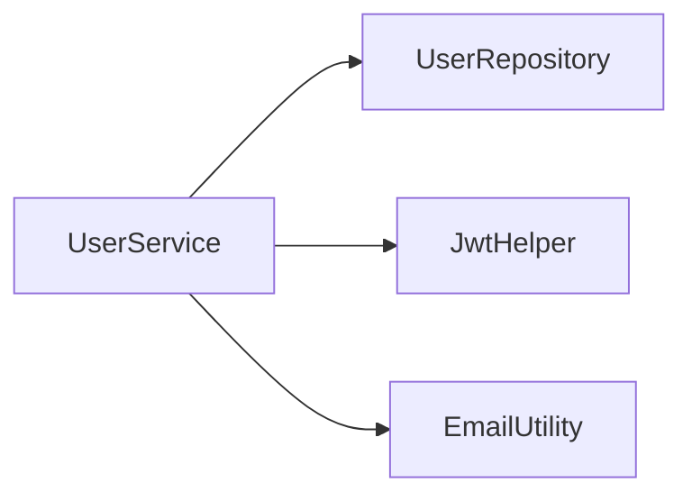

### 改善提案
1. EmailUtilityを別サービスに分離
2. JWT処理を共通ライブラリ化

---

## 3. EventLogModule

### スコア
| 軸 | スコア | 根拠 |
|---|-------|-----|
| Cohesion | 3 | イベント取得と保存が混在 |
| Coupling | 2 | Box API, ScalarDL, 複数Repositoryへの依存 |
| Independence | 2 | 外部システムへの強依存 |
| Reusability | 2 | Box固有のロジック |

**MMI: 46/100 (低中成熟)**

### 依存関係
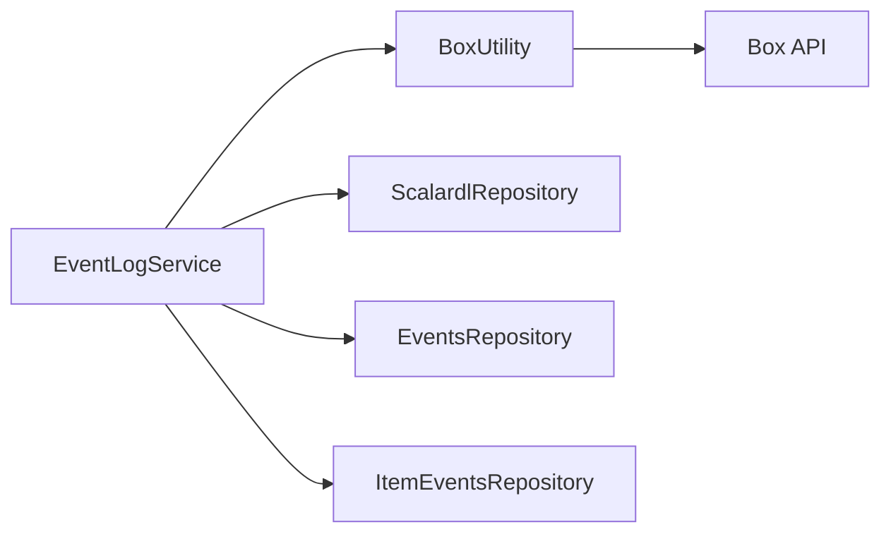

### 改善提案
1. Box APIアクセスをIntegrationサービスに分離
2. ScalarDL連携を独立サービス化
3. イベント取得と保存の責務を分離

---

## モジュール別スコア一覧

| モジュール | Cohesion | Coupling | Independence | Reusability | MMI | レベル |
|----------|----------|----------|--------------|-------------|-----|-------|
| UserModule | 4 | 4 | 4 | 3 | 76 | 中成熟 |
| AuditSetModule | 4 | 3 | 3 | 2 | 62 | 中成熟 |
| AuditGroupModule | 3 | 3 | 3 | 3 | 60 | 中成熟 |
| FileModule | 3 | 2 | 2 | 3 | 50 | 低中成熟 |
| EventLogModule | 3 | 2 | 2 | 2 | 46 | 低中成熟 |
| IntegrationModule | 2 | 2 | 2 | 2 | 40 | 未成熟 |
```

**活用方法:**
- 優先的にリファクタリングすべきモジュールの特定
- 分割の順序決定
- 詳細な改善計画の立案

---

### mmi-improvement-plan.md

**目的:** MMIスコア改善のためのロードマップ

**生成タイミング:** `/evaluate-mmi` Step 4

**構造:**

```markdown
# MMI改善計画

## 1. 改善目標

| 指標 | 現状 | 目標 | 期間 |
|-----|-----|-----|-----|
| 総合MMI | 58 | 75 | 6ヶ月 |
| Cohesion | 3.2 | 4.0 | 3ヶ月 |
| Coupling | 2.5 | 3.5 | 6ヶ月 |
| Independence | 2.8 | 3.5 | 6ヶ月 |
| Reusability | 3.0 | 3.5 | 4ヶ月 |

## 2. クイックウィン（1ヶ月以内）

| 施策 | 対象 | 効果 | 工数 |
|-----|-----|-----|-----|
| 循環依存の解消 | EventLog ↔ Item | Coupling +0.3 | 3人日 |
| 不要な依存削除 | CommonService | Coupling +0.2 | 2人日 |
| ユーティリティ分離 | GenericUtility | Reusability +0.2 | 2人日 |

## 3. 短期施策（1-3ヶ月）

### 3.1 Service層のリファクタリング
**目標:** Cohesion +0.5, Coupling +0.5

| タスク | 詳細 | 工数 |
|-------|-----|-----|
| 責務の明確化 | 各Serviceの単一責務化 | 10人日 |
| 依存の整理 | 直接依存をインターフェース経由に | 8人日 |
| 共通処理の抽出 | 横断的関心事の分離 | 5人日 |

### 3.2 データアクセス層の整理
**目標:** Independence +0.3

| タスク | 詳細 | 工数 |
|-------|-----|-----|
| Repository集約 | 1エンティティ1リポジトリに | 5人日 |
| トランザクション境界の明確化 | Service単位に整理 | 3人日 |

## 4. 中期施策（3-6ヶ月）

### 4.1 外部連携の分離
**目標:** Independence +0.4, Coupling +0.5

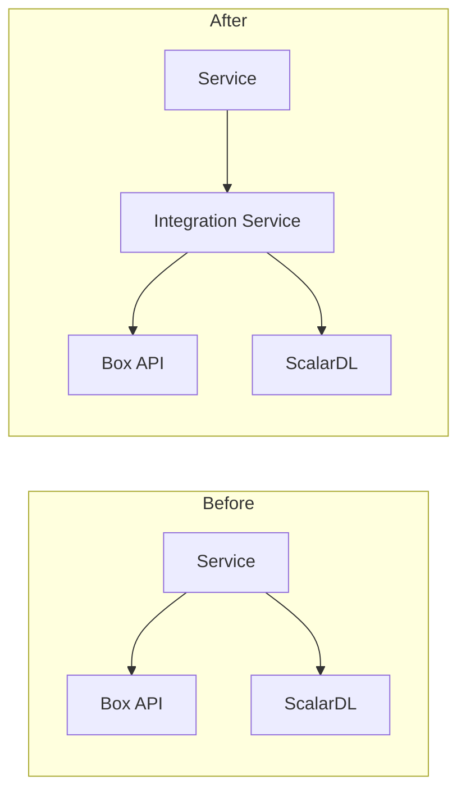

### 4.2 イベント駆動アーキテクチャの導入
**目標:** Coupling +0.3, Independence +0.3

| フェーズ | 内容 | 工数 |
|--------|-----|-----|
| メッセージング基盤導入 | Kafka/RabbitMQ | 5人日 |
| 非同期通信への移行 | 重要でない処理から | 15人日 |
| Sagaパターン導入 | 分散トランザクション | 10人日 |

## 5. 優先順位

```
優先度: 高 ────────────────────────────────► 低

[循環依存解消] → [Service責務分離] → [外部連携分離] → [イベント駆動化]
   (即効性高)      (基盤整備)         (分離準備)        (アーキテクチャ刷新)
```

## 6. リスクと対策

| リスク | 影響 | 対策 |
|-------|-----|-----|
| リファクタリング中のバグ混入 | 高 | テストカバレッジ向上を先行 |
| 開発停滞 | 中 | 段階的リリースで価値を早期提供 |
| スキル不足 | 中 | 外部支援・トレーニング |
```

**活用方法:**
- 開発計画の立案
- リソース配分の判断
- 進捗管理の基準

---

## 03_design - 設計ドキュメント

### domain-analysis.md

**目的:** ドメイン駆動設計に基づくドメイン分析

**生成タイミング:** `/map-domains` Step 2

**構造:**

```markdown
# ドメイン分析

## 1. コアドメイン

### 監査管理 (Audit Management)

**ビジネス価値:** 高
**複雑性:** 高
**戦略的重要性:** コア

| サブドメイン | 責務 | 主要エンティティ |
|------------|-----|----------------|
| 監査セット管理 | 監査対象の定義と管理 | AuditSet, AuditSetItem |
| 検証管理 | ファイルの真正性検証 | ItemStatus, Verification |

## 2. サポートドメイン

### ユーザー管理 (User Management)

**ビジネス価値:** 中
**複雑性:** 中
**戦略的重要性:** サポート

| サブドメイン | 責務 | 主要エンティティ |
|------------|-----|----------------|
| 認証 | ユーザー認証 | User, UserToken |
| 認可 | 権限管理 | Role, Permission |

## 3. 汎用ドメイン

### 外部連携 (Integration)

**ビジネス価値:** 低
**複雑性:** 高
**戦略的重要性:** 汎用（購入/委託検討）

| サブドメイン | 責務 | 主要エンティティ |
|------------|-----|----------------|
| Box連携 | ファイルストレージ連携 | - |
| ScalarDL連携 | 台帳管理連携 | - |

## 4. ドメイン分類マトリクス

```
        複雑性
        高 │    ┌─────────────┐
          │    │ 監査管理    │ ← コアドメイン
          │    │ (差別化)    │
          │    └─────────────┘
          │
          │    ┌─────────────┐
        低 │    │ ユーザー管理 │ ← サポートドメイン
          │    │ (必要だが汎用)│
          │    └─────────────┘
          └────────────────────────
             低              高
                ビジネス価値
```

## 5. 集約の識別

### AuditSet集約
```
AuditSet (集約ルート)
├── AuditSetItem
├── AuditSetCollaborator
└── ItemStatus
```

### User集約
```
User (集約ルート)
├── UserToken
└── UserOtp
```
```

**活用方法:**
- マイクロサービス境界の決定
- 開発チームの編成
- 投資優先順位の判断

---

### context-map.md

**目的:** 境界づけられたコンテキスト間の関係

**生成タイミング:** `/map-domains` Step 3

**構造:**

```markdown
# コンテキストマップ

## 1. 境界づけられたコンテキスト

| コンテキスト | 責務 | チーム |
|------------|-----|-------|
| Audit Context | 監査セット・検証管理 | 監査チーム |
| User Context | ユーザー・認証管理 | プラットフォームチーム |
| Event Context | イベントログ管理 | 監査チーム |
| Integration Context | 外部システム連携 | インフラチーム |

## 2. コンテキスト間の関係

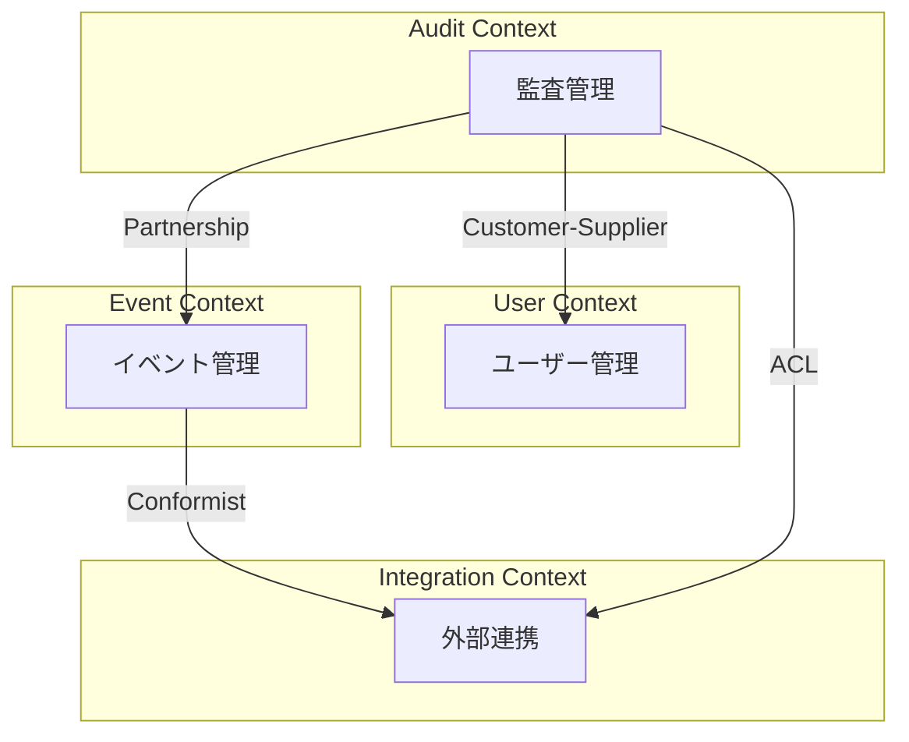

## 3. 関係パターンの詳細

### Audit → User: Customer-Supplier

| 項目 | 内容 |
|-----|-----|
| 上流 | User Context |
| 下流 | Audit Context |
| 関係 | Auditが必要とするユーザー情報をUserが提供 |
| 契約 | UserService.findById(), UserService.hasPermission() |

### Audit → Integration: Anti-Corruption Layer (ACL)

| 項目 | 内容 |
|-----|-----|
| 上流 | Integration Context (Box API) |
| 下流 | Audit Context |
| 関係 | 外部APIの変更からAuditを保護 |
| 実装 | BoxAdapter, FileTranslator |

## 4. 共有カーネル

| 共有要素 | コンテキスト | 管理方針 |
|---------|------------|---------|
| UserIdVO | Audit, Event | 共通ライブラリ |
| FileIdVO | Audit, Event | 共通ライブラリ |
| EventTypes | Event, Integration | Event Contextが所有 |

## 5. 移行時の考慮事項

| 関係 | 現状 | 移行後 | 注意点 |
|-----|-----|-------|-------|
| Audit → User | 直接DB参照 | API経由 | パフォーマンス考慮 |
| Audit → Event | 同一トランザクション | 非同期イベント | 整合性パターン変更 |
```

**活用方法:**
- チーム間の責務分担
- API設計の指針
- 統合テスト計画

---

### target-architecture.md

**目的:** リファクタリング後のターゲットアーキテクチャ

**生成タイミング:** `/design-microservices` Step 2

**構造:**

```markdown
# ターゲットアーキテクチャ

## 1. アーキテクチャ概要

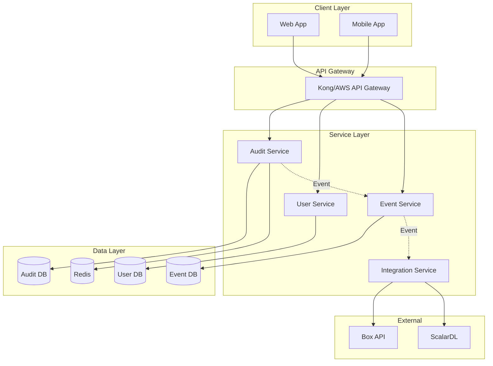

## 2. サービス定義

### Audit Service

| 項目 | 内容 |
|-----|-----|
| 責務 | 監査セット・監査グループ・検証の管理 |
| データストア | PostgreSQL (ScalarDB経由) |
| 主要API | /audit-sets, /audit-groups, /verifications |
| 依存サービス | User Service (認証), Event Service (通知) |

### User Service

| 項目 | 内容 |
|-----|-----|
| 責務 | ユーザー認証・認可・プロファイル管理 |
| データストア | PostgreSQL |
| 主要API | /auth, /users, /roles |
| 依存サービス | なし（自己完結） |

### Event Service

| 項目 | 内容 |
|-----|-----|
| 責務 | イベントログの収集・保存・検索 |
| データストア | DynamoDB (時系列データ) |
| 主要API | /events, /event-logs |
| 依存サービス | Integration Service (イベント取得) |

### Integration Service

| 項目 | 内容 |
|-----|-----|
| 責務 | 外部システム（Box, ScalarDL）との連携 |
| データストア | なし（ステートレス） |
| 主要API | /box, /scalardl |
| 依存サービス | 外部API |

## 3. 通信パターン

| パターン | 用途 | 実装 |
|---------|-----|-----|
| 同期 REST | クライアント→サービス | OpenAPI 3.0 |
| 同期 gRPC | サービス間（低レイテンシ） | Protocol Buffers |
| 非同期イベント | サービス間（疎結合） | Kafka |

## 4. データ管理

| サービス | データストア | 理由 |
|---------|------------|-----|
| Audit | PostgreSQL | トランザクション重視 |
| User | PostgreSQL | ACID必須 |
| Event | DynamoDB | 高スループット、時系列 |
| Cache | Redis | セッション、一時データ |

## 5. 横断的関心事

| 関心事 | 実装 |
|-------|-----|
| 認証 | JWT (User Service発行) |
| 認可 | OPA (Open Policy Agent) |
| ロギング | ELK Stack |
| 監視 | Prometheus + Grafana |
| トレーシング | Jaeger |
```

**活用方法:**
- 開発・インフラチームへの共有
- 技術選定の根拠
- 移行計画の基礎

---

### scalardb-schema.md

**目的:** ScalarDB Clusterのスキーマ設計

**生成タイミング:** `/design-scalardb` Step 2

**構造:**

```markdown
# ScalarDBスキーマ設計

## 1. Namespace設計

| Namespace | 用途 | ストレージ |
|-----------|-----|----------|
| audit | 監査関連データ | PostgreSQL |
| user | ユーザー関連データ | PostgreSQL |
| event | イベントログ | DynamoDB |

## 2. テーブル定義

### audit.audit_sets

```yaml
namespace: audit
table: audit_sets
partition_key:
  - id: TEXT
clustering_key: []
columns:
  - name: TEXT
  - description: TEXT
  - owner_id: TEXT
  - status: TEXT
  - created_at: BIGINT
  - updated_at: BIGINT
secondary_indexes:
  - owner_id
```

### audit.audit_set_items

```yaml
namespace: audit
table: audit_set_items
partition_key:
  - audit_set_id: TEXT
clustering_key:
  - item_id: TEXT
columns:
  - item_type: TEXT
  - file_path: TEXT
  - sha1_hash: TEXT
  - status: TEXT
  - added_at: BIGINT
```

### event.event_logs

```yaml
namespace: event
table: event_logs
partition_key:
  - item_id: TEXT
clustering_key:
  - event_time: BIGINT
  - event_id: TEXT
columns:
  - event_type: TEXT
  - actor_id: TEXT
  - details: TEXT
```

## 3. パーティション戦略

| テーブル | パーティションキー | 理由 |
|---------|-----------------|-----|
| audit_sets | id | 単一レコードアクセスが主 |
| audit_set_items | audit_set_id | 監査セット単位での一括取得 |
| event_logs | item_id | アイテム単位でのイベント検索 |

## 4. トランザクション境界

### 単一Namespace内トランザクション

```java
// Consensus Commit
try (TwoPhaseCommitTransaction tx = manager.start()) {
    // audit namespace内の操作
    tx.put(auditSetPut);
    tx.put(auditSetItemPut);
    tx.prepare();
    tx.commit();
}
```

### 複数Namespace間トランザクション

```java
// Two-Phase Commit
try (TwoPhaseCommitTransaction tx = manager.start()) {
    // audit namespace
    tx.put(auditSetPut);
    // event namespace
    tx.put(eventLogPut);
    tx.prepare();
    tx.commit();
}
```

## 5. スキーマ定義ファイル

```json
{
  "audit.audit_sets": {
    "transaction": true,
    "partition-key": ["id"],
    "columns": {
      "id": "TEXT",
      "name": "TEXT",
      "description": "TEXT",
      "owner_id": "TEXT",
      "status": "TEXT",
      "created_at": "BIGINT",
      "updated_at": "BIGINT"
    }
  }
}
```
```

**活用方法:**
- ScalarDB Schema Loaderへの入力
- 開発者向けスキーマドキュメント
- データモデルレビュー

---

### transformation-plan.md

**目的:** 現状からターゲットへの移行計画

**生成タイミング:** `/design-microservices` Step 3

**構造:**

```markdown
# 変換計画

## 1. 移行フェーズ概要

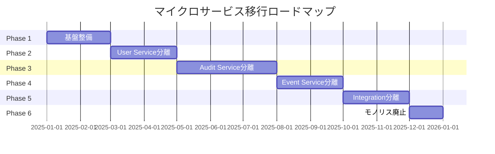

## 2. Phase 1: 基盤整備（2ヶ月）

### 目標
- CI/CDパイプラインの構築
- コンテナ化基盤の整備
- 監視・ロギング基盤の構築

### タスク
| タスク | 担当 | 工数 | 成果物 |
|-------|-----|-----|-------|
| Kubernetes環境構築 | インフラ | 10人日 | EKSクラスター |
| CI/CD構築 | DevOps | 8人日 | GitHub Actions |
| 監視基盤構築 | インフラ | 5人日 | Prometheus/Grafana |

## 3. Phase 2: User Service分離（2ヶ月）

### 目標
- ユーザー管理機能の独立サービス化
- 認証・認可の集中管理

### Strangler Fig Pattern適用

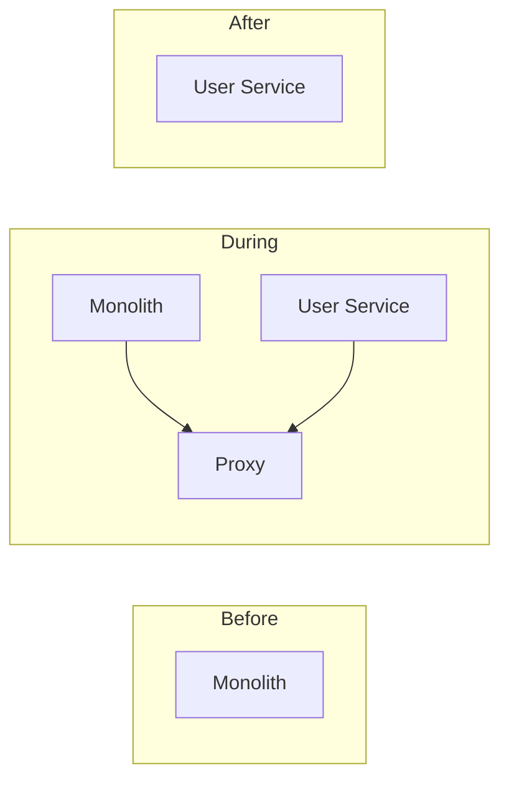

### タスク
| タスク | 工数 | リスク |
|-------|-----|-------|
| User Service実装 | 15人日 | 低 |
| 認証エンドポイント移行 | 5人日 | 中 |
| モノリス側の認証削除 | 3人日 | 低 |
| 統合テスト | 5人日 | - |

## 4. Phase 3: Audit Service分離（3ヶ月）

### 目標
- コアドメインの独立サービス化
- ScalarDB Clusterの導入

### データ移行戦略

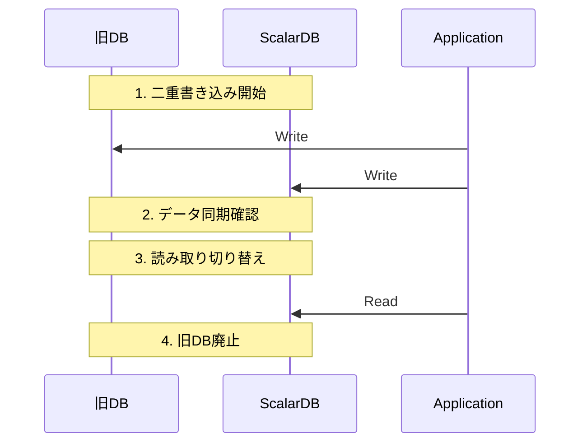

## 5. 各フェーズの完了基準

| フェーズ | 完了基準 |
|--------|---------|
| Phase 1 | 本番環境でコンテナが稼働 |
| Phase 2 | User Serviceが本番稼働、モノリスから認証コード削除 |
| Phase 3 | Audit Serviceが本番稼働、ScalarDB経由でデータアクセス |
| Phase 4 | Event Serviceが本番稼働、非同期イベント処理が機能 |
| Phase 5 | Integration Serviceが本番稼働、外部連携が安定 |
| Phase 6 | モノリスのシャットダウン完了 |

## 6. ロールバック計画

| フェーズ | ロールバック方法 | 所要時間 |
|--------|----------------|---------|
| Phase 2 | Proxyの切り戻し | 5分 |
| Phase 3 | 旧DB参照に切り戻し | 15分 |
| Phase 4 | 同期処理への切り戻し | 30分 |
```

**活用方法:**
- プロジェクト計画の策定
- リソース配分
- リスク管理

---

## 04_stories - ドメインストーリー

### [domain]-story.md

**目的:** ビジネスプロセスを物語形式で記述

**生成タイミング:** `/create-domain-story` 実行時

**構造:**

```markdown
# 監査セット作成ストーリー

## 概要

| 項目 | 内容 |
|-----|-----|
| ドメイン | 監査管理 |
| 主要アクター | 一般ユーザー |
| トリガー | 監査準備の開始 |
| ゴール | 監査対象ファイルの定義完了 |

## ストーリー

### 1. 舞台設定

**背景:**
企業の監査担当者（田中さん）は、四半期末の内部監査に向けて、
監査対象となるファイルを整理する必要があります。

**登場人物:**
- 田中さん（一般ユーザー、監査担当）
- 鈴木さん（外部監査者）
- Box（ファイルストレージシステム）

### 2. メインフロー

```mermaid
sequenceDiagram
    actor 田中 as 田中さん
    participant Web as WebApp
    participant API as Audit Service
    participant Box as Box API

    田中->>Web: 監査セット作成画面を開く
    田中->>Web: 監査セット名「2025Q1監査」を入力
    Web->>API: POST /audit-sets
    API->>API: 監査セット作成
    API->>Web: 作成完了

    田中->>Web: Boxからファイルを選択
    Web->>Box: ファイル一覧取得
    Box->>Web: ファイルリスト
    田中->>Web: 対象ファイルを追加
    Web->>API: POST /audit-sets/{id}/items
    API->>Box: ファイル情報取得
    API->>API: アイテム登録
    API->>Web: 追加完了

    田中->>Web: 外部監査者を招待
    Web->>API: POST /audit-sets/{id}/collaborators
    API->>API: コラボレーター追加
    API->>Web: 招待完了
```

### 3. アクティビティ詳細

| # | アクター | アクション | ワークアイテム | 結果 |
|---|---------|----------|--------------|-----|
| 1 | 田中さん | 作成する | 監査セット | 空の監査セット |
| 2 | 田中さん | 選択する | Boxファイル | ファイルリスト |
| 3 | 田中さん | 追加する | 監査項目 | 監査セットにファイル追加 |
| 4 | 田中さん | 招待する | 外部監査者 | コラボレーター追加 |

### 4. 例外フロー

#### 4.1 ファイルが見つからない場合

```mermaid
sequenceDiagram
    actor 田中 as 田中さん
    participant Web as WebApp
    participant API as Audit Service
    participant Box as Box API

    田中->>Web: ファイル追加を試みる
    Web->>API: POST /audit-sets/{id}/items
    API->>Box: ファイル情報取得
    Box->>API: 404 Not Found
    API->>Web: エラー「ファイルが見つかりません」
    Web->>田中: エラーメッセージ表示
```

#### 4.2 権限不足の場合

- 田中さんがファイルへのアクセス権を持っていない場合
- エラーメッセージを表示し、管理者への連絡を促す

### 5. ビジネスルール

| ルール | 説明 |
|-------|-----|
| BR-1 | 監査セットには少なくとも1つのファイルが必要 |
| BR-2 | 同一ファイルの重複追加は不可 |
| BR-3 | 削除済みファイルは追加不可 |
| BR-4 | コラボレーターは最大10名まで |

### 6. 用語集（このストーリー内）

| 用語 | 定義 |
|-----|-----|
| 監査セット | 監査対象ファイルの集合 |
| 監査項目 | 監査セット内の個別ファイル |
| コラボレーター | 監査セットにアクセスできる共同作業者 |
```

**活用方法:**
- 要件の可視化・共有
- ユースケース仕様の基礎
- ユーザーマニュアルの素材

---

## 05_estimate - コスト見積もり

### cost-summary.md

**目的:** コスト見積もりの概要

**生成タイミング:** `/estimate-cost` 実行時

**構造:**

```markdown
# コスト見積もりサマリー

## 1. 総コスト概要

| カテゴリ | 初期費用 | 月額費用 | 年間費用 |
|---------|---------|---------|---------|
| インフラストラクチャ | ¥2,500,000 | ¥850,000 | ¥10,200,000 |
| ライセンス | ¥0 | ¥450,000 | ¥5,400,000 |
| 開発・移行 | ¥15,000,000 | - | - |
| **合計** | **¥17,500,000** | **¥1,300,000** | **¥15,600,000** |

## 2. インフラコスト内訳

| リソース | 月額 | 備考 |
|---------|-----|-----|
| EKS クラスター | ¥150,000 | 3ノード構成 |
| RDS PostgreSQL | ¥200,000 | Multi-AZ |
| DynamoDB | ¥100,000 | オンデマンド |
| ElastiCache | ¥50,000 | Redis |
| ALB | ¥30,000 | - |
| その他 | ¥320,000 | ネットワーク、ストレージ等 |

## 3. ライセンスコスト内訳

| 製品 | 月額 | 備考 |
|-----|-----|-----|
| ScalarDB Cluster | ¥300,000 | Enterprise |
| Box Platform | ¥100,000 | API利用料 |
| 監視ツール | ¥50,000 | Datadog等 |

## 4. 開発・移行コスト内訳

| フェーズ | 工数 | 単価 | 金額 |
|--------|-----|-----|-----|
| Phase 1: 基盤整備 | 40人日 | ¥100,000 | ¥4,000,000 |
| Phase 2: User Service | 30人日 | ¥100,000 | ¥3,000,000 |
| Phase 3: Audit Service | 50人日 | ¥100,000 | ¥5,000,000 |
| Phase 4-6: その他 | 30人日 | ¥100,000 | ¥3,000,000 |

## 5. ROI試算

| 項目 | 金額 |
|-----|-----|
| 初期投資 | ¥17,500,000 |
| 年間運用削減効果 | ¥8,000,000 |
| 回収期間 | 約2.2年 |
```

**活用方法:**
- 予算申請
- 投資判断
- ベンダー交渉

---

### infrastructure-detail.md

**目的:** インフラストラクチャの詳細見積もり

**構造:**

```markdown
# インフラストラクチャ詳細見積もり

## 1. AWS構成

### Compute

| リソース | スペック | 数量 | 月額単価 | 月額計 |
|---------|--------|-----|---------|-------|
| EKS Node (m5.large) | 2vCPU, 8GB | 3 | ¥15,000 | ¥45,000 |
| EKS Control Plane | - | 1 | ¥7,500 | ¥7,500 |

### Database

| リソース | スペック | 数量 | 月額単価 | 月額計 |
|---------|--------|-----|---------|-------|
| RDS PostgreSQL (db.r5.large) | 2vCPU, 16GB | 2 | ¥80,000 | ¥160,000 |
| DynamoDB | オンデマンド | - | - | ¥100,000 |
| ElastiCache (cache.r5.large) | 2vCPU, 13GB | 2 | ¥25,000 | ¥50,000 |

### Network

| リソース | 数量 | 月額 |
|---------|-----|-----|
| ALB | 1 | ¥30,000 |
| NAT Gateway | 2 | ¥40,000 |
| データ転送 | 1TB | ¥10,000 |

## 2. 環境別コスト

| 環境 | 用途 | 月額 |
|-----|-----|-----|
| Production | 本番 | ¥600,000 |
| Staging | 検証 | ¥150,000 |
| Development | 開発 | ¥100,000 |
```

---

### license-requirements.md

**目的:** 必要なライセンスの一覧

**構造:**

```markdown
# ライセンス要件

## 1. 必須ライセンス

| 製品 | エディション | 用途 | 月額 |
|-----|------------|-----|-----|
| ScalarDB Cluster | Enterprise | 分散トランザクション | ¥300,000 |
| Box Platform | Business | ファイルストレージ連携 | ¥100,000 |

## 2. オプションライセンス

| 製品 | エディション | 用途 | 月額 |
|-----|------------|-----|-----|
| ScalarDB Analytics | Enterprise | 分析クエリ | ¥150,000 |
| Datadog | Pro | 監視 | ¥50,000 |

## 3. OSS（無償）

| 製品 | 用途 |
|-----|-----|
| Kubernetes | コンテナオーケストレーション |
| Kafka | メッセージング |
| Prometheus | メトリクス収集 |
| Grafana | 可視化 |

## 4. ライセンス条件

### ScalarDB Cluster Enterprise

- ノード数: 無制限
- サポート: 24/7
- SLA: 99.9%
- 契約期間: 年間
```

---

### cost-assumptions.md

**目的:** 見積もりの前提条件

**構造:**

```markdown
# コスト見積もり前提条件

## 1. 基本前提

| 項目 | 前提値 | 備考 |
|-----|-------|-----|
| 為替レート | $1 = ¥150 | 2025年1月時点 |
| AWS リージョン | ap-northeast-1 | 東京 |
| 契約期間 | 1年 | リザーブドインスタンス適用 |

## 2. 規模前提

| 項目 | 前提値 |
|-----|-------|
| 同時ユーザー数 | 500 |
| 月間トランザクション数 | 1,000,000 |
| データ保持期間 | 7年 |
| ストレージ増加率 | 20%/年 |

## 3. 除外事項

以下は見積もりに含まれていません：

- 既存システムの廃止費用
- トレーニング費用
- ドキュメント作成費用
- 予備費（通常10-20%を推奨）

## 4. リスク要因

| リスク | 影響 | 対策 |
|-------|-----|-----|
| 為替変動 | ±10% | 円建て契約を検討 |
| トラフィック増加 | +30% | オートスケーリング設定 |
| 移行遅延 | +20% | バッファ期間の確保 |
```

---

## graph - ナレッジグラフ

### data/*.csv

**目的:** グラフ構築用の中間データ

**ファイル一覧:**

| ファイル | 内容 | 列 |
|---------|-----|---|
| terms.csv | ユビキタス言語 | id, name, name_ja, definition, domain |
| domains.csv | ドメイン | id, name, type, description |
| entities.csv | エンティティ | id, name, file_path, type, line_number |
| methods.csv | メソッド | id, name, signature, file_path, line_number |
| files.csv | ファイル | id, path, language, module |
| actors.csv | アクター | id, name, type, description |
| roles.csv | ロール | id, name, permissions |
| belongs_to.csv | 所属関係 | entity_id, domain_id |
| defined_in.csv | 定義場所 | symbol_id, file_id |
| references.csv | 参照関係 | from_id, to_id |
| calls.csv | 呼び出し関係 | caller_id, callee_id |
| has_term.csv | 用語関連 | entity_id, term_id |

---

### schema.md

**目的:** グラフスキーマのドキュメント

**構造:**

```markdown
# ナレッジグラフスキーマ

## ノードタイプ

### UbiquitousTerm
ユビキタス言語（ビジネス用語）

| プロパティ | 型 | 説明 |
|----------|---|-----|
| id | STRING | 一意識別子 |
| name | STRING | 英語名 |
| name_ja | STRING | 日本語名 |
| definition | STRING | 定義 |
| domain | STRING | 所属ドメイン |

### Entity
コード上のエンティティ（クラス、インターフェース）

| プロパティ | 型 | 説明 |
|----------|---|-----|
| id | STRING | 一意識別子 |
| name | STRING | クラス名 |
| file_path | STRING | ファイルパス |
| type | STRING | class/interface/enum |
| line_number | INTEGER | 定義行番号 |

## リレーションシップ

### BELONGS_TO
Entity → Domain

### HAS_TERM
Entity/Method → UbiquitousTerm

### CALLS
Method → Method
```

---

### statistics.md

**目的:** グラフの統計情報

**構造:**

```markdown
# グラフ統計情報

## 生成情報

| 項目 | 値 |
|-----|---|
| 生成日時 | 2025-01-12 10:30:00 |
| 入力ディレクトリ | ./src |
| RyuGraphバージョン | 1.2.0 |

## ノード統計

| ノードタイプ | 件数 |
|------------|-----|
| UbiquitousTerm | 128 |
| Domain | 8 |
| Entity | 45 |
| Method | 312 |
| File | 180 |
| Actor | 6 |
| Role | 4 |
| **合計** | **683** |

## リレーションシップ統計

| リレーションシップ | 件数 |
|------------------|-----|
| BELONGS_TO | 45 |
| DEFINED_IN | 357 |
| REFERENCES | 234 |
| CALLS | 512 |
| IMPLEMENTS | 23 |
| HAS_TERM | 189 |
| HAS_ROLE | 12 |
| **合計** | **1,372** |

## 接続性分析

| 指標 | 値 |
|-----|---|
| 平均次数 | 4.02 |
| 最大次数 | 28 (UserService) |
| 孤立ノード | 3 |
```

---

## 99_appendix - 付録

### 追加資料

必要に応じて以下が格納されます：

- 元の設計書のコピー
- 分析時のログ
- 手動で追加した補足資料
- スクリーンショット

---

## ファイル間の関係

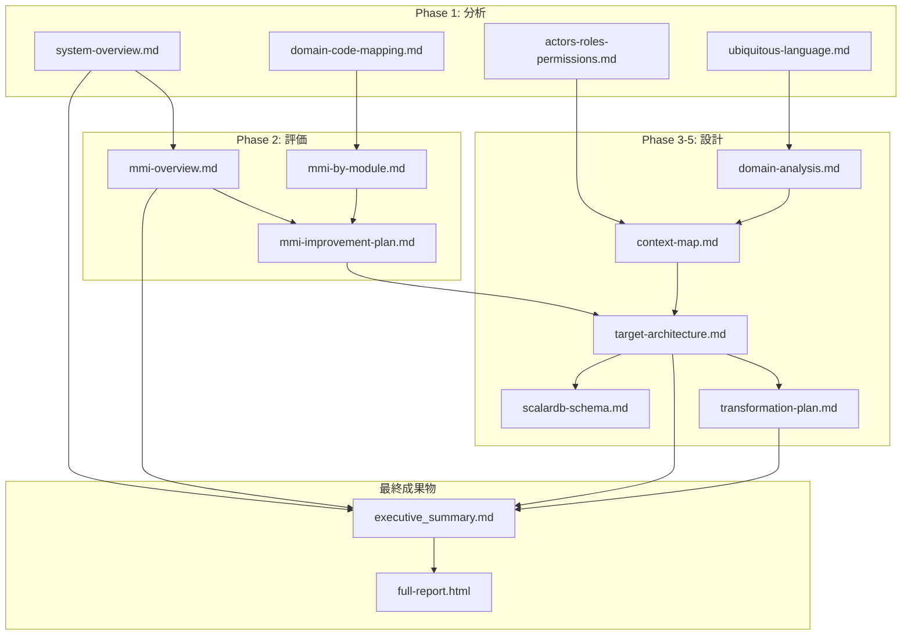

---

*このドキュメントは Refactoring Agent によって生成されました。*
