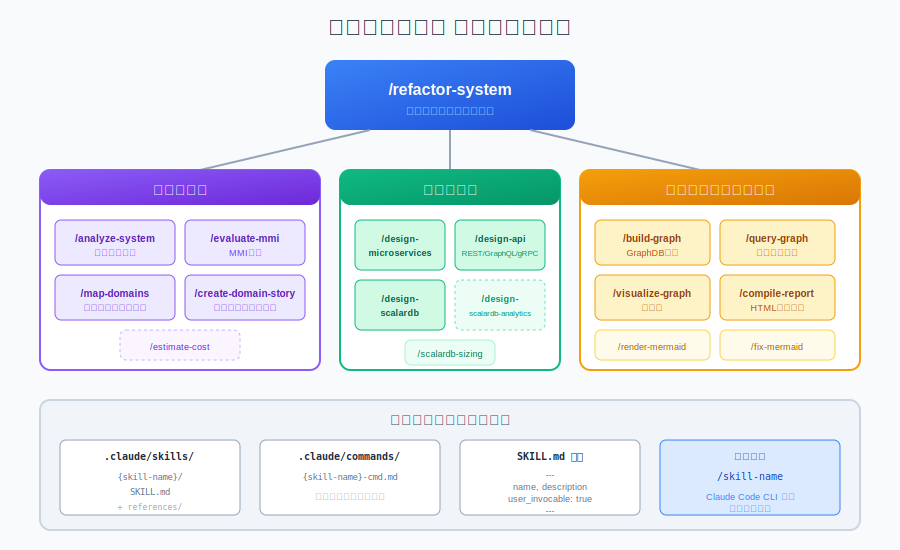
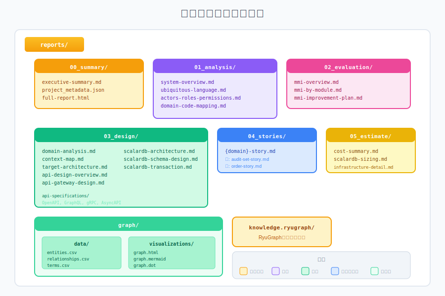

<!-- _class: lead -->
<!-- _backgroundColor: #1e293b -->
<!-- _color: white -->

# Refactoring Agent

## レガシーシステムのマイクロサービス化を支援する
## Claude Code エージェントシステム

<br>

**リファクタリング分析・設計の自動化**

---

# アジェンダ

1. **概要** - エージェントの目的と特徴
2. **アーキテクチャ** - パイプライン構成
3. **スキルシステム** - 各フェーズの詳細
4. **MMI評価** - モジュール成熟度指標
5. **出力物** - 分析レポート構造
6. **使用方法** - クイックスタート
7. **ScalarDBサイジング** - インフラ見積もり機能

---

# 1. 概要

## 目的

レガシーシステムの**マイクロサービス化**を支援するClaude Codeエージェント

<div class="columns">
<div>

### 主な機能

- システム分析・ユビキタス言語抽出
- モジュール成熟度（MMI）評価
- ドメイン境界の特定
- ターゲットアーキテクチャ設計
- API設計・ScalarDB設計
- コスト見積もり

</div>
<div>

### 特徴

- **9フェーズ**のパイプライン実行
- **ナレッジグラフ**による可視化
- **対話型**ドメインストーリー作成
- **HTML/Markdown**レポート出力

</div>
</div>

---

# 2. アーキテクチャ


---

# パイプライン詳細

| Phase | スキル | 出力 |
|-------|--------|------|
| 1 | `/analyze-system` | システム概要、ユビキタス言語 |
| 2 | `/evaluate-mmi` | MMI評価レポート |
| 3 | `/map-domains` | ドメインマッピング、コンテキストマップ |
| 4 | `/design-microservices` | ターゲットアーキテクチャ |
| 4.5 | `/design-api` | API仕様書（REST/GraphQL/gRPC） |
| 5 | `/design-scalardb` | ScalarDBスキーマ設計 |
| 6 | `/create-domain-story` | ドメインストーリー |
| 7 | `/estimate-cost` | コスト見積もり |
| 8 | - | エグゼクティブサマリー |

---

# 3. スキルシステム



---

# スキル定義

```
.claude/skills/{skill-name}/
├── SKILL.md           # スキル定義（YAML frontmatter）
└── references/        # 参照ドキュメント
```

### SKILL.md 構造

```yaml
---
name: analyze-system
description: システム分析エージェント...
user_invocable: true
---

# スキル実行手順
## Step 1: ...
## Step 2: ...
```

---

# 4. MMI評価


---

# MMI 4軸評価

<div class="columns">
<div>

### Cohesion (凝集度) - 30%
- 単一責任原則
- 1モジュール = 1責務

### Coupling (結合度) - 30%
- 疎結合の度合い
- 循環依存の有無

</div>
<div>

### Independence (独立性) - 20%
- デプロイ独立性
- 他モジュールへの影響

### Reusability (再利用性) - 20%
- 他コンテキストでの再利用
- 汎用インターフェース

</div>
</div>

---

# 成熟度レベル

| スコア | レベル | 推奨アクション |
|--------|--------|---------------|
| **80-100** | 高成熟度 | マイクロサービス化可能 |
| **60-80** | 中成熟度 | 軽微な改善後にMS化 |
| **40-60** | 低中成熟度 | リファクタリング必要 |
| **0-40** | 未成熟 | 大規模リファクタリング必要 |

<br>

> **例**: Scalar Auditor for BOX → **52.3/100** (低中成熟度)
> - God Class問題: UserService（1,118行）
> - 高密結合のサービス間依存

---

# 5. 出力物



---

# 主要出力ファイル

<div class="columns">
<div>

### 分析レポート
- `system-overview.md`
- `ubiquitous-language.md`
- `actors-roles-permissions.md`
- `mmi-overview.md`

### 設計ドキュメント
- `target-architecture.md`
- `api-design-overview.md`
- `scalardb-schema-design.md`

</div>
<div>

### 統合レポート
- `full-report.html`
  - Mermaid図レンダリング
  - ナレッジグラフ可視化
  - レスポンシブデザイン

### ナレッジグラフ
- `graph/data/*.csv`
- `graph/visualizations/`
- D3.jsインタラクティブビュー

</div>
</div>

---

# 6. 使用方法

## クイックスタート

```bash
# 全フェーズ実行（推奨）
/refactor-system ./path/to/source

# 個別スキル実行
/analyze-system ./path/to/source
/evaluate-mmi ./path/to/source
/design-api ./path/to/source

# ナレッジグラフ
/build-graph ./path/to/source
/query-graph "注文に関連するクラス"
/visualize-graph ./reports/graph
```

---

# コマンドオプション

```bash
# カスタム出力ディレクトリ
/refactor-system ./src --output=./custom-output/

# 特定ドメインのみ分析
/refactor-system ./src --domain=Order,Customer

# 分析のみ（設計スキップ）
/refactor-system ./src --analyze-only

# MMI評価スキップ
/refactor-system ./src --skip-mmi

# ドメインストーリースキップ
/refactor-system ./src --skip-stories
```

---

# 7. ScalarDBサイジング

## `/scalardb-sizing-estimator`

インタラクティブにScalarDB Clusterのサイジングと費用を見積もり

<div class="columns">
<div>

### 入力項目
- 性能要件（TPS）
- 可用性要件（SLA）
- 環境構成
- クラウドプロバイダー
- ライセンス形態

</div>
<div>

### 出力
- Pod数・リソース構成
- Kubernetes Node数
- バックエンドDB構成
- 月額/年額費用
- アーキテクチャ図

</div>
</div>

---

# ScalarDBライセンス形態

| 形態 | 月額/Pod | 特徴 |
|------|---------|------|
| **直接契約 Standard** | ¥100,000 | 長期利用向け、コスト効率良 |
| **直接契約 Premium** | ¥200,000 | 高度機能、24/7サポート |
| **AWS Marketplace Standard** | ~¥153,300 | 短期・PoC向け、AWS請求一本化 |
| **AWS Marketplace Premium** | ~¥306,600 | 短期・PoC向け |

<br>

> AWS Marketplace: $1.40/Pod/時間 × 730時間 = ~$1,022/月

---

# Pod数計算式

```
最終Pod数 = max(性能要件Pod数, 可用性要件Pod数, 最小Pod数)
```

### 計算例: 500 TPS, 99.9% SLA

| 項目 | 計算 | 結果 |
|------|------|------|
| 性能要件Pod数 | ceil(500 / 1,000) | 1 pod |
| 可用性要件Pod数 | Raftクォーラム最小 | 3 pods |
| 最終Pod数 | max(1, 3, 3) | **3 pods** |

<br>

> TPS/Pod: 900〜2,400（v3.17最適化有効時）

---

# 費用サマリー例

## 本番環境 5Pod構成（AWS）

| 項目 | 直接契約 Standard | AWS Marketplace |
|------|-------------------|-----------------|
| ScalarDB License | ¥500,000 | ¥766,500 |
| EKS Cluster | ¥11,000 | ¥11,000 |
| EC2 Nodes | ¥225,000 | ¥225,000 |
| Aurora PostgreSQL | ¥120,000 | ¥120,000 |
| ALB | ¥15,000 | ¥15,000 |
| **合計** | **¥871,000** | **¥1,137,500** |

---

# まとめ

<div class="highlight">

## Refactoring Agentでできること

</div>

<br>

- **自動分析**: レガシーコードの構造・依存関係を自動分析
- **MMI評価**: モジュール成熟度を定量的に評価
- **設計支援**: マイクロサービス・API・データベース設計
- **可視化**: ナレッジグラフによるシステム理解
- **見積もり**: ScalarDBインフラの費用見積もり

<br>

```bash
# 今すぐ始める
/refactor-system ./your-legacy-system
```

---

<!-- _class: lead -->
<!-- _backgroundColor: #1e293b -->
<!-- _color: white -->

# Thank You

<br>

## リソース

- **GitHub**: [refactoring-agent](https://github.com/your-repo/refactoring-agent)
- **ドキュメント**: `docs/USER_GUIDE.md`
- **サイジング解説**: `docs/SCALARDB_SIZING_MECHANISM.md`

<br>

**Questions?**
