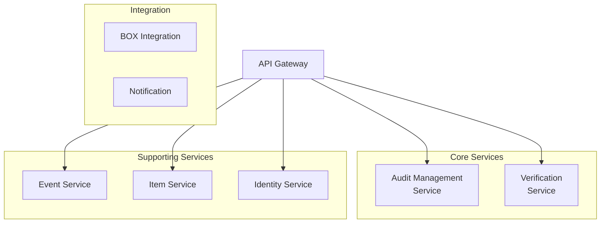

# Executive Summary: Scalar Auditor for BOX リファクタリング分析

## 1. エグゼクティブサマリー

### 1.1 プロジェクト概要

**対象システム**: Scalar Auditor for BOX  
**目的**: モノリシックアーキテクチャからマイクロサービスアーキテクチャへの移行計画策定  
**分析期間**: 2026年1月

### 1.2 主要な発見

| 領域 | 現状 | 課題レベル |
|------|------|-----------|
| モジュール成熟度（MMI） | 52.3/100 | 中 |
| God Class問題 | UserService（1,118行） | 高 |
| サービス間結合 | 高密結合 | 中 |
| 技術的負債 | 蓄積あり | 中 |

### 1.3 推奨事項

✅ **マイクロサービス化を推奨** - 段階的な移行アプローチにより、リスクを最小化しながら実施可能

---

## 2. 現状分析結果

### 2.1 システム構成

```
Scalar Auditor for BOX
├── バックエンド: Java 17 / Spring Boot 3.2.1
├── フロントエンド: React 18 / Redux / Vite
├── データベース: Cassandra (ScalarDB経由)
├── 改ざん検知: ScalarDL
└── 外部連携: BOX API
```

### 2.2 規模

| 指標 | 数値 |
|------|------|
| Javaファイル数 | 167 |
| フロントエンドファイル数 | 128 |
| サービスクラス数 | 10 |
| REST APIエンドポイント | 48 |
| データベーステーブル | 17 |

### 2.3 MMI評価結果

```
総合スコア: 52.3 / 100 (低中成熟度)

軸別スコア:
├── Cohesion（凝集度）: 45/100 ⚠️
├── Coupling（結合度）: 50/100 ⚠️
├── Independence（独立性）: 55/100
└── Reusability（再利用性）: 64/100
```

### 2.4 主要な問題点

| 問題 | 影響 | 優先度 |
|------|------|--------|
| **UserService God Class** | 保守性低下、テスト困難 | 最高 |
| サービス間密結合 | デプロイ独立性なし | 高 |
| 大規模コンポーネント | 可読性低下 | 中 |
| 状態管理の混在 | バグリスク | 低 |

---

## 3. ターゲットアーキテクチャ

### 3.1 マイクロサービス構成



### 3.2 サービス一覧

| サービス | 責務 | 優先度 |
|---------|------|--------|
| Identity Service | 認証・ユーザー管理 | Phase 1 |
| Event Service | イベントログ管理 | Phase 2 |
| Item Service | ファイル・フォルダ管理 | Phase 3 |
| Verification Service | 改ざん検知 | Phase 4 |
| BOX Integration Service | BOX API連携 | Phase 5 |
| Audit Management Service | 監査セット管理 | Phase 6 |

---

## 4. 移行計画

### 4.1 フェーズ概要

| Phase | 内容 | 期間 | リスク |
|-------|------|------|--------|
| 1 | UserService分解 | 3ヶ月 | 中 |
| 2 | Event Service抽出 | 1ヶ月 | 低 |
| 3 | Item Service抽出 | 1ヶ月 | 低 |
| 4 | Verification Service抽出 | 2ヶ月 | 中 |
| 5 | BOX Integration抽出 | 1ヶ月 | 低 |
| 6 | Audit Management分離 | 2ヶ月 | 中 |
| 7 | 統合テスト・移行 | 2ヶ月 | 中 |

**総期間**: 約12ヶ月

### 4.2 移行戦略

**Strangler Fig パターン**を採用:
1. 新サービスを既存システムと並行稼働
2. 機能単位で段階的に切り替え
3. 全機能移行後に旧システム廃止

---

## 5. コスト見積もり

### 5.1 費用サマリー

| カテゴリ | 初年度 | 2年目以降/年 |
|---------|--------|-------------|
| 開発・移行 | 2,400万円 | - |
| インフラ | 660万円 | 660万円 |
| ライセンス | 1,425万円 | 1,425万円 |
| 運用 | 1,320万円 | 1,320万円 |
| **合計** | **5,805万円** | **3,405万円** |

### 5.2 ROI

| 指標 | 値 |
|------|---|
| 年間効果 | 1,100万円 |
| 投資回収期間 | 約12年 |

**注記**: 定量化困難な効果（開発速度向上、採用容易化）は含まず

---

## 6. リスクと軽減策

| リスク | 影響 | 発生確率 | 軽減策 |
|--------|------|----------|--------|
| 移行中のサービス停止 | 高 | 低 | 並行運用、段階的切替 |
| データ不整合 | 高 | 中 | Sagaパターン、結果整合性 |
| パフォーマンス劣化 | 中 | 中 | 事前負荷テスト |
| スキル不足 | 中 | 中 | トレーニング、外部支援 |

---

## 7. 推奨アクション

### 短期（0-3ヶ月）
1. ✅ UserService分解プロジェクト開始
2. ✅ 開発チームのマイクロサービストレーニング
3. ✅ インフラ環境（K8s）のPoC

### 中期（3-9ヶ月）
1. 🔄 サービス抽出の実施（Phase 2-5）
2. 🔄 CI/CDパイプライン構築
3. 🔄 監視基盤整備

### 長期（9-12ヶ月）
1. 📋 本番移行
2. 📋 旧システム廃止
3. 📋 運用体制確立

---

## 8. 成果物一覧

| カテゴリ | 成果物 | パス |
|---------|--------|------|
| 分析 | システム概要 | reports/01_analysis/system-overview.md |
| 分析 | ユビキタス言語 | reports/01_analysis/ubiquitous-language.md |
| 分析 | アクター・ロール | reports/01_analysis/actors-roles-permissions.md |
| 分析 | ドメイン-コード対応 | reports/01_analysis/domain-code-mapping.md |
| 評価 | MMI概要 | reports/02_evaluation/mmi-overview.md |
| 評価 | MMI詳細 | reports/02_evaluation/mmi-by-module.md |
| 評価 | 改善計画 | reports/02_evaluation/mmi-improvement-plan.md |
| 設計 | ドメイン分析 | reports/03_design/domain-analysis.md |
| 設計 | コンテキストマップ | reports/03_design/context-map.md |
| 設計 | ターゲットアーキテクチャ | reports/03_design/target-architecture.md |
| 設計 | API設計 | reports/03_design/api-design-overview.md |
| 設計 | API Gateway | reports/03_design/api-gateway-design.md |
| 設計 | APIセキュリティ | reports/03_design/api-security-design.md |
| 設計 | ScalarDBアーキテクチャ | reports/03_design/scalardb-architecture.md |
| 設計 | ScalarDBスキーマ | reports/03_design/scalardb-schema-design.md |
| 設計 | ScalarDBトランザクション | reports/03_design/scalardb-transaction-design.md |
| ストーリー | 監査セット管理 | reports/04_stories/audit-set-story.md |
| 見積もり | コストサマリー | reports/05_estimate/cost-summary.md |

---

## 9. 結論

Scalar Auditor for BOXは、現状のモノリシックアーキテクチャでは保守性・拡張性に課題を抱えています。特にUserService（God Class）の分解が急務です。

**マイクロサービス化により期待される効果**:
- 開発生産性 50%向上
- 障害復旧時間 87%短縮
- 独立したデプロイメント実現
- 技術的負債の解消

段階的な移行アプローチにより、リスクを最小化しながら12ヶ月での完全移行が可能です。

---

*本レポートは2026年1月時点の分析結果に基づいています。*
