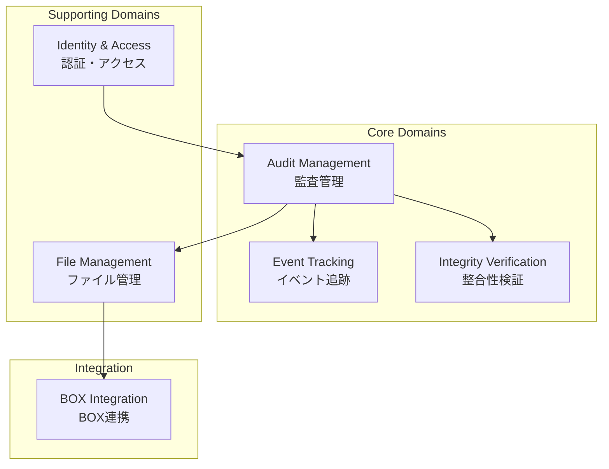
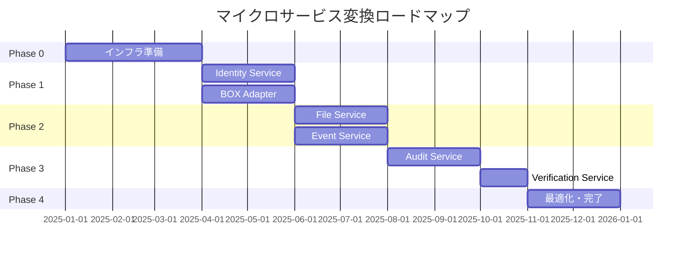

# Executive Summary
## Scalar Auditor for BOX - マイクロサービス化計画

---

## 1. プロジェクト概要

### 1.1 対象システム

| 項目 | 内容 |
|------|------|
| **システム名** | Scalar Auditor for BOX |
| **目的** | BOXファイルの監査・改ざん検証システム |
| **技術スタック** | Spring Boot 3.2.1, React 18, Vite |
| **構成** | モノリシックアーキテクチャ（モノレポ） |

### 1.2 分析範囲

- Javaバックエンド（Spring Boot）
- Reactフロントエンド
- ScalarDB/ScalarDL連携

---

## 2. 現状分析結果

### 2.1 システム構造

```
┌─────────────────────────────────────────────────────────┐
│                    現在のアーキテクチャ                    │
├─────────────────────────────────────────────────────────┤
│  Controller層 (9)  │  Service層 (12)  │  Repository層 (22)  │
├─────────────────────────────────────────────────────────┤
│                    Entity/Model (20)                     │
├─────────────────────────────────────────────────────────┤
│        ScalarDB Cluster    │    BOX Platform API        │
└─────────────────────────────────────────────────────────┘
```

### 2.2 MMI評価結果

| 指標 | スコア | 評価 |
|------|--------|------|
| **総合スコア** | 48.6/100 | 低中成熟 |
| Cohesion (凝集度) | 2.2/5 | サービス肥大化 |
| Coupling (結合度) | 2.0/5 | 高結合 |
| Independence (独立性) | 2.5/5 | 分離不足 |
| Reusability (再利用性) | 2.7/5 | 改善余地あり |

### 2.3 主要課題

| 課題 | 影響 | 優先度 |
|------|------|--------|
| UserService肥大化（1116行） | 保守性・テスタビリティ低下 | **高** |
| JSONフィールドによるデータ保存 | クエリ性能・整合性問題 | **中** |
| BOX API直接依存 | テスト困難・障害伝播 | **中** |
| 貧血ドメインモデル | ビジネスロジック分散 | **中** |

---

## 3. ドメイン設計

### 3.1 境界づけられたコンテキスト



### 3.2 コンテキスト関係パターン

| 関係 | パターン |
|------|---------|
| Audit ↔ File | Partnership |
| File → BOX Integration | Anti-corruption Layer |
| Identity → All | Customer-Supplier |
| Verification → ScalarDL | Open Host Service |

---

## 4. ターゲットアーキテクチャ

### 4.1 マイクロサービス構成

```
┌─────────────────────────────────────────────────────────────────┐
│                        API Gateway (Kong)                        │
├─────────────────────────────────────────────────────────────────┤
│  Identity  │  Audit   │  File    │  Event   │ Verification │ BOX │
│  Service   │  Service │  Service │  Service │   Service    │Adapter│
├─────────────────────────────────────────────────────────────────┤
│                     ScalarDB Cluster (3 nodes)                   │
├─────────────────────────────────────────────────────────────────┤
│     PostgreSQL        │    Cassandra    │     ScalarDL          │
│  (Identity/Audit/File)│    (Events)     │   (Verification)      │
└─────────────────────────────────────────────────────────────────┘
```

### 4.2 サービス仕様

| サービス | 責務 | 主要API |
|---------|------|---------|
| **Identity Service** | 認証・認可・ユーザー管理 | /auth, /users, /roles |
| **Audit Service** | 監査セット・グループ管理 | /audit-sets, /audit-groups |
| **File Service** | ファイルメタデータ管理 | /files, /folders, /items |
| **Event Service** | イベントログ収集・検索 | /events, /webhooks |
| **Verification Service** | 改ざん検証・証跡管理 | /verify, /proofs |
| **BOX Adapter** | BOX API連携・Anti-corruption | (内部) |

---

## 5. データアーキテクチャ

### 5.1 ScalarDB構成

| 設定 | 選択 | 理由 |
|------|------|------|
| デプロイモード | ScalarDB Cluster | マイクロサービス対応、高可用性 |
| トランザクション | Consensus Commit | 分散ACID必須 |
| ストレージ戦略 | Multi-storage | コンテキスト別最適化 |
| 分離レベル | SERIALIZABLE | 監査データ完全性保証 |

### 5.2 Namespace設計

| Namespace | ストレージ | テーブル数 |
|-----------|-----------|-----------|
| identity | PostgreSQL | 5 |
| audit | PostgreSQL | 5 |
| file | PostgreSQL | 4 |
| event | Cassandra | 4 |
| coordinator | PostgreSQL | 1 |

---

## 6. 変換計画

### 6.1 フェーズ概要



### 6.2 フェーズ詳細

| Phase | 期間 | 内容 | 成果物 |
|-------|------|------|--------|
| **0: 基盤構築** | 3ヶ月 | Kubernetes、ScalarDB Cluster、CI/CD | インフラ環境 |
| **1: 認証・BOX連携** | 4ヶ月 | Identity Service、BOX Adapter分離 | 認証基盤 |
| **2: ファイル・イベント** | 4ヶ月 | File Service、Event Service分離 | コア機能 |
| **3: 監査・検証** | 3ヶ月 | Audit Service、Verification Service | 監査機能完成 |
| **4: 最適化** | 2ヶ月 | 性能チューニング、モノリス廃止 | 本番移行 |

---

## 7. リスクと対策

### 7.1 技術リスク

| リスク | 影響 | 対策 |
|--------|------|------|
| 分散トランザクション失敗 | データ不整合 | Saga パターン、補償トランザクション |
| BOX API障害 | サービス停止 | サーキットブレーカー、リトライ |
| 移行中のサービス停止 | ビジネス影響 | Strangler Fig、段階的切替 |

### 7.2 組織リスク

| リスク | 影響 | 対策 |
|--------|------|------|
| スキル不足 | 品質低下 | トレーニング、ペアプログラミング |
| スコープ拡大 | スケジュール遅延 | 厳格な変更管理 |

---

## 8. 期待効果

### 8.1 定量効果

| 指標 | 現状 | 目標 | 改善率 |
|------|------|------|--------|
| デプロイ頻度 | 月1回 | 週1回+ | 400%+ |
| MTTR | 2時間 | 30分 | 75%短縮 |
| テストカバレッジ | 30% | 80% | 167%+ |
| MMIスコア | 48.6 | 75+ | 54%+ |

### 8.2 定性効果

- **開発生産性向上**: サービス単位の独立開発
- **障害影響局所化**: 障害がサービス内に限定
- **スケーラビリティ**: サービス単位の水平スケール
- **技術刷新容易化**: サービス単位の技術選択

---

## 9. 推奨事項

### 9.1 即時対応（Phase 0開始前）

1. **UserService分割設計の詳細化**
2. **ScalarDB Cluster検証環境構築**
3. **チームスキル評価とトレーニング計画**

### 9.2 継続的改善

1. **Domain Event導入**による疎結合化
2. **CQRS パターン**によるクエリ最適化
3. **Feature Flag**による段階的リリース

---

## 10. 付録

### 10.1 生成ドキュメント一覧

| カテゴリ | ファイル | 内容 |
|---------|---------|------|
| **分析** | system-overview.md | システム概要 |
| | ubiquitous-language.md | ユビキタス言語集 |
| | actors-roles-permissions.md | アクター・ロール・権限 |
| | domain-code-mapping.md | ドメイン-コード対応表 |
| **評価** | mmi-overview.md | MMI評価概要 |
| | mmi-by-module.md | モジュール別MMI |
| | mmi-improvement-plan.md | 改善計画 |
| **設計** | domain-analysis.md | ドメイン分析 |
| | context-map.md | コンテキストマップ |
| | target_architecture.md | ターゲットアーキテクチャ |
| | transformation_plan.md | 変換計画 |
| | operations_plan.md | 運用計画 |
| | scalardb_*.md | ScalarDB設計（4ファイル） |
| **ストーリー** | domain-stories.md | ドメインストーリー集 |
| **グラフ** | schema.md | GraphDBスキーマ |
| | statistics.md | グラフ統計情報 |

### 10.2 ナレッジグラフ

- **ノード数**: 106
- **リレーション数**: 130
- **データベース**: knowledge.ryugraph

```bash
# クエリ実行例
python scripts/query_graph.py --db-path ./knowledge.ryugraph \
  --query "監査セットに関連するクラス"
```

---

**生成日**: 2025-12-26
**プロジェクト**: Scalar Auditor for BOX
**バージョン**: 1.0.0

---

*このドキュメントはClaude Codeのリファクタリングエージェントにより自動生成されました。*
