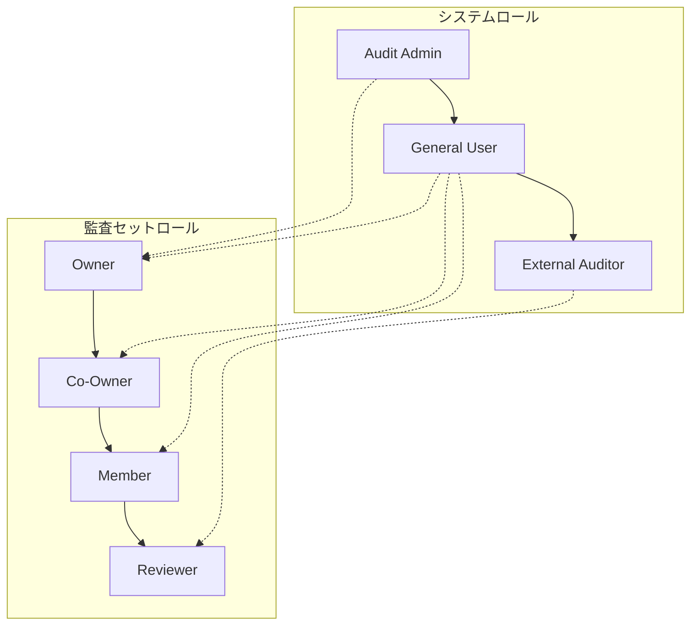
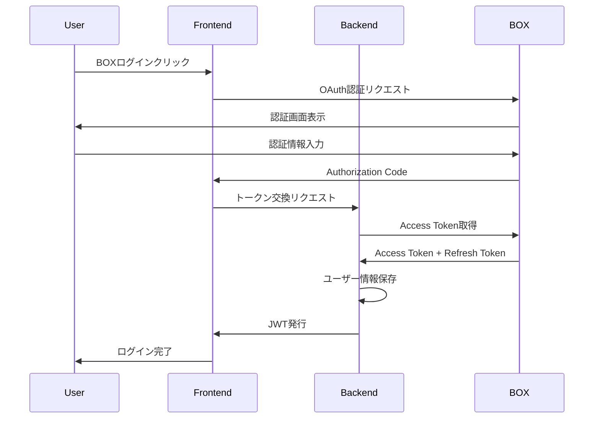
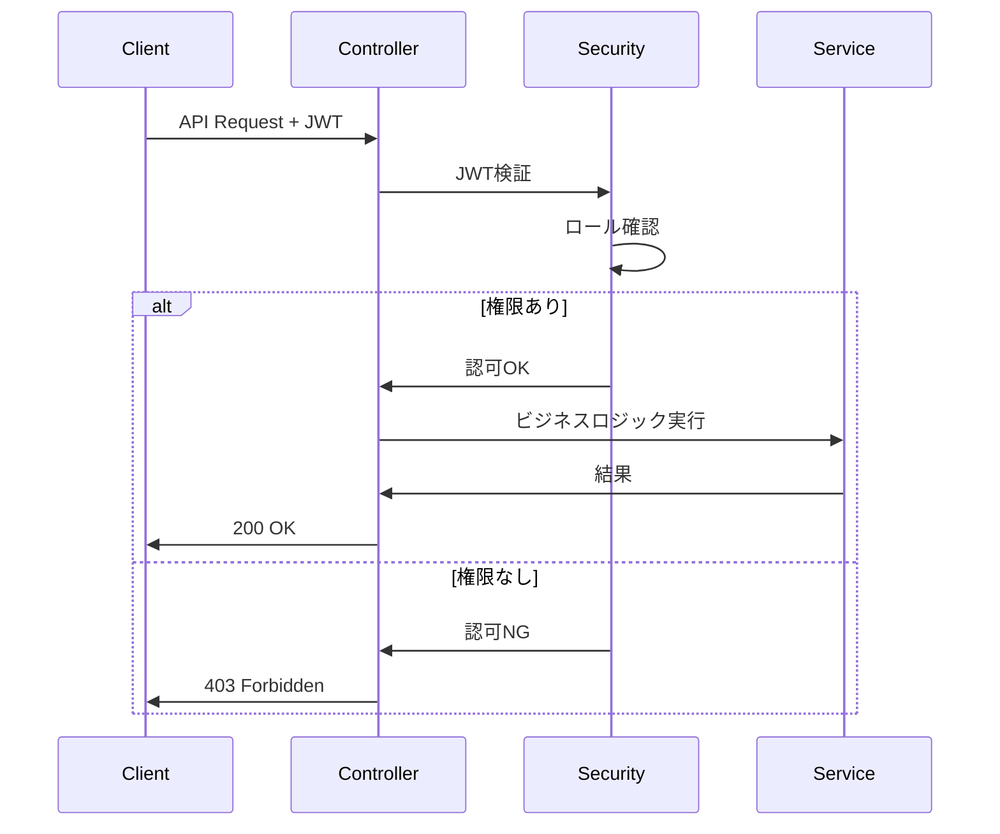

# アクター・ロール・権限マトリクス

## 1. アクター一覧

### 1.1 内部アクター

| アクター | 説明 | 主な責務 |
|---------|------|---------|
| **監査管理者 (Audit Admin)** | システム全体の管理者 | ユーザー管理、全監査セットへのアクセス |
| **一般ユーザー (General User)** | BOX組織内の通常ユーザー | 監査セット作成・管理、イベントログ閲覧 |
| **外部監査人 (External Auditor)** | 組織外の監査担当者 | 招待された監査セットの閲覧・検証 |

### 1.2 外部システム

| アクター | 説明 | 連携内容 |
|---------|------|---------|
| **BOX Platform** | クラウドストレージサービス | ファイル情報、イベントログ、認証 |
| **ScalarDB Cluster** | 分散トランザクションDB | データ永続化、トランザクション管理 |
| **ScalarDL** | 台帳サービス | ファイル改ざん検出 |

---

## 2. システムロール

### 2.1 ユーザーロール (UserRoles)

| ロール | コード値 | 説明 |
|-------|---------|------|
| 監査管理者 | `AUDIT_ADMIN` | システム全体の管理権限 |
| 一般ユーザー | `GENERAL_USER` | 標準操作権限 |
| 外部監査人 | `EXTERNAL_AUDITOR` | 制限付き閲覧権限 |

### 2.2 コラボレーターロール (CollaboratorUserRoles)

| ロール | コード値 | 監査セット内での権限 |
|-------|---------|---------------------|
| オーナー | `OWNER` | 全権限（削除、オーナー変更含む） |
| 共同オーナー | `CO_OWNER` | 編集、メンバー管理 |
| メンバー | `MEMBER` | 閲覧、アイテム追加 |
| レビュアー | `REVIEWER` | 閲覧のみ |

---

## 3. 権限マトリクス

### 3.1 システム機能 × ユーザーロール

| 機能 | Audit Admin | General User | External Auditor |
|------|:-----------:|:------------:|:----------------:|
| **ユーザー管理** |
| ユーザー作成 | ✅ | ❌ | ❌ |
| ユーザー削除 | ✅ | ❌ | ❌ |
| ロール変更 | ✅ | ❌ | ❌ |
| ユーザー一覧取得 | ✅ | ❌ | ❌ |
| **監査セット** |
| 作成 | ✅ | ✅ | ❌ |
| 削除 | ✅ | ✅ (自分の) | ❌ |
| 一覧表示 | ✅ (全て) | ✅ (関連のみ) | ✅ (招待のみ) |
| **イベントログ** |
| 閲覧 | ✅ | ✅ | ✅ (限定) |
| フィルタリング | ✅ | ✅ | ✅ |
| **ファイル操作** |
| 詳細表示 | ✅ | ✅ | ✅ |
| 改ざん検証 | ✅ | ✅ | ✅ |
| **監査グループ** |
| 作成 | ✅ | ✅ | ❌ |
| 管理 | ✅ | ✅ (自分の) | ❌ |

### 3.2 監査セット機能 × コラボレーターロール

| 機能 | Owner | Co-Owner | Member | Reviewer |
|------|:-----:|:--------:|:------:|:--------:|
| **基本操作** |
| 監査セット閲覧 | ✅ | ✅ | ✅ | ✅ |
| アイテム一覧 | ✅ | ✅ | ✅ | ✅ |
| アイテム詳細 | ✅ | ✅ | ✅ | ✅ |
| 改ざん検証 | ✅ | ✅ | ✅ | ✅ |
| **編集操作** |
| アイテム追加 | ✅ | ✅ | ✅ | ❌ |
| アイテム削除 | ✅ | ✅ | ❌ | ❌ |
| 情報編集 | ✅ | ✅ | ❌ | ❌ |
| **管理操作** |
| コラボレーター追加 | ✅ | ✅ | ❌ | ❌ |
| コラボレーター削除 | ✅ | ✅ | ❌ | ❌ |
| オーナー変更 | ✅ | ❌ | ❌ | ❌ |
| 監査セット削除 | ✅ | ❌ | ❌ | ❌ |

---

## 4. API エンドポイント × 権限

### 4.1 UserController

| エンドポイント | メソッド | 必要ロール |
|--------------|---------|-----------|
| `/api/user/create` | POST | AUDIT_ADMIN |
| `/api/user/delete/{userId}` | DELETE | AUDIT_ADMIN |
| `/api/user/update-role` | PUT | AUDIT_ADMIN |
| `/api/user/managed` | GET | AUDIT_ADMIN |
| `/api/user/external-auditors` | GET | AUDIT_ADMIN, GENERAL_USER |
| `/api/user/login` | POST | 認証不要 |
| `/api/user/token` | POST | 認証済み |

### 4.2 AuditSetController

| エンドポイント | メソッド | 必要権限 |
|--------------|---------|---------|
| `/api/audit-set/create` | POST | GENERAL_USER以上 |
| `/api/audit-set/delete/{id}` | DELETE | OWNER |
| `/api/audit-set/list` | GET | 認証済み（フィルタリング） |
| `/api/audit-set/update` | PUT | OWNER, CO_OWNER |
| `/api/audit-set/verify/{id}` | POST | 任意のコラボレーター |

### 4.3 AuditSetItemController

| エンドポイント | メソッド | 必要権限 |
|--------------|---------|---------|
| `/api/audit-set-item/add` | POST | MEMBER以上 |
| `/api/audit-set-item/view/{auditSetId}` | GET | 任意のコラボレーター |
| `/api/audit-set-item/get/{auditSetId}/{itemId}` | GET | 任意のコラボレーター |

### 4.4 FileController

| エンドポイント | メソッド | 必要権限 |
|--------------|---------|---------|
| `/api/file/details/{fileId}` | GET | 認証済み |
| `/api/file/versions/{fileId}` | GET | 認証済み |
| `/api/file/copies/{sha1}` | GET | 認証済み |
| `/api/file/tampering/{itemId}` | GET | 認証済み |

---

## 5. ロール階層と継承

**説明:**
- 矢印は権限の包含関係を示す
- 点線は割り当て可能な関係を示す

---

## 6. 認証・認可フロー

### 6.1 認証フロー

### 6.2 認可チェックフロー

---

## 7. 特殊なケース

### 7.1 監査グループによるアクセス

監査グループに所属するユーザーは、グループに割り当てられた監査セットへのアクセス権を自動的に取得します。

| 条件 | アクセス権 |
|------|----------|
| グループメンバー + グループが監査セットに割り当て | グループに付与された権限 |
| グループ特権レベル | VIEWER, EDITOR, ADMIN |

### 7.2 お気に入り機能

コラボレーターは監査セットをお気に入りとしてマークでき、一覧表示時のフィルタリングに使用されます。

---

*Generated: 2025-12-26*
*Source: scalar-event-log-fetcher-main*
