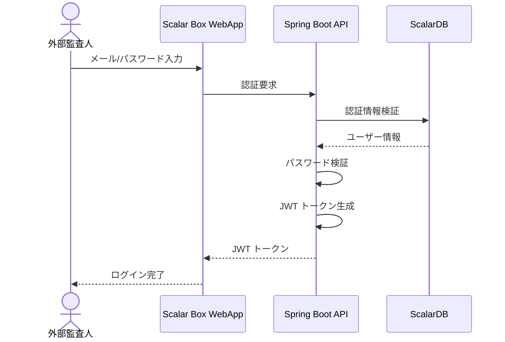
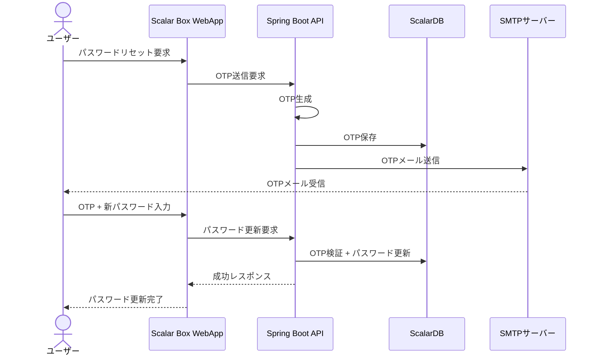
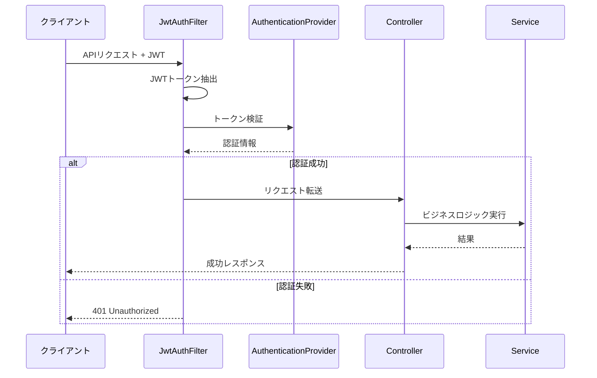

# アクター・ロール・権限

## アクター一覧

### 人間アクター

| アクター | 説明 | 主な操作 |
|---------|------|---------|
| 監査管理者（Audit Admin） | 組織の管理責任者。監査セット、ユーザー、外部監査人の管理を行う | 監査セットCRUD、ユーザーロール管理、外部監査人管理 |
| 一般ユーザー（General User） | BOXアカウントを持つ組織内ユーザー | ファイル追加、閲覧、監査アクセスログ確認 |
| 外部監査人（External Auditor） | 外部組織からの監査担当者 | 監査セット閲覧、ファイルプレビュー・ダウンロード、検証 |

### システムアクター

| システム | 説明 | 連携方法 |
|---------|------|---------|
| BOX API (Event Stream) | BOXのイベントストリームAPI | Client Credentials Grant認証、イベントログ取得 |
| BOX API (User Operations) | BOXのファイル操作API | OAuth 2.0認証、ファイル詳細取得・操作 |
| ScalarDB Cluster | 分散データベース管理システム | gRPC通信、トランザクション管理 |
| ScalarDL | 分散台帳システム | gRPC通信、改ざん検知・アセット管理 |
| SMTP Server | メールサーバー | SMTP通信、OTPメール送信 |

## ロール定義

### システムロール（UserRoles）

| ロール | 説明 | 権限セット | コード参照 |
|-------|------|-----------|-----------|
| AUDIT_ADMIN | 監査管理者 | 監査セット管理、ユーザー管理、外部監査人管理、全イベント履歴閲覧 | UserRoles.AUDIT_ADMIN |
| GENERAL_USER | 一般ユーザー | ファイル追加、閲覧、プレビュー、ダウンロード、監査アクセスログ閲覧 | UserRoles.GENERAL_USER |
| EXTERNAL_AUDITOR | 外部監査人 | 割り当て監査セット閲覧、ファイルプレビュー・ダウンロード、検証 | UserRoles.EXTERNAL_AUDITOR |

### 監査セットコラボレーターロール（CollaboratorUserRoles）

| ロール | 説明 | 権限セット | コード参照 |
|-------|------|-----------|-----------|
| OWNER | 所有者 | 監査セットの完全な管理権限、所有権移譲 | CollaboratorUserRoles.OWNER |
| CO_OWNER | 共同所有者 | 所有者に準ずる管理権限（所有権移譲は受け取りのみ） | CollaboratorUserRoles.CO_OWNER |
| MEMBER | メンバー | 監査セット内アイテムの閲覧・限定編集 | CollaboratorUserRoles.MEMBER |
| REVIEWER | レビュー担当者 | 監査セット内アイテムの読み取り専用アクセス | CollaboratorUserRoles.REVIEWER |

### 監査グループ権限（AuditGroupPrivileges）

| 権限 | 説明 | コード参照 |
|------|------|-----------|
| OWNER | グループ所有者 | AuditGroupPrivileges.OWNER |
| MEMBER | グループメンバー | AuditGroupPrivileges.MEMBER |

## 権限マトリックス

### システム操作権限

| 操作 | Audit Admin | General User | External Auditor |
|------|-------------|--------------|------------------|
| BOX統合メニュー使用 | ✓ | ✓ | ✗ |
| WebUI ログイン | ✓ | ✓ | ✓ |
| 監査セット作成 | ✓ | ✗ | ✗ |
| 監査セット更新 | ✓ | ✗ | ✗ |
| 監査セット削除 | ✓ | ✗ | ✗ |
| 監査セット所有者変更 | ✓ | ✗ | ✗ |
| ファイルを監査セットに追加 | ✓ | ✓ | ✗ |
| フォルダを監査セットに追加 | ✓ | ✓ | ✗ |
| 外部監査人作成 | ✓ | ✗ | ✗ |
| 外部監査人更新 | ✓ | ✗ | ✗ |
| 外部監査人削除 | ✓ | ✗ | ✗ |
| 監査グループ作成 | ✓ | ✗ | ✗ |
| 監査グループ更新 | ✓ | ✗ | ✗ |
| 監査グループ削除 | ✓ | ✗ | ✗ |
| ユーザーロール追加/編集 | ✓ | ✗ | ✗ |
| 外部監査人を監査セットに割り当て | ✓ | ✗ | ✗ |
| 全イベント履歴表示 | ✓ | ✗ | ✗ |
| ファイルイベント履歴表示 | ✓ | ✓ | ✓ |
| 監査アクセスログ表示 | ✗ | ✓ | ✗ |
| ファイルプレビュー | ✗ | ✓ | ✓ |
| ファイルダウンロード | ✗ | ✓ | ✓ |
| 自分/共有ファイル詳細表示 | ✓ | ✓ | - |
| 監査対象ファイル詳細表示 | - | - | ✓ |

### 監査セットコラボレーター権限

| 操作 | Owner | Co-Owner | Member | Reviewer |
|------|-------|----------|--------|----------|
| 監査セット情報閲覧 | ✓ | ✓ | ✓ | ✓ |
| 監査セット情報編集 | ✓ | ✓ | ✗ | ✗ |
| コラボレーター管理 | ✓ | ✓ | ✗ | ✗ |
| 監査セット削除 | ✓ | ✗ | ✗ | ✗ |
| 所有者変更 | ✓ | ✗ | ✗ | ✗ |
| 新所有者になる | - | ✓ | ✗ | ✗ |
| アイテム追加 | ✓ | ✓ | ✓ | ✗ |
| アイテム削除 | ✓ | ✓ | ✗ | ✗ |
| アイテム閲覧 | ✓ | ✓ | ✓ | ✓ |
| 検証実行 | ✓ | ✓ | ✓ | ✓ |

## ロール変更ルール

### ユーザーロール変更マトリックス

| 変更前ロール | 操作 | 変更後ロール |
|------------|------|------------|
| AUDIT_ADMIN | ロール変更 | GENERAL_USER |
| GENERAL_USER | ロール変更 | AUDIT_ADMIN |
| AUDIT_ADMIN | ロール追加 | AUDIT_ADMIN + GENERAL_USER |
| GENERAL_USER | ロール追加 | GENERAL_USER + AUDIT_ADMIN |
| AUDIT_ADMIN + GENERAL_USER | AUDIT_ADMIN削除 | GENERAL_USER |
| AUDIT_ADMIN + GENERAL_USER | GENERAL_USER削除 | AUDIT_ADMIN |

**注意事項:**
- ロール変更はAUDIT_ADMINのみ実行可能
- 自分自身のAUDIT_ADMINロールは削除不可（他の管理者が必要）

## 認証・認可フロー

### 組織ユーザー認証フロー

```mermaid
sequenceDiagram
    actor User as 組織ユーザー
    participant WebApp as Scalar Box WebApp
    participant API as Spring Boot API
    participant BOX as BOX OAuth 2.0
    participant DB as ScalarDB

    User->>WebApp: サインイン要求
    WebApp->>BOX: OAuth認証リダイレクト
    BOX-->>User: 認証画面表示
    User->>BOX: BOX認証情報入力
    BOX-->>WebApp: 認証コード返却
    WebApp->>API: トークン交換要求
    API->>BOX: アクセストークン取得
    BOX-->>API: アクセストークン
    API->>DB: ユーザー情報保存/更新
    API-->>WebApp: JWT トークン発行
    WebApp-->>User: ログイン完了
```

### 外部監査人認証フロー



### パスワードリセットフロー



### API認可フロー



## APIエンドポイント認可設定

### ホワイトリスト（認証不要）

| パス | 用途 |
|-----|------|
| /api/v1/auth/** | 認証関連API |
| /box/user/login | ログイン |
| /box/user/submitToken | トークン送信 |
| /box/item/getIntegratedItemDetail | 統合アイテム詳細 |
| /box/user/sendResetPasswordOTP | OTP送信 |
| /box/user/forgotPassword | パスワードリセット |
| /box/user/userSignIn/* | サインイン |
| /box/user/getNewAccessToken | トークン更新 |
| /swagger-ui/**, /v3/api-docs/** | API仕様書 |

### 認証必要エンドポイント

その他すべてのエンドポイントはJWT認証が必要です。

## セキュリティ設定

| 設定項目 | 値 | 備考 |
|---------|---|------|
| セッション管理 | STATELESS | JWTベースのステートレス認証 |
| CSRF保護 | 無効 | REST APIのためCSRF無効化 |
| CORS | 全オリジン許可 | 本番環境では適切なオリジン設定必要 |
| 認証方式 | JWT Bearer Token | Authorization ヘッダーで送信 |
