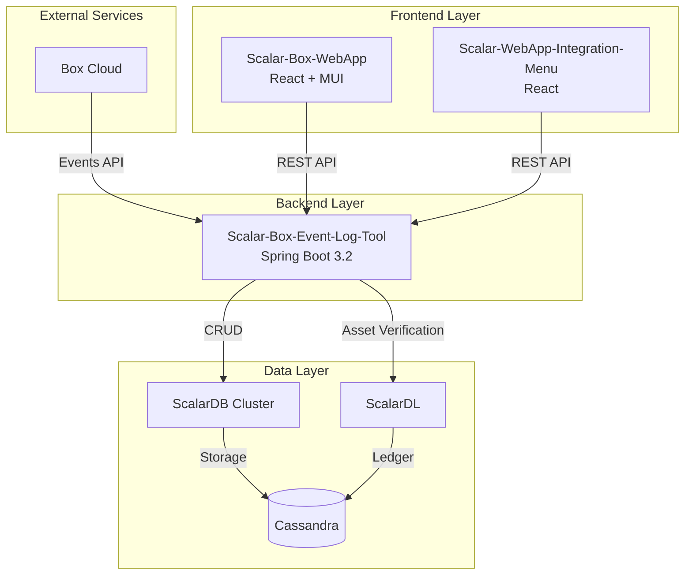
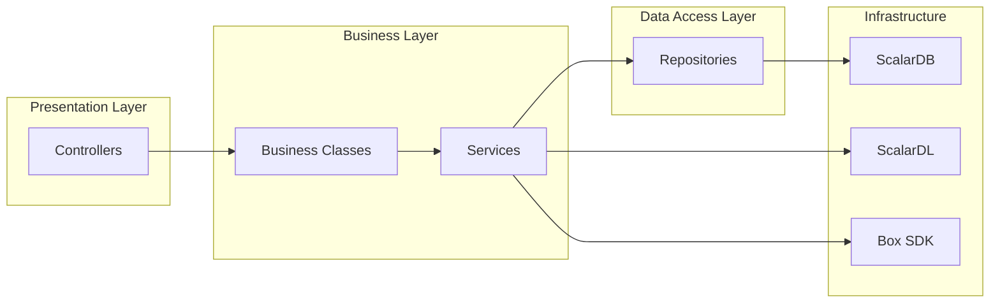
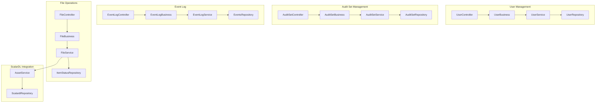
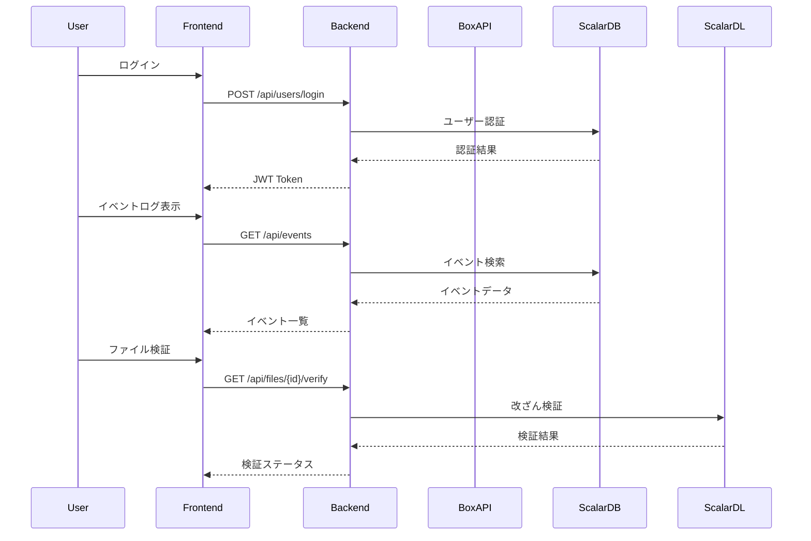
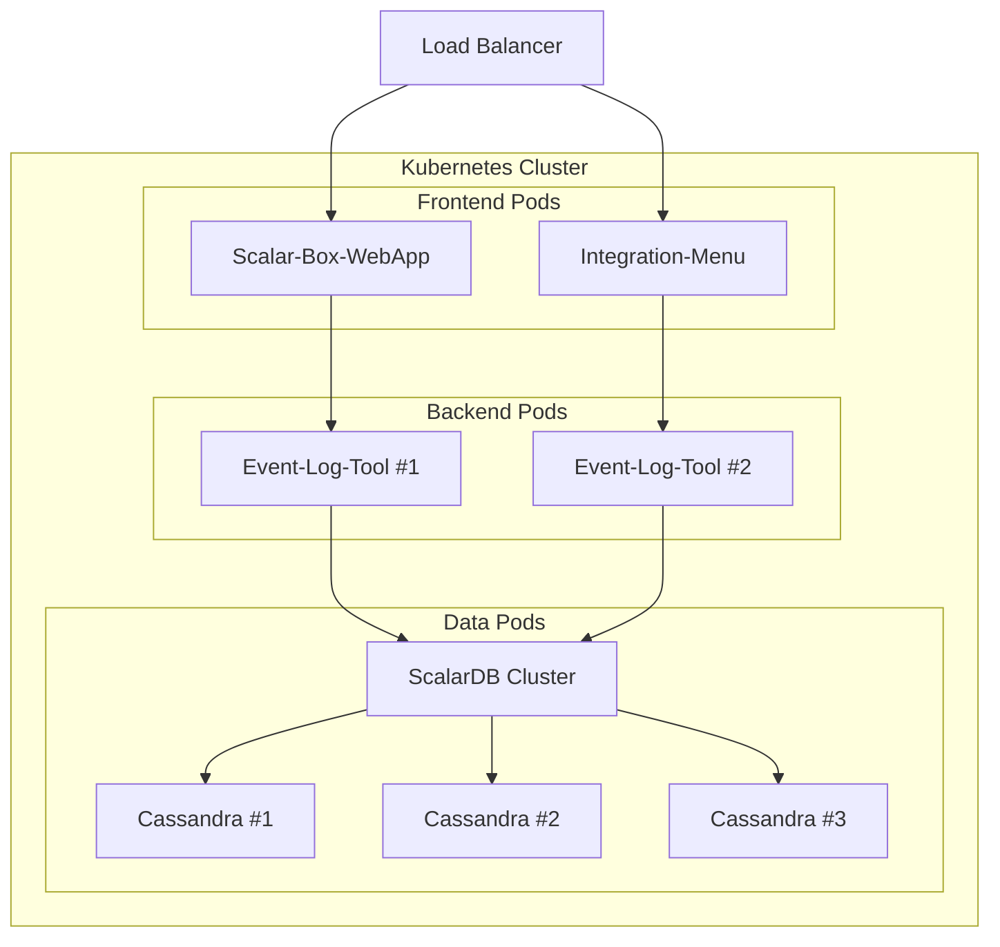
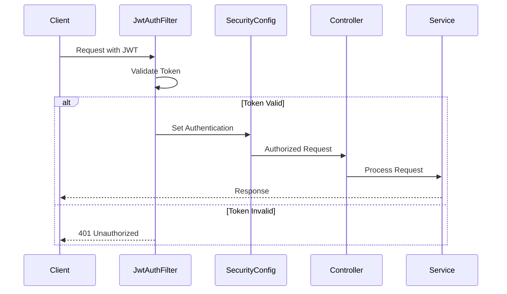

# アーキテクチャ図

## 1. システム全体構成

```mermaid
graph TB
    subgraph "External Services"
        BOX[Box Cloud]
    end

    subgraph "Frontend Layer"
        FE1[Scalar-Box-WebApp<br/>React + MUI]
        FE2[Scalar-WebApp-Integration-Menu<br/>React]
    end

    subgraph "Backend Layer"
        BE[Scalar-Box-Event-Log-Tool<br/>Spring Boot 3.2]
    end

    subgraph "Data Layer"
        SDB[ScalarDB Cluster]
        SDL[ScalarDL]
        CASS[(Cassandra)]
    end

    BOX -->|Events API| BE
    FE1 -->|REST API| BE
    FE2 -->|REST API| BE
    BE -->|CRUD| SDB
    BE -->|Asset Verification| SDL
    SDB -->|Storage| CASS
    SDL -->|Ledger| CASS
```

## 2. Backend レイヤー構成

```mermaid
graph LR
    subgraph "Presentation Layer"
        CTRL[Controllers]
    end

    subgraph "Business Layer"
        BIZ[Business Classes]
        SVC[Services]
    end

    subgraph "Data Access Layer"
        REPO[Repositories]
    end

    subgraph "Infrastructure"
        SDB[ScalarDB]
        SDL[ScalarDL]
        BOX[Box SDK]
    end

    CTRL --> BIZ
    BIZ --> SVC
    SVC --> REPO
    REPO --> SDB
    SVC --> SDL
    SVC --> BOX
```

## 3. コンポーネント関係図

```mermaid
graph TB
    subgraph "User Management"
        UC[UserController]
        UB[UserBusiness]
        US[UserService]
        UR[UserRepository]
    end

    subgraph "Audit Set Management"
        ASC[AuditSetController]
        ASB[AuditSetBusiness]
        ASS[AuditSetService]
        ASR[AuditSetRepository]
    end

    subgraph "Event Log"
        ELC[EventLogController]
        ELB[EventLogBusiness]
        ELS[EventLogService]
        ELR[EventsRepository]
    end

    subgraph "File Operations"
        FC[FileController]
        FB[FileBusiness]
        FS[FileService]
        ISR[ItemStatusRepository]
    end

    subgraph "ScalarDL Integration"
        AS[AssetService]
        SDR[ScalardlRepository]
    end

    UC --> UB --> US --> UR
    ASC --> ASB --> ASS --> ASR
    ELC --> ELB --> ELS --> ELR
    FC --> FB --> FS --> ISR
    FS --> AS --> SDR
```

## 4. データフロー図

```mermaid
sequenceDiagram
    participant User
    participant Frontend
    participant Backend
    participant BoxAPI
    participant ScalarDB
    participant ScalarDL

    User->>Frontend: ログイン
    Frontend->>Backend: POST /api/users/login
    Backend->>ScalarDB: ユーザー認証
    ScalarDB-->>Backend: 認証結果
    Backend-->>Frontend: JWT Token

    User->>Frontend: イベントログ表示
    Frontend->>Backend: GET /api/events
    Backend->>ScalarDB: イベント検索
    ScalarDB-->>Backend: イベントデータ
    Backend-->>Frontend: イベント一覧

    User->>Frontend: ファイル検証
    Frontend->>Backend: GET /api/files/{id}/verify
    Backend->>ScalarDL: 改ざん検証
    ScalarDL-->>Backend: 検証結果
    Backend-->>Frontend: 検証ステータス
```

## 5. デプロイメント構成

```mermaid
graph TB
    subgraph "Kubernetes Cluster"
        subgraph "Frontend Pods"
            FE1[Scalar-Box-WebApp]
            FE2[Integration-Menu]
        end

        subgraph "Backend Pods"
            BE1[Event-Log-Tool #1]
            BE2[Event-Log-Tool #2]
        end

        subgraph "Data Pods"
            SDB1[ScalarDB Cluster]
            CASS1[Cassandra #1]
            CASS2[Cassandra #2]
            CASS3[Cassandra #3]
        end
    end

    LB[Load Balancer] --> FE1
    LB --> FE2
    FE1 --> BE1
    FE2 --> BE2
    BE1 --> SDB1
    BE2 --> SDB1
    SDB1 --> CASS1
    SDB1 --> CASS2
    SDB1 --> CASS3
```

## 6. セキュリティフロー

```mermaid
sequenceDiagram
    participant Client
    participant JwtAuthFilter
    participant SecurityConfig
    participant Controller
    participant Service

    Client->>JwtAuthFilter: Request with JWT
    JwtAuthFilter->>JwtAuthFilter: Validate Token
    alt Token Valid
        JwtAuthFilter->>SecurityConfig: Set Authentication
        SecurityConfig->>Controller: Authorized Request
        Controller->>Service: Process Request
        Service-->>Client: Response
    else Token Invalid
        JwtAuthFilter-->>Client: 401 Unauthorized
    end
```
