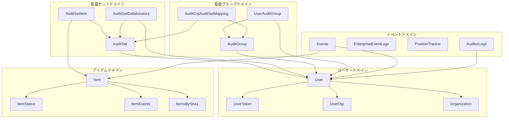

# ドメイン-コード対応表

## 1. ドメイン概要

### 1.1 識別されたドメイン

| ドメイン | 説明 | ビジネス価値 |
|---------|------|-------------|
| **ユーザードメイン** | ユーザー認証・認可、組織管理 | システムアクセス制御の基盤 |
| **監査セットドメイン** | 監査対象のグループ化と管理 | コア機能 - 監査対象の整理 |
| **監査グループドメイン** | 監査人のグループ化 | アクセス管理の効率化 |
| **アイテムドメイン** | ファイル・フォルダの管理 | BOX連携の中核 |
| **イベントドメイン** | イベントログの収集・表示 | 監査証跡の提供 |
| **改ざん検証ドメイン** | ScalarDLによる検証 | データ完全性の保証 |

---

## 2. パッケージ構造

### 2.1 レイヤードアーキテクチャ

```
com.scalar.events_log_tool.application/
├── controller/     # プレゼンテーション層（REST API）
├── business/       # ユースケース層（ビジネスロジック）
├── service/        # アプリケーションサービス層
├── repository/     # データアクセス層
├── model/          # ドメインモデル
├── dto/            # データ転送オブジェクト
├── responsedto/    # レスポンス用DTO
├── constant/       # 定数・列挙型
├── config/         # 設定クラス
├── security/       # セキュリティ関連
├── exception/      # 例外クラス
└── utility/        # ユーティリティ
```

---

## 3. ドメイン別コード対応

### 3.1 ユーザードメイン

#### エンティティ

| クラス | ファイル | フィールド数 | 説明 |
|-------|---------|-------------|------|
| `User` | model/User.java | 14 | ユーザーエンティティ |
| `UserToken` | model/UserToken.java | - | トークン管理 |
| `UserOtp` | model/UserOtp.java | - | OTP管理 |
| `Organization` | model/Organization.java | - | 組織エンティティ |
| `RoleUser` | model/RoleUser.java | - | ロール関連 |

#### Userモデル詳細

```java
public class User {
    private String userEmail;      // メールアドレス（識別子）
    private Long id;               // BOX User ID
    private String name;           // 表示名
    private String password;       // パスワード（外部監査人用）
    private String roleJson;       // ロールJSON
    private String orgId;          // 組織ID
    private String organizationName;
    private String imageUrl;
    private Boolean isDeleted;
    private Boolean isBoxAdmin;    // BOX管理者フラグ
    private String refreshToken;   // BOXリフレッシュトークン
    private Long refreshTokenExpiry;
    private String languageCode;
}
```

#### コンポーネント対応

| コンポーネント | クラス | 主な責務 |
|--------------|-------|---------|
| Controller | `UserController` | REST API（9エンドポイント） |
| Business | `UserBusiness` | ユースケース実装 |
| Service | `UserService` (1116行) | 認証、BOX連携、CRUD |
| Repository | `UserRepository`, `UserTokenRepository`, `UserOptRepository`, `RoleUserRepository`, `OrganizationRepository` | データアクセス |

#### API エンドポイント

| メソッド | パス | 機能 |
|---------|------|------|
| POST | `/api/user/login` | ログイン |
| POST | `/api/user/token` | トークン発行 |
| POST | `/api/user/create` | ユーザー作成 |
| DELETE | `/api/user/delete/{userId}` | ユーザー削除 |
| PUT | `/api/user/update-role` | ロール更新 |
| GET | `/api/user/managed` | 管理対象ユーザー一覧 |
| GET | `/api/user/external-auditors` | 外部監査人一覧 |

---

### 3.2 監査セットドメイン

#### エンティティ

| クラス | ファイル | フィールド数 | 説明 |
|-------|---------|-------------|------|
| `AuditSet` | model/AuditSet.java | 10 | 監査セットエンティティ |
| `AuditSetItem` | model/AuditSetItem.java | 8 | 監査セットアイテム |
| `AuditSetCollaborators` | model/AuditSetCollaborators.java | - | コラボレーター管理 |

#### AuditSetモデル詳細

```java
public class AuditSet {
    private String auditSetId;     // UUID
    private String auditSetName;   // 監査セット名
    private String description;    // 説明
    private Long ownerId;          // オーナーのBOX ID
    private String ownerName;      // オーナー名
    private String ownerEmail;     // オーナーメール
    private String aclJson;        // ACL設定（JSON）
    private Boolean isDeleted;     // 削除フラグ
    private Long createdAt;        // 作成日時
    private String auditGroupListJson; // 関連グループリスト
}
```

#### AuditSetItemモデル詳細

```java
public class AuditSetItem {
    private String auditSetId;     // 監査セットID
    private Long itemId;           // BOXアイテムID
    private String itemName;       // アイテム名
    private String itemType;       // file/folder
    private String accessList;     // アクセスリスト
    private String listJson;       // 詳細情報JSON
    private Long createdAt;        // 追加日時
    private Long assignedByUserId; // 追加者ID
}
```

#### コンポーネント対応

| コンポーネント | クラス | 主な責務 |
|--------------|-------|---------|
| Controller | `AuditSetController`, `AuditSetItemController`, `AuditSetCollaboratorController` | REST API |
| Business | `AuditSetBusiness`, `AuditSetItemBusiness`, `AuditSetCollaboratorBusiness` | ユースケース |
| Service | `AuditSetService` (845行), `AuditSetItemService` (899行), `AuditSetCollaboratorService` | ビジネスロジック |
| Repository | `AuditSetRepository`, `AuditSetItemRepository`, `AuditSetCollaboratorsRepository` | データアクセス |

---

### 3.3 監査グループドメイン

#### エンティティ

| クラス | ファイル | フィールド数 | 説明 |
|-------|---------|-------------|------|
| `AuditGroup` | model/AuditGroup.java | 10 | 監査グループ |
| `UserAuditGroup` | model/UserAuditGroup.java | - | ユーザー-グループ関連 |
| `AuditGrpAuditSetMapping` | model/AuditGrpAuditSetMapping.java | - | グループ-セット関連 |

#### AuditGroupモデル詳細

```java
public class AuditGroup {
    private String userEmail;      // 作成者メール
    private String auditGroupId;   // UUID
    private String auditGroupName; // グループ名
    private String description;    // 説明
    private Long ownerId;          // オーナーID
    private String ownerName;      // オーナー名
    private String memberListJson; // メンバーリストJSON
    private Long createdAt;        // 作成日時
    private Boolean isDeleted;     // 削除フラグ
}
```

#### コンポーネント対応

| コンポーネント | クラス | 主な責務 |
|--------------|-------|---------|
| Controller | `AuditGroupController` | REST API |
| Business | `AuditGroupBusiness` | ユースケース |
| Service | `AuditGroupService` | グループ管理 |
| Repository | `AuditGroupRepository`, `UserAuditGroupRepository`, `AuditGrpAuditSetMappingRepository` | データアクセス |

---

### 3.4 アイテムドメイン

#### エンティティ

| クラス | ファイル | フィールド数 | 説明 |
|-------|---------|-------------|------|
| `Item` | model/Item.java | 10 | ファイル/フォルダ基本情報 |
| `ItemStatus` | model/ItemStatus.java | - | 監視・検証ステータス |
| `ItemEvents` | model/ItemEvents.java | - | アイテム関連イベント |
| `ItemsBySha1` | model/ItemsBySha1.java | - | SHA1ハッシュ別アイテム |

#### Itemモデル詳細

```java
public class Item {
    private String itemId;         // BOXアイテムID
    private String itemType;       // file/folder
    private String itemHash;       // SHA1ハッシュ
    private Boolean isDeleted;     // 削除フラグ
    private Long size;             // ファイルサイズ
    private String auditedBy;      // 監査者
    private Long auditedAt;        // 監査日時
    private Integer auditStatus;   // 監査ステータス
    private String storageProvider; // ストレージプロバイダ
}
```

#### コンポーネント対応

| コンポーネント | クラス | 主な責務 |
|--------------|-------|---------|
| Controller | `FileController`, `FolderController`, `ItemController` | REST API |
| Business | `FileBusiness`, `FolderBusiness` | ユースケース |
| Service | `FileService`, `FolderService`, `CommonService`, `AssetService` | BOX連携、詳細取得 |
| Repository | `ItemRepository`, `ItemStatusRepository`, `ItemEventsRepository`, `ItemsBySha1Repository` | データアクセス |

---

### 3.5 イベントドメイン

#### エンティティ

| クラス | ファイル | フィールド数 | 説明 |
|-------|---------|-------------|------|
| `Events` | model/Events.java | 17 | イベントログ |
| `EnterpriseEventLogs` | model/EnterpriseEventLogs.java | - | エンタープライズイベント |
| `PositionTracker` | model/PositionTracker.java | - | 取得位置トラッカー |
| `AuditorLogs` | model/AuditorLogs.java | - | 監査人アクセスログ |
| `SystemEventDates` | model/SystemEventDates.java | - | システムイベント日付 |

#### Eventsモデル詳細

```java
public class Events {
    private String yyyyMMdd;       // 日付パーティション
    private String eventId;        // イベントID
    private String timestamp;      // タイムスタンプ
    private Long userId;           // ユーザーID
    private String userName;       // ユーザー名
    private String userEmail;      // ユーザーメール
    private String assetId;        // アセットID
    private Integer assetAge;      // アセットエイジ
    private Long itemId;           // アイテムID
    private Long itemVersionId;    // バージョンID
    private String sha1Hash;       // SHA1ハッシュ
    private String eventType;      // イベントタイプ
    private Long createdAt;        // 作成日時
    private String eventOccuredOn; // 発生日
    private Long parentFolderId;   // 親フォルダID
    private String sourceJson;     // ソースJSON
}
```

#### コンポーネント対応

| コンポーネント | クラス | 主な責務 |
|--------------|-------|---------|
| Controller | `EventLogController` | REST API |
| Business | `EventLogBusiness` | ユースケース |
| Service | `EventLogService` | イベント取得・フィルタリング |
| Repository | `EventsRepository`, `EnterpriseEventLogsRepository`, `PositionTrackerRepository`, `AuditorLogsRepository`, `SystemEventDatesRepository` | データアクセス |

---

### 3.6 改ざん検証ドメイン

#### コンポーネント対応

| コンポーネント | クラス | 主な責務 |
|--------------|-------|---------|
| Service | `AssetService` | ScalarDL連携 |
| Repository | `ScalardlRepository` | ScalarDL操作 |

#### 外部連携

- **ScalarDL Auditor**: 改ざん検証
- **ScalarDL Ledger**: 台帳管理

---

## 4. 外部システム連携

### 4.1 BOX Platform連携

| コンポーネント | 役割 |
|--------------|------|
| `BoxUtility` | API接続管理、SDK初期化 |
| `FileService` | ファイル詳細・バージョン取得 |
| `FolderService` | フォルダ詳細・アイテム一覧 |
| `EventLogService` | エンタープライズイベント取得 |
| `UserService` | OAuth認証、ユーザー情報取得 |

### 4.2 ScalarDB Cluster連携

| テーブル | 対応リポジトリ |
|---------|--------------|
| `user` | `UserRepository` |
| `user_token` | `UserTokenRepository` |
| `user_otp` | `UserOptRepository` |
| `organization` | `OrganizationRepository` |
| `audit_set` | `AuditSetRepository` |
| `audit_set_item` | `AuditSetItemRepository` |
| `audit_set_collaborators` | `AuditSetCollaboratorsRepository` |
| `audit_group` | `AuditGroupRepository` |
| `user_audit_group` | `UserAuditGroupRepository` |
| `audit_grp_audit_set_mapping` | `AuditGrpAuditSetMappingRepository` |
| `item` | `ItemRepository` |
| `item_status` | `ItemStatusRepository` |
| `item_events` | `ItemEventsRepository` |
| `items_by_sha1` | `ItemsBySha1Repository` |
| `events` | `EventsRepository` |
| `enterprise_event_logs` | `EnterpriseEventLogsRepository` |
| `position_tracker` | `PositionTrackerRepository` |
| `auditor_logs` | `AuditorLogsRepository` |
| `system_event_dates` | `SystemEventDatesRepository` |

---

## 5. ドメイン間の依存関係



---

## 6. コード行数サマリー

### 6.1 サービス層

| サービス | 行数 | ドメイン |
|---------|-----|---------|
| `UserService` | 1116 | ユーザー |
| `AuditSetItemService` | 899 | 監査セット |
| `AuditSetService` | 845 | 監査セット |
| `FileService` | 500+ | アイテム |
| `EventLogService` | 400+ | イベント |
| `AuditGroupService` | 300+ | 監査グループ |
| `FolderService` | 300+ | アイテム |
| `AuditSetCollaboratorService` | 200+ | 監査セット |
| `CommonService` | 150+ | 共通 |
| `AssetService` | 100+ | 改ざん検証 |

### 6.2 コントローラ層

| コントローラ | エンドポイント数 | ドメイン |
|------------|----------------|---------|
| `UserController` | 9 | ユーザー |
| `AuditSetController` | 6 | 監査セット |
| `AuditSetItemController` | 5 | 監査セット |
| `EventLogController` | 4 | イベント |
| `FileController` | 4 | アイテム |
| `AuditGroupController` | 4 | 監査グループ |
| `FolderController` | 3 | アイテム |
| `AuditSetCollaboratorController` | 3 | 監査セット |
| `ItemController` | 2 | アイテム |

---

## 7. 技術的負債と改善機会

### 7.1 識別された課題

| 課題 | ドメイン | 影響 | 優先度 |
|------|---------|------|-------|
| UserService肥大化 | ユーザー | 保守性低下 | 高 |
| JSON文字列でのデータ保存 | 全般 | クエリ性能低下 | 中 |
| BOX API依存の分離不足 | アイテム | テスタビリティ低下 | 中 |
| ドメインモデル貧血症 | 全般 | ビジネスロジック分散 | 中 |

### 7.2 リファクタリング候補

1. **UserServiceの分割**
   - `AuthenticationService` - 認証処理
   - `BoxUserService` - BOX連携
   - `UserManagementService` - ユーザー管理

2. **JSONフィールドの正規化**
   - `aclJson` → 別テーブル化
   - `memberListJson` → 関連テーブル化
   - `roleJson` → Enum化

3. **BOX API連携の抽象化**
   - `BoxApiClient`インターフェース導入
   - モック可能な設計へ

---

*Generated: 2025-12-26*
*Source: scalar-event-log-fetcher-main*
