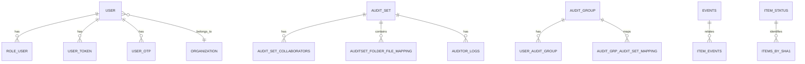
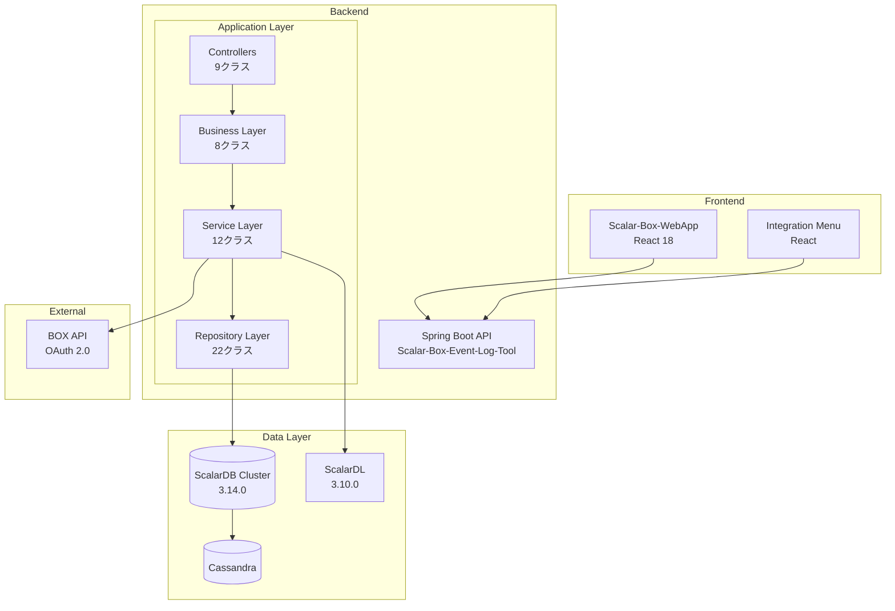
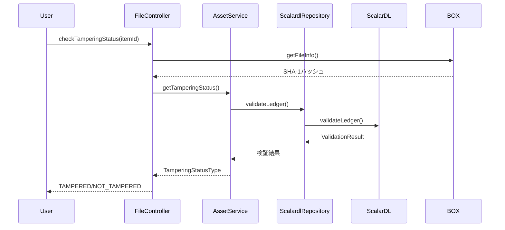

# Scalar Auditor for BOX - システム分析レポート

**分析日**: 2025-12-26
**対象**: scalar-event-log-fetcher-main

---

## 1. プロジェクト概要

### 1.1 目的
BOXアプリケーションと連携し、ユーザーイベントログをBOX外部に保存・管理するシステム。ファイルの改ざん検出機能を備え、外部監査人が重要ファイルを監査可能にする。

### 1.2 主要機能
| # | 機能 | 説明 |
|---|------|------|
| 1 | イベントログ保存・表示 | 日時/タイプ/ユーザーでフィルタリング可能 |
| 2 | ファイル詳細表示 | メタデータ、バージョン、SHA1ハッシュ重複確認 |
| 3 | ファイルバージョン管理 | 全バージョンの履歴表示 |
| 4 | 組織ユーザーロール管理 | Audit Admin / General User |
| 5 | 外部監査人管理 | 作成・更新・削除 |
| 6 | Audit Set管理 | ファイル/フォルダのグループ化 |
| 7 | Audit Group管理 | 監査人のグループ化 |
| 8 | ファイル改ざん検出 | ScalarDL連携による検証 |
| 9 | 外部監査人操作ログ | アクセスログの閲覧 |

---

## 2. 技術スタック

### 2.1 Backend
| 項目 | 技術 |
|------|------|
| フレームワーク | Spring Boot 3.2.1 |
| Java Version | 17 |
| ビルドツール | Gradle |
| 認証 | Spring Security + JWT |
| API文書 | OpenAPI (springdoc) |

### 2.2 Frontend
| 項目 | 技術 |
|------|------|
| フレームワーク | React 18 |
| ビルドツール | Vite 5 |
| 状態管理 | Redux Toolkit + Redux Persist |
| UIライブラリ | MUI (Material-UI) v5 |
| スタイリング | Tailwind CSS |
| 国際化 | i18next |
| Box SDK | box-ui-elements v19 |

### 2.3 Database / Infrastructure
| 項目 | 技術 |
|------|------|
| Database | Cassandra |
| Transaction管理 | ScalarDB Cluster 3.14.0 |
| 改ざん検出 | ScalarDL 3.10.0 |
| コンテナ | Kubernetes |

---

## 3. サブプロジェクト構成

```
scalar-event-log-fetcher-main/
├── Scalar-Box-Event-Log-Tool/       # Spring Boot Backend
│   ├── src/main/java/               # Javaソースコード
│   ├── src/main/resources/          # 設定ファイル
│   ├── schema-loader/               # ScalarDBスキーマ
│   └── build.gradle                 # ビルド設定
├── Scalar-Box-WebApp/               # React Frontend（メイン）
│   ├── src/pages/                   # ページコンポーネント
│   ├── src/redux/                   # 状態管理
│   └── src/api/                     # API呼び出し
├── Scalar-WebApp-Integration-Menu/  # React Frontend（統合メニュー）
├── K8s-scalardb-cluster/            # Kubernetes設定
│   └── scalardb-cluster-custom-values.yaml
├── ScalarDL-Event-Log-Fetcher-Setup/
├── Scalar-Box-Event-Log-Tool-Setup/
└── Documentation/                   # ドキュメント
```

---

## 4. Backendアーキテクチャ

### 4.1 パッケージ構成
```
com.scalar.events_log_tool.application/
├── controller/     # REST API エンドポイント (9クラス)
├── service/        # ビジネスロジック (10クラス)
├── business/       # Controller-Service間レイヤー (8クラス)
├── repository/     # データアクセス層 (19クラス)
├── model/          # エンティティ (17クラス)
├── dto/            # Data Transfer Objects (47クラス)
├── responsedto/    # レスポンス用DTO (17クラス)
├── config/         # 設定クラス
├── security/       # JWT認証・Spring Security
├── constant/       # 定数・Enum (11クラス)
├── exception/      # カスタム例外
└── utility/        # ユーティリティ (4クラス)
```

### 4.2 主要コントローラー
| コントローラー | 責務 |
|--------------|------|
| UserController | ユーザー認証・管理 |
| AuditSetController | 監査セットCRUD |
| AuditSetItemController | 監査セットアイテム管理 |
| AuditSetCollaboratorController | コラボレーター管理 |
| AuditGroupController | 監査グループ管理 |
| EventLogController | イベントログ取得 |
| FileController | ファイル操作・改ざん検証 |
| FolderController | フォルダ操作 |
| ItemController | アイテム共通操作 |

### 4.3 主要サービス
| サービス | 責務 | 主要メソッド |
|---------|------|-------------|
| UserService | ユーザー認証・管理 | login, createUser, deleteUser |
| AuditSetService | 監査セット管理 | createAuditSet, deleteAuditSet, updateCollaborators |
| AuditGroupService | グループ管理 | - |
| EventLogService | ログ検索 | getEventsByDateRange, getEventsByDateRangeAndUser |
| FileService | ファイル詳細 | getFileDetails, getFileCopies, getFileVersions |
| AssetService | ScalarDL連携 | addAsset, getTamperingStatus |

---

## 5. Frontendアーキテクチャ

### 5.1 ページ構成
| ディレクトリ | 機能 |
|------------|------|
| auth/ | 認証（ログイン、パスワードリセット） |
| AuditSet/ | 監査セット管理 |
| AuditorsAndGroups/ | 監査人・グループ管理 |
| ViewAllEventHistory/ | イベント履歴表示 |
| ViewItemsUnderAudit/ | 監査対象アイテム表示 |
| ExternalAuditorPage/ | 外部監査人用ページ |
| UserRole/ | ユーザーロール管理 |
| ApplicationSetting/ | アプリケーション設定 |

### 5.2 状態管理
- Redux Toolkit使用
- Redux Persistによる永続化
- redux-loggerによるデバッグ

---

## 6. データベース設計

### 6.1 テーブル一覧（15テーブル）

#### イベント関連
| テーブル | パーティションキー | 説明 |
|---------|-----------------|------|
| events | yyyy_mm_dd | BOXイベントログ（日付パーティション） |
| item_events | item_id | アイテム別イベント |
| auditor_logs | audit_set_id | 外部監査人操作ログ |

#### ユーザー関連
| テーブル | パーティションキー | 説明 |
|---------|-----------------|------|
| user | user_email | ユーザーマスタ |
| role_user | role_name | ロール別ユーザー |
| user_token | user_email | JWT/OAuth2トークン |
| user_otp | user_email | ワンタイムパスワード |
| organization | org_id | 組織マスタ |

#### 監査関連
| テーブル | パーティションキー | 説明 |
|---------|-----------------|------|
| audit_set | audit_set_id | 監査セット |
| audit_set_collaborators | user_email | 監査セット協力者 |
| audit_group | audit_group_id | 監査グループ |
| user_audit_group | user_email | ユーザー別グループ |
| audit_grp_audit_set_mapping | audit_group_id | グループ-セット関連 |
| auditset_folder_file_mapping | audit_set_id | セット-ファイル関連 |

#### ファイル関連
| テーブル | パーティションキー | 説明 |
|---------|-----------------|------|
| item_status | item_id | 改ざん検証ステータス |
| items_by_sha1 | sha1_hash | SHA1ハッシュ別ファイル |
| position_tracker | user_id | イベント取得位置 |

### 6.2 ER図（概念）



---

## 7. 外部システム連携

### 7.1 Box API連携
- **認証方式**: OAuth 2.0（Client Credentials Grant）
- **SDK**: Box Java SDK 4.4.0
- **イベント取得**: Enterprise Event API
- **ファイル操作**: Files/Folders API

### 7.2 ScalarDL連携
- **目的**: ファイル改ざん検出
- **契約**: クライアント証明書ベース
- **機能**: Asset登録、改ざん検証

---

## 8. セキュリティ

### 8.1 認証・認可
- JWT (JSON Web Token) ベース認証
- Spring Security統合
- ロールベースアクセス制御（RBAC）

### 8.2 ユーザーロール
| ロール | 権限 |
|-------|------|
| Audit Admin | 全機能へのアクセス |
| General User | 閲覧・限定的な操作 |
| External Auditor | 割り当てられたAudit Setのみ |

---

## 9. 国際化対応

- 日本語 (`messages_ja.properties`)
- 英語 (`messages.properties`)
- Frontend: i18next使用

---

## 10. まとめ

### 10.1 強み
- ScalarDB/ScalarDLによる信頼性の高いデータ管理
- Box連携による既存ワークフローとの統合
- ファイル改ざん検出機能
- 多言語対応

### 10.2 技術的特徴
- モノレポ構成（Backend + 複数Frontend）
- マイクロサービス対応基盤（ScalarDB Cluster）
- Kubernetes対応

---

## 11. サービス層詳細分析

### 11.1 サービスクラス一覧（コード行数順）

| サービス | 行数 | 責務 | 複雑度 |
|---------|-----|------|-------|
| `UserService` | 1116 | ユーザー認証・管理、BOX連携、トークン管理 | 高 |
| `AuditSetItemService` | 899 | 監査セットアイテム管理、検証、監視ステータス管理 | 高 |
| `AuditSetService` | 845 | 監査セットCRUD、コラボレーター管理 | 中 |
| `FileService` | 554 | ファイル詳細取得、バージョン管理、BOX連携 | 中 |
| `AuditGroupService` | 438 | 監査グループCRUD、メンバー管理 | 中 |
| `AuditSetCollaboratorService` | 286 | コラボレーター権限管理、オーナー変更 | 低 |
| `EventLogService` | 220 | イベントログ検索、フィルタリング | 低 |
| `AssetService` | 197 | ScalarDL資産管理、改ざん検証 | 中 |
| `FolderService` | 113 | BOXフォルダ操作 | 低 |
| `CommonService` | 31 | 共通ユーティリティ（Owner/CoOwner判定） | 低 |

### 11.2 リポジトリ層詳細（22クラス）

#### コアリポジトリ
| リポジトリ | テーブル | 主要操作 |
|-----------|---------|---------|
| `UserRepository` | user | create, getByUserEmail, getUserList, createAndDelete |
| `AuditSetRepository` | audit_set | create, get, getAuditSetList, getMyAuditSetList |
| `EventsRepository` | events | create, getAllEvents, getEventsByDate |
| `AuditGroupRepository` | audit_group | create, getgroupList, getAuditGroup, update |

#### 関連テーブルリポジトリ
| リポジトリ | テーブル | 関連 |
|-----------|---------|------|
| `AuditSetCollaboratorsRepository` | audit_set_collaborators | AuditSet-User |
| `AuditSetItemRepository` | audit_set_item | AuditSet-Item |
| `AuditGrpAuditSetMappingRepository` | audit_grp_audit_set_mapping | AuditGroup-AuditSet |
| `UserAuditGroupRepository` | user_audit_group | User-AuditGroup |

#### ファイル/イベント関連
| リポジトリ | テーブル | 用途 |
|-----------|---------|------|
| `ItemEventsRepository` | item_events | アイテム別イベント |
| `ItemStatusRepository` | item_status | 改ざん検証ステータス |
| `ItemsBySha1Repository` | items_by_sha1 | ハッシュ重複検出 |
| `AuditorLogsRepository` | auditor_logs | 外部監査人ログ |
| `ScalardlRepository` | (ScalarDL) | 台帳操作 |

---

## 12. アーキテクチャ図

### 12.1 システム全体構成



### 12.2 改ざん検出フロー



---

## 13. 課題と技術的負債

### 13.1 アーキテクチャ上の課題

| 課題 | 影響 | 優先度 |
|-----|------|-------|
| 巨大なServiceクラス（UserService: 1116行） | 保守性・可読性低下 | 高 |
| Controller-Business-Service層の責務境界曖昧 | 重複コード、テスト困難 | 中 |
| トランザクション管理の分散 | データ整合性リスク | 高 |
| BOX API依存の強結合 | テスト困難、変更影響大 | 中 |
| DTO/ResponseDTOの増大（64クラス） | メンテナンス負荷 | 低 |

### 13.2 推奨される改善

1. **サービス分割**
   - UserService → UserAuthService, UserProfileService, BoxIntegrationService
   - AuditSetService → AuditSetCoreService, AuditSetCollaboratorService

2. **ドメイン境界の明確化**
   - DDDに基づくBounded Context分割
   - Audit, User, Event, Integrationドメインの分離

3. **外部連携の抽象化**
   - BOX API用アダプタ層（Port/Adapter）導入
   - Mock対応によるテスタビリティ向上

4. **イベント駆動化の検討**
   - 非同期処理の導入
   - イベントソーシング検討（ScalarDL活用）

---

*Generated: 2025-12-26*
*Analysis Tool: Refactoring Agent v1.0*
*Source: scalar-event-log-fetcher-main*
