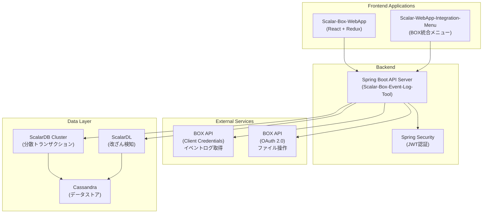

# 現行システム概要

## プロジェクト概要

**Scalar Auditor for BOX** は、BOXアプリケーションと統合された監査ツールです。BOXで管理されるファイルのユーザーイベントログを外部に保存し、外部監査人がファイルの完全性を検証できるようにします。ScalarDBでデータを管理し、ScalarDLでファイル改ざんを検出します。

## 技術スタック

### バックエンド

| 技術 | バージョン | 用途 |
|-----|----------|------|
| Java | 17 | メイン言語 |
| Spring Boot | 3.2.1 | Webフレームワーク |
| Spring Security | 3.2.x | 認証・認可 |
| JWT (jjwt) | 0.11.5 | トークンベース認証 |
| ScalarDB Cluster | 3.14.0 | 分散データベース管理 |
| ScalarDL | 3.10.0 | 改ざん検知・台帳管理 |
| Box Java SDK | 4.4.0 | BOX API連携 |
| Lombok | - | コード生成 |
| SpringDoc OpenAPI | 2.3.0 | API仕様書生成 |

### フロントエンド（WebApp）

| 技術 | バージョン | 用途 |
|-----|----------|------|
| React | 18.2.0 | UIフレームワーク |
| Vite | 5.0.8 | ビルドツール |
| Redux / Redux Toolkit | 2.1.0 | 状態管理 |
| Material UI | 5.15.x | UIコンポーネント |
| React Router | 6.22.0 | ルーティング |
| i18next | 23.11.2 | 国際化（日英対応） |
| Axios | 1.6.7 | HTTP通信 |
| Box UI Elements | 19.0.0 | BOX UIコンポーネント |
| Tailwind CSS | 3.4.1 | CSSフレームワーク |

### フロントエンド（Integration Menu）

| 技術 | バージョン | 用途 |
|-----|----------|------|
| React | 18.x | UIフレームワーク |
| Vite | - | ビルドツール |
| i18next | - | 国際化 |

### データベース

| 技術 | バージョン | 用途 |
|-----|----------|------|
| Cassandra | - | NoSQLデータストア |
| ScalarDB | 3.14.0 | 分散トランザクション管理 |
| ScalarDL | 3.10.0 | 改ざん検知用台帳 |

### インフラ

| 技術 | 用途 |
|-----|------|
| Kubernetes | コンテナオーケストレーション |
| Helm | ScalarDB Clusterデプロイ |

## アーキテクチャ概要

## モジュール構成

### バックエンド（Java）

| パッケージ | 責務 | ファイル数 |
|----------|------|----------|
| controller | REST APIエンドポイント | 9 |
| service | ビジネスロジック | 10 |
| repository | データアクセス（ScalarDB） | 19 |
| model | ドメインエンティティ | 20 |
| dto | データ転送オブジェクト | 47 |
| responsedto | APIレスポンス | 15 |
| constant | 定数・Enum定義 | 11 |
| security | 認証・認可 | 5 |
| business | ビジネスヘルパー | 8 |
| utility | ユーティリティ | 4 |
| exception | 例外処理 | 3 |
| config | アプリケーション設定 | 1 |

### フロントエンド（WebApp）

| ディレクトリ | 責務 | 主要ファイル |
|------------|------|------------|
| pages/auth | 認証画面 | LoginandSignup, ForgotPassword, OtpComponent |
| pages/AuditSet | 監査セット管理 | AuditSet, AuditDailogBox, ItemViewFileandFolders |
| pages/AuditorsAndGroups | 外部監査人・グループ管理 | AuditorsAndGroups, AddExternalAuditor, AddAuditGroup |
| pages/ExternalAuditorPage | 外部監査人向け画面 | ExternalAuditor, ExternalAuditorCard, Validating |
| pages/UserRole | ユーザーロール管理 | UserRole |
| pages/ViewAllEventHistory | イベント履歴表示 | ViewAllEventHistory, TableList |
| pages/ViewItemsUnderAudit | 監査対象アイテム表示 | ViewItemsUnderAudit |
| redux/reducerSlice | 状態管理 | authSlice, tokenSlice, folderAndFileSlice |
| hooks | カスタムフック | useAxiosPrivate, useRefreshToken |
| i18n | 国際化 | config, locales/en, locales/ja |

## データベーステーブル

| テーブル名 | 説明 | パーティションキー |
|-----------|------|------------------|
| events | BOXイベントログ | yyyy_mm_dd |
| item_events | アイテム別イベント | item_id |
| audit_set | 監査セット定義 | audit_set_id |
| audit_set_collaborators | 監査セット共同作業者 | user_email |
| auditset_folder_file_mapping | 監査セット-アイテムマッピング | audit_set_id |
| user | ユーザー情報 | user_email |
| role_user | ロール-ユーザーマッピング | role_name |
| audit_group | 監査グループ | audit_group_id |
| user_audit_group | ユーザー-監査グループマッピング | user_email |
| audit_grp_audit_set_mapping | 監査グループ-監査セットマッピング | audit_group_id |
| item_status | アイテム検証状態 | item_id |
| items_by_sha1 | SHA1ハッシュ別アイテム | sha1_hash |
| auditor_logs | 外部監査人操作ログ | audit_set_id |
| position_tracker | イベント取得位置 | user_id |
| user_token | ユーザートークン | user_email |
| user_otp | OTPコード | user_email |
| organization | 組織情報 | org_id |

## 外部連携

| 連携先 | 連携方式 | 用途 | 実装箇所 |
|-------|---------|------|---------|
| BOX API (Event Stream) | Client Credentials Grant | イベントログ取得 | EventLogService |
| BOX API (File Operations) | OAuth 2.0 | ファイル操作・詳細取得 | FileService, FolderService |
| ScalarDB Cluster | gRPC | トランザクション管理 | Repository層 |
| ScalarDL | gRPC | ファイル改ざん検証 | AssetService |
| SMTP Server | SMTP | パスワードリセットOTP送信 | EmailUtility |

## 課題・技術的負債

| 課題 | 深刻度 | 影響範囲 | 推奨対応 |
|-----|-------|---------|---------|
| CORS設定が全許可（*） | 高 | セキュリティ | 本番環境では適切なオリジンを指定 |
| 大量ファイルの検証時間 | 中 | ユーザビリティ | 非同期処理・バッチ処理の導入 |
| モノリシックなサービス層 | 中 | 保守性 | ドメインサービスの分離 |
| DTOとModelの重複 | 低 | コード重複 | MapStructなどのマッパー導入 |
| テストカバレッジ | 中 | 品質 | サービス層のテスト拡充 |
| エラーメッセージの国際化 | 低 | UX | バックエンドのi18n対応 |

## ファイル統計

- **Javaファイル**: 167ファイル
- **フロントエンドファイル**: 128ファイル（WebApp + Integration Menu）
- **設計書ファイル**: 13ファイル
- **テストファイル**: 7ファイル（サービス層のみ）
