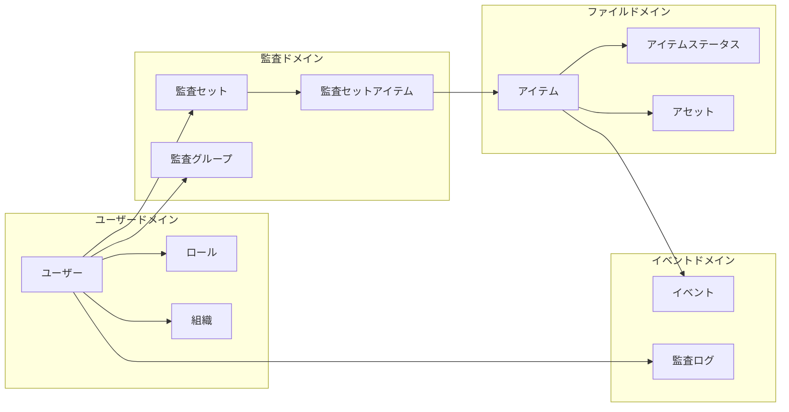

# ユビキタス言語（Ubiquitous Language）

## 監査ドメイン

| 用語 | 英語 | 定義 |
|------|------|------|
| 監査セット | Audit Set | 監査対象としてグループ化されたファイル/フォルダの集合 |
| 監査グループ | Audit Group | 監査人をグループ化したもの |
| コラボレーター | Collaborator | 監査セットにアクセス権を持つユーザー |
| レビュアー | Reviewer | 監査セットを閲覧・検証できる外部監査人 |
| 監査管理者 | Audit Admin | システムの管理権限を持つユーザー |
| 一般ユーザー | General User | 基本的な操作のみ可能なユーザー |
| 外部監査人 | External Auditor | 組織外から監査を行うユーザー |

## ファイルドメイン

| 用語 | 英語 | 定義 |
|------|------|------|
| アイテム | Item | ファイルまたはフォルダの総称 |
| アセット | Asset | ScalarDLに登録されたファイルのレコード |
| 改ざん検証 | Tampering Verification | ファイルが改ざんされていないか確認する処理 |
| ファイルコピー | File Copy | 同一SHA1ハッシュを持つファイル群 |
| ファイルバージョン | File Version | ファイルの履歴バージョン |
| SHA1ハッシュ | SHA1 Hash | ファイル内容の一意識別子 |

## イベントドメイン

| 用語 | 英語 | 定義 |
|------|------|------|
| イベントログ | Event Log | BOXで発生したユーザー操作の記録 |
| エンタープライズイベント | Enterprise Event | BOX Enterprise全体のイベント |
| イベントタイプ | Event Type | 操作の種類（UPLOAD, DOWNLOAD等） |
| 位置トラッカー | Position Tracker | イベント取得の継続位置を記録 |

## 認証・セキュリティドメイン

| 用語 | 英語 | 定義 |
|------|------|------|
| OTP | One-Time Password | パスワードリセット用の一時パスワード |
| リフレッシュトークン | Refresh Token | アクセストークン更新用トークン |
| アクセストークン | Access Token | API認証用トークン |

## 組織ドメイン

| 用語 | 英語 | 定義 |
|------|------|------|
| 組織 | Organization | BOX Enterpriseの組織単位 |
| Box管理者 | Box Admin | BOX側の管理権限を持つユーザー |

## ステータス値

### 改ざん検証ステータス (TamperingStatusType)
| 値 | 意味 |
|----|------|
| VALID | 改ざんなし（正常） |
| TAMPERED | 改ざん検出 |
| NOT_VERIFIED | 未検証 |

### アクセスステータス (AccessStatus)
| 値 | 意味 |
|----|------|
| ACTIVE | アクティブ |
| PENDING | 保留中 |
| REVOKED | 取り消し済み |

### コラボレーターロール (CollaboratorUserRoles)
| 値 | 意味 |
|----|------|
| OWNER | オーナー（全権限） |
| CO_OWNER | 共同オーナー（編集・メンバー管理） |
| MEMBER | メンバー（閲覧・アイテム追加） |
| REVIEWER | レビュアー（閲覧のみ） |

### ユーザーロール (UserRoles)
| 値 | 意味 |
|----|------|
| AUDIT_ADMIN | 監査管理者（全システム管理権限） |
| GENERAL_USER | 一般ユーザー（監査セット作成・管理） |
| EXTERNAL_AUDITOR | 外部監査人（招待された監査セットの閲覧） |

### イベントタイプ (EventType)
| 値 | 意味 |
|----|------|
| ITEM_UPLOAD | ファイルアップロード |
| ITEM_MOVE | ファイル移動 |
| ITEM_COPY | ファイルコピー |
| ITEM_TRASH | ゴミ箱移動 |
| ITEM_UNDELETE_VIA_TRASH | ゴミ箱から復元 |
| ITEM_RENAME | 名前変更 |
| ITEM_MODIFY | 内容変更 |

### 改ざん検証ステータス (TamperingStatusType) - 更新版
| 値 | 意味 |
|----|------|
| NOT_MONITORED | 監視対象外 |
| MONITORED | 監視中（登録済み） |
| NOT_TAMPERED | 改ざんなし（検証済み） |
| TAMPERED | 改ざん検出 |

---

## コード由来の用語

### サービス層の概念

| 用語 | クラス | 定義 |
|------|-------|------|
| 監査セットアイテム | AuditSetItem | 監査セットに登録されたファイル/フォルダ |
| 監査セットコラボレーター | AuditSetCollaborator | 監査セットへのアクセス権を持つユーザー |
| 監査ログ | AuditorLog | 外部監査人のアクセス履歴 |
| アイテムステータス | ItemStatus | ファイルの監視・検証状態 |
| SHA1別アイテム | ItemsBySha1 | 同一ハッシュを持つファイルのグループ |

### リポジトリ層の概念

| テーブル | 用語 | 役割 |
|---------|------|------|
| audit_set | 監査セット | 監査対象のコンテナ |
| audit_group | 監査グループ | ユーザーのグループ化 |
| audit_grp_audit_set_mapping | グループ-セット関連 | 多対多関連テーブル |
| user_audit_group | ユーザー-グループ関連 | グループメンバーシップ |
| position_tracker | 位置トラッカー | イベント取得の継続位置 |

### 外部連携の概念

| 用語 | 説明 |
|------|------|
| BOX API Connection | BOX APIへの接続管理 |
| Enterprise ID | BOX Enterprise識別子 |
| Service Account | BOX APIアクセス用サービスアカウント |
| Client Credentials | OAuth2クライアント認証情報 |

---

## ドメイン間の関係

---

*Generated: 2025-12-26*
*Source: scalar-event-log-fetcher-main*
