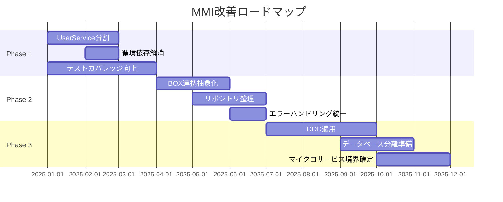
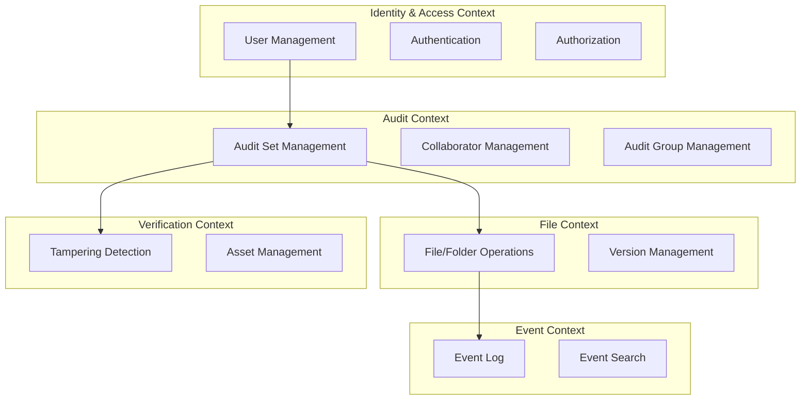
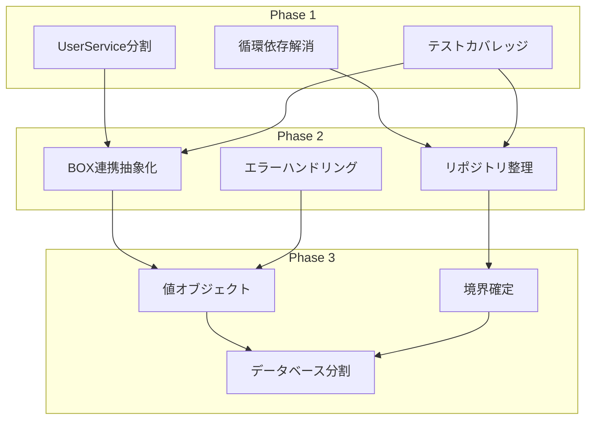

# MMI改善計画 (MMI Improvement Plan)

## 1. 改善目標

### 1.1 定量目標

| 指標 | 現状 | Phase 1 | Phase 2 | Phase 3 | 最終目標 |
|------|------|---------|---------|---------|---------|
| 総合MMI | 48.6 | 55 | 65 | 75 | 80+ |
| Cohesion平均 | 2.2 | 2.8 | 3.5 | 4.0 | 4.0+ |
| Coupling平均 | 2.0 | 2.5 | 3.0 | 3.5 | 4.0+ |
| Independence平均 | 2.5 | 3.0 | 3.5 | 4.0 | 4.0+ |
| Reusability平均 | 2.7 | 3.0 | 3.5 | 4.0 | 4.0+ |

### 1.2 定性目標

1. **Phase 1**: 最大のボトルネックである`UserService`の分割完了
2. **Phase 2**: サービス間の循環依存解消、BOX連携の抽象化
3. **Phase 3**: ドメイン駆動設計の適用、マイクロサービス境界の明確化
4. **最終**: マイクロサービスとして独立デプロイ可能な状態

---

## 2. ロードマップ

### 2.1 全体タイムライン



### 2.2 フェーズ別概要

| Phase | 期間 | 主要施策 | 期待効果 |
|-------|------|---------|---------|
| Phase 1 | 0-3ヶ月 | 責務分離、依存解消 | MMI +7pt |
| Phase 2 | 3-6ヶ月 | 抽象化、標準化 | MMI +10pt |
| Phase 3 | 6-12ヶ月 | DDD適用、境界確定 | MMI +10pt |

---

## 3. Phase 1: 責務分離と依存解消（0-3ヶ月）

### 3.1 施策一覧

| # | 施策 | 対象 | 優先度 | 工数 |
|---|------|------|-------|------|
| 1.1 | UserService分割 | UserService | 最優先 | 40h |
| 1.2 | 循環依存解消 | AuditSetItemService, AuditSetService | 高 | 24h |
| 1.3 | テストカバレッジ向上 | 全サービス | 高 | 60h |
| 1.4 | 共通例外処理の導入 | 全サービス | 中 | 16h |

### 3.2 UserService分割詳細

**現状構造:**
```
UserService (1116行, 29メソッド)
├── 認証系: login, loadUserByUsername, getToken, getNewAccessToken
├── BOX連携: registerUserAndSaveToken, updateLatestToken
├── ユーザー管理: createUser, deleteUser, getManagedUsers, editUser
├── ロール管理: updateUserRole, createRoleUser
├── パスワード: sendResetPasswordOTP, forgotPassword
└── その他: updateLanguageForUser, getListOfExternalAuditors
```

**目標構造:**
```
com.scalar.events_log_tool.application.service.user/
├── AuthenticationService.java (~300行)
│   ├── login()
│   ├── loadUserByUsername()
│   ├── getToken()
│   └── getNewAccessToken()
├── BoxUserService.java (~350行)
│   ├── registerUserAndSaveToken()
│   ├── updateLatestToken()
│   └── getBoxUserInfo()
├── UserManagementService.java (~300行)
│   ├── createUser()
│   ├── deleteUser()
│   ├── editUser()
│   ├── getManagedUsers()
│   └── updateUserRole()
└── PasswordResetService.java (~150行)
    ├── sendResetPasswordOTP()
    └── forgotPassword()
```

**依存関係の整理:**
```
Before:
UserService → [10 repositories + 5 services]

After:
AuthenticationService → UserRepository, JwtHelper
BoxUserService → UserRepository, UserTokenRepository, BoxUtility
UserManagementService → UserRepository, RoleUserRepository
PasswordResetService → UserOptRepository, EmailUtility
```

**実装手順:**
1. 新パッケージ `service.user` 作成
2. インターフェース `UserServiceFacade` 定義（後方互換性）
3. 各サービスクラス作成・テスト
4. 既存呼び出し元の段階的移行
5. 旧`UserService`の非推奨化・削除

### 3.3 循環依存解消

**現状の問題:**
```
AuditSetItemService → AuditSetService
AuditSetService → (AuditSetItemRepositoryを直接利用)
```

**解決策: イベント駆動パターン**
```
// Before
class AuditSetItemService {
    private AuditSetService auditSetService;

    void addItem() {
        auditSetService.isItemExistInAuditSet(...);
    }
}

// After
class AuditSetItemService {
    private AuditSetRepository auditSetRepository; // 直接参照

    void addItem() {
        auditSetRepository.existsByIdAndItemId(...);
    }
}
```

**代替案: インターフェース分離**
```java
// 共通インターフェース
interface AuditSetQueryService {
    boolean isItemExist(String auditSetId, Long itemId);
}

// 実装は別クラス
class AuditSetQueryServiceImpl implements AuditSetQueryService {
    // AuditSetItemServiceとAuditSetServiceが両方参照
}
```

---

## 4. Phase 2: 抽象化と標準化（3-6ヶ月）

### 4.1 施策一覧

| # | 施策 | 対象 | 優先度 | 工数 |
|---|------|------|-------|------|
| 2.1 | BOX連携層の抽象化 | BoxUtility, 各Service | 高 | 32h |
| 2.2 | リポジトリ層の整理 | 全Repository | 高 | 40h |
| 2.3 | エラーハンドリング統一 | 全Service | 中 | 24h |
| 2.4 | ログ出力標準化 | 全Service | 低 | 16h |

### 4.2 BOX連携層の抽象化

**現状:**
```java
// 各サービスで直接BoxUtilityを使用
class FileService {
    @Lazy
    private BoxAPIConnection connection;

    void getFileDetails() {
        BoxFile file = new BoxFile(connection, fileId);
        file.getInfo("name", "size", "sha1");
    }
}
```

**目標:**
```java
// インターフェース定義
interface BoxApiClient {
    FileInfo getFileInfo(String fileId, List<String> fields);
    FolderInfo getFolderInfo(String folderId);
    List<EventInfo> getEnterpriseEvents(String streamPosition);
}

// 実装
class BoxApiClientImpl implements BoxApiClient {
    private final BoxAPIConnection connection;

    @Override
    public FileInfo getFileInfo(String fileId, List<String> fields) {
        BoxFile file = new BoxFile(connection, fileId);
        return mapToFileInfo(file.getInfo(fields));
    }
}

// テスト用モック
class MockBoxApiClient implements BoxApiClient {
    // テストデータを返す
}
```

**利点:**
- テスタビリティ向上
- BOX SDKバージョン変更の影響を限定
- 将来的な他ストレージ対応が容易

### 4.3 リポジトリ層の整理

**現状の問題:**
- 22個のリポジトリが個別に存在
- サービスが多数のリポジトリに直接依存
- トランザクション境界が不明確

**Aggregate Root パターン適用:**
```
Before:
├── AuditSetRepository
├── AuditSetItemRepository
├── AuditSetCollaboratorsRepository
└── AuditGrpAuditSetMappingRepository

After:
├── AuditSetAggregateRepository (Aggregate Root)
│   └── 内部でItem, Collaborator, Mappingを管理
├── AuditSetItemRepository (内部利用のみ)
├── AuditSetCollaboratorsRepository (内部利用のみ)
└── AuditGrpAuditSetMappingRepository (内部利用のみ)
```

---

## 5. Phase 3: DDD適用と境界確定（6-12ヶ月）

### 5.1 施策一覧

| # | 施策 | 対象 | 優先度 | 工数 |
|---|------|------|-------|------|
| 3.1 | 値オブジェクト導入 | Model層 | 高 | 40h |
| 3.2 | ドメインサービス整理 | Service層 | 高 | 48h |
| 3.3 | 境界付けられたコンテキスト定義 | 全体 | 高 | 32h |
| 3.4 | データベース論理分割 | Repository層 | 中 | 40h |

### 5.2 値オブジェクト導入例

```java
// Before
class User {
    private String userEmail;
    private String roleJson;
}

// After
class User {
    private Email email;
    private UserRole role;
}

// 値オブジェクト
@Value
class Email {
    String value;

    public Email(String value) {
        if (!isValidEmail(value)) {
            throw new InvalidEmailException(value);
        }
        this.value = value;
    }
}

@Value
class UserRole {
    UserRoleType type;
    Set<Permission> permissions;

    public boolean canManageUsers() {
        return type == UserRoleType.AUDIT_ADMIN;
    }
}
```

### 5.3 境界付けられたコンテキスト



---

## 6. 施策依存関係



---

## 7. モニタリング計画

### 7.1 メトリクス収集

| メトリクス | 収集頻度 | ツール | 目標値 |
|-----------|---------|-------|-------|
| MMIスコア | 月次 | 手動評価 | 継続的改善 |
| コードカバレッジ | CI毎 | JaCoCo | 80%以上 |
| 循環依存数 | 週次 | jdepend | 0 |
| サービスあたり行数 | 月次 | cloc | 500行以下 |

### 7.2 レビューポイント

| 時点 | 確認内容 | 判定基準 |
|------|---------|---------|
| Phase 1完了 | UserService分割完了 | 新サービス各300行以下 |
| Phase 2完了 | 循環依存ゼロ | jdepend警告なし |
| Phase 3完了 | マイクロサービス準備 | MMI 75以上 |

---

## 8. リスクと緩和策

### 8.1 リスク一覧

| リスク | 確率 | 影響 | 緩和策 |
|-------|------|------|-------|
| 機能退行 | 高 | 高 | 包括的なテストスイート作成 |
| スケジュール遅延 | 中 | 中 | 段階的リリース、優先順位付け |
| チーム負荷 | 中 | 中 | リファクタリング専任時間確保 |
| 仕様理解不足 | 中 | 低 | ドメインエキスパートとの定期MTG |

### 8.2 ロールバック計画

- 各Phase完了時にリリースタグ作成
- Feature Flagによる新旧実装切り替え
- データベースマイグレーションは後方互換維持

---

## 9. 成功基準

### 9.1 Phase 1 成功基準

- [ ] UserServiceが4つ以下のサービスに分割
- [ ] 各新サービスが400行以下
- [ ] 循環依存が2つ以下に削減
- [ ] 単体テストカバレッジ60%以上

### 9.2 Phase 2 成功基準

- [ ] BoxApiClientインターフェース導入
- [ ] リポジトリ依存が各サービス5つ以下
- [ ] 統一例外ハンドリング適用
- [ ] 循環依存ゼロ

### 9.3 Phase 3 成功基準

- [ ] 5つの境界付けられたコンテキスト定義
- [ ] 主要値オブジェクト10個以上導入
- [ ] MMIスコア75以上
- [ ] 各コンテキストが独立テスト可能

---

*Generated: 2025-12-26*
*Source: scalar-event-log-fetcher-main*
