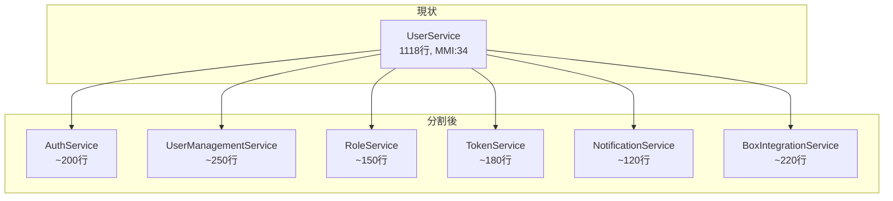
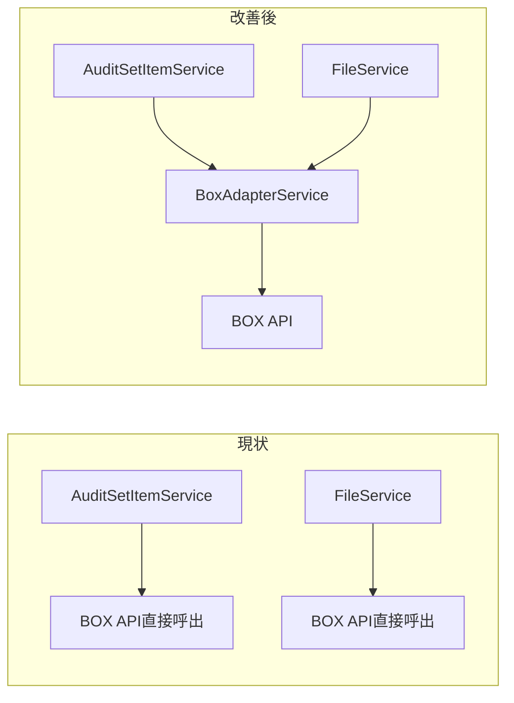
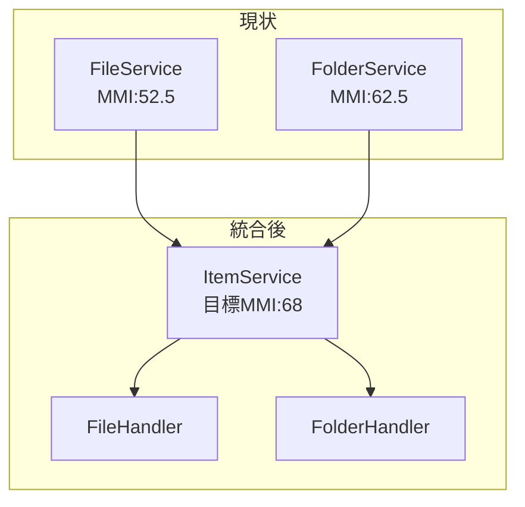
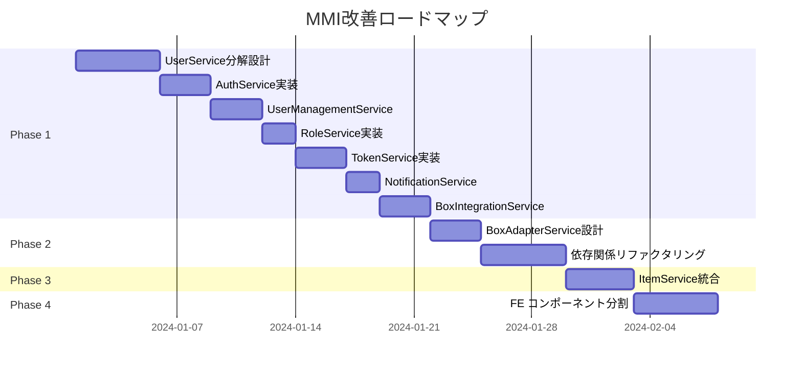

# MMI改善計画

## 改善目標

現在のMMIスコア **52.3** を **70.0以上** に向上させ、
マイクロサービス化に適した状態を達成する。

## 改善フェーズ

### Phase 1: God Class分解（優先度: 最高）

**対象**: UserService (MMI: 34.0 → 目標: 65.0)
**期間目安**: 中規模

#### 分割計画



#### 各サービスの責務

| 新サービス | 責務 | 予想MMI |
|-----------|------|---------|
| AuthService | 認証・認可、ログイン処理 | 70 |
| UserManagementService | ユーザーCRUD | 72 |
| RoleService | ロール管理 | 68 |
| TokenService | JWT/リフレッシュトークン管理 | 75 |
| NotificationService | メール・通知 | 70 |
| BoxIntegrationService | BOX OAuth連携 | 65 |

#### 実装ステップ

1. **インターフェース定義**
   ```java
   public interface AuthService {
       AuthResult authenticate(LoginRequest request);
       void logout(String userId);
       boolean validateToken(String token);
   }
   ```

2. **依存関係の整理**
   - TokenServiceはAuthServiceから利用
   - BoxIntegrationServiceはAuthServiceから利用
   - NotificationServiceは独立

3. **段階的移行**
   - 新サービスを作成
   - UserServiceからメソッドを移動
   - 呼び出し元を更新
   - テスト実行

#### 期待効果

| 指標 | 改善前 | 改善後 |
|------|--------|--------|
| Cohesion | 25 | 70 (+45) |
| Coupling | 30 | 60 (+30) |
| Independence | 40 | 65 (+25) |
| Reusability | 45 | 68 (+23) |
| **MMI** | **34.0** | **65.5** |

---

### Phase 2: サービス間結合の解消（優先度: 高）

**対象**: AuditSetItemService, FileService
**期間目安**: 小〜中規模

#### 2.1 BOX連携の分離



#### 2.2 サービス間依存の解消

```java
// Before: 直接依存
public class FileService {
    @Autowired
    private UserService userService; // 強結合
}

// After: インターフェース経由
public class FileService {
    @Autowired
    private UserInfoProvider userInfoProvider; // 疎結合
}
```

#### 期待効果

| サービス | 改善前MMI | 改善後MMI |
|----------|-----------|-----------|
| AuditSetItemService | 41.5 | 58.0 |
| FileService | 52.5 | 65.0 |

---

### Phase 3: ドメインサービスの統合（優先度: 中）

**対象**: FileService, FolderService
**期間目安**: 小規模

#### 統合計画



#### 設計方針

- Strategy パターンでファイル/フォルダ処理を抽象化
- 共通インターフェース `ItemHandler` を定義
- BOX APIアダプターを共有

---

### Phase 4: フロントエンド改善（優先度: 中）

**対象**: pages/AuditSet
**期間目安**: 小〜中規模

#### コンポーネント分割

```
AuditSet/ (現状: 1000行超)
├── AuditSetContainer.jsx (状態管理)
├── AuditSetList.jsx (一覧表示)
├── AuditSetDetail.jsx (詳細表示)
├── AuditSetForm.jsx (作成・編集フォーム)
└── hooks/
    ├── useAuditSet.js
    └── useAuditSetItem.js
```

#### 期待効果

| コンポーネント | 改善前MMI | 改善後MMI |
|---------------|-----------|-----------|
| pages/AuditSet | 47.5 | 62.0 |

---

## 改善ロードマップ



---

## MMIスコア推移予測

| フェーズ | 完了後MMI | 改善幅 |
|---------|-----------|--------|
| 現状 | 52.3 | - |
| Phase 1完了 | 60.5 | +8.2 |
| Phase 2完了 | 66.0 | +5.5 |
| Phase 3完了 | 68.5 | +2.5 |
| Phase 4完了 | 71.0 | +2.5 |

```
MMI Score Projection
100 ┤
 90 ┤
 80 ┤                                    ┌─────────── 目標ライン
 70 ┤                              ╭─────┘  71.0
 60 ┤              ╭───────────────╯
 50 ┤──────────────╯  52.3
 40 ┤
 30 ┤
    └──────┬──────┬──────┬──────┬──────┬────
          現状  Phase1 Phase2 Phase3 Phase4
```

---

## リスクと軽減策

| リスク | 影響度 | 軽減策 |
|--------|--------|--------|
| UserService分解時の既存機能破壊 | 高 | 包括的な統合テスト実施 |
| BOX API変更による影響 | 中 | アダプターパターンで隔離 |
| フロントエンド状態管理の複雑化 | 中 | Redux Toolkit活用 |
| リファクタリング中のサービス停止 | 低 | フィーチャーフラグ活用 |

---

## 成功指標

### 定量指標
- [ ] 全サービスのMMI 60以上
- [ ] 循環依存 0件
- [ ] God Class 0件
- [ ] サービス間直接依存 50%削減

### 定性指標
- [ ] 新サービス単独でのデプロイ可能
- [ ] テストカバレッジ 80%以上
- [ ] コードレビュー承認率向上

---

## 次のステップ

1. **Phase 3: ドメインマッピング** で境界づけられたコンテキストを特定
2. **Phase 4: マイクロサービス設計** でターゲットアーキテクチャを決定
3. 本改善計画をターゲットアーキテクチャに合わせて調整
