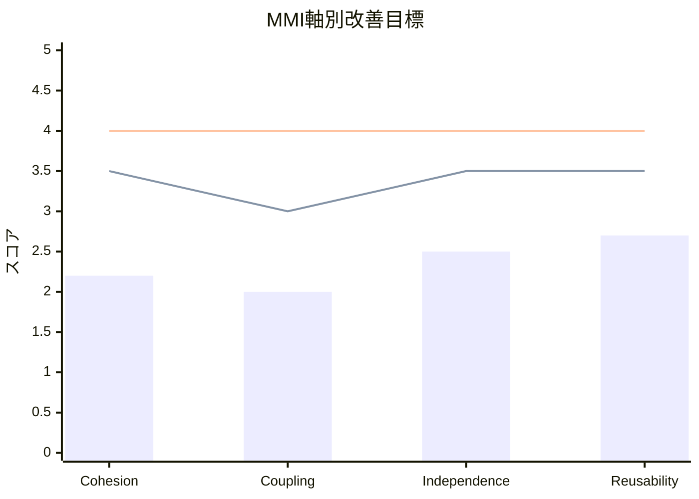

# MMI評価概要 (Modularity Maturity Index Overview)

## 1. エグゼクティブサマリー

### 1.1 総合評価

| 指標 | 値 | 評価 |
|------|-----|------|
| **総合MMIスコア** | **48.6** | 低中成熟 |
| 成熟度レベル | Level 2 | 大幅なリファクタリングが必要 |
| マイクロサービス化準備度 | 中 | 段階的な分離が推奨 |

### 1.2 軸別サマリー

| 評価軸 | 重み | 平均スコア (0-5) | 加重スコア |
|-------|-----|-----------------|-----------|
| Cohesion（凝集度） | 30% | 2.2 | 13.2 |
| Coupling（結合度） | 30% | 2.0 | 12.0 |
| Independence（独立性） | 20% | 2.5 | 10.0 |
| Reusability（再利用性） | 20% | 2.7 | 10.8 |
| **合計** | 100% | - | **46.0/100** |

---

## 2. スコア分布

### 2.1 モジュール別MMIスコア分布

```
高成熟 (80-100): ████ 0個 (0%)
中成熟 (60-80):  ████████ 2個 (20%)
低中成熟 (40-60): ████████████████ 5個 (50%)
未成熟 (0-40):   ████████████ 3個 (30%)
```

### 2.2 ヒストグラム

```
100 |
 90 |
 80 |
 70 | ▓▓
 60 | ▓▓ ▓▓
 50 | ▓▓ ▓▓ ▓▓ ▓▓
 40 | ▓▓ ▓▓ ▓▓ ▓▓ ▓▓ ▓▓
 30 | ▓▓ ▓▓ ▓▓ ▓▓ ▓▓ ▓▓ ▓▓
 20 | ▓▓ ▓▓ ▓▓ ▓▓ ▓▓ ▓▓ ▓▓ ▓▓ ▓▓
 10 | ▓▓ ▓▓ ▓▓ ▓▓ ▓▓ ▓▓ ▓▓ ▓▓ ▓▓ ▓▓
  0 +------------------------------------
     US  ASI ASS FS  AGS ASC ELS AstS FoS CS

    US=UserService, ASI=AuditSetItemService, ASS=AuditSetService
    FS=FileService, AGS=AuditGroupService, ASC=AuditSetCollaboratorService
    ELS=EventLogService, AstS=AssetService, FoS=FolderService, CS=CommonService
```

---

## 3. 軸別詳細分析

### 3.1 Cohesion（凝集度）分析

**平均スコア: 2.2 / 5.0**

| カテゴリ | 該当モジュール数 | 課題 |
|---------|----------------|------|
| 高凝集 (4-5) | 2 | - |
| 中凝集 (2-3) | 5 | 複数責務の混在 |
| 低凝集 (0-1) | 3 | 責務の肥大化 |

**主な問題点:**
- `UserService` (1116行): 認証、BOX連携、ユーザー管理、メール送信など多数の責務が集中
- `AuditSetItemService` (899行): アイテム管理、検証、監視ステータス管理が混在
- `AuditSetService` (845行): CRUD、コラボレーター管理、グループ管理が一体化

### 3.2 Coupling（結合度）分析

**平均スコア: 2.0 / 5.0**

| 結合パターン | 発生数 | 影響 |
|------------|-------|------|
| 循環依存 | 2 | 高 |
| 多重依存（5+） | 4 | 中 |
| 共有状態 | 3 | 中 |

**依存関係の問題:**
- `UserService` → 10+ リポジトリへの依存
- `AuditSetItemService` ↔ `AuditSetService` の相互参照
- `FileService` → `UserService` への直接依存
- 全サービスが `ObjectMapper` を直接利用

### 3.3 Independence（独立性）分析

**平均スコア: 2.5 / 5.0**

| 依存タイプ | 該当モジュール | 独立デプロイ可否 |
|-----------|--------------|----------------|
| DB共有 | 全モジュール | 不可 |
| 外部API共有 | 7モジュール | 条件付き可 |
| 設定共有 | 全モジュール | 不可 |

**独立性の障壁:**
- 単一のScalarDB Clusterへの依存
- BOX API接続の共有（`BoxUtility`経由）
- 共通の認証・セキュリティ設定

### 3.4 Reusability（再利用性）分析

**平均スコア: 2.7 / 5.0**

| 再利用レベル | 該当数 | 例 |
|------------|-------|-----|
| 高再利用性 | 2 | `CommonService`, `EventLogService` |
| 中再利用性 | 4 | `AssetService`, `FileService` |
| 低再利用性 | 4 | `UserService`, `AuditSetService` |

**再利用性の制約:**
- BOX Platform固有のロジックが多数埋め込み
- ハードコードされた定数（エンタープライズID等）
- ドメイン固有のビジネスルールの混在

---

## 4. 主要課題

### 4.1 最優先課題（Critical）

| # | 課題 | 影響度 | 対象モジュール |
|---|------|-------|--------------|
| 1 | UserServiceの肥大化 | 高 | UserService |
| 2 | サービス間の循環依存 | 高 | AuditSetItemService, AuditSetService |
| 3 | 多重リポジトリ依存 | 中 | UserService, AuditSetService |

### 4.2 重要課題（High）

| # | 課題 | 影響度 | 対象モジュール |
|---|------|-------|--------------|
| 4 | BOX API連携の分散 | 中 | FileService, FolderService, UserService |
| 5 | トランザクション管理の複雑さ | 中 | 複数サービス |
| 6 | ドメインモデル貧血症 | 中 | 全モデルクラス |

### 4.3 改善課題（Medium）

| # | 課題 | 影響度 | 対象モジュール |
|---|------|-------|--------------|
| 7 | JSON文字列での関連データ保存 | 低 | AuditSet, AuditGroup, User |
| 8 | エラーハンドリングの不統一 | 低 | 全サービス |
| 9 | ログ出力の非標準化 | 低 | 全サービス |

---

## 5. 推奨アクション

### 5.1 即時改善（Quick Wins）

1. **UserServiceの責務分離**
   - `AuthenticationService` - 認証処理
   - `BoxUserService` - BOX API連携
   - `UserManagementService` - ユーザーCRUD

2. **循環依存の解消**
   - インターフェース導入による依存逆転
   - イベント駆動への変更

### 5.2 短期改善（1-3ヶ月）

1. **BOX連携層の抽象化**
   - `BoxApiClient`インターフェース導入
   - モック可能な設計へ

2. **リポジトリ層の整理**
   - Aggregate Rootパターンの適用
   - 不要なリポジトリ依存の削減

### 5.3 中期改善（3-6ヶ月）

1. **ドメイン駆動設計の適用**
   - 値オブジェクトの導入
   - エンティティへのビジネスロジック移行

2. **データベース分離準備**
   - スキーマの論理分割
   - トランザクション境界の明確化

---

## 6. MMI改善目標

### 6.1 フェーズ別目標

| フェーズ | 期間 | 目標MMI | 主な施策 |
|---------|------|--------|---------|
| Phase 1 | 0-3ヶ月 | 55 | UserService分割、循環依存解消 |
| Phase 2 | 3-6ヶ月 | 65 | BOX連携抽象化、リポジトリ整理 |
| Phase 3 | 6-12ヶ月 | 75 | DDD適用、データ分離準備 |
| Phase 4 | 12ヶ月以降 | 80+ | マイクロサービス化実行 |

### 6.2 軸別改善目標



| 軸 | 現状 | Phase 2目標 | 最終目標 |
|----|------|-----------|---------|
| Cohesion | 2.2 | 3.5 | 4.0 |
| Coupling | 2.0 | 3.0 | 4.0 |
| Independence | 2.5 | 3.5 | 4.0 |
| Reusability | 2.7 | 3.5 | 4.0 |

---

## 7. リスク評価

### 7.1 リファクタリングリスク

| リスク | 確率 | 影響 | 緩和策 |
|-------|------|------|-------|
| 機能退行 | 高 | 高 | テストカバレッジ向上 |
| スケジュール遅延 | 中 | 中 | 段階的リリース |
| チーム習熟度 | 中 | 低 | トレーニング実施 |

### 7.2 技術的負債の定量化

| カテゴリ | 推定工数 | 優先度 |
|---------|---------|-------|
| コード重複 | 40h | 高 |
| 設計負債 | 120h | 高 |
| テスト負債 | 80h | 中 |
| ドキュメント負債 | 20h | 低 |
| **合計** | **260h** | - |

---

*Generated: 2025-12-26*
*Source: scalar-event-log-fetcher-main*
*Methodology: Modularity Maturity Index (MMI) v1.0*
