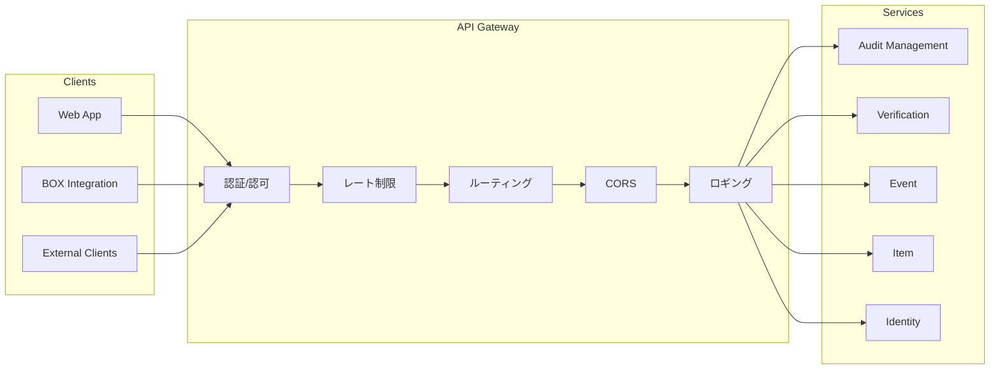

# API Gateway設計

## 1. API Gateway概要

### 1.1 役割



### 1.2 技術選定

| オプション | 特徴 | 推奨度 |
|-----------|------|--------|
| Kong | OSS、豊富なプラグイン、Kubernetes対応 | ★★★ |
| AWS API Gateway | マネージド、Lambda統合、高スケーラビリティ | ★★★ |
| NGINX | 軽量、高性能、設定柔軟 | ★★☆ |
| Istio Gateway | サービスメッシュ統合 | ★★☆ |

**推奨**: Kong または AWS API Gateway

---

## 2. ルーティング設計

### 2.1 パスベースルーティング

```yaml
routes:
  # Audit Management Service
  - name: audit-management
    paths:
      - /api/v1/audit-sets
      - /api/v1/audit-groups
    service: audit-management-service
    strip_path: false
    
  # Verification Service
  - name: verification
    paths:
      - /api/v1/items/*/validate
      - /api/v1/items/*/status
      - /api/v1/items/*/register
    service: verification-service
    strip_path: false
    
  # Event Service
  - name: event
    paths:
      - /api/v1/events
      - /api/v1/auditor-logs
    service: event-service
    strip_path: false
    
  # Item Service
  - name: item
    paths:
      - /api/v1/items
      - /api/v1/files
      - /api/v1/folders
    service: item-service
    strip_path: false
    
  # Identity Service
  - name: identity
    paths:
      - /api/v1/auth
      - /api/v1/users
    service: identity-service
    strip_path: false
```

### 2.2 アップストリーム設定

```yaml
upstreams:
  - name: audit-management-service
    targets:
      - target: audit-management.default.svc.cluster.local:8080
        weight: 100
    healthchecks:
      active:
        http_path: /health
        interval: 10
        
  - name: verification-service
    targets:
      - target: verification.default.svc.cluster.local:8080
        weight: 100
        
  - name: event-service
    targets:
      - target: event.default.svc.cluster.local:8080
        weight: 100
        
  - name: item-service
    targets:
      - target: item.default.svc.cluster.local:8080
        weight: 100
        
  - name: identity-service
    targets:
      - target: identity.default.svc.cluster.local:8080
        weight: 100
```

---

## 3. レート制限

### 3.1 レート制限ポリシー

| クライアントタイプ | 制限 | 単位 |
|------------------|------|------|
| 認証済みユーザー | 1000 | リクエスト/分 |
| 外部監査人 | 500 | リクエスト/分 |
| 未認証 | 60 | リクエスト/分 |
| BOX統合 | 2000 | リクエスト/分 |

### 3.2 Kong Rate Limiting設定

```yaml
plugins:
  - name: rate-limiting
    config:
      minute: 1000
      policy: cluster
      fault_tolerant: true
      hide_client_headers: false
      redis_host: redis.default.svc.cluster.local
      redis_port: 6379
```

### 3.3 エンドポイント別制限

```yaml
# 高負荷API用の追加制限
plugins:
  - name: rate-limiting
    route: verification
    config:
      minute: 100  # 検証は処理が重いため制限
      
  - name: rate-limiting
    route: event
    config:
      minute: 500  # イベント取得は中程度
```

---

## 4. CORS設定

### 4.1 CORS ポリシー

```yaml
plugins:
  - name: cors
    config:
      origins:
        - https://app.scalar-auditor.example.com
        - https://box-integration.example.com
      methods:
        - GET
        - POST
        - PUT
        - PATCH
        - DELETE
        - OPTIONS
      headers:
        - Accept
        - Authorization
        - Content-Type
        - X-Request-ID
      exposed_headers:
        - X-Request-ID
        - X-RateLimit-Remaining
      credentials: true
      max_age: 3600
      preflight_continue: false
```

### 4.2 環境別設定

| 環境 | 許可オリジン |
|------|-------------|
| 開発 | localhost:*, *.dev.example.com |
| ステージング | *.staging.example.com |
| 本番 | app.scalar-auditor.example.com |

---

## 5. 認証・認可

### 5.1 JWT検証

```yaml
plugins:
  - name: jwt
    config:
      uri_param_names:
        - jwt
      cookie_names:
        - token
      header_names:
        - authorization
      claims_to_verify:
        - exp
      secret_is_base64: false
```

### 5.2 認証バイパスルート

```yaml
# 認証不要エンドポイント
routes:
  - name: auth-public
    paths:
      - /api/v1/auth/login
      - /api/v1/auth/box/callback
      - /api/v1/users/password/reset
      - /api/v1/users/password/otp
      - /health
      - /api-docs
    plugins: []  # 認証プラグインなし
```

---

## 6. リクエスト変換

### 6.1 ヘッダー追加

```yaml
plugins:
  - name: request-transformer
    config:
      add:
        headers:
          - X-Gateway-Timestamp:$(date)
          - X-Forwarded-Service:scalar-auditor
```

### 6.2 レスポンス変換

```yaml
plugins:
  - name: response-transformer
    config:
      add:
        headers:
          - X-Request-ID:$(ctx.request_id)
          - X-Response-Time:$(latency)
```

---

## 7. ロギング・監視

### 7.1 アクセスログ

```yaml
plugins:
  - name: file-log
    config:
      path: /var/log/kong/access.log
      reopen: true
      
  - name: tcp-log
    config:
      host: logstash.monitoring.svc.cluster.local
      port: 5000
      tls: true
```

### 7.2 ログ形式

```json
{
  "timestamp": "2024-01-15T10:30:00.000Z",
  "request": {
    "id": "req-abc-123",
    "method": "GET",
    "uri": "/api/v1/audit-sets",
    "size": 0,
    "headers": {
      "authorization": "[REDACTED]",
      "user-agent": "Mozilla/5.0..."
    }
  },
  "response": {
    "status": 200,
    "size": 1234,
    "latencies": {
      "kong": 2,
      "proxy": 45,
      "request": 47
    }
  },
  "client": {
    "ip": "192.168.1.100"
  },
  "route": {
    "name": "audit-management"
  },
  "service": {
    "name": "audit-management-service"
  },
  "authenticated_entity": {
    "id": "user-456"
  }
}
```

### 7.3 メトリクス

```yaml
plugins:
  - name: prometheus
    config:
      per_consumer: true
      status_code_metrics: true
      latency_metrics: true
      bandwidth_metrics: true
      upstream_health_metrics: true
```

---

## 8. エラーハンドリング

### 8.1 カスタムエラーレスポンス

```yaml
plugins:
  - name: request-termination
    route: maintenance
    config:
      status_code: 503
      message: "Service is under maintenance"
      content_type: "application/json"
      body: |
        {
          "error": {
            "code": "SERVICE_MAINTENANCE",
            "message": "The service is temporarily unavailable"
          }
        }
```

### 8.2 サーキットブレーカー

```yaml
upstreams:
  - name: audit-management-service
    healthchecks:
      active:
        healthy:
          interval: 5
          successes: 2
        unhealthy:
          interval: 5
          http_failures: 3
    circuit_breaker:
      threshold: 50
      timeout: 30
```

---

## 9. セキュリティ対策

### 9.1 IP制限（管理API用）

```yaml
plugins:
  - name: ip-restriction
    route: admin
    config:
      allow:
        - 10.0.0.0/8
        - 192.168.1.0/24
```

### 9.2 Bot検出

```yaml
plugins:
  - name: bot-detection
    config:
      allow:
        - googlebot
        - bingbot
      deny:
        - curl
        - wget
```

### 9.3 リクエストサイズ制限

```yaml
plugins:
  - name: request-size-limiting
    config:
      allowed_payload_size: 10  # MB
```

---

## 10. デプロイメント

### 10.1 Kubernetes Ingress

```yaml
apiVersion: networking.k8s.io/v1
kind: Ingress
metadata:
  name: api-gateway
  annotations:
    kubernetes.io/ingress.class: kong
    konghq.com/strip-path: "false"
    cert-manager.io/cluster-issuer: letsencrypt-prod
spec:
  tls:
    - hosts:
        - api.scalar-auditor.example.com
      secretName: api-tls
  rules:
    - host: api.scalar-auditor.example.com
      http:
        paths:
          - path: /api
            pathType: Prefix
            backend:
              service:
                name: kong-proxy
                port:
                  number: 80
```

### 10.2 高可用性構成

```yaml
apiVersion: apps/v1
kind: Deployment
metadata:
  name: kong
spec:
  replicas: 3
  strategy:
    type: RollingUpdate
    rollingUpdate:
      maxSurge: 1
      maxUnavailable: 0
  template:
    spec:
      affinity:
        podAntiAffinity:
          requiredDuringSchedulingIgnoredDuringExecution:
            - topologyKey: kubernetes.io/hostname
```
