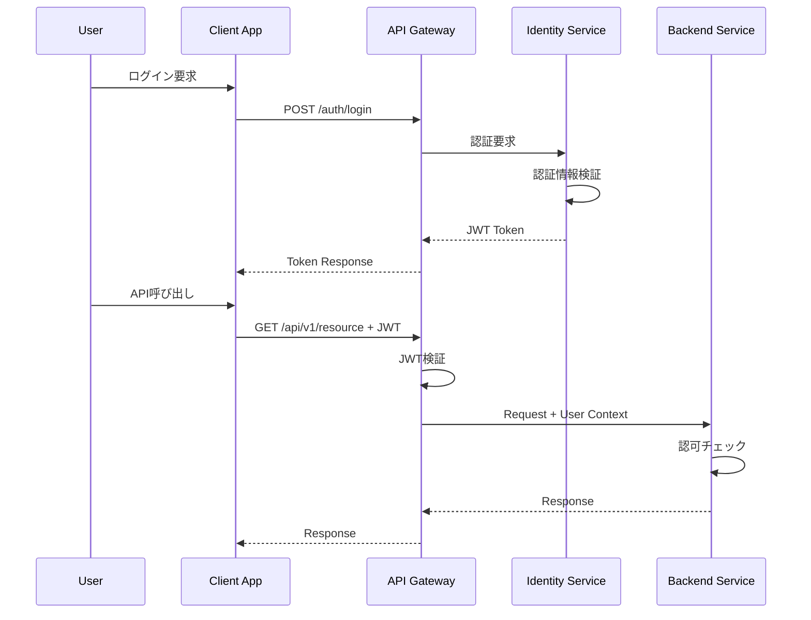
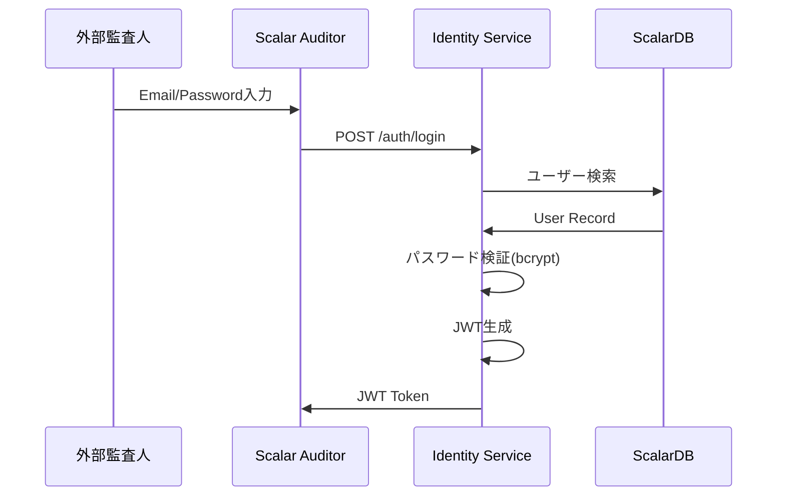
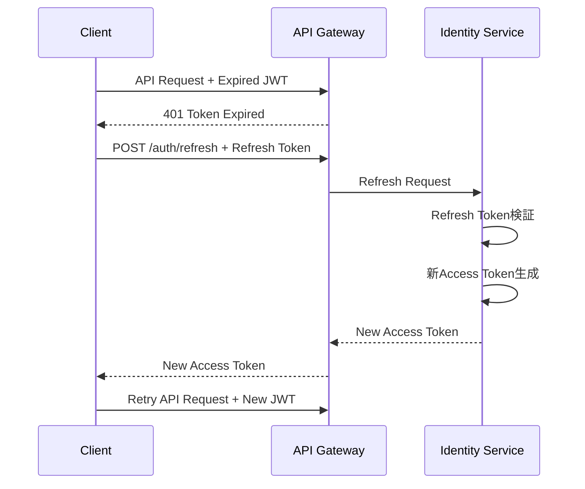
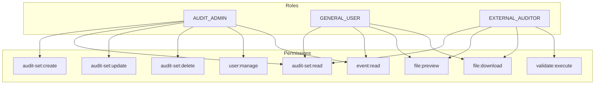

# API Security設計

## 1. セキュリティ概要

### 1.1 認証・認可フロー



### 1.2 セキュリティ層

| 層 | 責務 | 技術 |
|----|------|------|
| トランスポート | 通信暗号化 | TLS 1.3 |
| 認証 | ユーザー識別 | OAuth 2.0, JWT |
| 認可 | アクセス制御 | RBAC, ABAC |
| 入力検証 | 不正入力防止 | バリデーション |
| 監査 | 操作記録 | ログ |

---

## 2. 認証設計

### 2.1 認証方式

| ユーザータイプ | 認証方式 | フロー |
|--------------|---------|--------|
| 組織ユーザー | BOX OAuth 2.0 | Authorization Code |
| 外部監査人 | Email/Password | Resource Owner Password |
| サービス間 | Client Credentials | Client Credentials |
| BOX統合 | BOX JWT | JWT Bearer |

### 2.2 BOX OAuth 2.0フロー

```mermaid
sequenceDiagram
    participant U as 組織ユーザー
    participant APP as Scalar Auditor
    participant IDS as Identity Service
    participant BOX as BOX OAuth
    
    U->>APP: ログインクリック
    APP->>BOX: Authorization Request
    BOX->>U: 認証画面
    U->>BOX: 認証情報入力
    BOX->>APP: Authorization Code
    APP->>IDS: Code + Client Secret
    IDS->>BOX: Token Request
    BOX->>IDS: Access Token + Refresh Token
    IDS->>IDS: JWT生成
    IDS->>APP: Scalar JWT
```

### 2.3 外部監査人認証フロー



---

## 3. JWT設計

### 3.1 JWTペイロード

```json
{
  "sub": "user-456",
  "email": "user@example.com",
  "name": "John Doe",
  "roles": ["AUDIT_ADMIN", "GENERAL_USER"],
  "org_id": "org-123",
  "type": "access",
  "iat": 1705312200,
  "exp": 1705315800,
  "iss": "scalar-auditor-identity-service",
  "aud": "scalar-auditor-api"
}
```

### 3.2 トークン仕様

| 項目 | Access Token | Refresh Token |
|------|-------------|---------------|
| 有効期限 | 1時間 | 7日 |
| 署名アルゴリズム | RS256 | RS256 |
| 保存場所 | メモリ/Cookie | HttpOnly Cookie |
| スコープ | API アクセス | トークン更新のみ |

### 3.3 トークン更新フロー



---

## 4. 認可設計

### 4.1 RBACモデル



### 4.2 パーミッション定義

```java
public enum Permission {
    // Audit Set
    AUDIT_SET_CREATE("audit-set:create"),
    AUDIT_SET_READ("audit-set:read"),
    AUDIT_SET_UPDATE("audit-set:update"),
    AUDIT_SET_DELETE("audit-set:delete"),
    
    // User
    USER_MANAGE("user:manage"),
    USER_READ("user:read"),
    
    // Event
    EVENT_READ("event:read"),
    EVENT_READ_ALL("event:read-all"),
    
    // File
    FILE_PREVIEW("file:preview"),
    FILE_DOWNLOAD("file:download"),
    
    // Validation
    VALIDATE_EXECUTE("validate:execute");
}
```

### 4.3 リソースベース認可 (ABAC)

監査セットへのアクセスはコラボレーターロールに基づく:

```java
public class AuditSetAccessPolicy {
    public boolean canAccess(User user, AuditSet auditSet, Action action) {
        // 所有者は全権限
        if (auditSet.getOwnerId().equals(user.getId())) {
            return true;
        }
        
        // コラボレーターロールをチェック
        CollaboratorRole role = getCollaboratorRole(user, auditSet);
        
        return switch (action) {
            case READ -> role != null;
            case UPDATE -> role == OWNER || role == CO_OWNER;
            case DELETE -> role == OWNER;
            case ADD_ITEM -> role != REVIEWER;
            case REMOVE_ITEM -> role == OWNER || role == CO_OWNER;
        };
    }
}
```

### 4.4 APIエンドポイント認可マトリックス

| エンドポイント | AUDIT_ADMIN | GENERAL_USER | EXTERNAL_AUDITOR |
|--------------|-------------|--------------|------------------|
| POST /audit-sets | ✓ | ✗ | ✗ |
| GET /audit-sets | ✓ | ✓ (自分のみ) | ✓ (割当のみ) |
| PUT /audit-sets/{id} | ✓ | ✗ | ✗ |
| DELETE /audit-sets/{id} | ✓ | ✗ | ✗ |
| GET /events | ✓ (全て) | ✓ (自分のみ) | ✗ |
| GET /items/{id}/events | ✓ | ✓ | ✓ |
| POST /items/{id}/validate | ✓ | ✓ | ✓ |
| GET /users | ✓ | ✗ | ✗ |
| POST /users | ✓ | ✗ | ✗ |

---

## 5. セキュリティ対策

### 5.1 入力バリデーション

```java
@RestController
public class AuditSetController {
    
    @PostMapping("/audit-sets")
    public ResponseEntity<AuditSet> create(
            @Valid @RequestBody CreateAuditSetRequest request) {
        // バリデーション済みリクエスト
    }
}

public record CreateAuditSetRequest(
    @NotBlank @Size(max = 255) String name,
    @Size(max = 1000) String description,
    @Email String ownerEmail
) {}
```

### 5.2 SQLインジェクション対策

ScalarDBを使用し、パラメータバインディングを強制:

```java
public Optional<AuditSet> findById(String id) {
    Get get = Get.newBuilder()
        .namespace(NAMESPACE)
        .table(TABLE)
        .partitionKey(Key.of("audit_set_id", id))  // パラメータバインド
        .build();
    return storage.get(get).map(this::mapToEntity);
}
```

### 5.3 XSS対策

```java
// レスポンスのHTMLエスケープ
@Configuration
public class JacksonConfig {
    @Bean
    public Jackson2ObjectMapperBuilder jacksonBuilder() {
        return new Jackson2ObjectMapperBuilder()
            .featuresToEnable(SerializationFeature.ESCAPE_NON_ASCII);
    }
}

// Content Security Policy
@Configuration
public class SecurityHeadersConfig {
    @Bean
    public SecurityFilterChain filterChain(HttpSecurity http) {
        http.headers()
            .contentSecurityPolicy("default-src 'self'; script-src 'self'")
            .and()
            .xssProtection();
        return http.build();
    }
}
```

### 5.4 CSRF対策

```java
@Configuration
public class SecurityConfig {
    @Bean
    public SecurityFilterChain filterChain(HttpSecurity http) {
        http
            .csrf()
                .csrfTokenRepository(CookieCsrfTokenRepository.withHttpOnlyFalse())
                .ignoringRequestMatchers("/api/**"); // REST APIはステートレス
        return http.build();
    }
}
```

### 5.5 レート制限

```java
@Component
public class RateLimitingFilter extends OncePerRequestFilter {
    
    private final RateLimiter rateLimiter;
    
    @Override
    protected void doFilterInternal(HttpServletRequest request, 
                                     HttpServletResponse response,
                                     FilterChain filterChain) {
        String clientId = extractClientId(request);
        
        if (!rateLimiter.tryAcquire(clientId)) {
            response.setStatus(429);
            response.getWriter().write("{\"error\": \"Too many requests\"}");
            return;
        }
        
        filterChain.doFilter(request, response);
    }
}
```

---

## 6. 監査ログ

### 6.1 監査イベント

| イベント | 記録内容 |
|---------|---------|
| LOGIN_SUCCESS | ユーザーID、IP、タイムスタンプ |
| LOGIN_FAILURE | 試行ユーザー、IP、失敗理由 |
| RESOURCE_ACCESS | ユーザー、リソース、アクション |
| PERMISSION_DENIED | ユーザー、リソース、必要権限 |
| DATA_MODIFICATION | ユーザー、変更前後、タイムスタンプ |

### 6.2 監査ログフォーマット

```json
{
  "timestamp": "2024-01-15T10:30:00.000Z",
  "eventType": "RESOURCE_ACCESS",
  "actor": {
    "id": "user-456",
    "email": "admin@example.com",
    "roles": ["AUDIT_ADMIN"]
  },
  "resource": {
    "type": "audit-set",
    "id": "audit-set-123"
  },
  "action": "UPDATE",
  "result": "SUCCESS",
  "requestId": "req-abc-123",
  "clientIp": "192.168.1.100",
  "userAgent": "Mozilla/5.0..."
}
```

---

## 7. シークレット管理

### 7.1 シークレット一覧

| シークレット | 用途 | 保存場所 |
|-------------|------|---------|
| JWT署名鍵 | トークン署名 | Vault / AWS Secrets Manager |
| DB認証情報 | ScalarDB接続 | Vault / AWS Secrets Manager |
| BOX Client Secret | OAuth認証 | Vault / AWS Secrets Manager |
| SMTP認証情報 | メール送信 | Vault / AWS Secrets Manager |

### 7.2 Kubernetes Secrets

```yaml
apiVersion: v1
kind: Secret
metadata:
  name: identity-service-secrets
type: Opaque
data:
  jwt-private-key: <base64 encoded>
  jwt-public-key: <base64 encoded>
  box-client-secret: <base64 encoded>
```

### 7.3 シークレットローテーション

| シークレット | ローテーション間隔 |
|-------------|------------------|
| JWT署名鍵 | 90日 |
| DB認証情報 | 30日 |
| APIキー | 90日 |

---

## 8. TLS設定

### 8.1 TLSバージョン

```yaml
# Nginx/Kong設定
ssl_protocols TLSv1.3 TLSv1.2;
ssl_prefer_server_ciphers on;
ssl_ciphers ECDHE-ECDSA-AES128-GCM-SHA256:ECDHE-RSA-AES128-GCM-SHA256;
ssl_session_cache shared:SSL:10m;
ssl_session_timeout 1d;
ssl_stapling on;
ssl_stapling_verify on;
```

### 8.2 サービス間mTLS

```yaml
# Istio設定
apiVersion: security.istio.io/v1beta1
kind: PeerAuthentication
metadata:
  name: default
  namespace: scalar-auditor
spec:
  mtls:
    mode: STRICT
```
