# コンテキストマップ (Context Map)

## 1. コンテキスト関係図

### 1.1 全体マップ

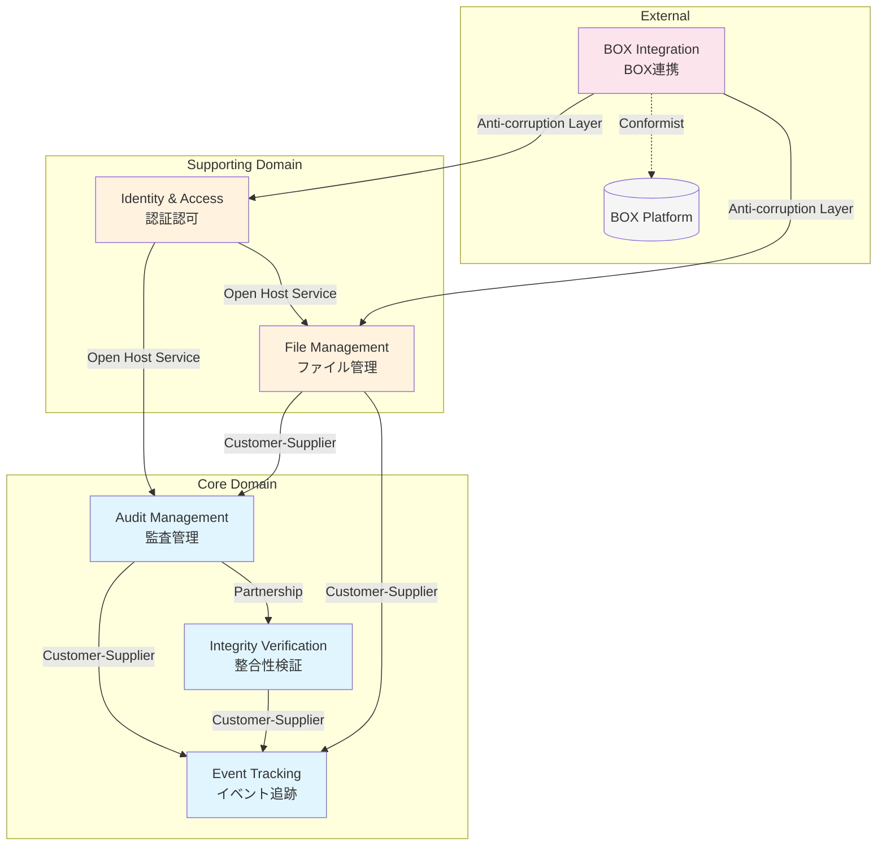

### 1.2 データフロー図

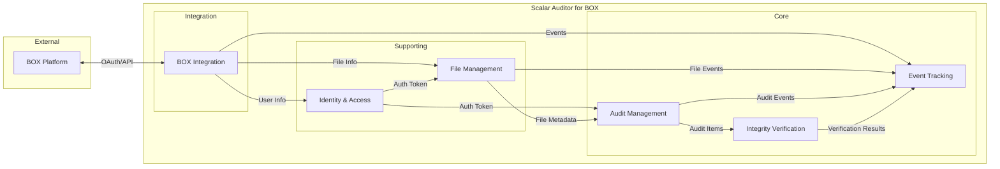

---

## 2. コンテキスト間関係パターン

### 2.1 パートナーシップ (Partnership)

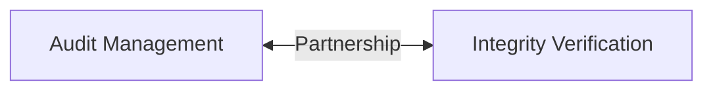

| 項目 | 内容 |
|------|------|
| **上流** | Audit Management |
| **下流** | Integrity Verification |
| **関係性** | 相互依存・協調開発 |
| **統合ポイント** | 監査アイテムの整合性検証 |
| **共有モデル** | AuditSetItem, AssetVerificationResult |
| **調整方法** | 共同設計、変更時は両チームで合意 |

**インターフェース定義:**
```java
// 共有インターフェース
interface AuditItemVerification {
    VerificationResult verifyItem(AuditSetItem item);
    List<VerificationResult> verifyAuditSet(String auditSetId);
    void registerAsset(AuditSetItem item);
}
```

---

### 2.2 顧客-供給者 (Customer-Supplier)

#### 2.2.1 Audit Management → Event Tracking

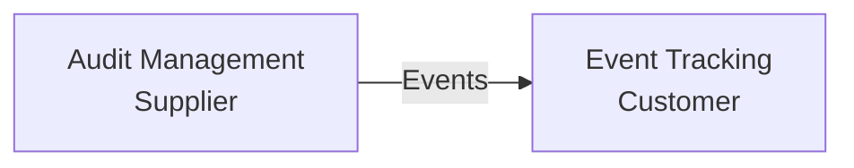

| 項目 | 内容 |
|------|------|
| **供給者** | Audit Management |
| **顧客** | Event Tracking |
| **関係性** | 顧客のニーズに応じてイベントを発行 |
| **契約** | 監査操作イベントの発行 |

**イベント契約:**
```java
// 発行イベント
record AuditSetCreatedEvent(String auditSetId, String userId, Instant createdAt);
record AuditItemAddedEvent(String auditSetId, Long itemId, String itemType);
record AuditItemVerifiedEvent(String auditSetId, Long itemId, VerificationStatus status);
```

#### 2.2.2 File Management → Audit Management

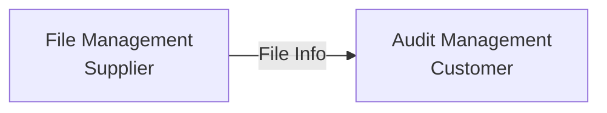

| 項目 | 内容 |
|------|------|
| **供給者** | File Management |
| **顧客** | Audit Management |
| **関係性** | ファイルメタデータの提供 |
| **契約** | ファイル情報取得API |

**契約インターフェース:**
```java
interface FileInfoProvider {
    FileInfo getFileInfo(String fileId);
    List<FileVersion> getFileVersions(String fileId);
    String getFileSha1(String fileId);
}
```

---

### 2.3 オープンホストサービス (Open Host Service)

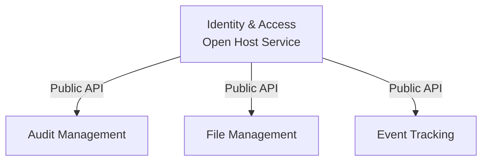

| 項目 | 内容 |
|------|------|
| **提供者** | Identity & Access |
| **消費者** | 全コンテキスト |
| **サービス** | 認証・認可API |
| **プロトコル** | JWT Token, Role-Based Access |

**公開API:**
```java
// 認証サービス
interface AuthenticationService {
    AuthToken authenticate(Credentials credentials);
    AuthToken refreshToken(String refreshToken);
    void logout(String userId);
}

// 認可サービス
interface AuthorizationService {
    boolean hasPermission(String userId, Permission permission);
    Set<Role> getUserRoles(String userId);
    boolean canAccessAuditSet(String userId, String auditSetId);
}
```

---

### 2.4 腐敗防止層 (Anti-corruption Layer)

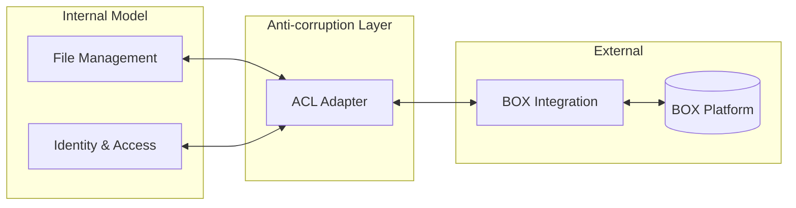

| 項目 | 内容 |
|------|------|
| **内部モデル** | File, Folder, User (ドメインモデル) |
| **外部モデル** | BoxFile, BoxFolder, BoxUser (BOX SDK) |
| **変換層** | BoxApiClient, BoxModelMapper |
| **目的** | BOX SDK変更からドメインモデルを保護 |

**ACL実装例:**
```java
// Anti-corruption Layer
class BoxApiClientAdapter implements ExternalStorageClient {
    private final BoxAPIConnection connection;
    private final BoxModelMapper mapper;

    @Override
    public FileInfo getFileInfo(String fileId) {
        BoxFile boxFile = new BoxFile(connection, fileId);
        BoxFile.Info info = boxFile.getInfo("name", "size", "sha1", "modified_at");
        return mapper.toFileInfo(info);  // BOXモデル → ドメインモデル
    }
}

// モデル変換
class BoxModelMapper {
    FileInfo toFileInfo(BoxFile.Info boxInfo) {
        return FileInfo.builder()
            .id(boxInfo.getID())
            .name(boxInfo.getName())
            .size(boxInfo.getSize())
            .sha1(boxInfo.getSha1())
            .modifiedAt(boxInfo.getModifiedAt().toInstant())
            .build();
    }
}
```

---

### 2.5 順応者 (Conformist)

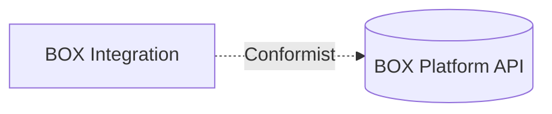

| 項目 | 内容 |
|------|------|
| **順応者** | BOX Integration |
| **上流** | BOX Platform |
| **関係性** | BOX APIの変更に完全に従う |
| **リスク** | BOX API変更時の影響大 |
| **緩和策** | ACL層での変換・バージョン管理 |

---

## 3. 統合パターン詳細

### 3.1 同期統合

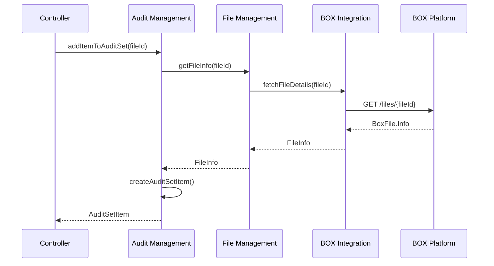

### 3.2 イベント駆動統合（目標状態）

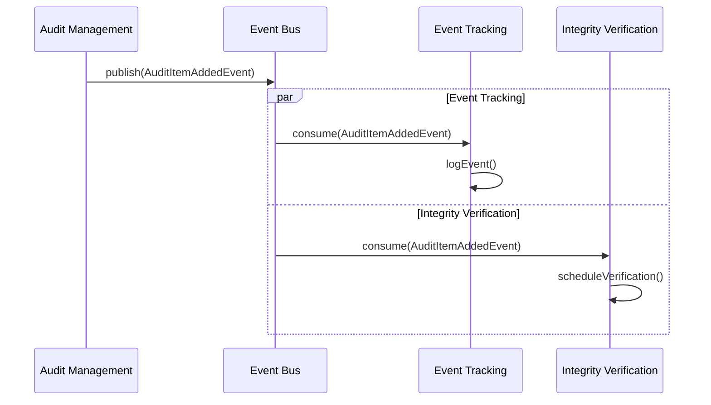

---

## 4. コンテキスト境界の実装

### 4.1 パッケージ構造（目標）

```
com.scalar.auditor/
├── identity/                    # Identity & Access Context
│   ├── api/
│   ├── application/
│   ├── domain/
│   └── infrastructure/
│
├── audit/                       # Audit Management Context
│   ├── api/
│   ├── application/
│   ├── domain/
│   └── infrastructure/
│
├── file/                        # File Management Context
│   ├── api/
│   ├── application/
│   ├── domain/
│   └── infrastructure/
│
├── event/                       # Event Tracking Context
│   ├── api/
│   ├── application/
│   ├── domain/
│   └── infrastructure/
│
├── verification/                # Integrity Verification Context
│   ├── api/
│   ├── application/
│   ├── domain/
│   └── infrastructure/
│
├── box/                         # BOX Integration Context
│   ├── api/
│   ├── application/
│   └── infrastructure/
│       └── acl/                 # Anti-corruption Layer
│
└── shared/                      # Shared Kernel
    ├── events/
    └── types/
```

### 4.2 モジュール間通信

| 通信タイプ | 使用箇所 | 実装方式 |
|-----------|---------|---------|
| 同期呼び出し | ファイル情報取得 | インターフェース注入 |
| イベント発行 | 監査操作通知 | Spring Events |
| 共有カーネル | 共通型・ID | 共有ライブラリ |

---

## 5. 移行戦略

### 5.1 フェーズ別移行

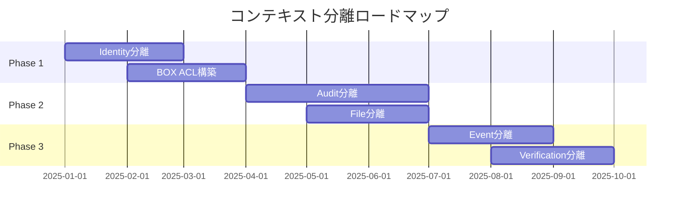

### 5.2 段階的インターフェース導入

```java
// Step 1: インターフェース定義
interface AuditSetOperations {
    AuditSetDto createAuditSet(CreateAuditSetCommand cmd);
    void addItem(AddItemCommand cmd);
}

// Step 2: 既存実装をラップ
class AuditSetOperationsAdapter implements AuditSetOperations {
    private final AuditSetService legacyService;
    // 委譲
}

// Step 3: 新実装に置き換え
class AuditSetApplicationService implements AuditSetOperations {
    // 新規実装
}
```

---

## 6. リスクと対策

| リスク | 影響 | 対策 |
|-------|------|------|
| 循環依存の残存 | 分離困難 | 依存逆転パターン適用 |
| 共有データベース | 独立性低下 | スキーマ論理分割 |
| トランザクション跨ぎ | データ不整合 | Sagaパターン検討 |
| パフォーマンス劣化 | 応答遅延 | キャッシュ・非同期化 |

---

*Generated: 2025-12-26*
*Source: scalar-event-log-fetcher-main*
