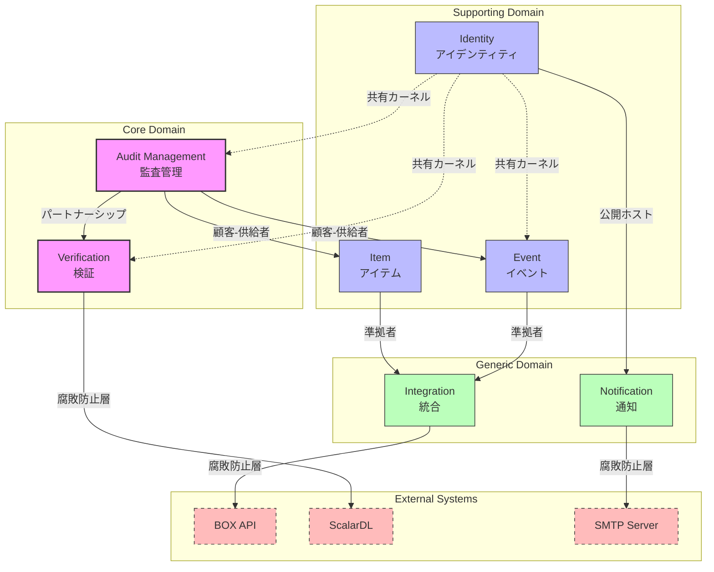
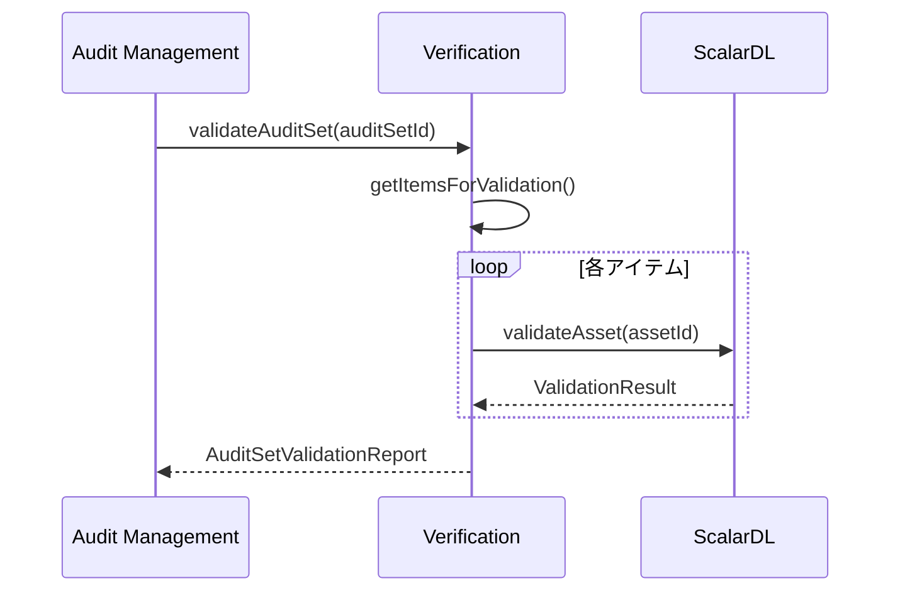
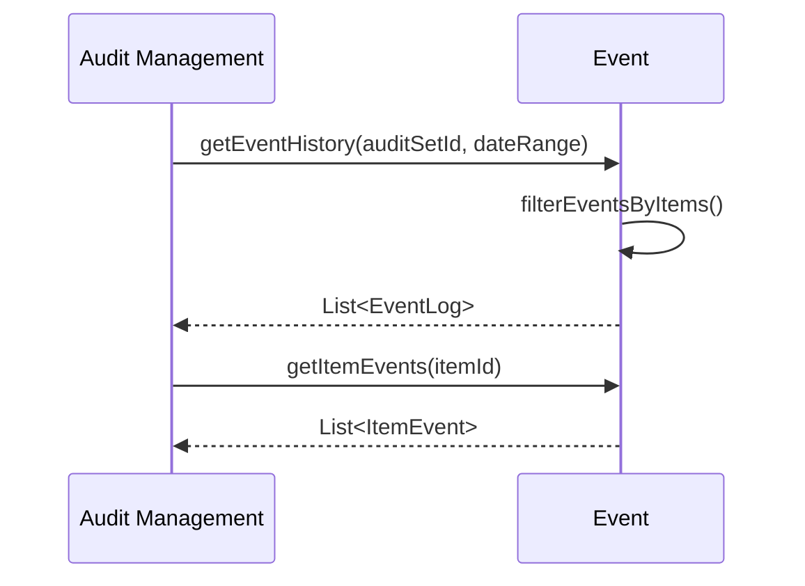
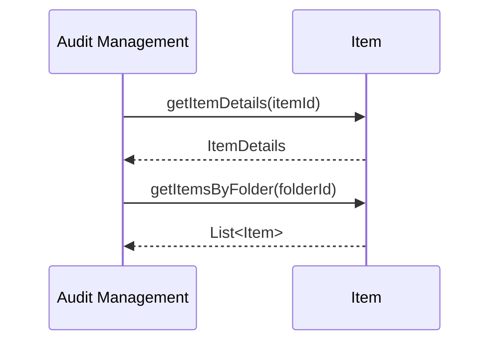
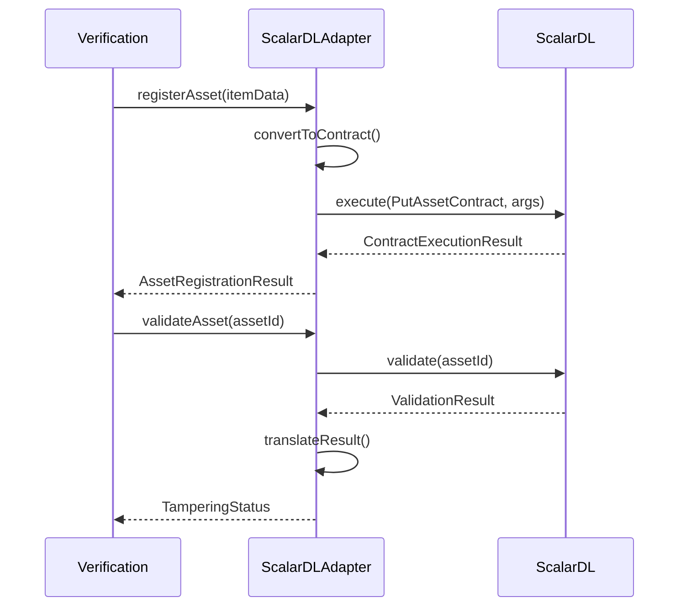
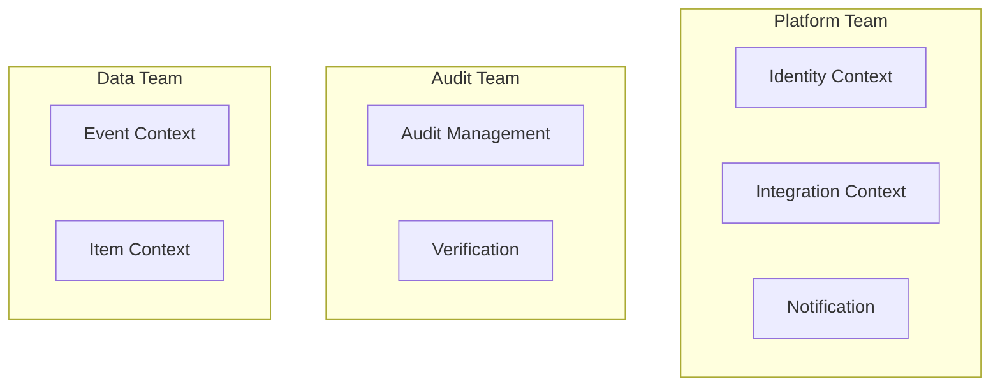
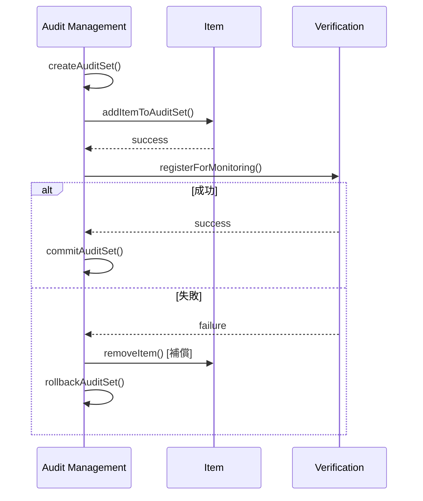

# コンテキストマップ

## 概要

Scalar Auditor for BOXシステムの境界づけられたコンテキスト間の関係を定義します。

---

## コンテキストマップ図



---

## コンテキスト関係の詳細

### 1. Audit Management ↔ Verification（パートナーシップ）

**関係タイプ**: Partnership（パートナーシップ）

両チームが対等な立場で協調し、APIと要件を共同で決定。



**共有インターフェース**:
```java
public interface ValidationService {
    ValidationResult validateItem(String itemId);
    AuditSetValidationReport validateAuditSet(String auditSetId);
    TamperingStatus getItemStatus(String itemId);
}
```

---

### 2. Audit Management → Event（顧客-供給者）

**関係タイプ**: Customer-Supplier（顧客-供給者）

Audit ManagementがCustomer（顧客）、EventがSupplier（供給者）。



**供給者API**:
```java
public interface EventQueryService {
    List<EventLog> getEventsByAuditSet(String auditSetId, DateRange range);
    List<ItemEvent> getEventsByItem(String itemId);
    List<AuditorLog> getAuditorLogs(String auditSetId);
}
```

---

### 3. Audit Management → Item（顧客-供給者）

**関係タイプ**: Customer-Supplier（顧客-供給者）



**供給者API**:
```java
public interface ItemQueryService {
    ItemDetails getItem(String itemId);
    List<Item> getItemsByFolder(String folderId);
    List<FileVersion> getFileVersions(String fileId);
    List<Item> getFileCopies(String sha1Hash);
}
```

---

### 4. Integration → BOX API（腐敗防止層）

**関係タイプ**: Anti-Corruption Layer（腐敗防止層）

外部BOX APIとの統合を隔離し、内部モデルへの変換を担当。

```mermaid
sequenceDiagram
    participant INT as Integration
    participant ACL as AntiCorruptionLayer
    participant BOX as BOX API
    
    INT->>ACL: fetchEventStream(position)
    ACL->>BOX: GET /events?stream_position=...
    BOX-->>ACL: BoxEventResponse
    ACL->>ACL: translateToInternalModel()
    ACL-->>INT: List<InternalEvent>
```

**腐敗防止層の実装**:
```java
public class BoxEventTranslator {
    public InternalEvent translate(BoxEvent boxEvent) {
        return InternalEvent.builder()
            .eventId(boxEvent.getEventId())
            .eventType(mapEventType(boxEvent.getEventType()))
            .itemId(boxEvent.getSource().getId())
            .timestamp(boxEvent.getCreatedAt())
            .userId(boxEvent.getCreatedBy().getId())
            .build();
    }
    
    private EventType mapEventType(String boxEventType) {
        return switch(boxEventType) {
            case "ITEM_UPLOAD" -> EventType.UPLOAD;
            case "ITEM_MOVE" -> EventType.MOVE;
            // ... mapping
        };
    }
}
```

---

### 5. Verification → ScalarDL（腐敗防止層）

**関係タイプ**: Anti-Corruption Layer（腐敗防止層）

ScalarDL APIとの統合を隔離。



---

### 6. Identity（共有カーネル）

**関係タイプ**: Shared Kernel（共有カーネル）

全コンテキストで共有されるユーザー・ロール情報。

**共有モデル**:
```java
// 全コンテキストで共有
public record UserInfo(
    String userId,
    String email,
    String name,
    Set<Role> roles
) {}

public enum Role {
    AUDIT_ADMIN,
    GENERAL_USER,
    EXTERNAL_AUDITOR
}
```

**注意点**:
- 共有カーネルは最小限に保つ
- 変更時は全コンテキストへの影響を検討
- イベント駆動で同期を検討

---

## コンテキスト間通信パターン

### 同期通信（現状）

| 呼び出し元 | 呼び出し先 | パターン |
|-----------|-----------|----------|
| Audit Management | Event | REST API |
| Audit Management | Item | REST API |
| Audit Management | Verification | REST API |
| Item | Integration (BOX) | REST API |
| Verification | Integration (ScalarDL) | gRPC |

### 推奨非同期通信（将来）

| イベント発行元 | イベント | 購読者 |
|--------------|---------|--------|
| Item | ItemCreated | Audit Management, Event |
| Item | ItemModified | Verification, Event |
| Audit Management | AuditSetCreated | Event |
| Verification | ValidationCompleted | Audit Management |

---

## チーム境界とコンテキスト

### 推奨チーム構成



| チーム | 担当コンテキスト | 責務 |
|-------|----------------|------|
| Platform Team | Identity, Integration, Notification | 基盤サービス |
| Audit Team | Audit Management, Verification | コアビジネス |
| Data Team | Event, Item | データ管理 |

---

## データ整合性戦略

### 結果整合性の採用

コンテキスト間では結果整合性を採用し、Sagaパターンで長時間トランザクションを管理。



---

## 次のステップ

1. **Phase 4: マイクロサービス設計** - 具体的なサービス境界と責務の定義
2. **Phase 4.5: API設計** - REST/gRPC/イベントAPIの詳細設計
3. **Phase 5: ScalarDB設計** - データアーキテクチャの最適化
