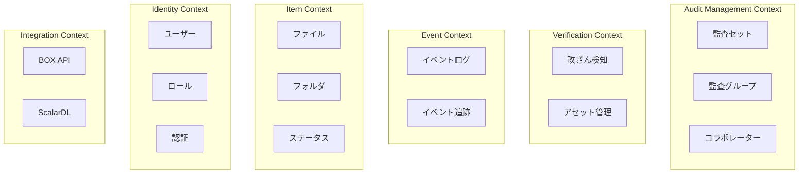
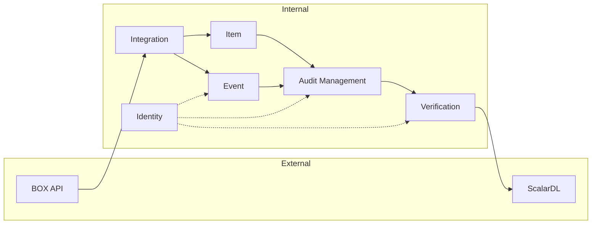

# ドメイン分析

## 1. ドメイン分類

Scalar Auditor for BOXシステムを戦略的ドメイン駆動設計の観点から分析します。

### 1.1 コアドメイン

ビジネスにおいて最も価値を生み出す、差別化要因となるドメイン。

| ドメイン | 説明 | ビジネス価値 |
|---------|------|-------------|
| **監査セット管理** | 監査対象ファイル・フォルダのグループ化と管理 | 監査業務の効率化、コンプライアンス対応 |
| **改ざん検知** | ScalarDLを用いたファイル完全性の検証 | 法的証拠としての信頼性、不正検出 |

### 1.2 サポートドメイン

コアドメインをサポートするが、差別化要因ではないドメイン。

| ドメイン | 説明 | 役割 |
|---------|------|------|
| **イベントログ管理** | BOXイベントの取得・保存・照会 | 監査証跡の提供 |
| **アイテム管理** | ファイル・フォルダのメタデータ管理 | 監査対象の追跡 |
| **ユーザー管理** | ユーザーCRUD、ロール管理 | アクセス制御の基盤 |

### 1.3 汎用ドメイン

市販品やオープンソースで代替可能な汎用機能。

| ドメイン | 説明 | 代替可能性 |
|---------|------|-----------|
| **認証・認可** | JWT認証、BOX OAuth | 汎用認証サービスで代替可能 |
| **通知** | メール送信、OTP | メールサービスで代替可能 |
| **BOX連携** | BOX API統合 | SDKベースで標準化可能 |

---

## 2. 境界づけられたコンテキスト

### 2.1 コンテキスト一覧

### 2.2 各コンテキストの詳細

#### Audit Management Context（監査管理コンテキスト）

**責務**: 監査セット、監査グループ、コラボレーターの管理

| エンティティ | 集約ルート | 説明 |
|-------------|-----------|------|
| AuditSet | ✓ | 監査セットの作成・更新・削除 |
| AuditGroup | ✓ | 外部監査人グループの管理 |
| AuditSetCollaborators | | 監査セットへのアクセス権管理 |
| AuditSetItem | | 監査対象アイテムのマッピング |
| AuditGrpAuditSetMapping | | グループと監査セットの関連 |
| UserAuditGroup | | ユーザーとグループの関連 |

**ユビキタス言語**:
- 監査セット（Audit Set）
- 監査グループ（Audit Group）
- コラボレーター（Collaborator）
- 所有者（Owner）、共同所有者（Co-Owner）

---

#### Verification Context（検証コンテキスト）

**責務**: ScalarDLを用いたファイル改ざん検知

| エンティティ | 集約ルート | 説明 |
|-------------|-----------|------|
| Asset | ✓ | ScalarDLアセット（検証対象） |
| ItemStatus | | アイテムの検証ステータス |
| ItemsBySha1 | | SHA1ハッシュによるファイル索引 |

**ユビキタス言語**:
- 改ざん（Tampering）
- 検証（Validation）
- アセット（Asset）
- 改ざんステータス（TAMPERED, NOT_TAMPERED, MONITORED, NOT_MONITORED）

---

#### Event Context（イベントコンテキスト）

**責務**: BOXイベントの取得、保存、照会

| エンティティ | 集約ルート | 説明 |
|-------------|-----------|------|
| Events | ✓ | BOXイベントログ |
| ItemEvents | | アイテム別イベント |
| AuditorLogs | | 外部監査人操作ログ |
| PositionTracker | | イベントストリーム位置 |

**ユビキタス言語**:
- イベントログ（Event Log）
- イベントタイプ（ITEM_UPLOAD, ITEM_MOVE等）
- 監査人ログ（Auditor Log）

---

#### Item Context（アイテムコンテキスト）

**責務**: ファイル・フォルダのメタデータ管理

| エンティティ | 集約ルート | 説明 |
|-------------|-----------|------|
| Item | ✓ | ファイル/フォルダ基本情報 |
| FileVersion | | ファイルバージョン情報 |

**ユビキタス言語**:
- アイテム（Item）
- ファイル（File）
- フォルダ（Folder）
- バージョン（Version）

---

#### Identity Context（アイデンティティコンテキスト）

**責務**: ユーザー認証、ロール管理

| エンティティ | 集約ルート | 説明 |
|-------------|-----------|------|
| User | ✓ | ユーザー情報 |
| RoleUser | | ユーザーロールマッピング |
| UserToken | | 認証トークン |
| UserOtp | | ワンタイムパスワード |
| Organization | | 組織情報 |

**ユビキタス言語**:
- 組織ユーザー（Organization User）
- 外部監査人（External Auditor）
- 監査管理者（Audit Admin）
- ロール（Role）

---

#### Integration Context（統合コンテキスト）

**責務**: 外部システム連携

| コンポーネント | 説明 |
|---------------|------|
| BoxUtility | BOX API連携 |
| ScalardlRepository | ScalarDL連携 |

**ユビキタス言語**:
- BOXトークン
- イベントストリーム
- 分散台帳

---

## 3. ドメイン分類マトリックス

### 3.1 ビジネス構造軸

| ドメイン | パイプライン | ブラックボード | ダイアログ |
|---------|-------------|---------------|-----------|
| 監査セット管理 | | ✓ | |
| 改ざん検知 | ✓ | | |
| イベントログ | ✓ | | |
| アイテム管理 | | ✓ | |
| ユーザー管理 | | ✓ | |
| 認証 | | | ✓ |

### 3.2 マイクロサービス境界軸

| ドメイン | プロセス | マスター | 統合 | サポート |
|---------|---------|---------|------|---------|
| 監査セット管理 | ✓ | | | |
| 改ざん検知 | ✓ | | | |
| イベントログ | | ✓ | | |
| アイテム管理 | | ✓ | | |
| ユーザー管理 | | ✓ | | |
| 認証 | | | | ✓ |
| BOX連携 | | | ✓ | |

---

## 4. コンテキスト間関係

### 4.1 関係タイプ

| 関係 | 上流 | 下流 | 説明 |
|------|------|------|------|
| 顧客-供給者 | Audit Management | Event | 監査セットがイベント照会 |
| 顧客-供給者 | Audit Management | Item | 監査セットがアイテム参照 |
| 顧客-供給者 | Verification | Item | 検証がアイテム状態更新 |
| パートナーシップ | Audit Management | Verification | 監査と検証の協調 |
| 腐敗防止層 | Integration | 外部 | BOX/ScalarDL連携 |
| 共有カーネル | Identity | 全コンテキスト | ユーザー情報共有 |

### 4.2 データフロー

---

## 5. 推奨マイクロサービス境界

Phase 1分析に基づく推奨サービス境界：

| サービス名 | コンテキスト | 主要責務 |
|-----------|-------------|----------|
| audit-management-service | Audit Management | 監査セット・グループ管理 |
| verification-service | Verification | 改ざん検知・検証 |
| event-service | Event | イベントログ管理 |
| item-service | Item | ファイル・フォルダ管理 |
| identity-service | Identity | 認証・ユーザー管理 |
| box-integration-service | Integration (BOX) | BOX API連携 |
| notification-service | - | 通知・メール送信 |

詳細はPhase 4で設計します。
