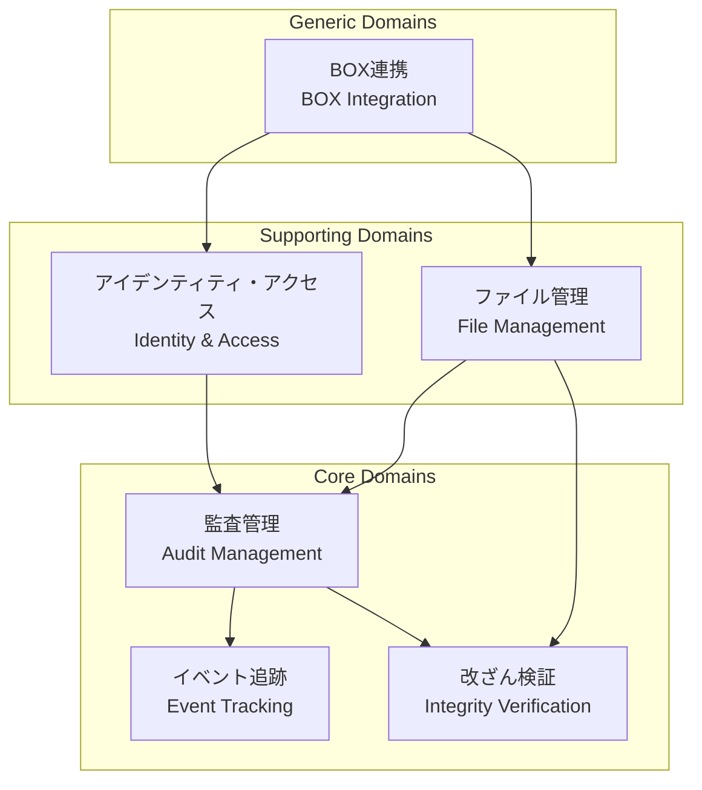
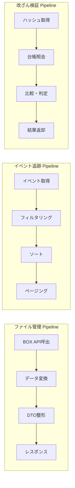
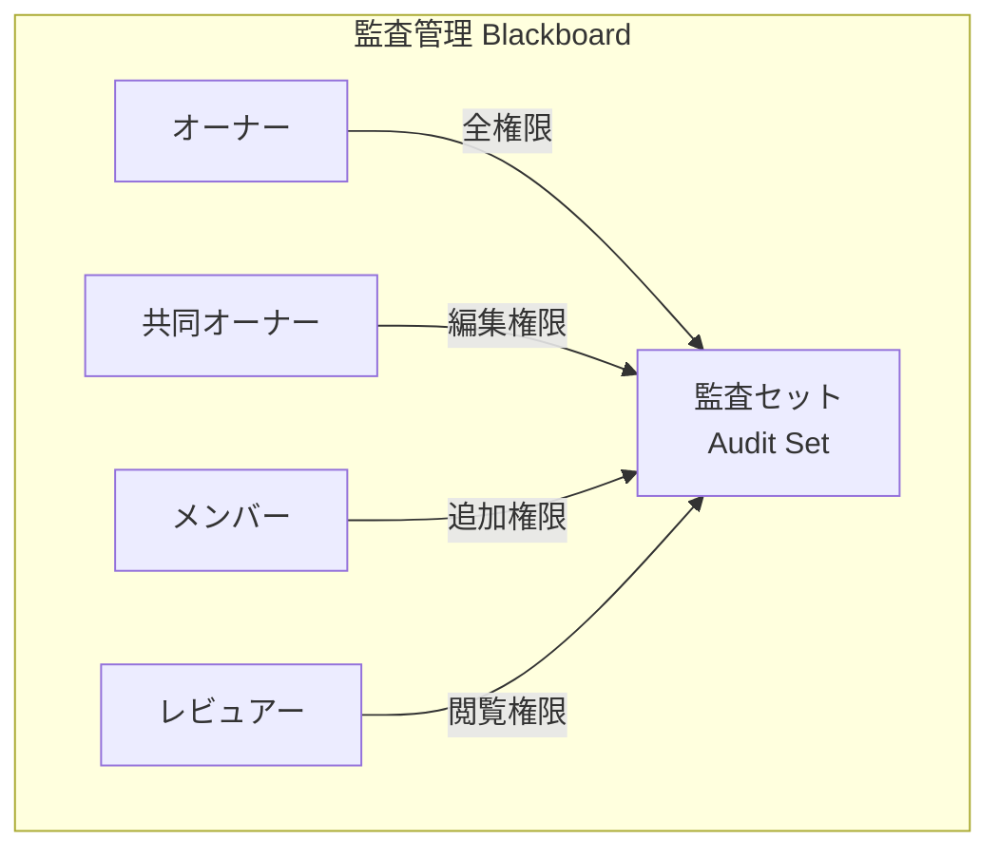
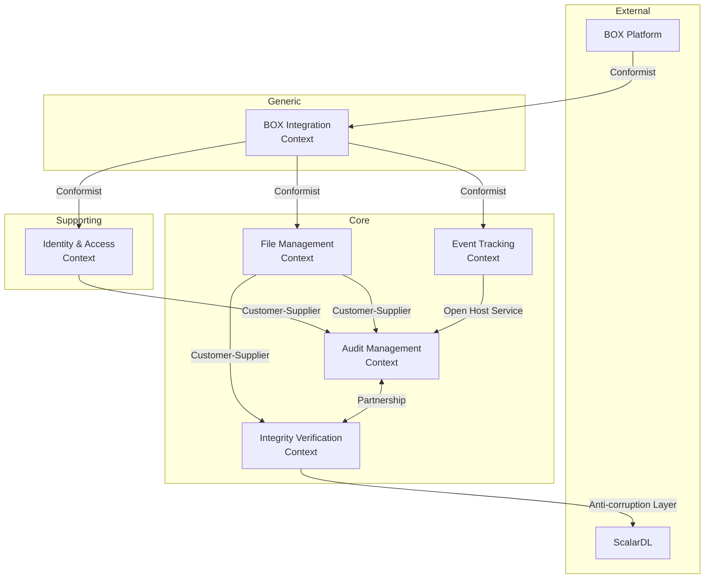
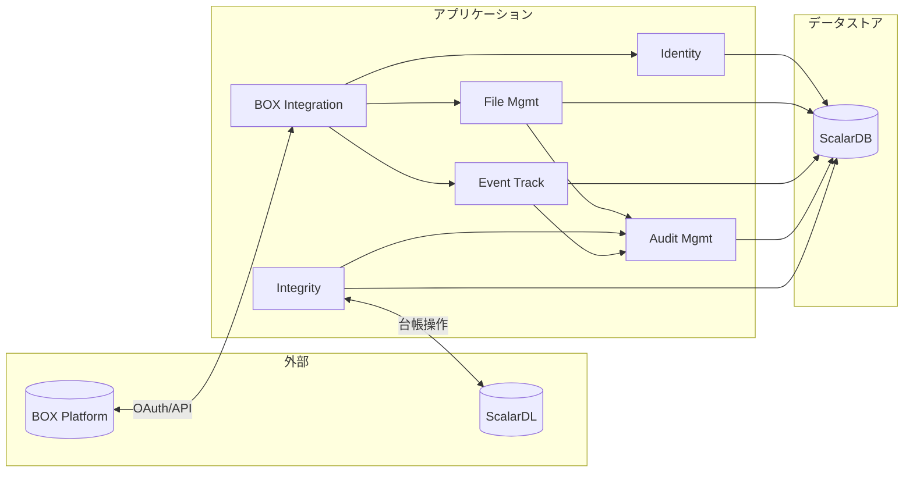

# ドメイン分析 (Domain Analysis)

## 1. ドメイン一覧

### 1.1 識別されたドメイン

| # | ドメイン名 | 英語名 | コアドメイン | 説明 |
|---|-----------|--------|:-----------:|------|
| 1 | アイデンティティ・アクセス | Identity & Access | - | ユーザー認証・認可、組織管理 |
| 2 | 監査管理 | Audit Management | **Core** | 監査セット・グループの管理 |
| 3 | ファイル管理 | File Management | - | BOXファイル・フォルダ操作 |
| 4 | イベント追跡 | Event Tracking | **Core** | イベントログの収集・検索 |
| 5 | 改ざん検証 | Integrity Verification | **Core** | ScalarDLによる改ざん検出 |
| 6 | BOX連携 | BOX Integration | - | BOX Platform API連携 |

### 1.2 ドメイン階層



---

## 2. ドメインタイプ分類（ビジネス構造軸）

### 2.1 分類結果

| ドメイン | タイプ | 理由 |
|---------|-------|------|
| アイデンティティ・アクセス | **Dialogue** | 認証フロー、セッション管理、リアルタイム権限チェック |
| 監査管理 | **Blackboard** | 複数ユーザーによる監査セットへの協調的アクセス |
| ファイル管理 | **Pipeline** | ファイル情報取得→変換→表示の順次処理 |
| イベント追跡 | **Pipeline** | イベント収集→保存→検索→表示の順次処理 |
| 改ざん検証 | **Pipeline** | 登録→検証→結果取得の順次処理 |
| BOX連携 | **Dialogue** | BOX API とのリアルタイム通信 |

### 2.2 タイプ別詳細

#### Pipeline Domain（順次処理型）

| ドメイン | 入力 | 処理フロー | 出力 |
|---------|-----|-----------|------|
| ファイル管理 | BOXファイルID | API呼出→変換→整形 | ファイル詳細DTO |
| イベント追跡 | 日付範囲・フィルタ | 取得→フィルタ→ソート | イベントリスト |
| 改ざん検証 | アイテムID | 台帳照会→比較→判定 | 検証結果 |



#### Blackboard Domain（協調型）

| ドメイン | 共有リソース | 競合管理 | 協調パターン |
|---------|------------|---------|------------|
| 監査管理 | 監査セット | ACL・ロール | オーナー/コラボレーター権限 |



#### Dialogue Domain（対話型）

| ドメイン | インタラクション | セッション | イベント駆動 |
|---------|----------------|-----------|------------|
| アイデンティティ・アクセス | OAuth認証フロー | JWT管理 | ログイン/ログアウト |
| BOX連携 | API呼出・応答 | 接続プール | トークン更新 |

---

## 3. サービスカテゴリ分類（マイクロサービス境界軸）

### 3.1 分類結果

| ドメイン | カテゴリ | 理由 |
|---------|--------|------|
| アイデンティティ・アクセス | **Supporting** | 全ドメインから利用される横断的機能 |
| 監査管理 | **Process** | 複数ステップのワークフロー、ステート管理 |
| ファイル管理 | **Master** | ファイル情報のCRUD、参照データ提供 |
| イベント追跡 | **Master** | イベントデータの蓄積・検索 |
| 改ざん検証 | **Process** | 検証ワークフロー、状態遷移管理 |
| BOX連携 | **Integration** | 外部APIアダプタ、プロトコル変換 |

### 3.2 カテゴリ別詳細

#### Process Domain（プロセス型）

**監査管理サービス**
```
状態遷移:
作成 → アイテム追加 → コラボレーター招待 → 検証実行 → 完了

トランザクション境界:
- 監査セット作成 + 初期コラボレーター設定
- アイテム追加 + 監視ステータス更新
- コラボレーター変更 + ACL更新
```

**改ざん検証サービス**
```
状態遷移:
未監視 → 監視中 → 検証待ち → 検証済み(正常/改ざん)

トランザクション境界:
- 監視登録 + ScalarDL台帳登録
- 検証実行 + 結果保存
```

#### Master Domain（マスタ型）

**ファイル管理サービス**
```
責務:
- ファイル/フォルダ情報の取得・キャッシュ
- バージョン履歴の管理
- SHA1ベースのファイル重複検出
```

**イベント追跡サービス**
```
責務:
- BOXイベントの収集・保存
- 日付/ユーザー/タイプでの検索
- 監査ログの記録
```

#### Integration Domain（統合型）

**BOX連携サービス**
```
責務:
- BOX API認証・接続管理
- API呼び出しのラッピング
- レート制限・リトライ処理
- エラー変換
```

#### Supporting Domain（サポート型）

**アイデンティティ・アクセスサービス**
```
責務:
- ユーザー認証（BOX OAuth / パスワード）
- JWT発行・検証
- ロール・権限管理
- 組織管理
```

---

## 4. 境界づけられたコンテキスト

### 4.1 Identity & Access Context

**概要**

ユーザーの認証・認可を担当するコンテキスト。BOX OAuthとパスワード認証の両方をサポート。

**ユビキタス言語**

| 用語 | 定義 | 他コンテキストとの違い |
|-----|------|---------------------|
| User | システム利用者 | 監査管理では「コラボレーター」として参照 |
| Role | システム権限（Admin/General/External） | 監査管理では「コラボレーターロール」が別途存在 |
| Organization | BOX Enterprise組織 | - |
| Token | 認証トークン（JWT/BOX） | - |

**含まれるエンティティ**
- User
- UserToken
- UserOtp
- Organization
- RoleUser

**提供する機能**
- ログイン / ログアウト
- トークン発行・更新
- ユーザーCRUD
- ロール管理
- パスワードリセット

**依存するコンテキスト**
- BOX Integration: OAuth認証フロー

---

### 4.2 Audit Management Context

**概要**

監査セットと監査グループを管理するコアコンテキスト。監査対象のグループ化とアクセス制御を提供。

**ユビキタス言語**

| 用語 | 定義 | 他コンテキストとの違い |
|-----|------|---------------------|
| AuditSet | 監査対象ファイルの集合 | - |
| AuditSetItem | 監査セットに登録されたアイテム | File Mgmtでは「Item」 |
| Collaborator | 監査セットへのアクセス権を持つユーザー | Identityでは「User」 |
| AuditGroup | ユーザーのグループ | - |
| Owner | 監査セットの所有者（全権限） | - |
| CoOwner | 共同所有者（編集権限） | - |

**含まれるエンティティ**
- AuditSet
- AuditSetItem
- AuditSetCollaborators
- AuditGroup
- UserAuditGroup
- AuditGrpAuditSetMapping

**提供する機能**
- 監査セットCRUD
- アイテム追加・削除
- コラボレーター管理
- 監査グループ管理
- アクセス制御

**依存するコンテキスト**
- Identity & Access: ユーザー情報取得
- File Management: アイテム詳細取得
- Integrity Verification: 改ざん検証実行

---

### 4.3 File Management Context

**概要**

BOXのファイル・フォルダ情報を管理するコンテキスト。BOX APIからのデータ取得と整形を担当。

**ユビキタス言語**

| 用語 | 定義 | 他コンテキストとの違い |
|-----|------|---------------------|
| Item | ファイルまたはフォルダ | 監査管理では「AuditSetItem」としてラップ |
| ItemStatus | 監視・検証ステータス | - |
| FileVersion | ファイルのバージョン履歴 | - |
| SHA1 | ファイル内容のハッシュ | - |

**含まれるエンティティ**
- Item
- ItemStatus
- ItemEvents
- ItemsBySha1

**提供する機能**
- ファイル詳細取得
- フォルダ内容一覧
- バージョン履歴取得
- 同一内容ファイル検索

**依存するコンテキスト**
- BOX Integration: BOX API呼び出し
- Identity & Access: アクセストークン取得

---

### 4.4 Event Tracking Context

**概要**

BOXエンタープライズイベントの収集・検索を担当するコンテキスト。監査証跡として機能。

**ユビキタス言語**

| 用語 | 定義 | 他コンテキストとの違い |
|-----|------|---------------------|
| Event | BOXで発生した操作記録 | - |
| EnterpriseEvent | エンタープライズ全体のイベント | - |
| EventType | イベントの種類（UPLOAD/DOWNLOAD等） | - |
| PositionTracker | イベント取得の継続位置 | - |

**含まれるエンティティ**
- Events
- EnterpriseEventLogs
- PositionTracker
- AuditorLogs
- SystemEventDates

**提供する機能**
- 日付範囲でのイベント検索
- ユーザー別フィルタリング
- イベントタイプ別フィルタリング
- 外部監査人アクセスログ

**依存するコンテキスト**
- BOX Integration: エンタープライズイベント取得
- Identity & Access: ユーザー情報

---

### 4.5 Integrity Verification Context

**概要**

ScalarDLを使用したファイル改ざん検証を担当するコンテキスト。台帳ベースの不変記録を提供。

**ユビキタス言語**

| 用語 | 定義 | 他コンテキストとの違い |
|-----|------|---------------------|
| Asset | ScalarDL台帳に登録されたレコード | - |
| TamperingStatus | 改ざん検証結果 | - |
| Contract | ScalarDLスマートコントラクト | - |

**含まれるエンティティ**
- (ScalarDL内部で管理)

**提供する機能**
- ファイルハッシュの台帳登録
- 改ざん検証実行
- 検証ステータス取得

**依存するコンテキスト**
- File Management: ファイルハッシュ取得
- (外部) ScalarDL Auditor/Ledger

---

### 4.6 BOX Integration Context

**概要**

BOX Platform APIとの連携を担当するコンテキスト。API認証、呼び出し、エラーハンドリングを抽象化。

**ユビキタス言語**

| 用語 | 定義 | 他コンテキストとの違い |
|-----|------|---------------------|
| BoxAPIConnection | BOX APIへの接続 | - |
| EnterpriseID | BOX Enterprise識別子 | - |
| ServiceAccount | BOX API用サービスアカウント | - |

**含まれるエンティティ**
- (外部BOX Platform)

**提供する機能**
- OAuth認証フロー
- API接続管理
- ファイル/フォルダAPI呼び出し
- イベントAPI呼び出し

**依存するコンテキスト**
- (外部) BOX Platform

---

## 5. コンテキストマップ

### 5.1 関係パターン一覧

| 上流 | 下流 | パターン | 説明 |
|-----|------|---------|------|
| BOX Integration | File Management | **Conformist** | BOX APIの仕様に従う |
| BOX Integration | Event Tracking | **Conformist** | BOX イベント形式に従う |
| BOX Integration | Identity & Access | **Conformist** | BOX OAuth仕様に従う |
| Identity & Access | Audit Management | **Customer-Supplier** | ユーザー情報を提供 |
| File Management | Audit Management | **Customer-Supplier** | アイテム情報を提供 |
| Audit Management | Integrity Verification | **Partnership** | 検証対象を協調管理 |
| File Management | Integrity Verification | **Customer-Supplier** | ハッシュ情報を提供 |
| Event Tracking | Audit Management | **Open Host Service** | イベント検索APIを公開 |

### 5.2 コンテキストマップ図



### 5.3 データフロー



---

## 6. 課題と推奨事項

### 6.1 境界の曖昧さ

| 課題 | 現状 | 推奨 |
|------|------|------|
| ユーザーとコラボレーターの二重管理 | Userモデルが両コンテキストで使用 | Collaboratorを独立エンティティ化 |
| 監査セットアイテムとアイテムの関係 | 強結合 | 参照IDのみ保持、イベント駆動更新 |
| BOX連携の分散 | 各サービスで直接呼び出し | BOX Integration経由に統一 |

### 6.2 トランザクション境界の問題

| 問題 | 影響 | 対策 |
|------|------|------|
| 複数コンテキストをまたぐトランザクション | データ整合性リスク | Sagaパターン導入 |
| ScalarDLとScalarDBの二重書き込み | 部分失敗リスク | 補償トランザクション設計 |

### 6.3 推奨アクション

1. **短期（1-3ヶ月）**
   - BOX Integration Contextの明確化
   - Collaboratorエンティティの独立化

2. **中期（3-6ヶ月）**
   - コンテキスト間通信のAPI化
   - イベント駆動アーキテクチャの部分導入

3. **長期（6-12ヶ月）**
   - 各コンテキストのマイクロサービス化
   - Sagaパターンによる分散トランザクション管理

---

*Generated: 2025-12-26*
*Source: scalar-event-log-fetcher-main*
