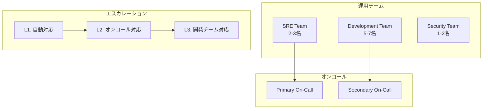
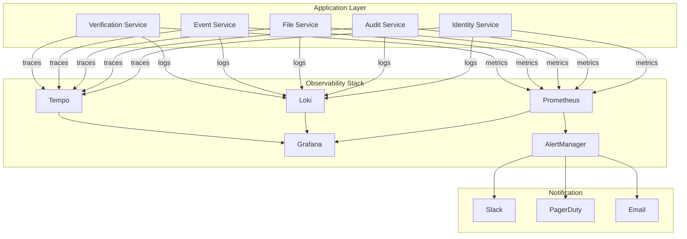
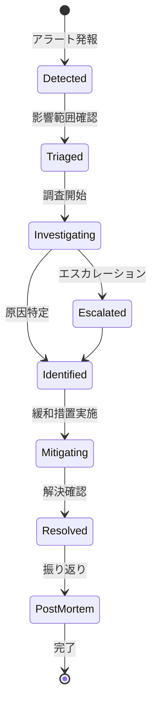
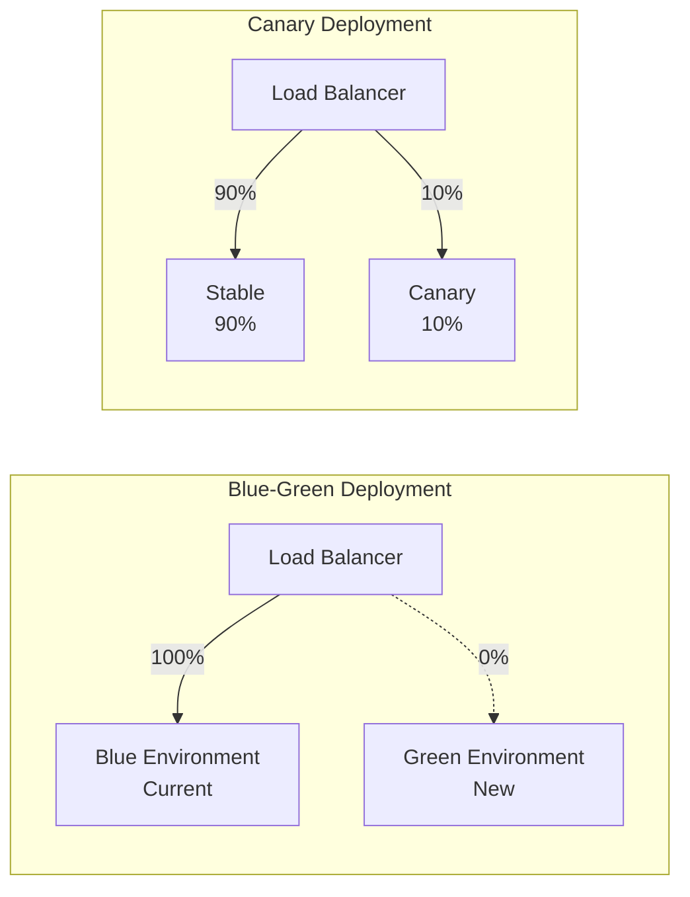
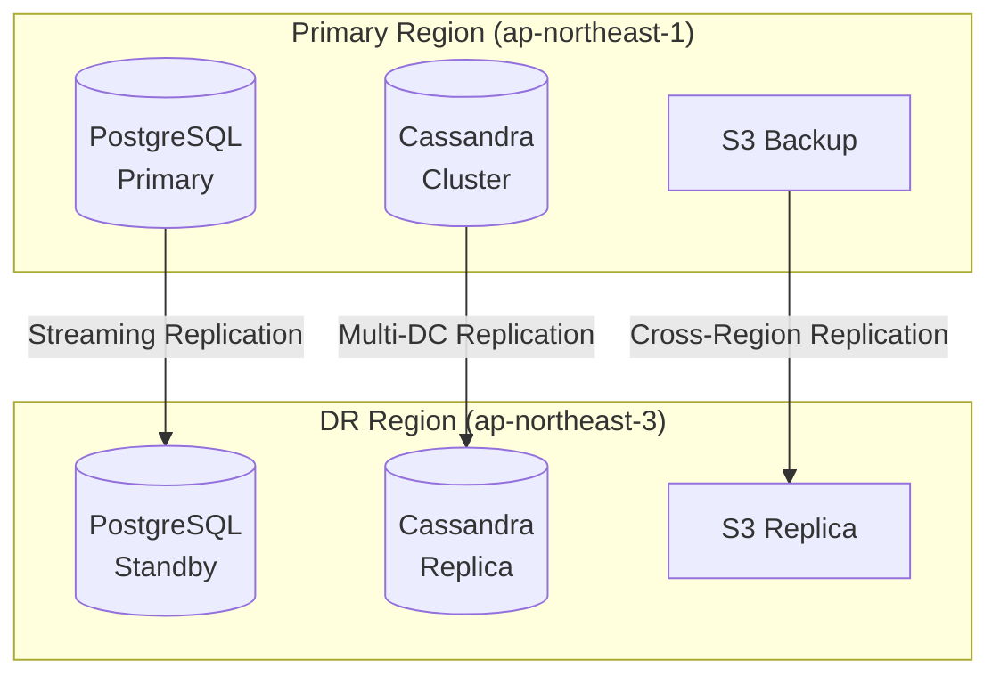
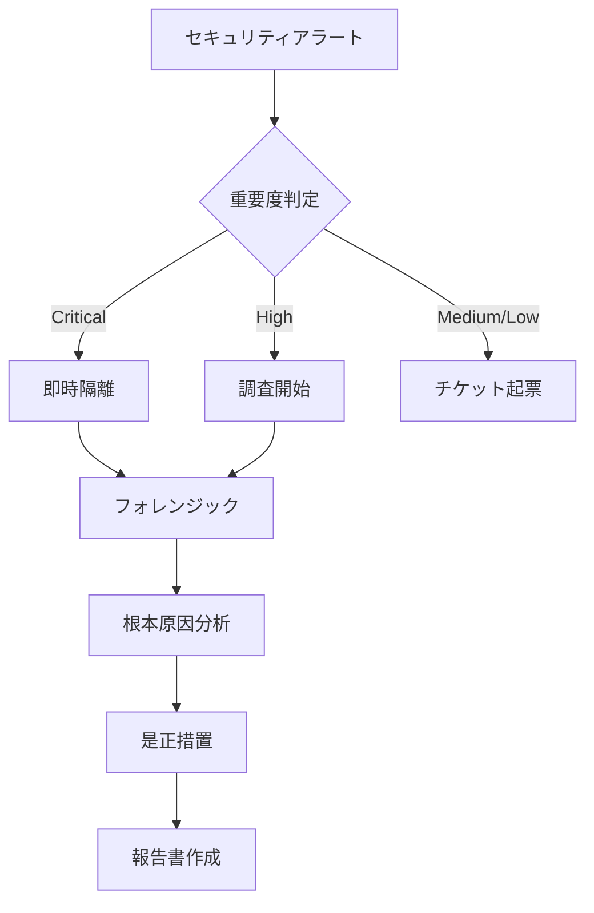

# 運用計画書

## 1. エグゼクティブサマリー

### 1.1 運用目標

| 指標 | 目標値 | 測定方法 |
|------|--------|----------|
| **可用性** | 99.9% (月間43分以下のダウンタイム) | Prometheus/Grafana |
| **レイテンシ P99** | < 500ms | APM (Datadog/NewRelic) |
| **スループット** | > 1000 TPS | Load Testing |
| **MTTR** | < 30分 | Incident Tracking |
| **デプロイ頻度** | 週1回以上 | CI/CD Pipeline |

### 1.2 運用体制



---

## 2. インフラストラクチャ運用

### 2.1 Kubernetes クラスタ管理

#### クラスタ構成

```yaml
# 本番環境クラスタ構成
production:
  control_plane:
    nodes: 3
    instance_type: m5.xlarge

  worker_pools:
    - name: general
      nodes: 3-10
      instance_type: m5.2xlarge
      autoscaling: true

    - name: scalardb
      nodes: 3
      instance_type: r5.2xlarge
      taints:
        - key: workload
          value: scalardb
          effect: NoSchedule

    - name: monitoring
      nodes: 2
      instance_type: m5.large
```

#### ノード管理手順

```bash
# ノードのドレイン（メンテナンス前）
kubectl drain <node-name> --ignore-daemonsets --delete-emptydir-data

# ノードの復帰
kubectl uncordon <node-name>

# ノードの状態確認
kubectl get nodes -o wide
kubectl describe node <node-name>
```

### 2.2 データベース運用

#### PostgreSQL運用

| タスク | 頻度 | 担当 |
|--------|------|------|
| バックアップ確認 | 日次 | 自動 + アラート |
| VACUUM ANALYZE | 週次 | 自動 |
| インデックス再構築 | 月次 | 手動 |
| 統計情報更新 | 日次 | 自動 |
| レプリカ遅延監視 | 常時 | 自動 |

```sql
-- パフォーマンス監視クエリ
SELECT
    schemaname,
    relname,
    seq_scan,
    idx_scan,
    n_live_tup,
    n_dead_tup,
    last_vacuum,
    last_autovacuum
FROM pg_stat_user_tables
WHERE schemaname IN ('identity', 'audit', 'file')
ORDER BY n_dead_tup DESC;

-- 長時間クエリの検出
SELECT
    pid,
    now() - pg_stat_activity.query_start AS duration,
    query,
    state
FROM pg_stat_activity
WHERE (now() - pg_stat_activity.query_start) > interval '5 minutes';
```

#### Cassandra運用

| タスク | 頻度 | 担当 |
|--------|------|------|
| nodetool repair | 週次 | 自動 |
| Compaction監視 | 常時 | 自動 |
| スナップショット | 日次 | 自動 |
| ガベージコレクション | 週次 | 自動 |

```bash
# クラスタ状態確認
nodetool status

# リペア実行
nodetool repair -pr event

# Compaction状態
nodetool compactionstats
```

---

## 3. 監視・アラート設計

### 3.1 監視アーキテクチャ



### 3.2 アラートルール

#### Critical アラート (即時対応)

```yaml
groups:
  - name: critical
    rules:
      - alert: ServiceDown
        expr: up{job=~"identity-service|audit-service|file-service|event-service|verification-service"} == 0
        for: 1m
        labels:
          severity: critical
        annotations:
          summary: "Service {{ $labels.job }} is down"

      - alert: ScalarDBClusterUnhealthy
        expr: scalardb_cluster_healthy_nodes < 2
        for: 1m
        labels:
          severity: critical
        annotations:
          summary: "ScalarDB Cluster has less than 2 healthy nodes"

      - alert: DatabaseConnectionExhausted
        expr: scalardb_jdbc_connection_pool_active / scalardb_jdbc_connection_pool_max > 0.9
        for: 5m
        labels:
          severity: critical
        annotations:
          summary: "Database connection pool is nearly exhausted"

      - alert: TransactionErrorRateHigh
        expr: rate(scalardb_transaction_errors_total[5m]) / rate(scalardb_transactions_total[5m]) > 0.05
        for: 5m
        labels:
          severity: critical
        annotations:
          summary: "Transaction error rate exceeds 5%"
```

#### Warning アラート (1時間以内対応)

```yaml
groups:
  - name: warning
    rules:
      - alert: HighLatency
        expr: histogram_quantile(0.99, rate(http_request_duration_seconds_bucket[5m])) > 0.5
        for: 10m
        labels:
          severity: warning
        annotations:
          summary: "P99 latency exceeds 500ms"

      - alert: PodRestartLoop
        expr: increase(kube_pod_container_status_restarts_total[1h]) > 3
        for: 5m
        labels:
          severity: warning
        annotations:
          summary: "Pod {{ $labels.pod }} is in restart loop"

      - alert: DiskSpaceRunningLow
        expr: (node_filesystem_avail_bytes / node_filesystem_size_bytes) * 100 < 20
        for: 30m
        labels:
          severity: warning
        annotations:
          summary: "Disk space is below 20%"
```

### 3.3 ダッシュボード

#### サービス概要ダッシュボード

| パネル | メトリクス | 閾値 |
|--------|----------|------|
| リクエストレート | `rate(http_requests_total[5m])` | - |
| エラーレート | `rate(http_requests_total{status=~"5.."}[5m])` | < 1% |
| レイテンシ P50/P99 | `histogram_quantile(0.99, ...)` | < 500ms |
| サービス可用性 | `avg(up{job="..."})` | > 99.9% |
| アクティブコネクション | `scalardb_jdbc_connection_pool_active` | < 80% |

---

## 4. インシデント管理

### 4.1 インシデント分類

| レベル | 影響 | 対応時間 | エスカレーション |
|--------|------|----------|-----------------|
| **P1 (Critical)** | サービス全停止 | 15分以内 | 即時エスカレーション |
| **P2 (High)** | 主要機能障害 | 30分以内 | 1時間後エスカレーション |
| **P3 (Medium)** | 一部機能障害 | 4時間以内 | 翌営業日 |
| **P4 (Low)** | 軽微な問題 | 翌営業日 | なし |

### 4.2 インシデント対応フロー



### 4.3 ランブック

#### サービス障害時の対応

```bash
# 1. Pod状態確認
kubectl get pods -n production -l app=<service-name>

# 2. ログ確認
kubectl logs -n production -l app=<service-name> --tail=100

# 3. イベント確認
kubectl get events -n production --sort-by='.lastTimestamp'

# 4. 強制再起動（必要な場合）
kubectl rollout restart deployment/<service-name> -n production

# 5. ロールバック（必要な場合）
kubectl rollout undo deployment/<service-name> -n production
```

#### ScalarDB障害時の対応

```bash
# 1. クラスタ状態確認
kubectl get pods -n scalardb-system

# 2. Coordinator状態確認
kubectl exec -n scalardb-system scalardb-0 -- \
  curl -s http://localhost:8080/health

# 3. トランザクションログ確認
kubectl logs -n scalardb-system scalardb-0 | grep -i "transaction"

# 4. 強制ロールバック（必要な場合）
# ※ 専門家の判断が必要
```

#### データベース障害時の対応

```bash
# PostgreSQL
# 1. 接続確認
psql -h postgres-primary -U admin -c "SELECT 1"

# 2. レプリケーション状態
psql -h postgres-primary -U admin -c "SELECT * FROM pg_stat_replication"

# 3. フェイルオーバー実行（Patroni使用時）
patronictl -c /etc/patroni/patroni.yml failover

# Cassandra
# 1. クラスタ状態
nodetool status

# 2. ノード再起動
sudo systemctl restart cassandra
```

---

## 5. デプロイメント運用

### 5.1 デプロイメント戦略



### 5.2 デプロイチェックリスト

#### デプロイ前

- [ ] 全テストがパス
- [ ] セキュリティスキャン完了
- [ ] パフォーマンステスト完了
- [ ] DBマイグレーションレビュー完了
- [ ] ロールバック手順確認
- [ ] 変更内容のドキュメント化

#### デプロイ中

- [ ] Canary デプロイ実行
- [ ] エラーレート監視
- [ ] レイテンシ監視
- [ ] ログ異常確認
- [ ] 10分間の安定性確認

#### デプロイ後

- [ ] フルロールアウト完了
- [ ] Smoke Test実行
- [ ] アラート確認
- [ ] ドキュメント更新

### 5.3 ロールバック手順

```bash
# 1. 即時ロールバック（Deployment）
kubectl rollout undo deployment/<service-name> -n production

# 2. 特定バージョンへのロールバック
kubectl rollout undo deployment/<service-name> -n production --to-revision=<revision>

# 3. ロールバック状態確認
kubectl rollout status deployment/<service-name> -n production

# 4. DBマイグレーションのロールバック（必要な場合）
flyway -url=jdbc:postgresql://... -user=... -password=... undo
```

---

## 6. 災害復旧計画 (DR)

### 6.1 DR目標

| 指標 | 目標値 |
|------|--------|
| **RTO** (Recovery Time Objective) | 1時間 |
| **RPO** (Recovery Point Objective) | 5分 |

### 6.2 バックアップ戦略



### 6.3 復旧手順

#### リージョン障害時

```bash
# 1. DRリージョンへのDNS切り替え
aws route53 change-resource-record-sets \
  --hosted-zone-id $ZONE_ID \
  --change-batch file://dr-dns-switch.json

# 2. PostgreSQL スタンバイ昇格
patronictl -c /etc/patroni/patroni.yml switchover --master <dr-node>

# 3. アプリケーション接続先更新
kubectl set env deployment/identity-service \
  DATABASE_URL=jdbc:postgresql://dr-postgres:5432/scalardb

# 4. 動作確認
curl https://api.dr.example.com/health
```

---

## 7. 定期メンテナンス

### 7.1 メンテナンススケジュール

| タスク | 頻度 | 所要時間 | ダウンタイム |
|--------|------|----------|-------------|
| セキュリティパッチ適用 | 月次 | 2時間 | なし (ローリング) |
| Kubernetesアップグレード | 四半期 | 4時間 | なし (ローリング) |
| DBバキューム | 週次 | 1時間 | なし |
| 証明書更新 | 年次 | 1時間 | なし |
| 負荷テスト | 四半期 | 4時間 | なし (ステージング) |

### 7.2 メンテナンスウィンドウ

- **定期メンテナンス**: 毎月第3日曜日 02:00-06:00 JST
- **緊急メンテナンス**: 随時（事前通知24時間前）

### 7.3 メンテナンス通知テンプレート

```markdown
## メンテナンス通知

**日時**: 2025-XX-XX 02:00 - 06:00 (JST)
**対象**: Scalar Auditor for BOX
**影響**: サービスへの影響なし（ローリングアップデート）

### 作業内容
- Kubernetesノードのセキュリティパッチ適用
- データベースの定期メンテナンス

### 問い合わせ先
- Slack: #scalar-auditor-support
- Email: support@example.com
```

---

## 8. 容量計画

### 8.1 リソース使用量予測

| リソース | 現在 | 6ヶ月後 | 12ヶ月後 |
|----------|------|---------|----------|
| CPU | 40% | 55% | 70% |
| Memory | 50% | 65% | 80% |
| Storage (PostgreSQL) | 100GB | 200GB | 400GB |
| Storage (Cassandra) | 500GB | 1TB | 2TB |

### 8.2 スケーリングトリガー

```yaml
# HPA設定
apiVersion: autoscaling/v2
kind: HorizontalPodAutoscaler
metadata:
  name: identity-service-hpa
spec:
  scaleTargetRef:
    apiVersion: apps/v1
    kind: Deployment
    name: identity-service
  minReplicas: 3
  maxReplicas: 10
  metrics:
    - type: Resource
      resource:
        name: cpu
        target:
          type: Utilization
          averageUtilization: 70
    - type: Resource
      resource:
        name: memory
        target:
          type: Utilization
          averageUtilization: 80
```

---

## 9. セキュリティ運用

### 9.1 セキュリティ監視

| 監視項目 | ツール | 頻度 |
|----------|--------|------|
| 脆弱性スキャン | Trivy | デプロイ毎 |
| ランタイムセキュリティ | Falco | リアルタイム |
| シークレット監査 | Vault Audit | リアルタイム |
| ネットワークポリシー | Cilium | リアルタイム |

### 9.2 セキュリティインシデント対応



---

## 10. SLA/SLO管理

### 10.1 SLO定義

| サービス | SLI | SLO | Error Budget |
|----------|-----|-----|--------------|
| Identity Service | 可用性 | 99.9% | 43分/月 |
| Audit Service | 可用性 | 99.95% | 21分/月 |
| Verification Service | レイテンシ P99 | < 1秒 | - |
| Event Service | スループット | > 500 TPS | - |

### 10.2 Error Budget ポリシー

```
Error Budget残量 > 50%: 通常開発
Error Budget残量 20-50%: 新機能凍結、信頼性改善優先
Error Budget残量 < 20%: インシデント対応のみ
Error Budget枯渇: サービス凍結、全リソース投入
```

---

*Generated: 2025-12-26*
*Version: 1.0.0*
*Source: Scalar Auditor for BOX - Microservices Design*
