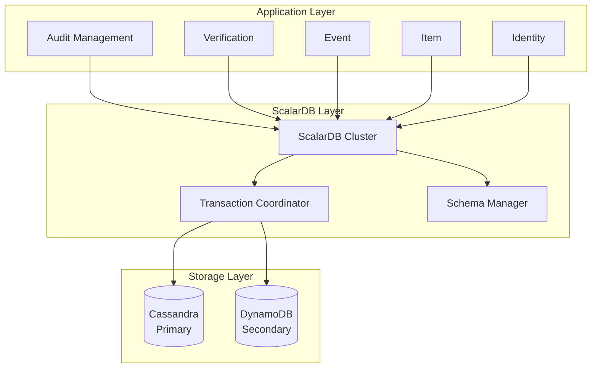
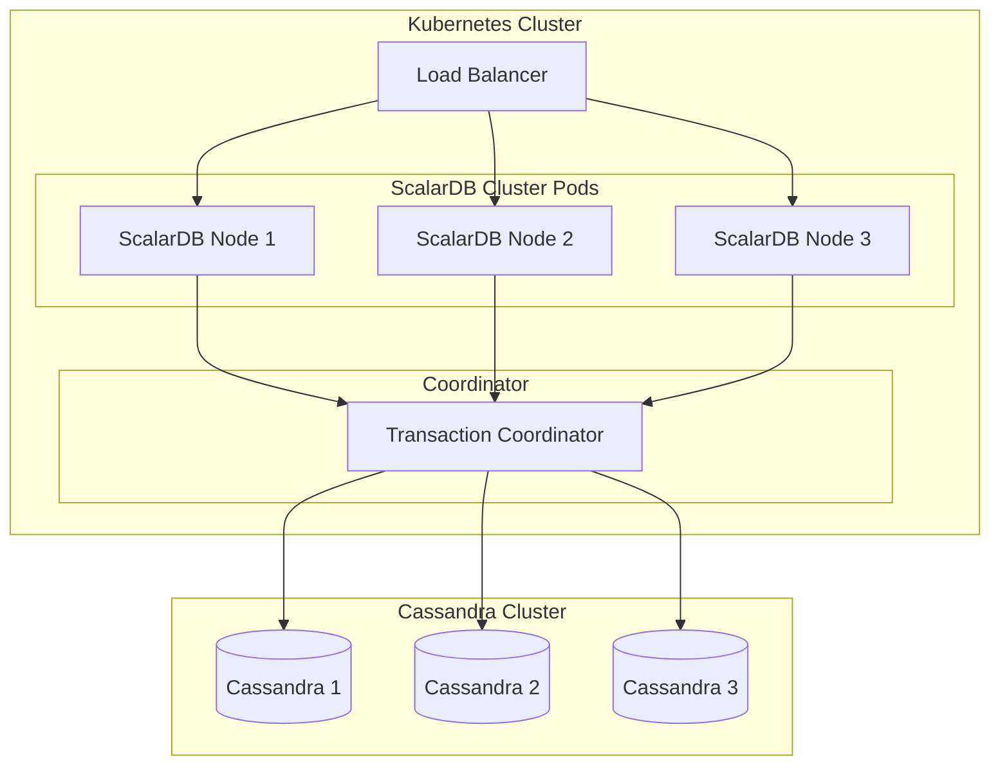
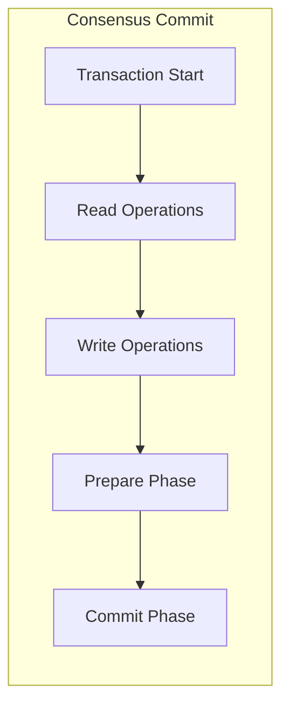

# ScalarDB アーキテクチャ設計

## 1. ScalarDB概要

### 1.1 ScalarDBの役割



### 1.2 採用理由

| 特徴 | 利点 |
|------|------|
| 分散トランザクション | 複数テーブル間のACID保証 |
| マルチストレージ | Cassandra + 他DBの統合 |
| スキーマ管理 | 一貫したスキーマ操作 |
| スケーラビリティ | 水平スケーリング対応 |

---

## 2. クラスター構成

### 2.1 本番環境構成



### 2.2 環境別構成

| 環境 | ScalarDB Nodes | Cassandra Nodes | 備考 |
|------|---------------|-----------------|------|
| 開発 | 1 | 1 | ローカル開発 |
| ステージング | 2 | 3 | 検証環境 |
| 本番 | 3 | 3 | 高可用性 |

### 2.3 リソース要件

| コンポーネント | CPU | Memory | Storage |
|---------------|-----|--------|---------|
| ScalarDB Node | 2 cores | 4GB | 10GB |
| Cassandra Node | 4 cores | 8GB | 100GB SSD |
| Coordinator | 1 core | 2GB | 5GB |

---

## 3. 接続設定

### 3.1 scalardb.properties

```properties
# Transaction mode
scalar.db.transaction_manager=consensus-commit

# Storage configuration
scalar.db.storage=cassandra
scalar.db.contact_points=cassandra-0,cassandra-1,cassandra-2
scalar.db.contact_port=9042
scalar.db.username=${SCALARDB_USERNAME}
scalar.db.password=${SCALARDB_PASSWORD}

# Consensus commit settings
scalar.db.consensus_commit.isolation_level=SERIALIZABLE
scalar.db.consensus_commit.serializable_strategy=EXTRA_READ

# Connection pool
scalar.db.connection_pool.min_idle=5
scalar.db.connection_pool.max_idle=10
scalar.db.connection_pool.max_total=20

# Retry settings
scalar.db.retry.max_retries=10
scalar.db.retry.initial_interval_millis=100
scalar.db.retry.max_interval_millis=10000
scalar.db.retry.multiplier=2.0
```

### 3.2 Spring Boot統合

```java
@Configuration
public class ScalarDbConfig {
    
    @Bean
    public DistributedTransactionManager transactionManager() throws Exception {
        Properties props = new Properties();
        props.load(getClass().getResourceAsStream("/scalardb.properties"));
        return TransactionFactory.create(props).getTransactionManager();
    }
    
    @Bean
    public DistributedStorage storage() throws Exception {
        Properties props = new Properties();
        props.load(getClass().getResourceAsStream("/scalardb.properties"));
        return StorageFactory.create(props);
    }
}
```

---

## 4. ネームスペース設計

### 4.1 サービス別ネームスペース

```
scalar_auditor/
├── audit/          # Audit Management Service
│   ├── audit_set
│   ├── audit_group
│   ├── audit_set_collaborators
│   └── audit_set_item
├── verification/   # Verification Service
│   ├── item_status
│   └── items_by_sha1
├── event/          # Event Service
│   ├── events
│   ├── item_events
│   ├── auditor_logs
│   └── position_tracker
├── item/           # Item Service
│   └── item
├── identity/       # Identity Service
│   ├── user
│   ├── role_user
│   ├── user_token
│   ├── user_otp
│   ├── user_audit_group
│   └── organization
└── coordinator/    # ScalarDB internal
    └── coordinator_state
```

### 4.2 ネームスペース分離の利点

| 利点 | 説明 |
|------|------|
| サービス独立性 | 各サービスが自身のデータを管理 |
| アクセス制御 | ネームスペース単位で権限設定可能 |
| 移行容易性 | サービス単位でのデータ移行が容易 |
| 監視容易性 | ネームスペース単位でメトリクス取得 |

---

## 5. トランザクション設計

### 5.1 トランザクションモード



### 5.2 分離レベル

| レベル | 用途 | パフォーマンス |
|--------|------|--------------|
| SERIALIZABLE | 強整合性必須操作 | 低 |
| SNAPSHOT | 読み取り中心操作 | 高 |

**推奨設定**:
- 書き込み操作: SERIALIZABLE
- 読み取り専用: SNAPSHOT

### 5.3 トランザクションパターン

```java
@Service
public class AuditSetService {
    
    private final DistributedTransactionManager manager;
    
    public AuditSet createAuditSet(CreateAuditSetRequest request) {
        DistributedTransaction tx = manager.start();
        try {
            // 監査セット作成
            Put auditSetPut = createAuditSetPut(request);
            tx.put(auditSetPut);
            
            // 所有者をコラボレーターとして追加
            Put collaboratorPut = createCollaboratorPut(request);
            tx.put(collaboratorPut);
            
            tx.commit();
            return mapToAuditSet(auditSetPut);
        } catch (Exception e) {
            tx.abort();
            throw new ServiceException("Failed to create audit set", e);
        }
    }
}
```

---

## 6. 高可用性設計

### 6.1 Kubernetes配置

```yaml
apiVersion: apps/v1
kind: StatefulSet
metadata:
  name: scalardb-cluster
spec:
  replicas: 3
  selector:
    matchLabels:
      app: scalardb
  serviceName: scalardb
  template:
    spec:
      affinity:
        podAntiAffinity:
          requiredDuringSchedulingIgnoredDuringExecution:
            - labelSelector:
                matchExpressions:
                  - key: app
                    operator: In
                    values:
                      - scalardb
              topologyKey: kubernetes.io/hostname
      containers:
        - name: scalardb
          image: ghcr.io/scalar-labs/scalardb-cluster-node:3.14
          ports:
            - containerPort: 60053
          resources:
            requests:
              cpu: "2"
              memory: "4Gi"
            limits:
              cpu: "4"
              memory: "8Gi"
          livenessProbe:
            grpc:
              port: 60053
            initialDelaySeconds: 30
            periodSeconds: 10
          readinessProbe:
            grpc:
              port: 60053
            initialDelaySeconds: 5
            periodSeconds: 5
```

### 6.2 障害復旧

| シナリオ | 対応 |
|---------|------|
| ノード障害 | 自動フェイルオーバー |
| データ破損 | Cassandraレプリケーション |
| 全クラスター障害 | バックアップからリストア |

---

## 7. 監視・運用

### 7.1 メトリクス

| メトリクス | 説明 | 閾値 |
|-----------|------|------|
| transaction_latency | トランザクション遅延 | < 100ms |
| transaction_throughput | スループット | > 1000 TPS |
| commit_success_rate | コミット成功率 | > 99.9% |
| abort_rate | アボート率 | < 0.1% |

### 7.2 Prometheus設定

```yaml
scrape_configs:
  - job_name: 'scalardb-cluster'
    static_configs:
      - targets: ['scalardb-0:8080', 'scalardb-1:8080', 'scalardb-2:8080']
    metrics_path: '/metrics'
```

### 7.3 アラート設定

```yaml
groups:
  - name: scalardb
    rules:
      - alert: ScalarDBHighLatency
        expr: histogram_quantile(0.99, scalardb_transaction_latency_seconds_bucket) > 0.5
        for: 5m
        labels:
          severity: warning
        annotations:
          summary: "ScalarDB high latency detected"
          
      - alert: ScalarDBHighAbortRate
        expr: rate(scalardb_transaction_abort_total[5m]) / rate(scalardb_transaction_total[5m]) > 0.01
        for: 5m
        labels:
          severity: critical
        annotations:
          summary: "ScalarDB high abort rate detected"
```

---

## 8. バックアップ・リカバリ

### 8.1 バックアップ戦略

| タイプ | 頻度 | 保持期間 |
|--------|------|---------|
| フルバックアップ | 日次 | 30日 |
| 増分バックアップ | 時間毎 | 7日 |
| スナップショット | 週次 | 90日 |

### 8.2 リカバリ手順

1. Cassandraスナップショットからリストア
2. ScalarDBトランザクションログ適用
3. 整合性チェック実行
4. サービス再開
