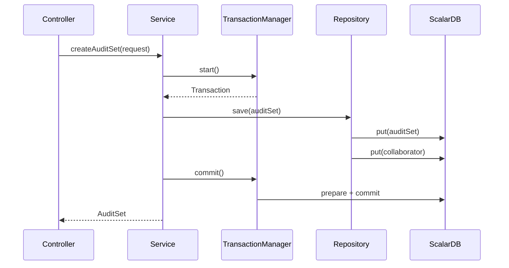
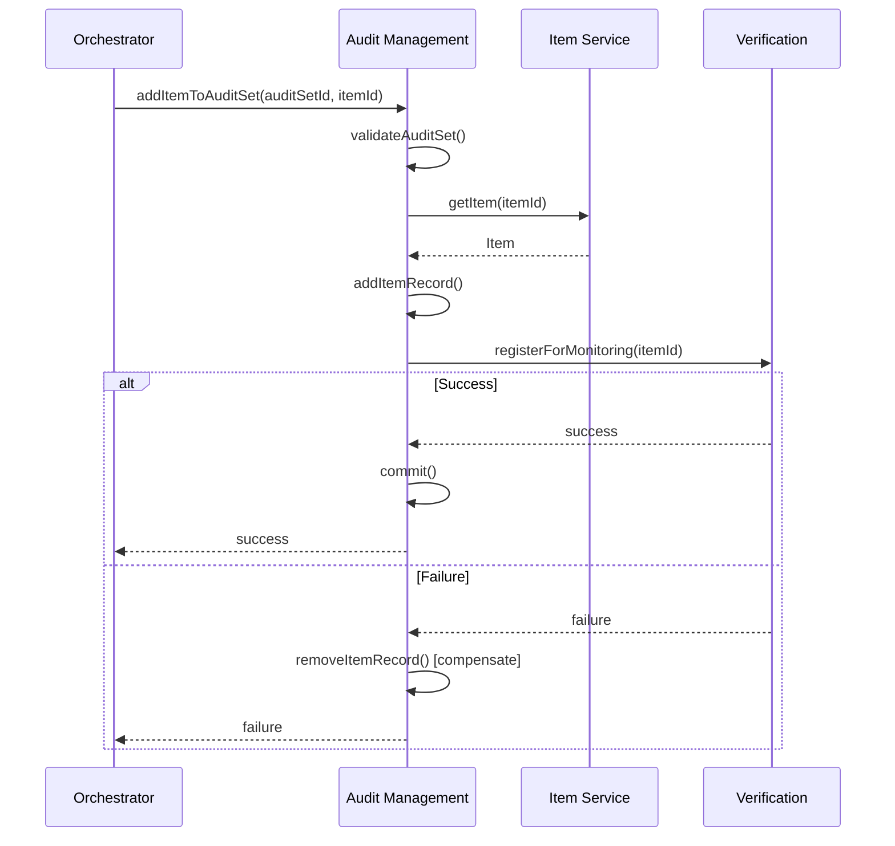
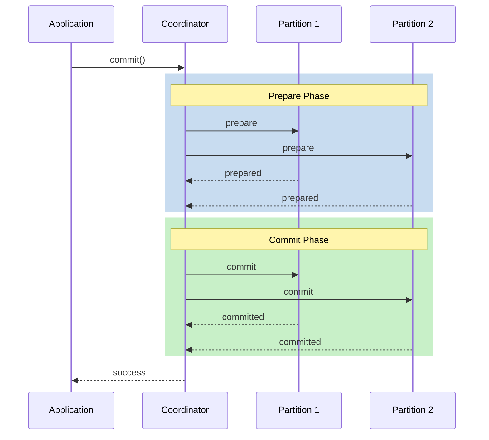

# ScalarDB トランザクション設計

## 1. トランザクションパターン

### 1.1 単一サービストランザクション



**実装例**:
```java
@Service
public class AuditSetService {
    
    @Autowired
    private DistributedTransactionManager transactionManager;
    
    public AuditSet createAuditSet(CreateAuditSetRequest request) {
        DistributedTransaction tx = transactionManager.start();
        try {
            // 監査セット作成
            AuditSet auditSet = AuditSet.builder()
                .id(UUID.randomUUID().toString())
                .name(request.getName())
                .description(request.getDescription())
                .ownerUserId(request.getOwnerId())
                .build();
            
            tx.put(auditSetRepository.toPut(auditSet));
            
            // 所有者をコラボレーターとして追加
            AuditSetCollaborator collaborator = AuditSetCollaborator.builder()
                .auditSetId(auditSet.getId())
                .userEmail(request.getOwnerEmail())
                .role(CollaboratorRole.OWNER)
                .build();
            
            tx.put(collaboratorRepository.toPut(collaborator));
            
            tx.commit();
            return auditSet;
            
        } catch (Exception e) {
            tx.abort();
            throw new ServiceException("Failed to create audit set", e);
        }
    }
}
```

---

### 1.2 クロスサービストランザクション（Saga）



**Sagaオーケストレーター実装**:
```java
@Service
public class AddItemSaga {
    
    @Autowired
    private AuditSetService auditSetService;
    
    @Autowired
    private ItemServiceClient itemClient;
    
    @Autowired
    private VerificationServiceClient verificationClient;
    
    public void execute(String auditSetId, String itemId) {
        SagaContext context = new SagaContext();
        
        try {
            // Step 1: アイテム情報取得
            Item item = itemClient.getItem(itemId);
            
            // Step 2: 監査セットにアイテム追加
            auditSetService.addItem(auditSetId, item);
            context.markCompleted("addItem");
            
            // Step 3: 検証サービスに登録
            verificationClient.registerForMonitoring(itemId);
            context.markCompleted("registerMonitoring");
            
        } catch (Exception e) {
            compensate(context, auditSetId, itemId);
            throw new SagaException("Add item saga failed", e);
        }
    }
    
    private void compensate(SagaContext context, String auditSetId, String itemId) {
        if (context.isCompleted("registerMonitoring")) {
            verificationClient.unregisterFromMonitoring(itemId);
        }
        if (context.isCompleted("addItem")) {
            auditSetService.removeItem(auditSetId, itemId);
        }
    }
}
```

---

## 2. 分離レベルとロック戦略

### 2.1 分離レベル選択

| 操作タイプ | 分離レベル | 理由 |
|-----------|-----------|------|
| 監査セット作成 | SERIALIZABLE | 一意性保証 |
| 監査セット更新 | SERIALIZABLE | 競合防止 |
| アイテム追加 | SERIALIZABLE | 整合性保証 |
| イベント読み取り | SNAPSHOT | 読み取り専用、高速 |
| ステータス確認 | SNAPSHOT | 読み取り専用 |

### 2.2 楽観的ロック

```java
@Service
public class AuditSetService {
    
    public void updateAuditSet(String id, UpdateRequest request) {
        DistributedTransaction tx = transactionManager.start();
        try {
            // 現在の状態を取得
            Optional<Result> result = tx.get(
                Get.newBuilder()
                    .namespace("audit")
                    .table("audit_set")
                    .partitionKey(Key.ofText("audit_set_id", id))
                    .build()
            );
            
            if (result.isEmpty()) {
                throw new NotFoundException("Audit set not found");
            }
            
            // バージョンチェック（楽観的ロック）
            long currentVersion = result.get().getBigInt("version");
            if (currentVersion != request.getExpectedVersion()) {
                throw new OptimisticLockException("Concurrent modification detected");
            }
            
            // 更新
            tx.put(
                Put.newBuilder()
                    .namespace("audit")
                    .table("audit_set")
                    .partitionKey(Key.ofText("audit_set_id", id))
                    .textValue("name", request.getName())
                    .bigIntValue("version", currentVersion + 1)
                    .build()
            );
            
            tx.commit();
            
        } catch (Exception e) {
            tx.abort();
            throw e;
        }
    }
}
```

---

## 3. エラーハンドリング

### 3.1 リトライ戦略

```java
@Configuration
public class TransactionRetryConfig {
    
    @Bean
    public RetryTemplate transactionRetryTemplate() {
        return RetryTemplate.builder()
            .maxAttempts(3)
            .exponentialBackoff(100, 2, 1000)
            .retryOn(TransactionConflictException.class)
            .retryOn(TransactionRetryableException.class)
            .build();
    }
}

@Service
public class AuditSetService {
    
    @Autowired
    private RetryTemplate retryTemplate;
    
    public AuditSet createWithRetry(CreateAuditSetRequest request) {
        return retryTemplate.execute(context -> {
            return createAuditSet(request);
        });
    }
}
```

### 3.2 デッドレター処理

```java
@Component
public class TransactionDeadLetterHandler {
    
    @Autowired
    private DeadLetterQueue deadLetterQueue;
    
    public void handleFailedTransaction(
            String transactionId, 
            Object payload, 
            Exception exception) {
        
        DeadLetter letter = DeadLetter.builder()
            .transactionId(transactionId)
            .payload(serialize(payload))
            .errorMessage(exception.getMessage())
            .errorType(exception.getClass().getName())
            .timestamp(Instant.now())
            .retryCount(0)
            .build();
        
        deadLetterQueue.enqueue(letter);
        
        // アラート送信
        alertService.sendAlert("Transaction failed: " + transactionId);
    }
}
```

---

## 4. パフォーマンス最適化

### 4.1 バッチ操作

```java
@Service
public class EventService {
    
    public void saveEventsBatch(List<Event> events) {
        DistributedTransaction tx = transactionManager.start();
        try {
            for (Event event : events) {
                // events テーブル
                tx.put(eventRepository.toPut(event));
                
                // item_events テーブル（非正規化）
                tx.put(itemEventRepository.toPut(event));
            }
            tx.commit();
        } catch (Exception e) {
            tx.abort();
            throw e;
        }
    }
}
```

### 4.2 読み取り最適化

```java
@Service
public class EventQueryService {
    
    @Autowired
    private DistributedStorage storage;  // 読み取り専用
    
    public List<Event> getEventsByDate(String date) {
        // トランザクションなしで高速読み取り
        Scan scan = Scan.newBuilder()
            .namespace("event")
            .table("events")
            .partitionKey(Key.ofText("yyyy_mm_dd", date))
            .ordering(Ordering.desc("event_id"))
            .limit(100)
            .build();
        
        return storage.scan(scan)
            .stream()
            .map(this::toEvent)
            .collect(Collectors.toList());
    }
}
```

---

## 5. 分散トランザクションパターン

### 5.1 Two-Phase Commit（ScalarDB内部）



### 5.2 Outbox Pattern（イベント発行）

```java
@Service
public class AuditSetService {
    
    public AuditSet createAuditSet(CreateAuditSetRequest request) {
        DistributedTransaction tx = transactionManager.start();
        try {
            // 1. 監査セット作成
            AuditSet auditSet = createAuditSetEntity(request);
            tx.put(auditSetRepository.toPut(auditSet));
            
            // 2. Outboxにイベント登録（同一トランザクション）
            OutboxEvent event = OutboxEvent.builder()
                .id(UUID.randomUUID().toString())
                .aggregateType("AuditSet")
                .aggregateId(auditSet.getId())
                .eventType("AuditSetCreated")
                .payload(serialize(auditSet))
                .status("PENDING")
                .build();
            tx.put(outboxRepository.toPut(event));
            
            tx.commit();
            return auditSet;
            
        } catch (Exception e) {
            tx.abort();
            throw e;
        }
    }
}

// Outboxイベントを別プロセスで発行
@Scheduled(fixedRate = 1000)
public void publishOutboxEvents() {
    List<OutboxEvent> pending = outboxRepository.findPending();
    for (OutboxEvent event : pending) {
        try {
            eventPublisher.publish(event);
            outboxRepository.markPublished(event.getId());
        } catch (Exception e) {
            log.error("Failed to publish event: {}", event.getId(), e);
        }
    }
}
```

---

## 6. 監視・デバッグ

### 6.1 トランザクションログ

```java
@Aspect
@Component
public class TransactionLoggingAspect {
    
    @Around("@annotation(Transactional)")
    public Object logTransaction(ProceedingJoinPoint pjp) throws Throwable {
        String txId = UUID.randomUUID().toString();
        long startTime = System.currentTimeMillis();
        
        MDC.put("transactionId", txId);
        log.info("Transaction started: {}", pjp.getSignature().getName());
        
        try {
            Object result = pjp.proceed();
            long duration = System.currentTimeMillis() - startTime;
            log.info("Transaction committed: {} ({}ms)", txId, duration);
            return result;
        } catch (Exception e) {
            long duration = System.currentTimeMillis() - startTime;
            log.error("Transaction aborted: {} ({}ms) - {}", txId, duration, e.getMessage());
            throw e;
        } finally {
            MDC.remove("transactionId");
        }
    }
}
```

### 6.2 メトリクス

```java
@Component
public class TransactionMetrics {
    
    private final MeterRegistry meterRegistry;
    private final Counter commitCounter;
    private final Counter abortCounter;
    private final Timer transactionTimer;
    
    public TransactionMetrics(MeterRegistry meterRegistry) {
        this.meterRegistry = meterRegistry;
        this.commitCounter = Counter.builder("scalardb.transaction.commit")
            .description("Number of committed transactions")
            .register(meterRegistry);
        this.abortCounter = Counter.builder("scalardb.transaction.abort")
            .description("Number of aborted transactions")
            .register(meterRegistry);
        this.transactionTimer = Timer.builder("scalardb.transaction.duration")
            .description("Transaction duration")
            .register(meterRegistry);
    }
    
    public void recordCommit(long durationMs) {
        commitCounter.increment();
        transactionTimer.record(durationMs, TimeUnit.MILLISECONDS);
    }
    
    public void recordAbort(long durationMs, String reason) {
        abortCounter.increment();
        meterRegistry.counter("scalardb.transaction.abort.reason", "reason", reason).increment();
    }
}
```
