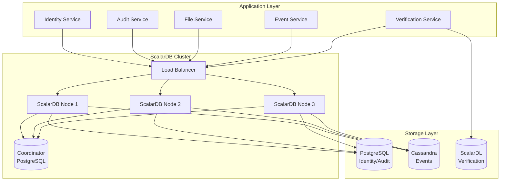
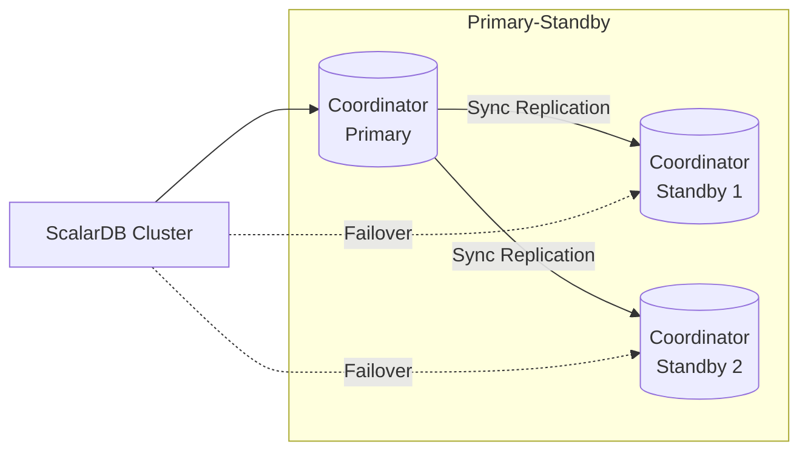
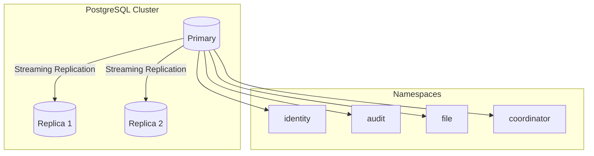
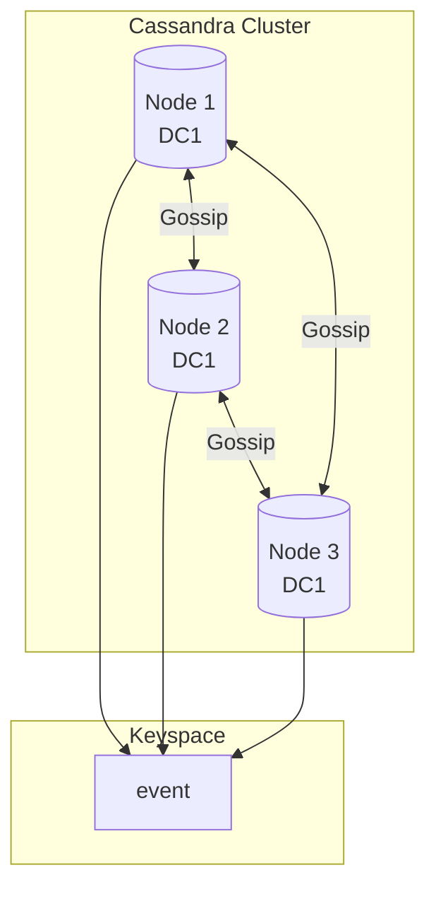
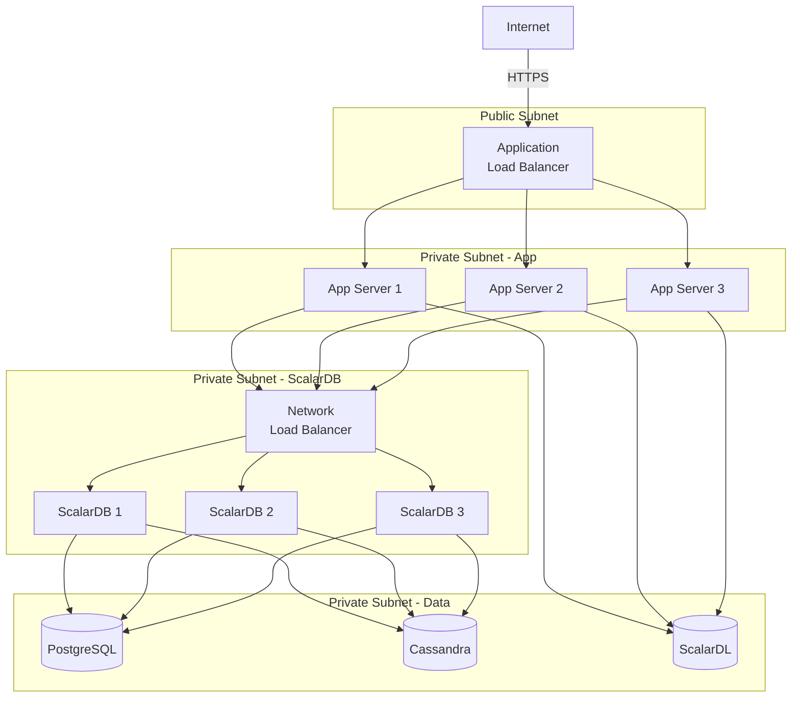
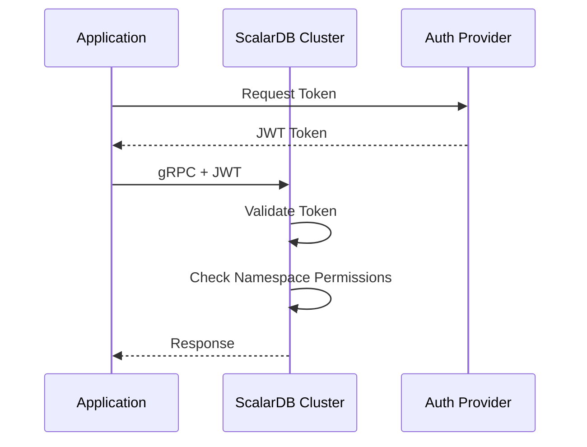
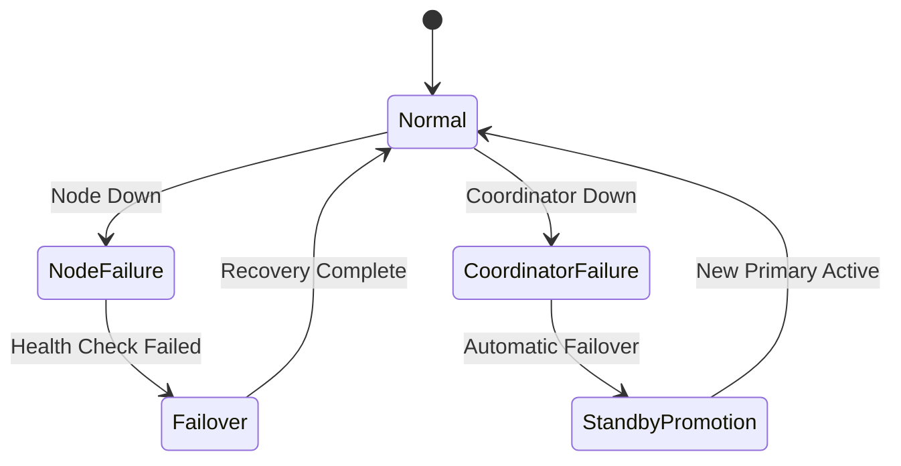
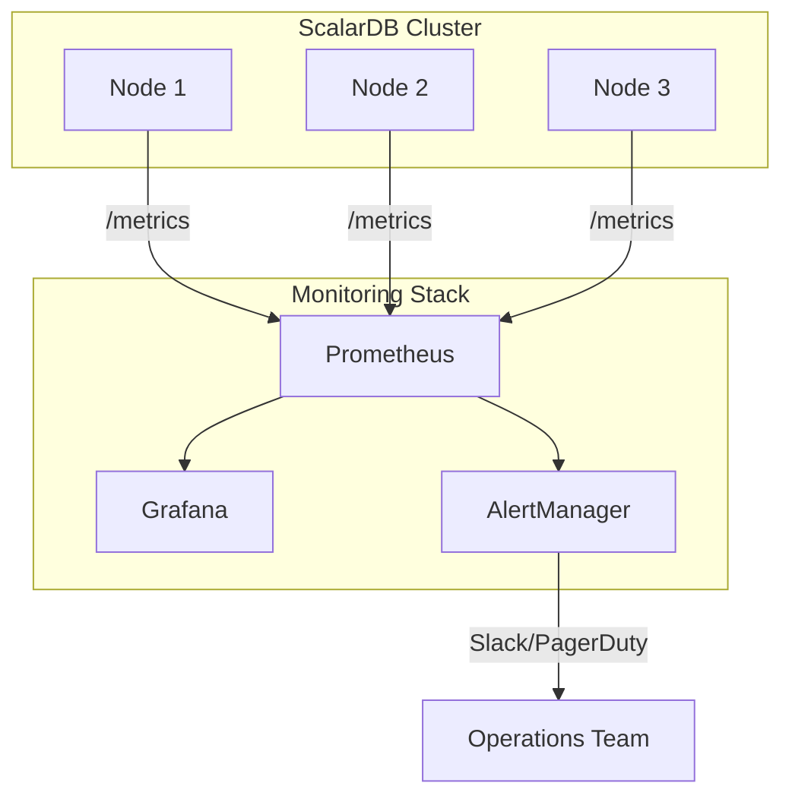

# ScalarDB アーキテクチャ設計

## 1. エグゼクティブサマリー

### 1.1 設計方針

| 項目 | 選択 | 理由 |
|------|------|------|
| **デプロイモード** | ScalarDB Cluster | マイクロサービス化、高可用性、GraphQL/SQL対応 |
| **トランザクション** | Consensus Commit | 分散ACIDトランザクション必須 |
| **ストレージ戦略** | Multi-storage | コンテキスト別最適化 |
| **整合性レベル** | SERIALIZABLE | 監査データの完全性保証 |

### 1.2 アーキテクチャ概要



---

## 2. デプロイモード決定

### 2.1 選定: ScalarDB Cluster

**ScalarDB Clusterを選択した理由:**

| 要件 | ScalarDB Core | ScalarDB Cluster | 判定 |
|------|:-------------:|:----------------:|:----:|
| マイクロサービス対応 | △ | ◎ | Cluster |
| 高可用性 | × | ◎ | Cluster |
| GraphQL/SQL対応 | × | ◎ | Cluster |
| 分散トランザクション | ○ | ◎ | Cluster |
| 運用監視 | △ | ◎ | Cluster |
| スケーラビリティ | △ | ◎ | Cluster |

### 2.2 クラスタ構成

```yaml
# ScalarDB Cluster構成
cluster:
  nodes: 3
  replication_factor: 3

  # ノード配置
  topology:
    - zone: ap-northeast-1a
      node: scalardb-1
    - zone: ap-northeast-1c
      node: scalardb-2
    - zone: ap-northeast-1d
      node: scalardb-3

  # リソース
  resources:
    cpu: 4
    memory: 16Gi
    storage: 100Gi
```

### 2.3 Coordinator設計



**Coordinator設定:**

```properties
# coordinator.properties
scalar.db.consensus_commit.coordinator.namespace=coordinator
scalar.db.consensus_commit.coordinator.table=state

# Group Commit (高スループット)
scalar.db.consensus_commit.coordinator.group_commit.enabled=true
scalar.db.consensus_commit.coordinator.group_commit.slot_capacity=20
scalar.db.consensus_commit.coordinator.group_commit.group_size_fix_timeout_millis=40
scalar.db.consensus_commit.coordinator.group_commit.delayed_slot_move_timeout_millis=800
scalar.db.consensus_commit.coordinator.group_commit.old_group_abort_timeout_millis=60000

# Parallel Executor
scalar.db.consensus_commit.parallel_executor_count=32
scalar.db.consensus_commit.parallel_preparation_enabled=true
scalar.db.consensus_commit.parallel_validation_enabled=true
scalar.db.consensus_commit.parallel_commit_enabled=true
scalar.db.consensus_commit.parallel_rollback_enabled=true
```

---

## 3. ストレージ構成

### 3.1 Multi-storage設計

| Namespace | ストレージ | 理由 |
|-----------|-----------|------|
| `identity` | PostgreSQL | 複雑なクエリ、JOIN、トランザクション重視 |
| `audit` | PostgreSQL | ACID保証、複雑なアクセス制御 |
| `file` | PostgreSQL | メタデータ管理、インデックス活用 |
| `event` | Cassandra | 高書き込みスループット、時系列データ |
| `coordinator` | PostgreSQL | トランザクション状態管理 |

### 3.2 ストレージ別設計

#### PostgreSQL (Identity, Audit, File)



**PostgreSQL設定:**

```properties
# postgres-storage.properties
scalar.db.storage=jdbc
scalar.db.contact_points=jdbc:postgresql://postgres-primary:5432/scalardb
scalar.db.username=${DB_USER}
scalar.db.password=${DB_PASSWORD}

# Connection Pool
scalar.db.jdbc.connection_pool.min_idle=10
scalar.db.jdbc.connection_pool.max_idle=50
scalar.db.jdbc.connection_pool.max_total=100
```

#### Cassandra (Event)



**Cassandra設定:**

```properties
# cassandra-storage.properties
scalar.db.storage=cassandra
scalar.db.contact_points=cassandra-1,cassandra-2,cassandra-3
scalar.db.contact_port=9042
scalar.db.username=${CASSANDRA_USER}
scalar.db.password=${CASSANDRA_PASSWORD}

# Consistency
scalar.db.cassandra.local_datacenter=dc1
```

### 3.3 Multi-storage統合設定

```properties
# scalardb.properties
scalar.db.storage=multi-storage
scalar.db.transaction_manager=consensus-commit

# Storage definitions
scalar.db.multi_storage.storages=postgres,cassandra

# PostgreSQL storage
scalar.db.multi_storage.storages.postgres.storage=jdbc
scalar.db.multi_storage.storages.postgres.contact_points=jdbc:postgresql://postgres:5432/scalardb
scalar.db.multi_storage.storages.postgres.username=${POSTGRES_USER}
scalar.db.multi_storage.storages.postgres.password=${POSTGRES_PASSWORD}

# Cassandra storage
scalar.db.multi_storage.storages.cassandra.storage=cassandra
scalar.db.multi_storage.storages.cassandra.contact_points=cassandra-1,cassandra-2,cassandra-3
scalar.db.multi_storage.storages.cassandra.username=${CASSANDRA_USER}
scalar.db.multi_storage.storages.cassandra.password=${CASSANDRA_PASSWORD}

# Namespace mapping
scalar.db.multi_storage.namespace_mapping=identity:postgres,audit:postgres,file:postgres,event:cassandra,coordinator:postgres
scalar.db.multi_storage.default_storage=postgres
```

---

## 4. ネットワーク設計

### 4.1 ネットワークトポロジー



### 4.2 ポート設計

| サービス | ポート | 用途 |
|---------|-------|------|
| ScalarDB Cluster | 60053 | gRPC (Transaction) |
| ScalarDB Cluster | 60054 | gRPC (Admin) |
| ScalarDB Cluster | 9080 | GraphQL |
| ScalarDB Cluster | 8080 | HTTP/REST |
| PostgreSQL | 5432 | Database |
| Cassandra | 9042 | CQL |
| ScalarDL | 50051 | gRPC |

### 4.3 セキュリティグループ

```yaml
# App -> ScalarDB
app_to_scalardb:
  ingress:
    - port: 60053
      protocol: TCP
      source: app_security_group
    - port: 60054
      protocol: TCP
      source: app_security_group

# ScalarDB -> Storage
scalardb_to_storage:
  ingress:
    - port: 5432
      protocol: TCP
      source: scalardb_security_group
    - port: 9042
      protocol: TCP
      source: scalardb_security_group
```

---

## 5. セキュリティ設計

### 5.1 認証・認可



### 5.2 暗号化

| レイヤー | 暗号化方式 | 対象 |
|---------|-----------|------|
| 転送中 | TLS 1.3 | App ↔ ScalarDB ↔ Storage |
| 保存時 | AES-256 | PostgreSQL, Cassandra |
| キー管理 | AWS KMS | 暗号化キー |

### 5.3 Namespace別権限

```java
// Namespace権限設定
public enum NamespacePermission {
    IDENTITY_READ,
    IDENTITY_WRITE,
    AUDIT_READ,
    AUDIT_WRITE,
    EVENT_READ,
    EVENT_WRITE,
    FILE_READ,
    FILE_WRITE
}

// サービス別権限マッピング
Map<Service, Set<NamespacePermission>> servicePermissions = Map.of(
    Service.IDENTITY, Set.of(IDENTITY_READ, IDENTITY_WRITE),
    Service.AUDIT, Set.of(AUDIT_READ, AUDIT_WRITE, IDENTITY_READ, FILE_READ),
    Service.FILE, Set.of(FILE_READ, FILE_WRITE),
    Service.EVENT, Set.of(EVENT_READ, EVENT_WRITE)
);
```

---

## 6. 可用性設計

### 6.1 高可用性構成

| コンポーネント | 冗長構成 | RTO | RPO |
|--------------|---------|-----|-----|
| ScalarDB Cluster | 3ノード Active-Active | 30秒 | 0 |
| Coordinator DB | Primary-Standby | 60秒 | 0 |
| PostgreSQL | Primary + 2 Replica | 60秒 | 0 |
| Cassandra | 3ノード RF=3 | 30秒 | 0 |

### 6.2 障害復旧



### 6.3 バックアップ戦略

| 対象 | 方式 | 頻度 | 保持期間 |
|------|------|------|---------|
| PostgreSQL | pg_dump + WAL Archive | 日次フル + 継続的WAL | 30日 |
| Cassandra | Snapshot + Incremental | 日次スナップショット | 14日 |
| Coordinator | pg_dump | 1時間毎 | 7日 |

---

## 7. 監視設計

### 7.1 メトリクス

```yaml
# ScalarDB Cluster Metrics
scalardb_metrics:
  - name: transaction_latency
    type: histogram
    labels: [namespace, operation]

  - name: transaction_throughput
    type: counter
    labels: [namespace, status]

  - name: connection_pool_active
    type: gauge
    labels: [storage]

  - name: coordinator_group_commit_size
    type: histogram
```

### 7.2 アラート設定

| メトリクス | 閾値 | 重要度 |
|-----------|------|-------|
| Transaction Latency P99 | > 500ms | Warning |
| Transaction Latency P99 | > 1000ms | Critical |
| Error Rate | > 1% | Warning |
| Error Rate | > 5% | Critical |
| Connection Pool Exhaustion | > 80% | Warning |

### 7.3 ダッシュボード



---

## 8. 性能設計

### 8.1 性能目標

| 指標 | 目標値 | 備考 |
|------|-------|------|
| トランザクションレイテンシ P50 | < 50ms | 単一DB操作 |
| トランザクションレイテンシ P99 | < 200ms | 分散トランザクション |
| スループット | > 1000 TPS | ピーク時 |
| 可用性 | 99.9% | 月間 |

### 8.2 チューニングパラメータ

```properties
# Performance Tuning
scalar.db.consensus_commit.parallel_executor_count=32
scalar.db.consensus_commit.parallel_preparation_enabled=true
scalar.db.consensus_commit.parallel_validation_enabled=true
scalar.db.consensus_commit.parallel_commit_enabled=true

# Group Commit (Latency vs Throughput tradeoff)
scalar.db.consensus_commit.coordinator.group_commit.enabled=true
scalar.db.consensus_commit.coordinator.group_commit.slot_capacity=20

# Connection Pool
scalar.db.jdbc.connection_pool.max_total=100
scalar.db.jdbc.connection_pool.max_idle=50
```

---

*Generated: 2025-12-26*
*Source: scalar-event-log-fetcher-main*
*ScalarDB Version: 3.14.x (Cluster)*
