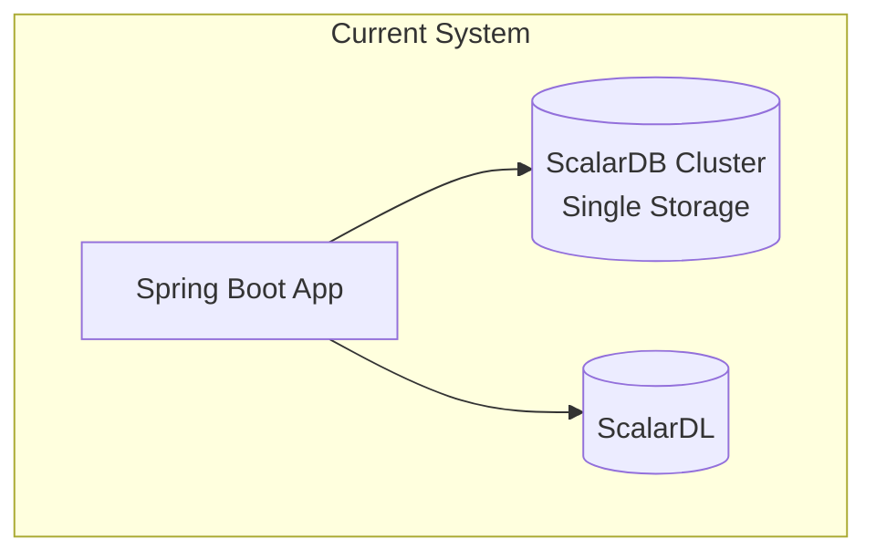
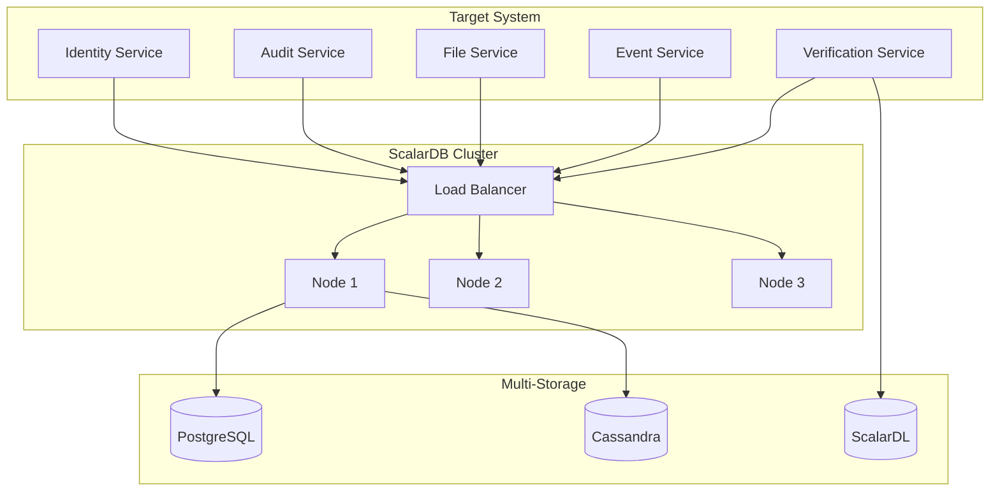
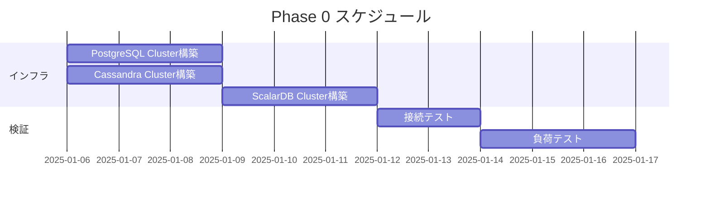
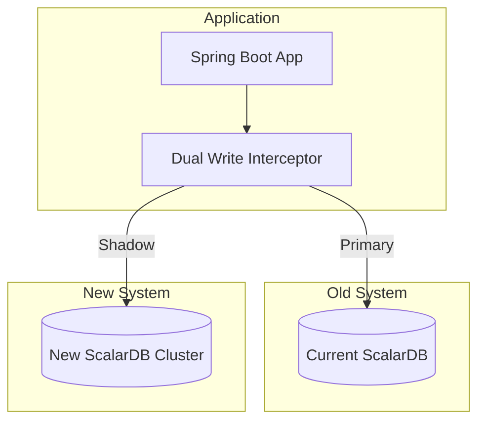
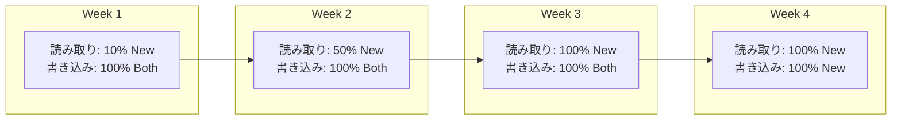
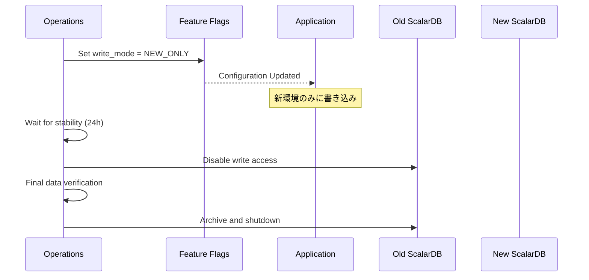
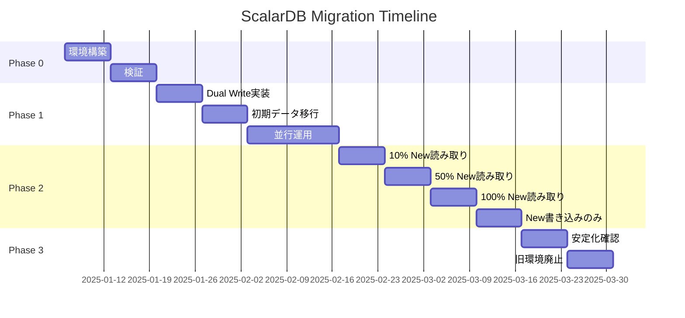

# ScalarDB マイグレーション計画

## 1. マイグレーション概要

### 1.1 現状構成



### 1.2 目標構成



### 1.3 マイグレーション戦略

| フェーズ | 内容 | 期間 | リスク |
|---------|------|------|-------|
| Phase 0 | 準備・検証環境構築 | 2週間 | 低 |
| Phase 1 | スキーマ移行・並行書き込み | 4週間 | 中 |
| Phase 2 | 段階的切り替え | 4週間 | 中 |
| Phase 3 | 完全移行・旧環境廃止 | 2週間 | 低 |

---

## 2. Phase 0: 準備（2週間）

### 2.1 環境構築



### 2.2 インフラ構成

```yaml
# Kubernetes構成例
---
# PostgreSQL StatefulSet
apiVersion: apps/v1
kind: StatefulSet
metadata:
  name: postgresql
spec:
  serviceName: postgresql
  replicas: 3
  selector:
    matchLabels:
      app: postgresql
  template:
    spec:
      containers:
      - name: postgresql
        image: postgres:15
        resources:
          requests:
            cpu: "2"
            memory: "8Gi"
          limits:
            cpu: "4"
            memory: "16Gi"
        volumeMounts:
        - name: data
          mountPath: /var/lib/postgresql/data
  volumeClaimTemplates:
  - metadata:
      name: data
    spec:
      accessModes: ["ReadWriteOnce"]
      resources:
        requests:
          storage: 100Gi
---
# ScalarDB Cluster Deployment
apiVersion: apps/v1
kind: Deployment
metadata:
  name: scalardb-cluster
spec:
  replicas: 3
  selector:
    matchLabels:
      app: scalardb-cluster
  template:
    spec:
      containers:
      - name: scalardb-cluster
        image: ghcr.io/scalar-labs/scalardb-cluster-node:3.14.0
        ports:
        - containerPort: 60053  # gRPC
        - containerPort: 9080   # GraphQL
        env:
        - name: SCALAR_DB_CLUSTER_MEMBERSHIP_TYPE
          value: "KUBERNETES"
        volumeMounts:
        - name: config
          mountPath: /scalardb-cluster/config
```

### 2.3 スキーマ作成スクリプト

```java
public class MigrationSchemaCreator {
    private final Admin admin;

    public void createAllSchemas() throws Exception {
        // Phase 0: 新環境にスキーマ作成
        createNamespaces();
        createIdentityTables();
        createAuditTables();
        createFileTables();
        createEventTables();
    }

    private void createNamespaces() throws Exception {
        admin.createNamespace("identity", true);
        admin.createNamespace("audit", true);
        admin.createNamespace("file", true);
        admin.createNamespace("event", true);
        admin.createNamespace("coordinator", true);
    }

    private void createIdentityTables() throws Exception {
        // users table
        TableMetadata usersMetadata = TableMetadata.newBuilder()
            .addPartitionKey("user_email")
            .addColumn("user_email", DataType.TEXT)
            .addColumn("user_id", DataType.BIGINT)
            .addColumn("name", DataType.TEXT)
            .addColumn("password_hash", DataType.TEXT)
            .addColumn("role", DataType.TEXT)
            .addColumn("org_id", DataType.TEXT)
            .addColumn("is_deleted", DataType.BOOLEAN)
            .addColumn("created_at", DataType.BIGINT)
            .addColumn("updated_at", DataType.BIGINT)
            .addSecondaryIndex("user_id")
            .addSecondaryIndex("org_id")
            .build();
        admin.createTable("identity", "users", usersMetadata, true);

        // 他のidentityテーブル...
    }
}
```

### 2.4 検証項目

| 項目 | 確認内容 | 合格基準 |
|------|---------|---------|
| 接続テスト | 各ストレージへの接続 | 全ノード接続成功 |
| CRUD テスト | 基本操作の動作確認 | エラーなし |
| トランザクションテスト | Consensus Commit動作 | 整合性保持 |
| 負荷テスト | 1000 TPS達成 | レイテンシP99 < 500ms |
| 障害テスト | ノード障害時の動作 | 30秒以内に復旧 |

---

## 3. Phase 1: 並行書き込み（4週間）

### 3.1 アーキテクチャ



### 3.2 Dual Write実装

```java
@Component
public class DualWriteTransactionManager implements DistributedTransactionManager {
    private final DistributedTransactionManager primaryManager;  // 旧環境
    private final DistributedTransactionManager shadowManager;   // 新環境
    private final DualWriteConfig config;

    @Override
    public DistributedTransaction start() {
        return new DualWriteTransaction(
            primaryManager.start(),
            shadowManager.start(),
            config
        );
    }
}

public class DualWriteTransaction implements DistributedTransaction {
    private final DistributedTransaction primaryTx;
    private final DistributedTransaction shadowTx;
    private final DualWriteConfig config;
    private final List<Mutation> mutations = new ArrayList<>();

    @Override
    public Optional<Result> get(Get get) throws CrudException {
        // 読み取りはPrimaryのみ
        return primaryTx.get(get);
    }

    @Override
    public void put(Put put) throws CrudException {
        mutations.add(put);
        primaryTx.put(put);

        if (config.isShadowWriteEnabled()) {
            try {
                Put shadowPut = convertToNewSchema(put);
                shadowTx.put(shadowPut);
            } catch (Exception e) {
                log.error("Shadow write failed", e);
                // Shadow書き込み失敗は無視（ログのみ）
            }
        }
    }

    @Override
    public void commit() throws CommitException {
        // Primary優先でコミット
        primaryTx.commit();

        if (config.isShadowWriteEnabled()) {
            try {
                shadowTx.commit();
            } catch (Exception e) {
                log.error("Shadow commit failed, scheduling async sync", e);
                scheduleAsyncSync(mutations);
            }
        }
    }

    private Put convertToNewSchema(Put originalPut) {
        // 旧スキーマ → 新スキーマ変換
        String namespace = mapNamespace(originalPut.forNamespace().get());
        String table = mapTable(originalPut.forTable().get());

        return Put.newBuilder()
            .namespace(namespace)
            .table(table)
            .partitionKey(convertKey(originalPut.getPartitionKey()))
            .clusteringKey(convertClusteringKey(originalPut.getClusteringKey()))
            // ... 値のマッピング
            .build();
    }
}
```

### 3.3 データ同期バッチ

```java
@Component
public class DataSyncBatch {
    private final DistributedTransactionManager oldManager;
    private final DistributedTransactionManager newManager;

    @Scheduled(cron = "0 0 2 * * *")  // 毎日2:00
    public void syncData() {
        log.info("Starting data sync batch");

        // テーブルごとに同期
        syncUsers();
        syncAuditSets();
        syncAuditSetItems();
        syncEvents();

        log.info("Data sync batch completed");
    }

    private void syncUsers() {
        DistributedTransaction oldTx = oldManager.start();
        DistributedTransaction newTx = newManager.start();

        try {
            Scan scan = Scan.newBuilder()
                .namespace("events_log_tool")
                .table("user")
                .all()
                .build();

            List<Result> results = oldTx.scan(scan);

            for (Result result : results) {
                Put put = convertUserToNewSchema(result);
                newTx.put(put);
            }

            newTx.commit();
            log.info("Synced {} users", results.size());

        } catch (Exception e) {
            newTx.abort();
            throw new SyncException("User sync failed", e);
        } finally {
            oldTx.abort();  // 読み取り専用
        }
    }

    private Put convertUserToNewSchema(Result oldUser) {
        return Put.newBuilder()
            .namespace("identity")
            .table("users")
            .partitionKey(Key.ofText("user_email", oldUser.getText("userEmail")))
            .bigIntValue("user_id", oldUser.getBigInt("id"))
            .textValue("name", oldUser.getText("name"))
            .textValue("password_hash", oldUser.getText("password"))
            .textValue("role", oldUser.getText("roleJson"))
            .textValue("org_id", oldUser.getText("orgId"))
            .booleanValue("is_deleted", oldUser.getBoolean("isDeleted"))
            .bigIntValue("created_at", System.currentTimeMillis())
            .bigIntValue("updated_at", System.currentTimeMillis())
            .build();
    }
}
```

### 3.4 検証クエリ

```java
@Component
public class DataVerifier {
    private final DistributedTransactionManager oldManager;
    private final DistributedTransactionManager newManager;

    public VerificationResult verify() {
        VerificationResult result = new VerificationResult();

        // ユーザー数比較
        long oldUserCount = countRecords(oldManager, "events_log_tool", "user");
        long newUserCount = countRecords(newManager, "identity", "users");
        result.addCheck("users", oldUserCount, newUserCount);

        // 監査セット数比較
        long oldAuditSetCount = countRecords(oldManager, "events_log_tool", "audit_set");
        long newAuditSetCount = countRecords(newManager, "audit", "audit_sets");
        result.addCheck("audit_sets", oldAuditSetCount, newAuditSetCount);

        // サンプルデータ整合性チェック
        verifyRandomSamples(result, 100);

        return result;
    }

    private void verifyRandomSamples(VerificationResult result, int sampleSize) {
        // ランダムサンプリングで詳細比較
        List<String> sampleEmails = getSampleUserEmails(sampleSize);

        for (String email : sampleEmails) {
            Result oldUser = getOldUser(email);
            Result newUser = getNewUser(email);

            if (!compareUserData(oldUser, newUser)) {
                result.addMismatch("user", email);
            }
        }
    }
}
```

### 3.5 Phase 1 チェックリスト

- [ ] Dual Write Interceptor実装
- [ ] スキーマ変換ロジック実装
- [ ] 初期データ移行バッチ実行
- [ ] 日次同期バッチ設定
- [ ] データ整合性検証
- [ ] パフォーマンス影響確認（レイテンシ+10%以内）
- [ ] エラー監視設定

---

## 4. Phase 2: 段階的切り替え（4週間）

### 4.1 切り替え戦略



### 4.2 Feature Flag実装

```java
@Component
public class MigrationFeatureFlags {
    private final FeatureFlagClient client;

    // 読み取り先の制御
    public ReadSource getReadSource(String namespace) {
        int percentage = client.getIntValue("migration.read.new_percentage", 0);
        return ThreadLocalRandom.current().nextInt(100) < percentage
            ? ReadSource.NEW
            : ReadSource.OLD;
    }

    // 書き込み先の制御
    public WriteMode getWriteMode() {
        String mode = client.getStringValue("migration.write.mode", "DUAL");
        return WriteMode.valueOf(mode);
    }

    public enum ReadSource { OLD, NEW }
    public enum WriteMode { OLD_ONLY, DUAL, NEW_ONLY }
}

@Component
public class MigrationAwareTransactionManager {
    private final DistributedTransactionManager oldManager;
    private final DistributedTransactionManager newManager;
    private final MigrationFeatureFlags flags;

    public DistributedTransaction start() {
        WriteMode writeMode = flags.getWriteMode();

        return switch (writeMode) {
            case OLD_ONLY -> new SingleTransaction(oldManager.start());
            case DUAL -> new DualWriteTransaction(
                oldManager.start(),
                newManager.start()
            );
            case NEW_ONLY -> new SingleTransaction(newManager.start());
        };
    }

    public Optional<Result> get(Get get) {
        ReadSource source = flags.getReadSource(get.forNamespace().get());

        return switch (source) {
            case OLD -> oldManager.start().get(convertToOldSchema(get));
            case NEW -> newManager.start().get(get);
        };
    }
}
```

### 4.3 カナリアリリース

```yaml
# Kubernetes Canary Deployment
apiVersion: argoproj.io/v1alpha1
kind: Rollout
metadata:
  name: auditor-app
spec:
  replicas: 10
  strategy:
    canary:
      steps:
      - setWeight: 10
      - pause: {duration: 1h}
      - setWeight: 30
      - pause: {duration: 1h}
      - setWeight: 50
      - pause: {duration: 1h}
      - setWeight: 100
      analysis:
        templates:
        - templateName: success-rate
        args:
        - name: service-name
          value: auditor-app
```

### 4.4 ロールバック手順

```java
@Component
public class MigrationRollback {
    private final MigrationFeatureFlags flags;
    private final AlertService alertService;

    public void executeRollback(RollbackReason reason) {
        log.warn("Initiating rollback: {}", reason);

        // 1. Feature Flagを即座に変更
        flags.setWriteMode(WriteMode.OLD_ONLY);
        flags.setReadPercentage(0);

        // 2. 進行中のトランザクションの完了を待機
        waitForInFlightTransactions(Duration.ofSeconds(30));

        // 3. アラート送信
        alertService.sendCritical("Migration rollback executed: " + reason);

        // 4. ログ記録
        log.info("Rollback completed");
    }

    public void executeEmergencyRollback() {
        // 即座にロールバック（待機なし）
        flags.setWriteMode(WriteMode.OLD_ONLY);
        flags.setReadPercentage(0);
        alertService.sendCritical("Emergency rollback executed");
    }
}
```

### 4.5 Phase 2 モニタリング

```yaml
# Prometheus AlertRules
groups:
- name: migration
  rules:
  - alert: MigrationHighErrorRate
    expr: |
      rate(scalardb_transaction_total{status="error"}[5m])
      / rate(scalardb_transaction_total[5m]) > 0.01
    for: 5m
    labels:
      severity: warning
    annotations:
      summary: "Migration error rate > 1%"

  - alert: MigrationDataMismatch
    expr: migration_data_mismatch_count > 0
    for: 1m
    labels:
      severity: critical
    annotations:
      summary: "Data mismatch detected between old and new systems"

  - alert: MigrationLatencyIncrease
    expr: |
      histogram_quantile(0.99, rate(scalardb_transaction_duration_seconds_bucket[5m]))
      > histogram_quantile(0.99, rate(scalardb_transaction_duration_seconds_bucket[5m] offset 1d)) * 1.5
    for: 10m
    labels:
      severity: warning
    annotations:
      summary: "Transaction latency increased 50% compared to yesterday"
```

---

## 5. Phase 3: 完全移行（2週間）

### 5.1 最終切り替え



### 5.2 旧環境廃止手順

```bash
#!/bin/bash
# decommission-old-env.sh

echo "=== Phase 3: Old Environment Decommission ==="

# 1. 最終データ検証
echo "Step 1: Final data verification..."
./verify-data.sh
if [ $? -ne 0 ]; then
    echo "ERROR: Data verification failed"
    exit 1
fi

# 2. 旧環境の読み取り専用化
echo "Step 2: Setting old environment to read-only..."
kubectl patch configmap scalardb-old-config \
    -p '{"data":{"read_only":"true"}}'

# 3. アプリケーションからの接続解除確認
echo "Step 3: Verifying no active connections..."
./check-connections.sh old-scalardb
if [ $? -ne 0 ]; then
    echo "WARNING: Active connections detected"
    read -p "Continue? (y/n) " -n 1 -r
    if [[ ! $REPLY =~ ^[Yy]$ ]]; then
        exit 1
    fi
fi

# 4. データアーカイブ
echo "Step 4: Archiving data..."
./archive-data.sh old-scalardb s3://backup-bucket/scalardb-migration/

# 5. 旧環境停止
echo "Step 5: Stopping old environment..."
kubectl scale deployment old-scalardb --replicas=0

# 6. リソース削除（7日後に自動実行）
echo "Step 6: Scheduling resource deletion in 7 days..."
kubectl apply -f cleanup-job.yaml

echo "=== Decommission completed ==="
```

### 5.3 クリーンアップ

```java
@Component
public class MigrationCleanup {

    public void cleanup() {
        // 1. Dual Write コード削除
        log.info("Removing dual write interceptor...");

        // 2. 旧スキーマ変換コード削除
        log.info("Removing old schema converters...");

        // 3. Feature Flag削除
        log.info("Removing migration feature flags...");

        // 4. 監視設定更新
        log.info("Updating monitoring configuration...");

        // 5. ドキュメント更新
        log.info("Documentation update reminder sent");
    }
}
```

---

## 6. データ移行詳細

### 6.1 テーブル別移行マッピング

| 旧テーブル | 新Namespace | 新テーブル | 変換ロジック |
|-----------|------------|-----------|-------------|
| user | identity | users | userEmail → user_email (PK変更) |
| user_token | identity | user_tokens | 構造変更なし |
| audit_set | audit | audit_sets | aclJson → 別テーブル化 |
| audit_set_item | audit | audit_set_items | 構造変更なし |
| audit_set_collaborators | audit | audit_set_collaborators | 構造変更なし |
| events | event | events | Cassandraへ移行 |

### 6.2 JSON列正規化

**旧スキーマ (aclJson埋め込み):**
```java
// AuditSet.aclJson
{
  "owner": {"email": "owner@example.com", "role": "OWNER"},
  "collaborators": [
    {"email": "user1@example.com", "role": "CO_OWNER"},
    {"email": "user2@example.com", "role": "MEMBER"}
  ]
}
```

**新スキーマ (正規化):**
```java
// audit_set_collaborators テーブル
// PK: audit_set_id, CK: user_email
{
  "audit_set_id": "uuid",
  "user_email": "owner@example.com",
  "collaborator_role": "OWNER"
}
```

**変換ロジック:**
```java
public List<Put> convertAclJsonToCollaborators(String auditSetId, String aclJson) {
    List<Put> puts = new ArrayList<>();
    JsonNode acl = objectMapper.readTree(aclJson);

    // オーナー追加
    JsonNode owner = acl.get("owner");
    puts.add(createCollaboratorPut(auditSetId, owner.get("email").asText(), "OWNER"));

    // コラボレーター追加
    JsonNode collaborators = acl.get("collaborators");
    if (collaborators != null && collaborators.isArray()) {
        for (JsonNode collab : collaborators) {
            puts.add(createCollaboratorPut(
                auditSetId,
                collab.get("email").asText(),
                collab.get("role").asText()
            ));
        }
    }

    return puts;
}
```

### 6.3 イベントデータ移行（PostgreSQL → Cassandra）

```java
public class EventMigrationBatch {
    private final JdbcTemplate oldJdbc;
    private final DistributedTransactionManager newManager;

    public void migrateEvents(LocalDate startDate, LocalDate endDate) {
        LocalDate current = startDate;

        while (!current.isAfter(endDate)) {
            String yyyymmdd = current.format(DateTimeFormatter.BASIC_ISO_DATE);
            migrateEventsForDate(yyyymmdd);
            current = current.plusDays(1);
        }
    }

    private void migrateEventsForDate(String yyyymmdd) {
        log.info("Migrating events for {}", yyyymmdd);

        // 旧DBからイベント取得
        List<Map<String, Object>> oldEvents = oldJdbc.queryForList(
            "SELECT * FROM events WHERE yyyyMMdd = ?", yyyymmdd
        );

        // バッチサイズで分割
        Lists.partition(oldEvents, 100).forEach(batch -> {
            DistributedTransaction tx = newManager.start();
            try {
                for (Map<String, Object> event : batch) {
                    Put put = convertEventToNewSchema(event);
                    tx.put(put);
                }
                tx.commit();
            } catch (Exception e) {
                tx.abort();
                throw new MigrationException("Event migration failed for " + yyyymmdd, e);
            }
        });

        log.info("Migrated {} events for {}", oldEvents.size(), yyyymmdd);
    }
}
```

---

## 7. 検証計画

### 7.1 検証フェーズ

| フェーズ | 内容 | 期間 | 担当 |
|---------|------|------|------|
| 単体テスト | CRUD操作の動作確認 | 1日 | Dev |
| 結合テスト | トランザクション動作確認 | 2日 | Dev |
| 負荷テスト | パフォーマンス検証 | 3日 | QA |
| 障害テスト | フェイルオーバー確認 | 2日 | Ops |
| UAT | ユーザー受入テスト | 5日 | User |

### 7.2 テストケース

```java
@SpringBootTest
public class MigrationIntegrationTest {

    @Test
    void shouldCreateAuditSetInNewSchema() {
        // Given
        CreateAuditSetRequest request = new CreateAuditSetRequest("Test Set", "owner@example.com");

        // When
        AuditSet result = auditService.createAuditSet(request);

        // Then
        assertThat(result.getId()).isNotNull();

        // 新環境でデータ確認
        Optional<Result> newData = newManager.start().get(
            Get.newBuilder()
                .namespace("audit")
                .table("audit_sets")
                .partitionKey(Key.ofText("audit_set_id", result.getId()))
                .build()
        );
        assertThat(newData).isPresent();
    }

    @Test
    void shouldMaintainDataConsistencyDuringDualWrite() {
        // Dual Write中のデータ整合性テスト
        // 両環境に同一データが存在することを確認
    }

    @Test
    void shouldHandleFailoverGracefully() {
        // ノード障害時のフェイルオーバーテスト
    }
}
```

### 7.3 パフォーマンスベンチマーク

```java
@BenchmarkMode(Mode.Throughput)
@OutputTimeUnit(TimeUnit.SECONDS)
public class TransactionBenchmark {

    @Benchmark
    public void createAuditSetBenchmark(Blackhole bh) {
        AuditSet result = auditService.createAuditSet(createRandomRequest());
        bh.consume(result);
    }

    @Benchmark
    public void addItemToAuditSetBenchmark(Blackhole bh) {
        AuditSetItem result = auditService.addItem(auditSetId, randomItemId());
        bh.consume(result);
    }
}
```

---

## 8. ロールバック手順

### 8.1 ロールバック判断基準

| 指標 | 閾値 | アクション |
|------|------|-----------|
| エラー率 | > 5% | 自動ロールバック |
| レイテンシP99 | > 2秒 | 警告→手動判断 |
| データ不整合 | > 0件 | 即座にロールバック |
| ユーザー報告 | 重大障害 | 手動ロールバック |

### 8.2 ロールバック実行

```bash
#!/bin/bash
# rollback.sh

echo "=== Migration Rollback ==="

# 1. Feature Flag変更
echo "Step 1: Switching to old environment..."
curl -X PUT http://feature-flag-service/flags/migration.write.mode \
    -d '{"value": "OLD_ONLY"}'
curl -X PUT http://feature-flag-service/flags/migration.read.new_percentage \
    -d '{"value": 0}'

# 2. 進行中トランザクション待機
echo "Step 2: Waiting for in-flight transactions..."
sleep 30

# 3. 確認
echo "Step 3: Verifying rollback..."
./verify-rollback.sh

echo "=== Rollback completed ==="
```

### 8.3 ロールバック後の対応

1. **原因分析**: ログ・メトリクス確認
2. **修正**: 問題の修正
3. **再テスト**: ステージング環境で検証
4. **再移行**: 修正後に再度移行実施

---

## 9. タイムライン



---

*Generated: 2025-12-26*
*Source: scalar-event-log-fetcher-main*
*ScalarDB Version: 3.14.x*
