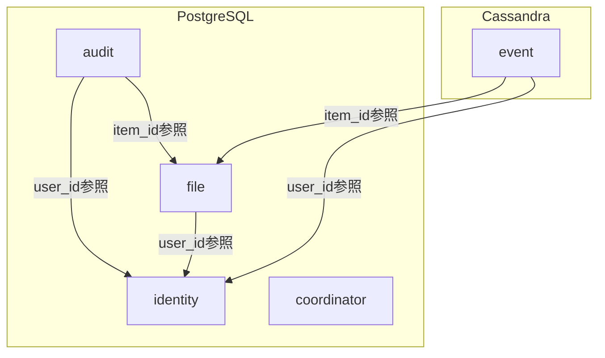
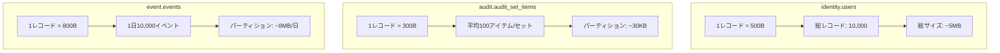

# ScalarDB スキーマ設計

## 1. Namespace設計

### 1.1 Namespace一覧

| Namespace | 説明 | ストレージ | テーブル数 |
|-----------|------|-----------|-----------|
| `identity` | ユーザー・認証管理 | PostgreSQL | 5 |
| `audit` | 監査セット・グループ管理 | PostgreSQL | 6 |
| `file` | ファイル・フォルダ管理 | PostgreSQL | 4 |
| `event` | イベントログ管理 | Cassandra | 5 |
| `coordinator` | トランザクション調整 | PostgreSQL | 1 |

### 1.2 Namespace関係図



---

## 2. Identity Namespace

### 2.1 users テーブル

```json
{
  "namespace": "identity",
  "table": "users",
  "partition_key": ["user_email"],
  "clustering_key": [],
  "columns": {
    "user_email": "TEXT",
    "user_id": "BIGINT",
    "name": "TEXT",
    "password_hash": "TEXT",
    "role": "TEXT",
    "org_id": "TEXT",
    "organization_name": "TEXT",
    "image_url": "TEXT",
    "is_deleted": "BOOLEAN",
    "is_box_admin": "BOOLEAN",
    "language_code": "TEXT",
    "created_at": "BIGINT",
    "updated_at": "BIGINT"
  },
  "secondary_indexes": ["user_id", "org_id"]
}
```

**Java定義:**

```java
TableMetadata usersMetadata = TableMetadata.newBuilder()
    .addPartitionKey("user_email")
    .addColumn("user_email", DataType.TEXT)
    .addColumn("user_id", DataType.BIGINT)
    .addColumn("name", DataType.TEXT)
    .addColumn("password_hash", DataType.TEXT)
    .addColumn("role", DataType.TEXT)
    .addColumn("org_id", DataType.TEXT)
    .addColumn("organization_name", DataType.TEXT)
    .addColumn("image_url", DataType.TEXT)
    .addColumn("is_deleted", DataType.BOOLEAN)
    .addColumn("is_box_admin", DataType.BOOLEAN)
    .addColumn("language_code", DataType.TEXT)
    .addColumn("created_at", DataType.BIGINT)
    .addColumn("updated_at", DataType.BIGINT)
    .addSecondaryIndex("user_id")
    .addSecondaryIndex("org_id")
    .build();
```

### 2.2 user_tokens テーブル

```json
{
  "namespace": "identity",
  "table": "user_tokens",
  "partition_key": ["user_email"],
  "clustering_key": ["token_type"],
  "columns": {
    "user_email": "TEXT",
    "token_type": "TEXT",
    "refresh_token": "TEXT",
    "access_token": "TEXT",
    "expires_at": "BIGINT",
    "created_at": "BIGINT",
    "updated_at": "BIGINT"
  },
  "secondary_indexes": []
}
```

### 2.3 user_otps テーブル

```json
{
  "namespace": "identity",
  "table": "user_otps",
  "partition_key": ["user_email"],
  "clustering_key": ["otp_type"],
  "columns": {
    "user_email": "TEXT",
    "otp_type": "TEXT",
    "otp_code": "TEXT",
    "expires_at": "BIGINT",
    "is_used": "BOOLEAN",
    "created_at": "BIGINT"
  },
  "secondary_indexes": []
}
```

### 2.4 organizations テーブル

```json
{
  "namespace": "identity",
  "table": "organizations",
  "partition_key": ["org_id"],
  "clustering_key": [],
  "columns": {
    "org_id": "TEXT",
    "enterprise_id": "TEXT",
    "org_name": "TEXT",
    "admin_email": "TEXT",
    "is_active": "BOOLEAN",
    "created_at": "BIGINT",
    "updated_at": "BIGINT"
  },
  "secondary_indexes": ["enterprise_id"]
}
```

### 2.5 role_users テーブル

```json
{
  "namespace": "identity",
  "table": "role_users",
  "partition_key": ["user_email"],
  "clustering_key": [],
  "columns": {
    "user_email": "TEXT",
    "role_type": "TEXT",
    "permissions": "TEXT",
    "assigned_at": "BIGINT",
    "assigned_by": "TEXT"
  },
  "secondary_indexes": ["role_type"]
}
```

---

## 3. Audit Namespace

### 3.1 audit_sets テーブル

```json
{
  "namespace": "audit",
  "table": "audit_sets",
  "partition_key": ["audit_set_id"],
  "clustering_key": [],
  "columns": {
    "audit_set_id": "TEXT",
    "audit_set_name": "TEXT",
    "description": "TEXT",
    "owner_id": "BIGINT",
    "owner_email": "TEXT",
    "owner_name": "TEXT",
    "is_deleted": "BOOLEAN",
    "created_at": "BIGINT",
    "updated_at": "BIGINT"
  },
  "secondary_indexes": ["owner_id", "owner_email"]
}
```

**Java定義:**

```java
TableMetadata auditSetsMetadata = TableMetadata.newBuilder()
    .addPartitionKey("audit_set_id")
    .addColumn("audit_set_id", DataType.TEXT)
    .addColumn("audit_set_name", DataType.TEXT)
    .addColumn("description", DataType.TEXT)
    .addColumn("owner_id", DataType.BIGINT)
    .addColumn("owner_email", DataType.TEXT)
    .addColumn("owner_name", DataType.TEXT)
    .addColumn("is_deleted", DataType.BOOLEAN)
    .addColumn("created_at", DataType.BIGINT)
    .addColumn("updated_at", DataType.BIGINT)
    .addSecondaryIndex("owner_id")
    .addSecondaryIndex("owner_email")
    .build();
```

### 3.2 audit_set_items テーブル

```json
{
  "namespace": "audit",
  "table": "audit_set_items",
  "partition_key": ["audit_set_id"],
  "clustering_key": ["item_id"],
  "clustering_key_order": {"item_id": "ASC"},
  "columns": {
    "audit_set_id": "TEXT",
    "item_id": "BIGINT",
    "item_name": "TEXT",
    "item_type": "TEXT",
    "monitoring_status": "TEXT",
    "verification_status": "TEXT",
    "assigned_by_user_id": "BIGINT",
    "created_at": "BIGINT",
    "updated_at": "BIGINT"
  },
  "secondary_indexes": ["monitoring_status", "verification_status"]
}
```

**Java定義:**

```java
TableMetadata auditSetItemsMetadata = TableMetadata.newBuilder()
    .addPartitionKey("audit_set_id")
    .addClusteringKey("item_id", Scan.Ordering.Order.ASC)
    .addColumn("audit_set_id", DataType.TEXT)
    .addColumn("item_id", DataType.BIGINT)
    .addColumn("item_name", DataType.TEXT)
    .addColumn("item_type", DataType.TEXT)
    .addColumn("monitoring_status", DataType.TEXT)
    .addColumn("verification_status", DataType.TEXT)
    .addColumn("assigned_by_user_id", DataType.BIGINT)
    .addColumn("created_at", DataType.BIGINT)
    .addColumn("updated_at", DataType.BIGINT)
    .addSecondaryIndex("monitoring_status")
    .addSecondaryIndex("verification_status")
    .build();
```

### 3.3 audit_set_collaborators テーブル

```json
{
  "namespace": "audit",
  "table": "audit_set_collaborators",
  "partition_key": ["audit_set_id"],
  "clustering_key": ["user_email"],
  "columns": {
    "audit_set_id": "TEXT",
    "user_email": "TEXT",
    "user_id": "BIGINT",
    "user_name": "TEXT",
    "collaborator_role": "TEXT",
    "invited_by": "TEXT",
    "created_at": "BIGINT",
    "updated_at": "BIGINT"
  },
  "secondary_indexes": ["user_id", "collaborator_role"]
}
```

### 3.4 audit_groups テーブル

```json
{
  "namespace": "audit",
  "table": "audit_groups",
  "partition_key": ["audit_group_id"],
  "clustering_key": [],
  "columns": {
    "audit_group_id": "TEXT",
    "audit_group_name": "TEXT",
    "description": "TEXT",
    "owner_id": "BIGINT",
    "owner_email": "TEXT",
    "owner_name": "TEXT",
    "is_deleted": "BOOLEAN",
    "created_at": "BIGINT",
    "updated_at": "BIGINT"
  },
  "secondary_indexes": ["owner_id"]
}
```

### 3.5 audit_group_members テーブル

```json
{
  "namespace": "audit",
  "table": "audit_group_members",
  "partition_key": ["audit_group_id"],
  "clustering_key": ["user_email"],
  "columns": {
    "audit_group_id": "TEXT",
    "user_email": "TEXT",
    "user_id": "BIGINT",
    "member_role": "TEXT",
    "added_by": "TEXT",
    "created_at": "BIGINT"
  },
  "secondary_indexes": ["user_id"]
}
```

### 3.6 audit_group_set_mappings テーブル

```json
{
  "namespace": "audit",
  "table": "audit_group_set_mappings",
  "partition_key": ["audit_group_id"],
  "clustering_key": ["audit_set_id"],
  "columns": {
    "audit_group_id": "TEXT",
    "audit_set_id": "TEXT",
    "linked_at": "BIGINT",
    "linked_by": "TEXT"
  },
  "secondary_indexes": []
}
```

---

## 4. File Namespace

### 4.1 items テーブル

```json
{
  "namespace": "file",
  "table": "items",
  "partition_key": ["item_id"],
  "clustering_key": [],
  "columns": {
    "item_id": "BIGINT",
    "item_type": "TEXT",
    "item_name": "TEXT",
    "parent_folder_id": "BIGINT",
    "sha1_hash": "TEXT",
    "size": "BIGINT",
    "storage_provider": "TEXT",
    "is_deleted": "BOOLEAN",
    "created_at": "BIGINT",
    "updated_at": "BIGINT"
  },
  "secondary_indexes": ["sha1_hash", "parent_folder_id"]
}
```

**Java定義:**

```java
TableMetadata itemsMetadata = TableMetadata.newBuilder()
    .addPartitionKey("item_id")
    .addColumn("item_id", DataType.BIGINT)
    .addColumn("item_type", DataType.TEXT)
    .addColumn("item_name", DataType.TEXT)
    .addColumn("parent_folder_id", DataType.BIGINT)
    .addColumn("sha1_hash", DataType.TEXT)
    .addColumn("size", DataType.BIGINT)
    .addColumn("storage_provider", DataType.TEXT)
    .addColumn("is_deleted", DataType.BOOLEAN)
    .addColumn("created_at", DataType.BIGINT)
    .addColumn("updated_at", DataType.BIGINT)
    .addSecondaryIndex("sha1_hash")
    .addSecondaryIndex("parent_folder_id")
    .build();
```

### 4.2 item_monitoring_status テーブル

```json
{
  "namespace": "file",
  "table": "item_monitoring_status",
  "partition_key": ["item_id"],
  "clustering_key": [],
  "columns": {
    "item_id": "BIGINT",
    "monitoring_status": "TEXT",
    "last_checked_at": "BIGINT",
    "last_version_id": "BIGINT",
    "last_sha1_hash": "TEXT",
    "created_at": "BIGINT",
    "updated_at": "BIGINT"
  },
  "secondary_indexes": ["monitoring_status"]
}
```

### 4.3 items_by_sha1 テーブル

```json
{
  "namespace": "file",
  "table": "items_by_sha1",
  "partition_key": ["sha1_hash"],
  "clustering_key": ["item_id"],
  "columns": {
    "sha1_hash": "TEXT",
    "item_id": "BIGINT",
    "item_name": "TEXT",
    "created_at": "BIGINT"
  },
  "secondary_indexes": []
}
```

### 4.4 file_versions テーブル

```json
{
  "namespace": "file",
  "table": "file_versions",
  "partition_key": ["item_id"],
  "clustering_key": ["version_id"],
  "clustering_key_order": {"version_id": "DESC"},
  "columns": {
    "item_id": "BIGINT",
    "version_id": "BIGINT",
    "version_name": "TEXT",
    "sha1_hash": "TEXT",
    "size": "BIGINT",
    "modified_by_id": "BIGINT",
    "modified_by_name": "TEXT",
    "created_at": "BIGINT"
  },
  "secondary_indexes": []
}
```

---

## 5. Event Namespace (Cassandra)

### 5.1 events テーブル

```json
{
  "namespace": "event",
  "table": "events",
  "partition_key": ["yyyymmdd"],
  "clustering_key": ["event_id"],
  "clustering_key_order": {"event_id": "DESC"},
  "columns": {
    "yyyymmdd": "TEXT",
    "event_id": "TEXT",
    "event_type": "TEXT",
    "timestamp": "BIGINT",
    "user_id": "BIGINT",
    "user_email": "TEXT",
    "user_name": "TEXT",
    "item_id": "BIGINT",
    "item_name": "TEXT",
    "item_type": "TEXT",
    "sha1_hash": "TEXT",
    "parent_folder_id": "BIGINT",
    "source_json": "TEXT",
    "created_at": "BIGINT"
  },
  "secondary_indexes": ["user_id", "item_id", "event_type"]
}
```

**Java定義:**

```java
TableMetadata eventsMetadata = TableMetadata.newBuilder()
    .addPartitionKey("yyyymmdd")
    .addClusteringKey("event_id", Scan.Ordering.Order.DESC)
    .addColumn("yyyymmdd", DataType.TEXT)
    .addColumn("event_id", DataType.TEXT)
    .addColumn("event_type", DataType.TEXT)
    .addColumn("timestamp", DataType.BIGINT)
    .addColumn("user_id", DataType.BIGINT)
    .addColumn("user_email", DataType.TEXT)
    .addColumn("user_name", DataType.TEXT)
    .addColumn("item_id", DataType.BIGINT)
    .addColumn("item_name", DataType.TEXT)
    .addColumn("item_type", DataType.TEXT)
    .addColumn("sha1_hash", DataType.TEXT)
    .addColumn("parent_folder_id", DataType.BIGINT)
    .addColumn("source_json", DataType.TEXT)
    .addColumn("created_at", DataType.BIGINT)
    .addSecondaryIndex("user_id")
    .addSecondaryIndex("item_id")
    .addSecondaryIndex("event_type")
    .build();
```

### 5.2 events_by_item テーブル（逆引き用）

```json
{
  "namespace": "event",
  "table": "events_by_item",
  "partition_key": ["item_id"],
  "clustering_key": ["timestamp", "event_id"],
  "clustering_key_order": {"timestamp": "DESC", "event_id": "DESC"},
  "columns": {
    "item_id": "BIGINT",
    "timestamp": "BIGINT",
    "event_id": "TEXT",
    "event_type": "TEXT",
    "user_id": "BIGINT",
    "user_name": "TEXT",
    "yyyymmdd": "TEXT"
  },
  "secondary_indexes": []
}
```

### 5.3 position_tracker テーブル

```json
{
  "namespace": "event",
  "table": "position_tracker",
  "partition_key": ["tracker_type"],
  "clustering_key": [],
  "columns": {
    "tracker_type": "TEXT",
    "stream_position": "TEXT",
    "last_event_id": "TEXT",
    "last_synced_at": "BIGINT",
    "updated_at": "BIGINT"
  },
  "secondary_indexes": []
}
```

### 5.4 auditor_logs テーブル

```json
{
  "namespace": "event",
  "table": "auditor_logs",
  "partition_key": ["yyyymmdd"],
  "clustering_key": ["log_id"],
  "clustering_key_order": {"log_id": "DESC"},
  "columns": {
    "yyyymmdd": "TEXT",
    "log_id": "TEXT",
    "user_email": "TEXT",
    "user_name": "TEXT",
    "action": "TEXT",
    "resource_type": "TEXT",
    "resource_id": "TEXT",
    "ip_address": "TEXT",
    "user_agent": "TEXT",
    "created_at": "BIGINT"
  },
  "secondary_indexes": ["user_email"]
}
```

### 5.5 system_event_dates テーブル

```json
{
  "namespace": "event",
  "table": "system_event_dates",
  "partition_key": ["date_type"],
  "clustering_key": ["yyyymmdd"],
  "clustering_key_order": {"yyyymmdd": "DESC"},
  "columns": {
    "date_type": "TEXT",
    "yyyymmdd": "TEXT",
    "event_count": "BIGINT",
    "created_at": "BIGINT"
  },
  "secondary_indexes": []
}
```

---

## 6. パーティション戦略

### 6.1 パーティションキー設計原則

| Namespace | テーブル | パーティションキー | 理由 |
|-----------|---------|------------------|------|
| identity | users | user_email | ユニーク識別子、均等分散 |
| audit | audit_sets | audit_set_id | UUID、均等分散 |
| audit | audit_set_items | audit_set_id | セット単位でのアクセスパターン |
| file | items | item_id | BOX ID、ユニーク |
| event | events | yyyymmdd | 日付ベースの時系列アクセス |

### 6.2 パーティションサイズ見積もり



### 6.3 ホットパーティション対策

**イベントテーブル:**
- 日付パーティション（yyyymmdd）で自然分散
- 古いパーティションは読み取り専用

**監査セットアイテム:**
- セットIDで分散
- 大規模セット（10,000+アイテム）はページング

---

## 7. インデックス設計

### 7.1 セカンダリインデックス一覧

| Namespace | テーブル | インデックスカラム | 用途 |
|-----------|---------|------------------|------|
| identity | users | user_id | BOX ID検索 |
| identity | users | org_id | 組織別ユーザー検索 |
| audit | audit_sets | owner_id | オーナー別検索 |
| audit | audit_set_items | monitoring_status | ステータス別フィルタ |
| file | items | sha1_hash | 重複ファイル検索 |
| event | events | user_id | ユーザー別イベント検索 |
| event | events | item_id | アイテム別イベント検索 |

### 7.2 複合クエリパターン

```java
// パターン1: 監査セットのアイテム一覧（ステータスフィルタ）
Scan scan = Scan.newBuilder()
    .namespace("audit")
    .table("audit_set_items")
    .partitionKey(Key.ofText("audit_set_id", auditSetId))
    .orderings(Scan.Ordering.asc("item_id"))
    .build();

// パターン2: 日付範囲のイベント検索
Scan scan = Scan.newBuilder()
    .namespace("event")
    .table("events")
    .partitionKey(Key.ofText("yyyymmdd", "20250101"))
    .start(Key.ofText("event_id", startEventId))
    .limit(100)
    .build();

// パターン3: SHA1によるファイル検索
Scan scan = Scan.newBuilder()
    .namespace("file")
    .table("items_by_sha1")
    .partitionKey(Key.ofText("sha1_hash", sha1Hash))
    .build();
```

---

## 8. データ型マッピング

### 8.1 現行モデル → ScalarDBマッピング

| Javaモデル型 | 現行DB型 | ScalarDB型 | 備考 |
|-------------|---------|-----------|------|
| String | VARCHAR | TEXT | - |
| Long | BIGINT | BIGINT | - |
| Integer | INT | INT | - |
| Boolean | BOOLEAN | BOOLEAN | - |
| Instant | TIMESTAMP | BIGINT | Epoch millis |
| LocalDate | DATE | TEXT | yyyyMMdd形式 |
| JSON String | VARCHAR | TEXT | 構造化データ |

### 8.2 JSON列の正規化

**現行（非推奨）:**
```java
// AuditSet.aclJson - JSON文字列として保存
private String aclJson;
```

**目標（正規化）:**
```java
// audit_set_collaboratorsテーブルで正規化
// パーティションキー: audit_set_id
// クラスタリングキー: user_email
```

---

## 9. スキーマ作成スクリプト

### 9.1 初期化コード

```java
public class SchemaInitializer {
    private final Admin admin;

    public void initializeSchema() throws Exception {
        // Namespaces
        admin.createNamespace("identity", true);
        admin.createNamespace("audit", true);
        admin.createNamespace("file", true);
        admin.createNamespace("event", true);

        // Identity tables
        createUsersTable();
        createUserTokensTable();
        createUserOtpsTable();
        createOrganizationsTable();
        createRoleUsersTable();

        // Audit tables
        createAuditSetsTable();
        createAuditSetItemsTable();
        createAuditSetCollaboratorsTable();
        createAuditGroupsTable();
        createAuditGroupMembersTable();
        createAuditGroupSetMappingsTable();

        // File tables
        createItemsTable();
        createItemMonitoringStatusTable();
        createItemsBySha1Table();
        createFileVersionsTable();

        // Event tables
        createEventsTable();
        createEventsByItemTable();
        createPositionTrackerTable();
        createAuditorLogsTable();
        createSystemEventDatesTable();
    }
}
```

### 9.2 テーブル作成例

```java
private void createAuditSetsTable() throws Exception {
    TableMetadata metadata = TableMetadata.newBuilder()
        .addPartitionKey("audit_set_id")
        .addColumn("audit_set_id", DataType.TEXT)
        .addColumn("audit_set_name", DataType.TEXT)
        .addColumn("description", DataType.TEXT)
        .addColumn("owner_id", DataType.BIGINT)
        .addColumn("owner_email", DataType.TEXT)
        .addColumn("owner_name", DataType.TEXT)
        .addColumn("is_deleted", DataType.BOOLEAN)
        .addColumn("created_at", DataType.BIGINT)
        .addColumn("updated_at", DataType.BIGINT)
        .addSecondaryIndex("owner_id")
        .addSecondaryIndex("owner_email")
        .build();

    admin.createTable("audit", "audit_sets", metadata, true);
}
```

---

*Generated: 2025-12-26*
*Source: scalar-event-log-fetcher-main*
*ScalarDB Version: 3.14.x*
