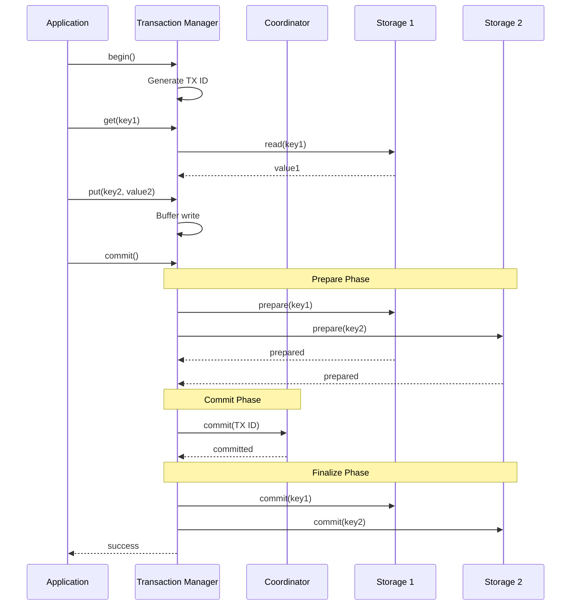
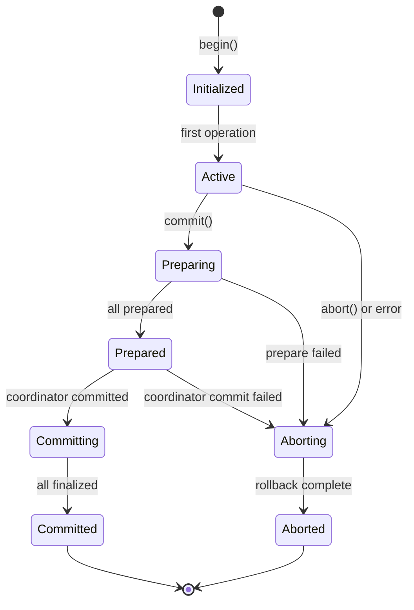
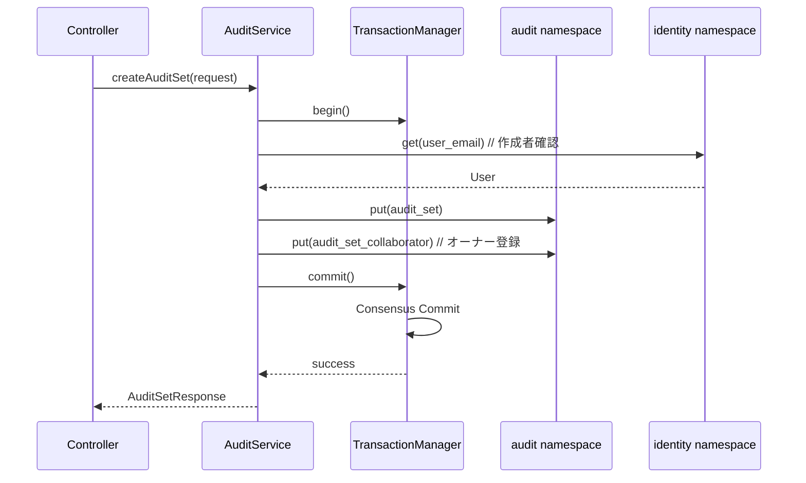
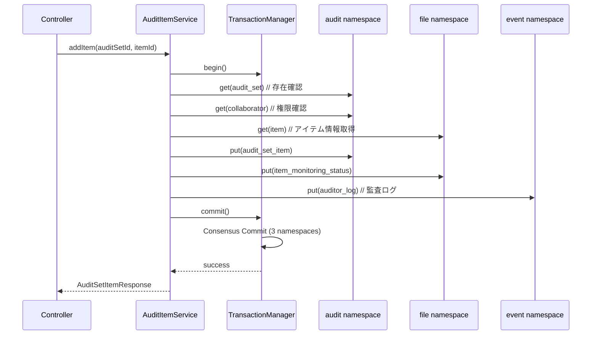
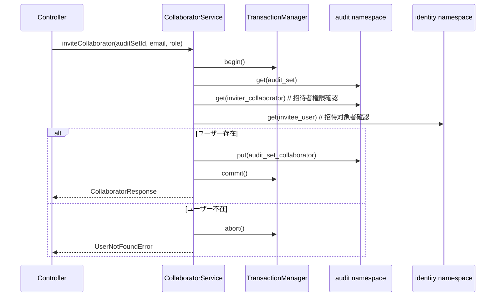
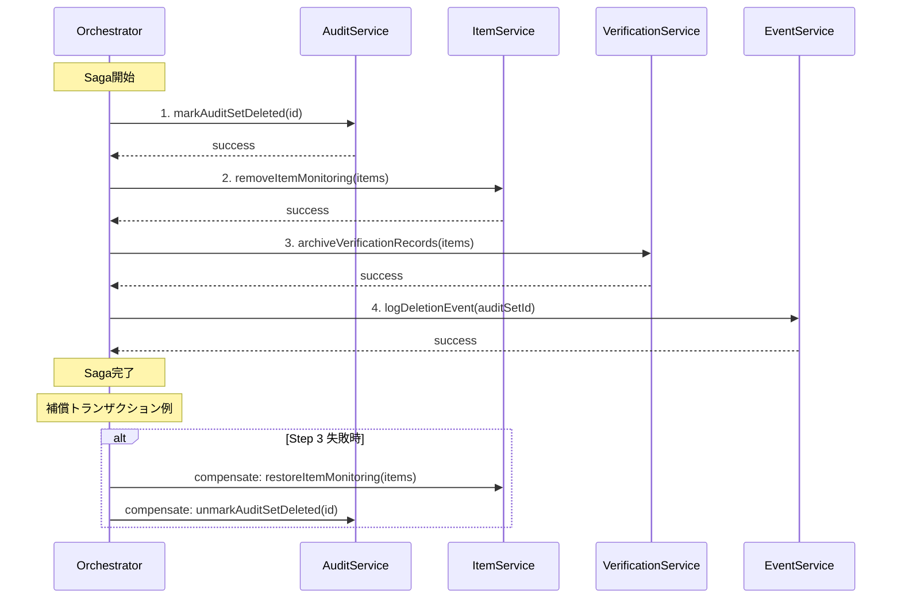
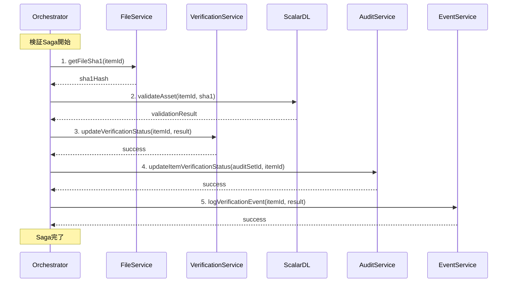
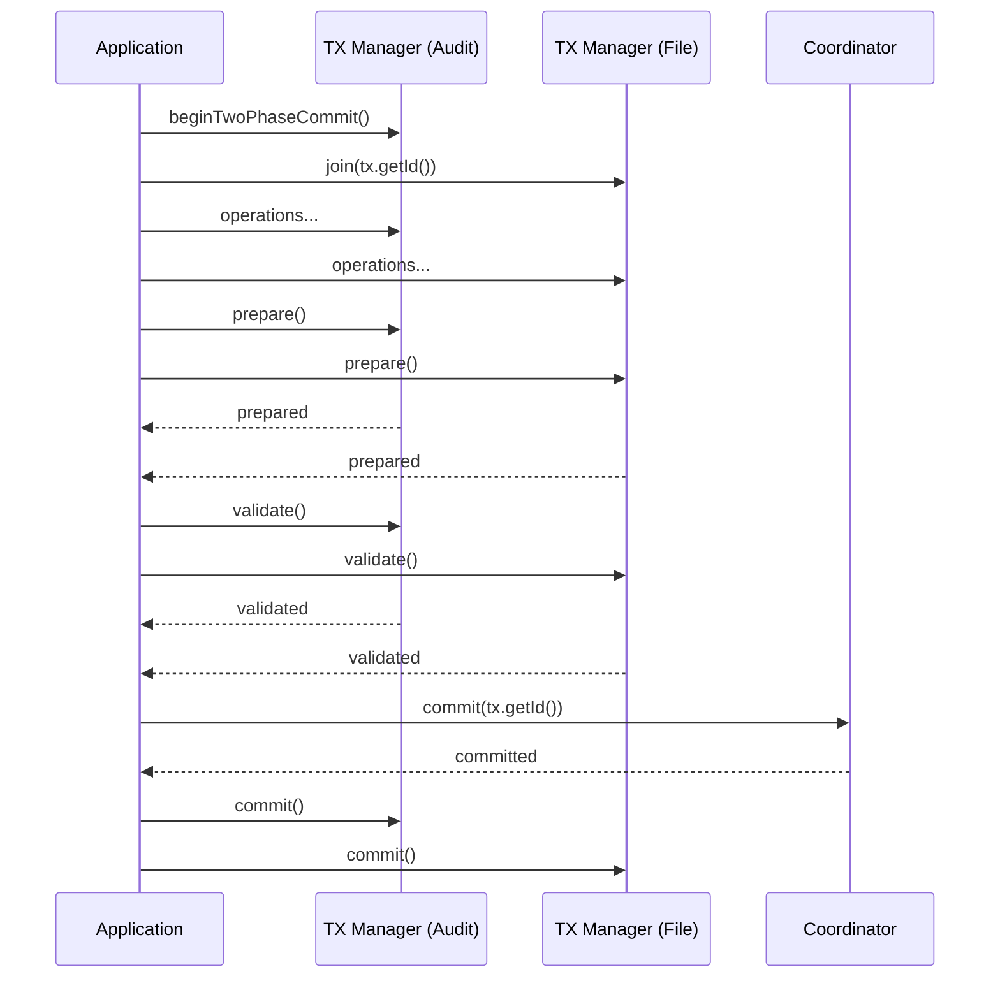
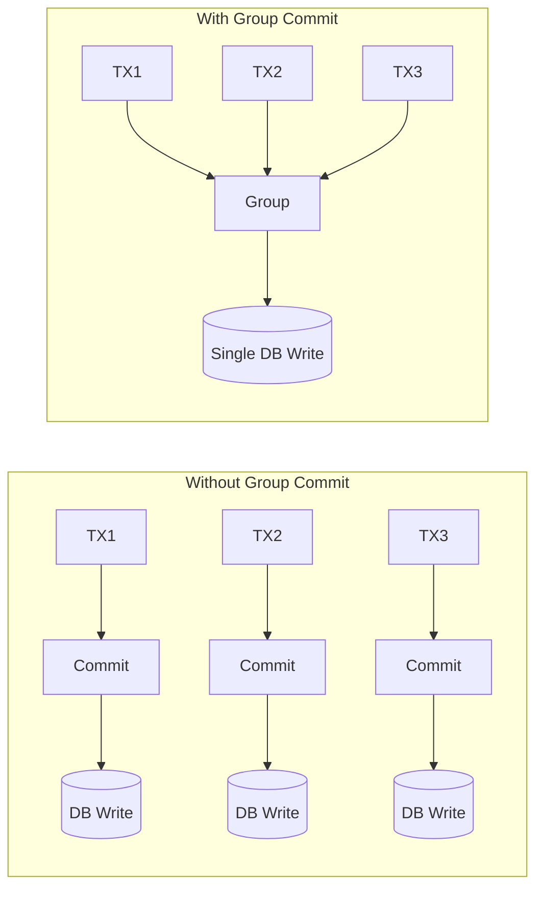

# ScalarDB トランザクション設計

## 1. トランザクション概要

### 1.1 トランザクションパターン分類

| パターン | 適用場面 | 特徴 |
|---------|---------|------|
| **単一Namespace ACID** | 同一コンテキスト内操作 | Consensus Commit |
| **分散トランザクション** | 複数Namespace横断 | Two-Phase Commit |
| **Saga** | 長時間・複雑なワークフロー | 補償トランザクション |

### 1.2 トランザクションマネージャ設定

```properties
# ScalarDB Transaction設定
scalar.db.transaction_manager=consensus-commit
scalar.db.consensus_commit.isolation_level=SERIALIZABLE
scalar.db.consensus_commit.serializable_strategy=EXTRA_READ

# Coordinator設定
scalar.db.consensus_commit.coordinator.namespace=coordinator
scalar.db.consensus_commit.coordinator.group_commit.enabled=true
```

---

## 2. Consensus Commitプロトコル

### 2.1 プロトコル概要



### 2.2 Consensus Commit状態遷移



---

## 3. ユースケース別トランザクション設計

### 3.1 監査セット作成



**実装コード:**

```java
@Service
public class AuditSetService {
    private final DistributedTransactionManager manager;

    @Transactional
    public AuditSet createAuditSet(CreateAuditSetRequest request) {
        DistributedTransaction tx = manager.start();
        try {
            // 1. ユーザー存在確認
            Get getUser = Get.newBuilder()
                .namespace("identity")
                .table("users")
                .partitionKey(Key.ofText("user_email", request.getOwnerEmail()))
                .build();
            Optional<Result> userResult = tx.get(getUser);
            if (userResult.isEmpty()) {
                throw new UserNotFoundException(request.getOwnerEmail());
            }

            // 2. 監査セット作成
            String auditSetId = UUID.randomUUID().toString();
            Put putAuditSet = Put.newBuilder()
                .namespace("audit")
                .table("audit_sets")
                .partitionKey(Key.ofText("audit_set_id", auditSetId))
                .textValue("audit_set_name", request.getName())
                .textValue("description", request.getDescription())
                .bigIntValue("owner_id", userResult.get().getBigInt("user_id"))
                .textValue("owner_email", request.getOwnerEmail())
                .booleanValue("is_deleted", false)
                .bigIntValue("created_at", Instant.now().toEpochMilli())
                .build();
            tx.put(putAuditSet);

            // 3. オーナーをコラボレーターとして登録
            Put putCollaborator = Put.newBuilder()
                .namespace("audit")
                .table("audit_set_collaborators")
                .partitionKey(Key.ofText("audit_set_id", auditSetId))
                .clusteringKey(Key.ofText("user_email", request.getOwnerEmail()))
                .textValue("collaborator_role", "OWNER")
                .bigIntValue("created_at", Instant.now().toEpochMilli())
                .build();
            tx.put(putCollaborator);

            tx.commit();
            return mapToAuditSet(auditSetId, request);

        } catch (Exception e) {
            tx.abort();
            throw new TransactionException("Failed to create audit set", e);
        }
    }
}
```

### 3.2 監査セットへのアイテム追加



**実装コード:**

```java
@Service
public class AuditItemService {
    private final DistributedTransactionManager manager;

    @Transactional
    public AuditSetItem addItemToAuditSet(String auditSetId, Long itemId, String userEmail) {
        DistributedTransaction tx = manager.start();
        try {
            // 1. 監査セット存在確認
            validateAuditSetExists(tx, auditSetId);

            // 2. 権限確認
            validateUserPermission(tx, auditSetId, userEmail, "ADD_ITEM");

            // 3. アイテム情報取得
            Get getItem = Get.newBuilder()
                .namespace("file")
                .table("items")
                .partitionKey(Key.ofBigInt("item_id", itemId))
                .build();
            Result itemResult = tx.get(getItem)
                .orElseThrow(() -> new ItemNotFoundException(itemId));

            // 4. 監査セットアイテム登録
            Put putItem = Put.newBuilder()
                .namespace("audit")
                .table("audit_set_items")
                .partitionKey(Key.ofText("audit_set_id", auditSetId))
                .clusteringKey(Key.ofBigInt("item_id", itemId))
                .textValue("item_name", itemResult.getText("item_name"))
                .textValue("item_type", itemResult.getText("item_type"))
                .textValue("monitoring_status", "PENDING")
                .textValue("verification_status", "NOT_VERIFIED")
                .bigIntValue("created_at", Instant.now().toEpochMilli())
                .build();
            tx.put(putItem);

            // 5. 監視ステータス更新
            Put putStatus = Put.newBuilder()
                .namespace("file")
                .table("item_monitoring_status")
                .partitionKey(Key.ofBigInt("item_id", itemId))
                .textValue("monitoring_status", "MONITORING")
                .bigIntValue("updated_at", Instant.now().toEpochMilli())
                .build();
            tx.put(putStatus);

            // 6. 監査ログ記録
            recordAuditLog(tx, userEmail, "ADD_ITEM", auditSetId, itemId.toString());

            tx.commit();
            return mapToAuditSetItem(auditSetId, itemId);

        } catch (CrudConflictException e) {
            tx.abort();
            throw new ConflictException("Item already exists in audit set", e);
        } catch (Exception e) {
            tx.abort();
            throw new TransactionException("Failed to add item", e);
        }
    }
}
```

### 3.3 コラボレーター招待



---

## 4. Sagaパターン設計

### 4.1 監査セット削除Saga



**Saga実装:**

```java
@Service
public class AuditSetDeletionSaga {
    private final AuditService auditService;
    private final ItemService itemService;
    private final VerificationService verificationService;
    private final EventService eventService;

    public void deleteAuditSet(String auditSetId, String userId) {
        SagaContext context = new SagaContext();

        try {
            // Step 1: 監査セット論理削除
            auditService.markDeleted(auditSetId);
            context.addCompensation(() -> auditService.unmarkDeleted(auditSetId));

            // Step 2: アイテム一覧取得と監視解除
            List<Long> itemIds = auditService.getItemIds(auditSetId);
            itemService.removeMonitoring(itemIds);
            context.addCompensation(() -> itemService.restoreMonitoring(itemIds));

            // Step 3: 検証記録アーカイブ
            verificationService.archiveRecords(auditSetId);
            context.addCompensation(() -> verificationService.restoreRecords(auditSetId));

            // Step 4: 削除イベント記録
            eventService.logDeletion(auditSetId, userId);
            // イベント記録は補償不要

            // Saga完了
            context.complete();

        } catch (Exception e) {
            // 補償トランザクション実行
            context.compensate();
            throw new SagaFailedException("Audit set deletion failed", e);
        }
    }
}

public class SagaContext {
    private final List<Runnable> compensations = new ArrayList<>();
    private boolean completed = false;

    public void addCompensation(Runnable compensation) {
        compensations.add(0, compensation); // 逆順で実行
    }

    public void compensate() {
        if (!completed) {
            compensations.forEach(c -> {
                try {
                    c.run();
                } catch (Exception e) {
                    log.error("Compensation failed", e);
                }
            });
        }
    }

    public void complete() {
        completed = true;
    }
}
```

### 4.2 改ざん検証Saga



---

## 5. 例外処理戦略

### 5.1 例外分類

| 例外タイプ | 対応 | 例 |
|-----------|------|-----|
| **Transient** | リトライ | CrudConflictException, CommitConflictException |
| **Non-Transient** | エラー返却 | ValidationException, NotFoundException |
| **Unknown** | 冪等性チェック | UnknownTransactionStatusException |

### 5.2 リトライ戦略

```java
@Component
public class TransactionRetryHandler {
    private static final int MAX_RETRIES = 3;
    private static final long INITIAL_BACKOFF_MS = 100;

    public <T> T executeWithRetry(Supplier<T> operation) {
        int attempt = 0;
        while (true) {
            try {
                return operation.get();
            } catch (CrudConflictException | CommitConflictException e) {
                attempt++;
                if (attempt >= MAX_RETRIES) {
                    throw new RetryExhaustedException("Max retries exceeded", e);
                }
                backoff(attempt);
            }
        }
    }

    private void backoff(int attempt) {
        long sleepMs = INITIAL_BACKOFF_MS * (1L << (attempt - 1));
        try {
            Thread.sleep(sleepMs + ThreadLocalRandom.current().nextLong(50));
        } catch (InterruptedException e) {
            Thread.currentThread().interrupt();
        }
    }
}
```

### 5.3 UnknownTransactionStatus処理

```java
public class IdempotentTransactionHandler {
    private final DistributedTransactionManager manager;
    private final IdempotencyKeyStore keyStore;

    public <T> T executeIdempotent(String idempotencyKey, Supplier<T> operation) {
        // 1. 既存結果チェック
        Optional<T> existingResult = keyStore.get(idempotencyKey);
        if (existingResult.isPresent()) {
            return existingResult.get();
        }

        DistributedTransaction tx = manager.start();
        try {
            T result = operation.get();
            tx.commit();

            // 結果を保存
            keyStore.save(idempotencyKey, result);
            return result;

        } catch (UnknownTransactionStatusException e) {
            // トランザクション状態不明
            // コーディネーターをチェック
            TransactionState state = manager.getState(tx.getId());

            if (state == TransactionState.COMMITTED) {
                // コミット済み - 結果を再構築
                T result = reconstructResult(tx.getId());
                keyStore.save(idempotencyKey, result);
                return result;
            } else {
                // 未コミット - エラー返却
                throw new TransactionFailedException("Transaction status unknown", e);
            }
        } catch (Exception e) {
            tx.abort();
            throw new TransactionException("Transaction failed", e);
        }
    }
}
```

### 5.4 例外ハンドラ

```java
@ControllerAdvice
public class ScalarDbExceptionHandler {

    @ExceptionHandler(CrudConflictException.class)
    public ResponseEntity<ErrorResponse> handleConflict(CrudConflictException e) {
        log.warn("CRUD conflict: {}", e.getMessage());
        return ResponseEntity
            .status(HttpStatus.CONFLICT)
            .body(new ErrorResponse("CONFLICT", "Resource was modified by another transaction"));
    }

    @ExceptionHandler(CommitConflictException.class)
    public ResponseEntity<ErrorResponse> handleCommitConflict(CommitConflictException e) {
        log.warn("Commit conflict: {}", e.getMessage());
        return ResponseEntity
            .status(HttpStatus.CONFLICT)
            .body(new ErrorResponse("COMMIT_CONFLICT", "Transaction commit failed due to conflict"));
    }

    @ExceptionHandler(UnknownTransactionStatusException.class)
    public ResponseEntity<ErrorResponse> handleUnknown(UnknownTransactionStatusException e) {
        log.error("Unknown transaction status: {}", e.getMessage());
        return ResponseEntity
            .status(HttpStatus.INTERNAL_SERVER_ERROR)
            .body(new ErrorResponse("UNKNOWN_STATUS", "Transaction status is unknown. Please retry."));
    }

    @ExceptionHandler(PreparationConflictException.class)
    public ResponseEntity<ErrorResponse> handlePreparationConflict(PreparationConflictException e) {
        log.warn("Preparation conflict: {}", e.getMessage());
        return ResponseEntity
            .status(HttpStatus.CONFLICT)
            .body(new ErrorResponse("PREPARATION_CONFLICT", "Transaction preparation failed"));
    }
}
```

---

## 6. Two-Phase Commit設計

### 6.1 サービス間トランザクション



### 6.2 Two-Phase Commit実装

```java
@Service
public class CrossServiceTransactionManager {
    private final TwoPhaseCommitTransactionManager txManager;

    public void executeAcrossServices(CrossServiceOperation operation) {
        TwoPhaseCommitTransaction tx = txManager.begin();
        try {
            // 1. 各サービスの操作実行
            operation.execute(tx);

            // 2. Prepare Phase
            tx.prepare();

            // 3. Validation Phase
            tx.validate();

            // 4. Commit Phase
            tx.commit();

        } catch (PreparationConflictException e) {
            tx.rollback();
            throw new TransactionConflictException("Prepare failed", e);
        } catch (ValidationConflictException e) {
            tx.rollback();
            throw new TransactionConflictException("Validation failed", e);
        } catch (CommitConflictException e) {
            tx.rollback();
            throw new TransactionConflictException("Commit failed", e);
        }
    }
}
```

---

## 7. パフォーマンス最適化

### 7.1 Group Commit

```properties
# Group Commit設定
scalar.db.consensus_commit.coordinator.group_commit.enabled=true
scalar.db.consensus_commit.coordinator.group_commit.slot_capacity=20
scalar.db.consensus_commit.coordinator.group_commit.group_size_fix_timeout_millis=40
scalar.db.consensus_commit.coordinator.group_commit.delayed_slot_move_timeout_millis=800
```



### 7.2 並列実行

```properties
# Parallel Execution
scalar.db.consensus_commit.parallel_executor_count=32
scalar.db.consensus_commit.parallel_preparation_enabled=true
scalar.db.consensus_commit.parallel_validation_enabled=true
scalar.db.consensus_commit.parallel_commit_enabled=true
scalar.db.consensus_commit.parallel_rollback_enabled=true
```

### 7.3 読み取り最適化

```java
// 複数キーの並列読み取り
public List<Result> batchGet(List<Get> gets) {
    return tx.get(gets); // 内部で並列化
}

// Scan最適化
Scan scan = Scan.newBuilder()
    .namespace("audit")
    .table("audit_set_items")
    .partitionKey(Key.ofText("audit_set_id", auditSetId))
    .limit(100)  // ページサイズ制限
    .projections("item_id", "item_name", "monitoring_status")  // 必要カラムのみ
    .build();
```

---

## 8. モニタリング

### 8.1 トランザクションメトリクス

```yaml
metrics:
  - name: scalardb_transaction_duration_seconds
    type: histogram
    labels: [operation, namespace, status]

  - name: scalardb_transaction_total
    type: counter
    labels: [namespace, status]

  - name: scalardb_conflict_total
    type: counter
    labels: [type, namespace]

  - name: scalardb_retry_total
    type: counter
    labels: [namespace]
```

### 8.2 ログ設計

```java
@Aspect
@Component
public class TransactionLoggingAspect {

    @Around("@annotation(Transactional)")
    public Object logTransaction(ProceedingJoinPoint pjp) throws Throwable {
        String txId = UUID.randomUUID().toString();
        long start = System.currentTimeMillis();

        MDC.put("txId", txId);
        log.info("TX_START: method={}", pjp.getSignature().getName());

        try {
            Object result = pjp.proceed();
            long duration = System.currentTimeMillis() - start;
            log.info("TX_COMMIT: duration={}ms", duration);
            return result;
        } catch (Exception e) {
            long duration = System.currentTimeMillis() - start;
            log.error("TX_ABORT: duration={}ms, error={}", duration, e.getMessage());
            throw e;
        } finally {
            MDC.remove("txId");
        }
    }
}
```

---

*Generated: 2025-12-26*
*Source: scalar-event-log-fetcher-main*
*ScalarDB Version: 3.14.x*
