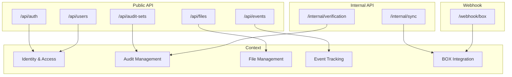
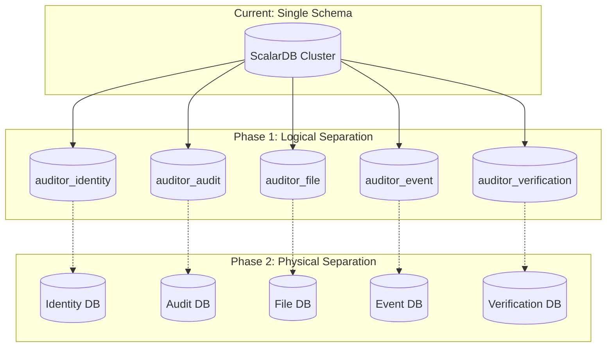
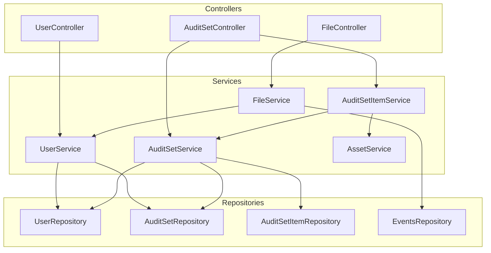
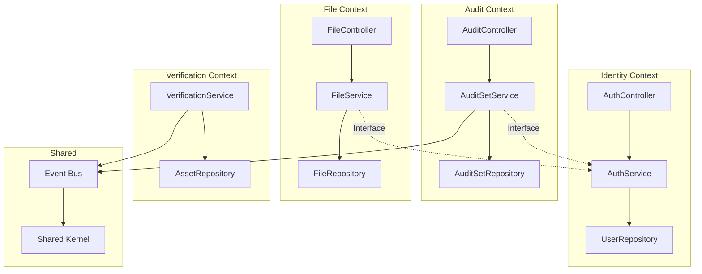

# システムマッピング (System Mapping)

## 1. 現状システム → ドメイン対応表

### 1.1 サービス層マッピング

| 現行サービス | 行数 | 対応ドメイン | 対応コンテキスト | 分割提案 |
|-------------|------|-------------|-----------------|---------|
| UserService | 1116 | Identity & Access, BOX Integration | Identity & Access, BOX Integration | AuthService, BoxUserService, UserMgmtService, PasswordService |
| AuditSetService | 845 | Audit Management | Audit Management | AuditSetCrudService, AuditSetAccessService, AuditSetGroupService |
| AuditSetItemService | 899 | Audit Management, Integrity Verification | Audit Management, Integrity Verification | ItemCrudService, MonitoringService, VerificationService |
| AuditSetCollaboratorService | 288 | Audit Management | Audit Management | 維持 |
| AuditGroupService | 439 | Audit Management | Audit Management | 維持 |
| FileService | 555 | File Management | File Management | FileDetailsService, FileVersionService |
| FolderService | 115 | File Management | File Management | 維持 |
| EventLogService | 222 | Event Tracking | Event Tracking | 維持 |
| AssetService | 199 | Integrity Verification | Integrity Verification | 維持 |
| CommonService | 33 | 共有カーネル | Shared Kernel | 維持 |

### 1.2 リポジトリ層マッピング

| 現行リポジトリ | 対応ドメイン | 対応コンテキスト | Aggregate |
|---------------|-------------|-----------------|-----------|
| UserRepository | Identity & Access | Identity & Access | User |
| RoleUserRepository | Identity & Access | Identity & Access | User |
| UserTokenRepository | Identity & Access, BOX Integration | Identity & Access | User |
| UserOptRepository | Identity & Access | Identity & Access | User |
| OrganizationRepository | Identity & Access | Identity & Access | Organization |
| AuditSetRepository | Audit Management | Audit Management | AuditSet |
| AuditSetItemRepository | Audit Management | Audit Management | AuditSet |
| AuditSetCollaboratorsRepository | Audit Management | Audit Management | AuditSet |
| AuditGroupRepository | Audit Management | Audit Management | AuditGroup |
| AuditGrpAuditSetMappingRepository | Audit Management | Audit Management | AuditGroup |
| UserAuditGroupMappingRepository | Audit Management | Audit Management | AuditGroup |
| EventsRepository | Event Tracking | Event Tracking | Event |
| ItemEventsRepository | Event Tracking | Event Tracking | Event |
| FileMonitoringStatusRepository | File Management | File Management | FileMonitoring |
| AuditorLogsRepository | Event Tracking | Event Tracking | AuditLog |
| Sha1Repository | File Management, Integrity Verification | File Management | FileSha1 |

### 1.3 エンティティ層マッピング

| 現行エンティティ | ドメイン | コンテキスト | 種別 | 備考 |
|-----------------|---------|-------------|------|------|
| User | Identity & Access | Identity & Access | Aggregate Root | |
| RoleUser | Identity & Access | Identity & Access | Entity | User配下 |
| UserToken | Identity & Access | Identity & Access | Value Object | |
| UserOpt | Identity & Access | Identity & Access | Entity | |
| Organization | Identity & Access | Identity & Access | Aggregate Root | |
| AuditSet | Audit Management | Audit Management | Aggregate Root | |
| AuditSetItem | Audit Management | Audit Management | Entity | AuditSet配下 |
| AuditSetCollaborators | Audit Management | Audit Management | Entity | AuditSet配下 |
| AuditGroup | Audit Management | Audit Management | Aggregate Root | |
| AuditGrpAuditSetMapping | Audit Management | Audit Management | Value Object | |
| UserAuditGroupMapping | Audit Management | Audit Management | Value Object | |
| Events | Event Tracking | Event Tracking | Aggregate Root | |
| ItemEvents | Event Tracking | Event Tracking | Entity | Events配下 |
| FileMonitoringStatus | File Management | File Management | Entity | |
| Sha1 | Integrity Verification | Integrity Verification | Value Object | |

---

## 2. コード配置マッピング

### 2.1 現行パッケージ → 目標パッケージ

```
【現行構造】                          【目標構造】
com.scalar.events_log_tool/           com.scalar.auditor/
├── application/                      ├── identity/
│   ├── controller/                   │   ├── api/
│   │   ├── UserController            │   │   └── UserController
│   │   ├── AuditSetController        │   ├── application/
│   │   └── ...                       │   │   ├── AuthenticationService
│   └── service/                      │   │   ├── UserManagementService
│       ├── UserService               │   │   └── PasswordResetService
│       ├── AuditSetService           │   ├── domain/
│       └── ...                       │   │   ├── User
├── domain/                           │   │   ├── RoleUser
│   └── model/                        │   │   └── UserRepository
│       ├── User                      │   └── infrastructure/
│       ├── AuditSet                  │       └── JpaUserRepository
│       └── ...                       │
├── infrastructure/                   ├── audit/
│   └── repository/                   │   ├── api/
│       ├── UserRepository            │   │   ├── AuditSetController
│       ├── AuditSetRepository        │   │   └── AuditGroupController
│       └── ...                       │   ├── application/
└── utility/                          │   │   ├── AuditSetService
    └── BoxUtility                    │   │   └── AuditGroupService
                                      │   ├── domain/
                                      │   │   ├── AuditSet
                                      │   │   ├── AuditSetItem
                                      │   │   └── AuditGroup
                                      │   └── infrastructure/
                                      │
                                      ├── file/
                                      │   ├── api/
                                      │   ├── application/
                                      │   ├── domain/
                                      │   └── infrastructure/
                                      │
                                      ├── event/
                                      │   ├── api/
                                      │   ├── application/
                                      │   ├── domain/
                                      │   └── infrastructure/
                                      │
                                      ├── verification/
                                      │   ├── api/
                                      │   ├── application/
                                      │   ├── domain/
                                      │   └── infrastructure/
                                      │
                                      ├── box/
                                      │   ├── application/
                                      │   └── infrastructure/
                                      │       └── acl/
                                      │
                                      └── shared/
                                          ├── events/
                                          └── types/
```

---

## 3. API エンドポイントマッピング

### 3.1 現行エンドポイント → コンテキスト

| エンドポイント | 現行Controller | 対応コンテキスト | 移行先 |
|--------------|----------------|-----------------|-------|
| `/api/auth/**` | UserController | Identity & Access | identity/api/AuthController |
| `/api/users/**` | UserController | Identity & Access | identity/api/UserController |
| `/api/audit-sets/**` | AuditSetController | Audit Management | audit/api/AuditSetController |
| `/api/audit-groups/**` | AuditGroupController | Audit Management | audit/api/AuditGroupController |
| `/api/files/**` | FileController | File Management | file/api/FileController |
| `/api/folders/**` | FolderController | File Management | file/api/FolderController |
| `/api/events/**` | EventLogController | Event Tracking | event/api/EventController |
| `/api/box/**` | (各Controller内) | BOX Integration | box/api/BoxController |

### 3.2 API分類



---

## 4. データベーススキーママッピング

### 4.1 テーブル → コンテキスト

| テーブル | 対応コンテキスト | 所有権 | 共有タイプ |
|---------|-----------------|-------|-----------|
| users | Identity & Access | 専有 | 参照のみ許可 |
| role_user | Identity & Access | 専有 | なし |
| user_tokens | Identity & Access | 専有 | なし |
| user_opt | Identity & Access | 専有 | なし |
| organizations | Identity & Access | 専有 | 参照のみ許可 |
| audit_sets | Audit Management | 専有 | なし |
| audit_set_items | Audit Management | 専有 | なし |
| audit_set_collaborators | Audit Management | 専有 | なし |
| audit_groups | Audit Management | 専有 | なし |
| audit_grp_audit_set_mapping | Audit Management | 専有 | なし |
| user_audit_group_mapping | Audit Management | 専有 | なし |
| events | Event Tracking | 専有 | なし |
| item_events | Event Tracking | 専有 | なし |
| file_monitoring_status | File Management | 専有 | なし |
| sha1 | Integrity Verification | 専有 | なし |
| auditor_logs | Event Tracking | 専有 | なし |

### 4.2 スキーマ分割計画



---

## 5. 外部連携マッピング

### 5.1 BOX API連携

| 現行利用箇所 | BOX API | 対応コンテキスト | ACL経由 |
|-------------|---------|-----------------|--------|
| UserService.registerUserAndSaveToken | OAuth API | Identity & Access | ✓ |
| FileService.getFileDetails | Files API | File Management | ✓ |
| FolderService.getFolderItems | Folders API | File Management | ✓ |
| EventLogService.getEnterpriseEvents | Events API | Event Tracking | ✓ |
| BoxUtility.getConnection | Connection | BOX Integration | - |

### 5.2 ScalarDL連携

| 現行利用箇所 | ScalarDL API | 対応コンテキスト |
|-------------|-------------|-----------------|
| AssetService.registerAsset | Ledger.register | Integrity Verification |
| AssetService.validateAsset | Auditor.validate | Integrity Verification |
| AssetService.getAssetHistory | Ledger.scan | Integrity Verification |

---

## 6. 依存関係マッピング

### 6.1 現行依存関係



### 6.2 目標依存関係



---

## 7. 移行チェックリスト

### 7.1 Identity & Access Context

- [ ] UserService分割
  - [ ] AuthenticationService抽出
  - [ ] UserManagementService抽出
  - [ ] PasswordResetService抽出
- [ ] パッケージ移動
- [ ] インターフェース定義
- [ ] テスト移行

### 7.2 Audit Management Context

- [ ] AuditSetService整理
- [ ] AuditSetItemService分割
- [ ] 循環依存解消
- [ ] パッケージ移動
- [ ] テスト移行

### 7.3 File Management Context

- [ ] FileService整理
- [ ] FolderService統合検討
- [ ] BOX ACL経由に変更
- [ ] パッケージ移動
- [ ] テスト移行

### 7.4 Event Tracking Context

- [ ] EventLogService維持
- [ ] イベント発行者の整理
- [ ] パッケージ移動
- [ ] テスト移行

### 7.5 Integrity Verification Context

- [ ] AssetService維持
- [ ] 検証ロジック抽出
- [ ] ScalarDL連携の抽象化
- [ ] パッケージ移動
- [ ] テスト移行

### 7.6 BOX Integration Context

- [ ] BoxApiClient作成
- [ ] ACL層実装
- [ ] モデルマッパー作成
- [ ] パッケージ移動
- [ ] テスト移行

---

## 8. 影響分析

### 8.1 変更影響マトリクス

| 変更対象 | Identity | Audit | File | Event | Verification | BOX |
|---------|:--------:|:-----:|:----:|:-----:|:------------:|:---:|
| UserService分割 | ◎ | ○ | ○ | - | - | ○ |
| AuditSet循環依存解消 | - | ◎ | - | ○ | ○ | - |
| BOX ACL導入 | ○ | - | ◎ | ○ | - | ◎ |
| スキーマ分割 | ◎ | ◎ | ◎ | ◎ | ◎ | - |

◎: 直接影響, ○: 間接影響, -: 影響なし

### 8.2 リスク評価

| マッピング項目 | リスクレベル | 理由 |
|--------------|:----------:|------|
| UserService分割 | 高 | 全コンテキストが依存 |
| 循環依存解消 | 中 | Audit内で完結 |
| BOX ACL導入 | 中 | 外部API変更リスク |
| スキーマ分割 | 高 | トランザクション影響 |

---

*Generated: 2025-12-26*
*Source: scalar-event-log-fetcher-main*
