# ターゲットアーキテクチャ

## 1. アーキテクチャ概要

### 1.1 マイクロサービス全体図

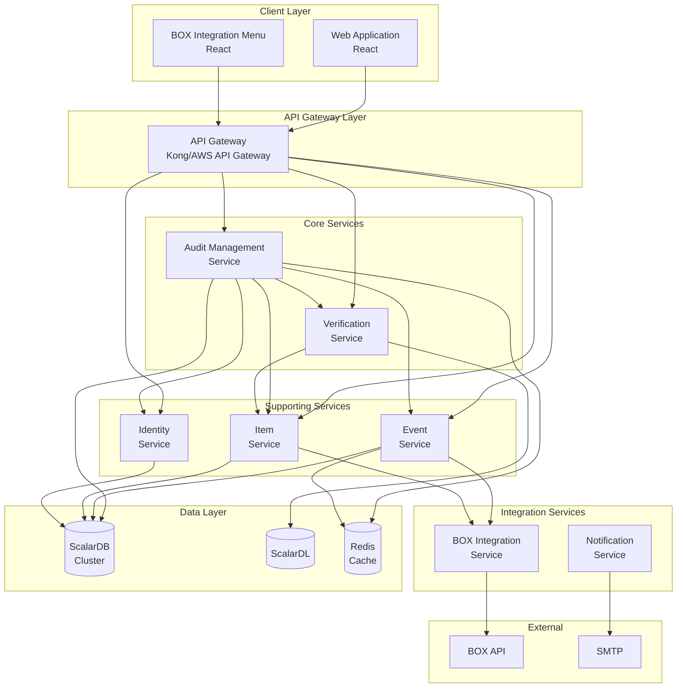

### 1.2 サービス一覧

| サービス名 | 種別 | 主要責務 | 技術スタック |
|-----------|------|----------|-------------|
| audit-management-service | Core | 監査セット・グループ管理 | Spring Boot, ScalarDB |
| verification-service | Core | 改ざん検知・検証 | Spring Boot, ScalarDL |
| event-service | Supporting | イベントログ管理 | Spring Boot, ScalarDB |
| item-service | Supporting | ファイル・フォルダ管理 | Spring Boot, ScalarDB |
| identity-service | Supporting | 認証・ユーザー管理 | Spring Boot, ScalarDB |
| box-integration-service | Integration | BOX API連携 | Spring Boot |
| notification-service | Integration | メール・通知 | Spring Boot |

---

## 2. サービス詳細設計

### 2.1 Audit Management Service

**責務**: 監査セット、監査グループ、コラボレーターのライフサイクル管理

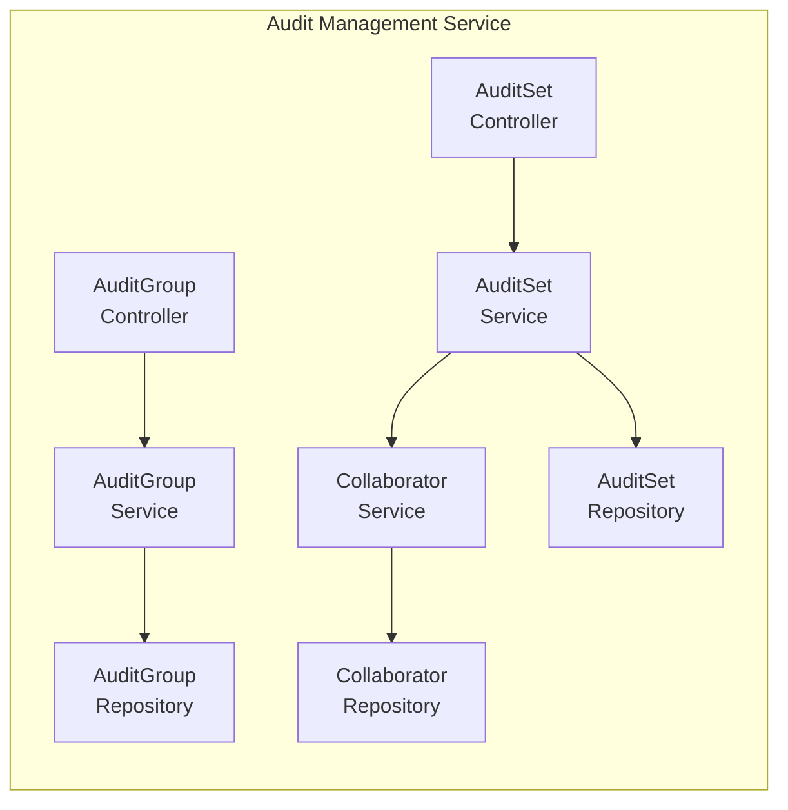

**API エンドポイント**:
| メソッド | パス | 説明 |
|---------|------|------|
| POST | /api/v1/audit-sets | 監査セット作成 |
| GET | /api/v1/audit-sets | 監査セット一覧 |
| GET | /api/v1/audit-sets/{id} | 監査セット詳細 |
| PUT | /api/v1/audit-sets/{id} | 監査セット更新 |
| DELETE | /api/v1/audit-sets/{id} | 監査セット削除 |
| POST | /api/v1/audit-sets/{id}/items | アイテム追加 |
| POST | /api/v1/audit-groups | 監査グループ作成 |
| POST | /api/v1/audit-sets/{id}/collaborators | コラボレーター追加 |

**データモデル**:
```
AuditSet
├── audit_set_id (PK)
├── name
├── description
├── owner_user_id
├── created_at
└── updated_at

AuditSetItem
├── audit_set_id (PK)
├── item_id (CK)
├── item_type
└── added_at
```

---

### 2.2 Verification Service

**責務**: ScalarDLを用いた改ざん検知・検証

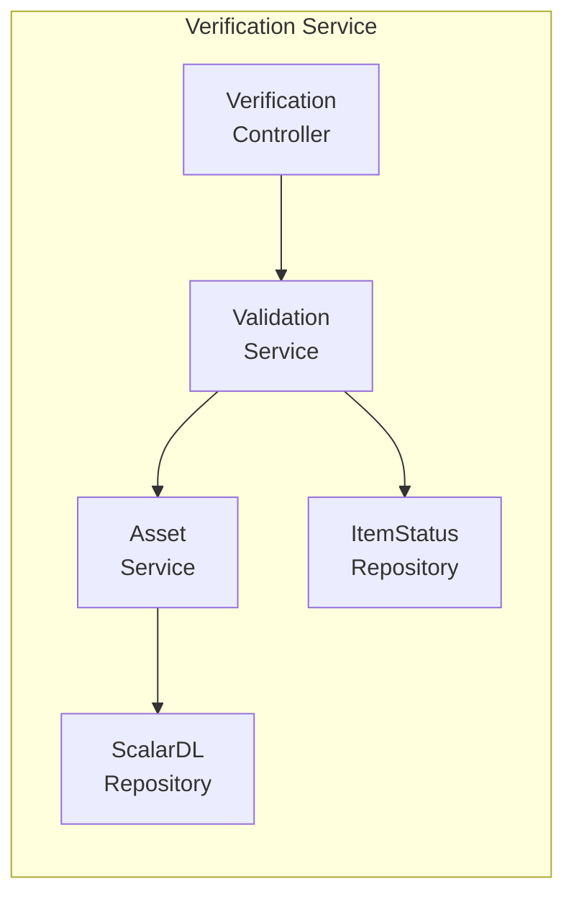

**API エンドポイント**:
| メソッド | パス | 説明 |
|---------|------|------|
| POST | /api/v1/items/{id}/validate | アイテム検証 |
| POST | /api/v1/audit-sets/{id}/validate | 監査セット全体検証 |
| GET | /api/v1/items/{id}/status | 改ざんステータス取得 |
| POST | /api/v1/items/{id}/register | アセット登録 |

**ScalarDL Contract**:
```
Contract: PutAsset
- assetId: item_id
- properties: {sha1_hash, version, timestamp}

Contract: ValidateAsset
- assetId: item_id
- returns: ValidationResult
```

---

### 2.3 Event Service

**責務**: BOXイベントログの取得・保存・照会

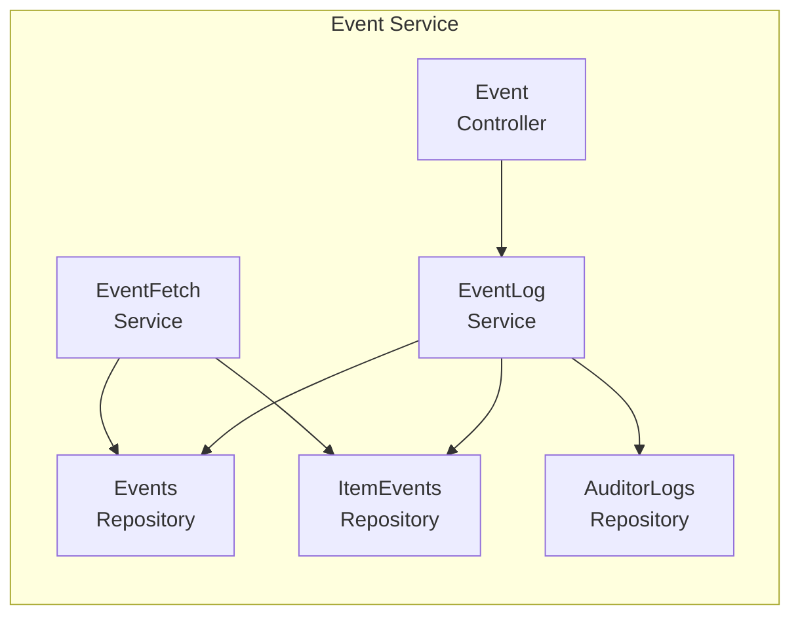

**API エンドポイント**:
| メソッド | パス | 説明 |
|---------|------|------|
| GET | /api/v1/events | イベント一覧（フィルタ付き） |
| GET | /api/v1/items/{id}/events | アイテム別イベント |
| GET | /api/v1/audit-sets/{id}/events | 監査セット別イベント |
| GET | /api/v1/auditor-logs | 監査人ログ |

**バッチ処理**:
- EventFetchJobが定期的にBOX APIからイベント取得
- PositionTrackerで取得位置を管理

---

### 2.4 Item Service

**責務**: ファイル・フォルダメタデータ管理

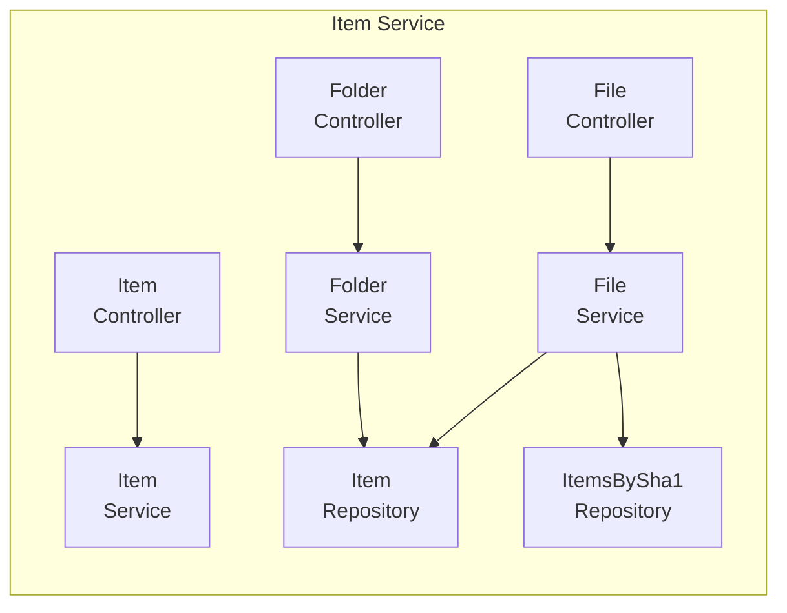

**API エンドポイント**:
| メソッド | パス | 説明 |
|---------|------|------|
| GET | /api/v1/items/{id} | アイテム詳細 |
| GET | /api/v1/files/{id}/versions | バージョン一覧 |
| GET | /api/v1/files/{sha1}/copies | SHA1コピー一覧 |
| GET | /api/v1/folders/{id}/children | フォルダ内容 |

---

### 2.5 Identity Service

**責務**: 認証・認可・ユーザー管理

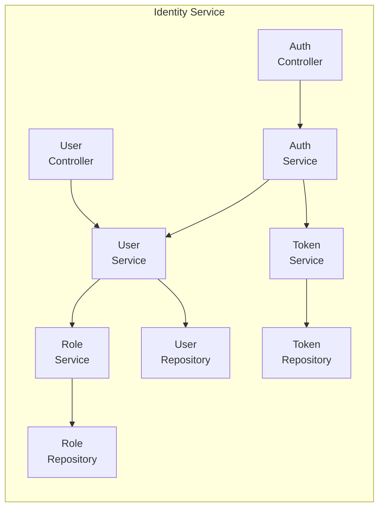

**API エンドポイント**:
| メソッド | パス | 説明 |
|---------|------|------|
| POST | /api/v1/auth/login | ログイン |
| POST | /api/v1/auth/logout | ログアウト |
| POST | /api/v1/auth/refresh | トークン更新 |
| GET | /api/v1/users | ユーザー一覧 |
| POST | /api/v1/users | ユーザー作成（外部監査人） |
| PUT | /api/v1/users/{id}/roles | ロール更新 |

---

### 2.6 BOX Integration Service

**責務**: BOX APIとの連携を一元化

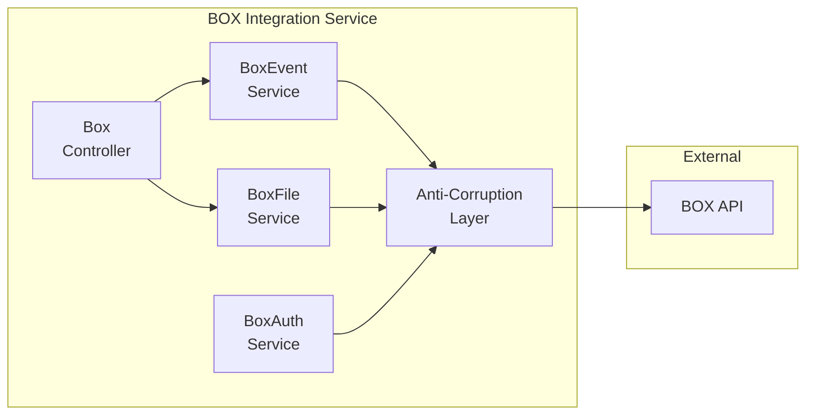

**API エンドポイント**:
| メソッド | パス | 説明 |
|---------|------|------|
| GET | /api/v1/box/events | イベントストリーム取得 |
| GET | /api/v1/box/files/{id} | ファイル詳細取得 |
| GET | /api/v1/box/files/{id}/preview | プレビューURL取得 |
| POST | /api/v1/box/oauth/callback | OAuth コールバック |

---

## 3. サービス間通信

### 3.1 同期通信（REST/gRPC）

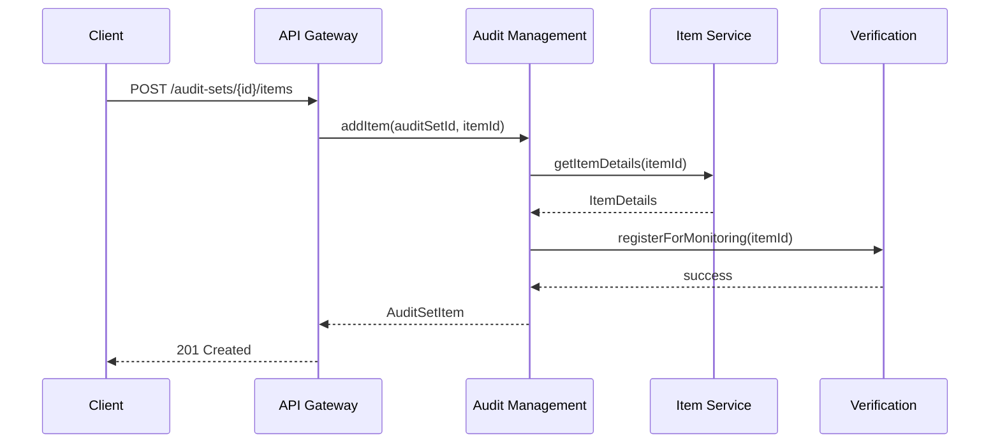

### 3.2 非同期通信（イベント駆動）

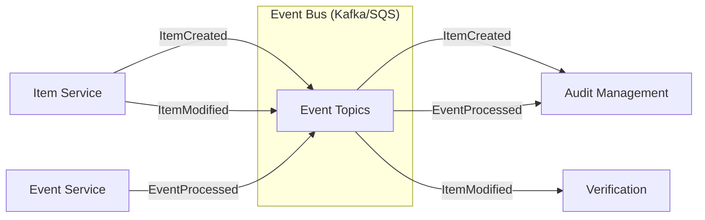

**イベント定義**:
```json
{
  "eventType": "ItemCreated",
  "timestamp": "2024-01-01T00:00:00Z",
  "payload": {
    "itemId": "file_123456",
    "itemType": "FILE",
    "parentId": "folder_789",
    "sha1Hash": "abc123..."
  }
}
```

---

## 4. デプロイメントアーキテクチャ

### 4.1 Kubernetes構成

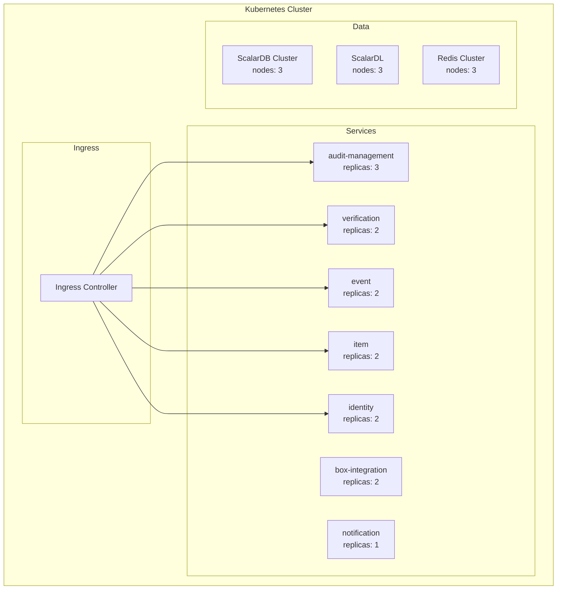

### 4.2 サービス構成

| サービス | レプリカ数 | CPU | Memory | 理由 |
|---------|-----------|-----|--------|------|
| audit-management | 3 | 500m | 1Gi | コアサービス、高可用性 |
| verification | 2 | 1000m | 2Gi | ScalarDL通信、CPU集約 |
| event | 2 | 500m | 1Gi | イベント処理 |
| item | 2 | 500m | 512Mi | 軽量CRUD |
| identity | 2 | 500m | 512Mi | 認証処理 |
| box-integration | 2 | 500m | 512Mi | 外部API通信 |
| notification | 1 | 250m | 256Mi | 非クリティカル |

---

## 5. 移行戦略

### 5.1 段階的移行（Strangler Fig パターン）

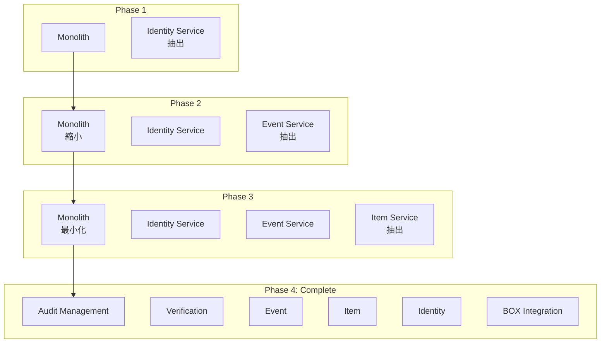

### 5.2 移行フェーズ

| Phase | 抽出サービス | 期間目安 | リスク |
|-------|-------------|----------|--------|
| 1 | Identity Service | 中 | 認証フロー変更 |
| 2 | Event Service | 小 | イベント取得分離 |
| 3 | Item Service | 小 | データ参照パターン変更 |
| 4 | Verification Service | 中 | ScalarDL連携 |
| 5 | BOX Integration | 小 | API統合 |
| 6 | Audit Management | 中 | コア機能分離 |

---

## 6. 監視・運用

### 6.1 可観測性

| 領域 | ツール | 用途 |
|------|--------|------|
| メトリクス | Prometheus + Grafana | パフォーマンス監視 |
| ログ | ELK Stack / Loki | ログ集約・検索 |
| トレース | Jaeger / Zipkin | 分散トレーシング |
| アラート | PagerDuty / Opsgenie | インシデント管理 |

### 6.2 SLA目標

| メトリクス | 目標値 |
|-----------|--------|
| 可用性 | 99.9% |
| API レスポンス (P95) | < 500ms |
| API レスポンス (P99) | < 1000ms |
| エラー率 | < 0.1% |
