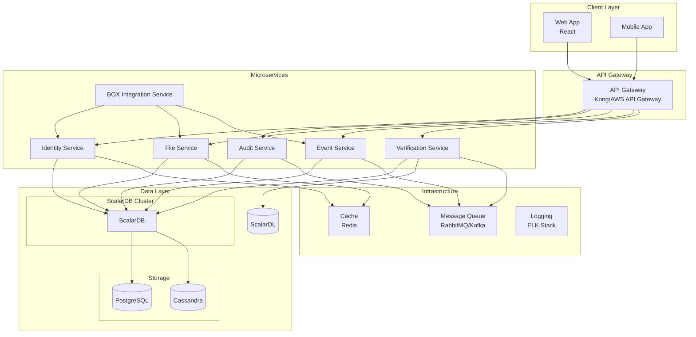
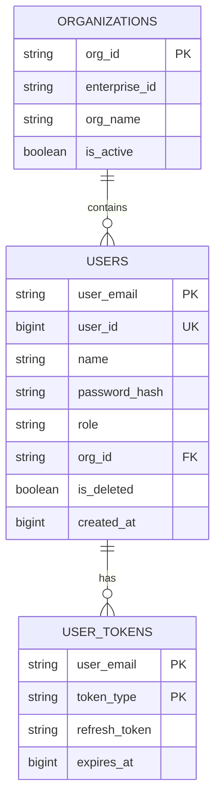
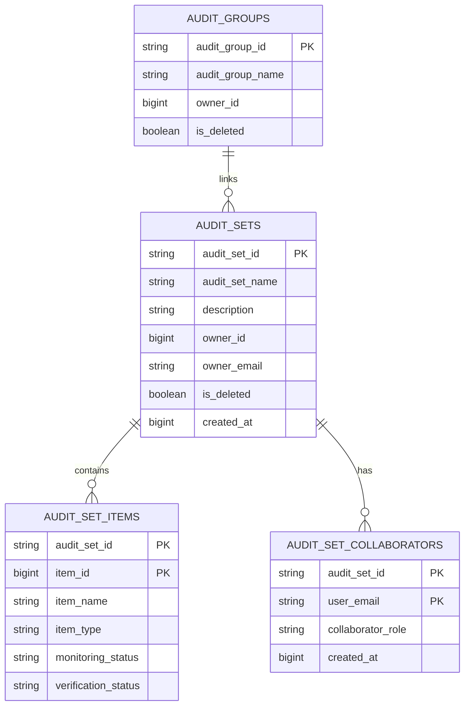
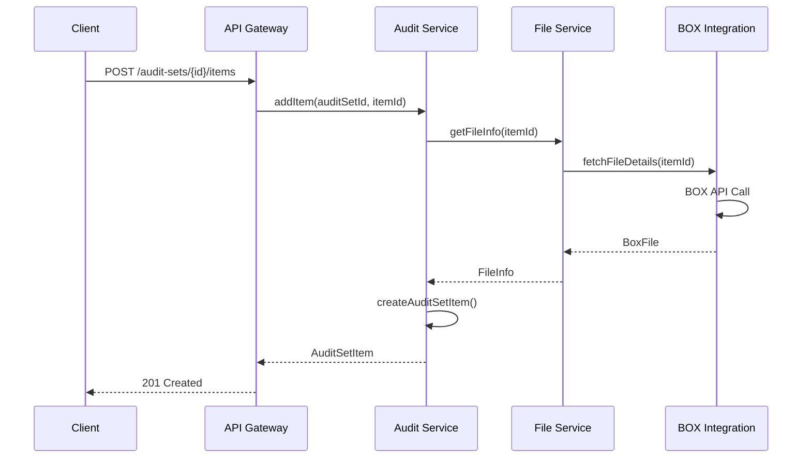
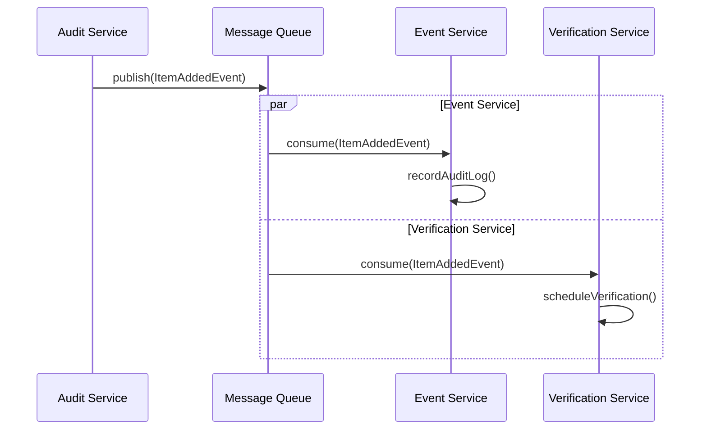
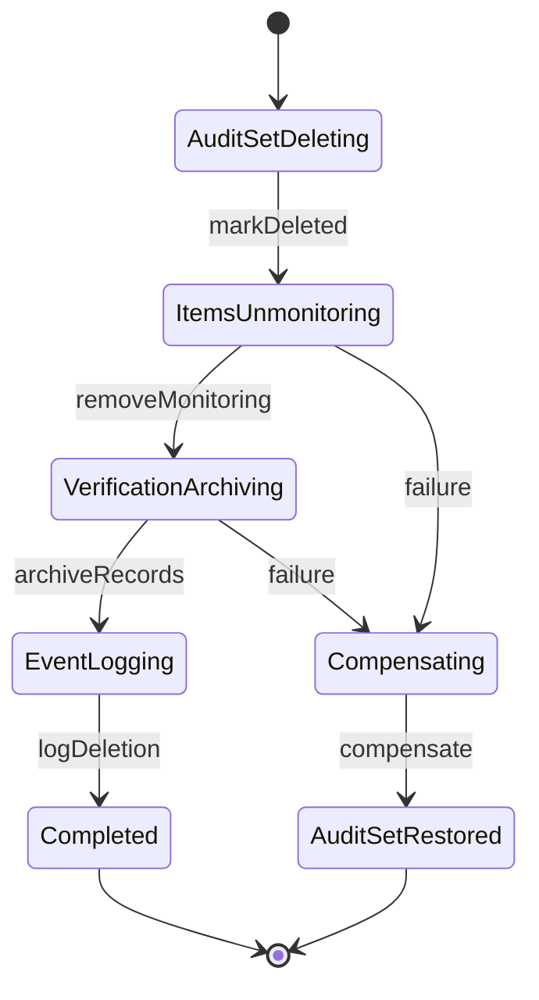
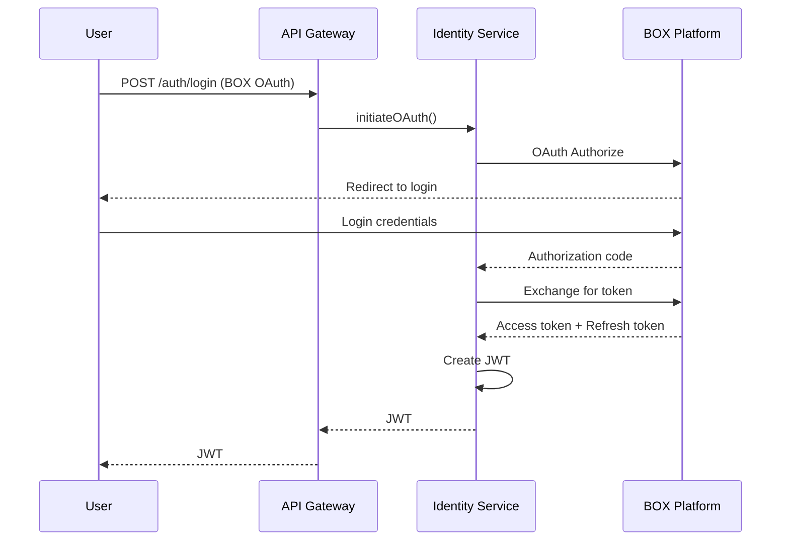

# ターゲットアーキテクチャ (Target Architecture)

## 1. アーキテクチャ概要

### 1.1 目標アーキテクチャ



### 1.2 サービス一覧

| サービス | 責務 | 技術スタック | チームサイズ |
|---------|------|-------------|------------|
| Identity Service | 認証・認可・ユーザー管理 | Spring Boot, JWT | 2-3名 |
| Audit Service | 監査セット・グループ管理 | Spring Boot | 3-4名 |
| File Service | ファイル・フォルダ情報管理 | Spring Boot | 2-3名 |
| Event Service | イベントログ収集・検索 | Spring Boot | 2名 |
| Verification Service | 改ざん検証 | Spring Boot, ScalarDL | 2名 |
| BOX Integration Service | BOX API連携 | Spring Boot | 2名 |

---

## 2. サービス詳細設計

### 2.1 Identity Service

**責務:**
- ユーザー認証（BOX OAuth / パスワード）
- JWT発行・検証
- ユーザーCRUD
- ロール・権限管理
- 組織管理

**API仕様:**

| Method | Endpoint | 説明 |
|--------|----------|------|
| POST | /api/v1/auth/login | ログイン |
| POST | /api/v1/auth/token/refresh | トークン更新 |
| POST | /api/v1/auth/logout | ログアウト |
| GET | /api/v1/users | ユーザー一覧 |
| POST | /api/v1/users | ユーザー作成 |
| GET | /api/v1/users/{id} | ユーザー詳細 |
| PUT | /api/v1/users/{id} | ユーザー更新 |
| DELETE | /api/v1/users/{id} | ユーザー削除 |
| GET | /api/v1/organizations | 組織一覧 |

**データモデル:**



**依存サービス:**
- BOX Integration Service (OAuth)

---

### 2.2 Audit Service

**責務:**
- 監査セットCRUD
- 監査セットアイテム管理
- コラボレーター管理
- 監査グループ管理
- アクセス制御

**API仕様:**

| Method | Endpoint | 説明 |
|--------|----------|------|
| GET | /api/v1/audit-sets | 監査セット一覧 |
| POST | /api/v1/audit-sets | 監査セット作成 |
| GET | /api/v1/audit-sets/{id} | 監査セット詳細 |
| PUT | /api/v1/audit-sets/{id} | 監査セット更新 |
| DELETE | /api/v1/audit-sets/{id} | 監査セット削除 |
| GET | /api/v1/audit-sets/{id}/items | アイテム一覧 |
| POST | /api/v1/audit-sets/{id}/items | アイテム追加 |
| DELETE | /api/v1/audit-sets/{id}/items/{itemId} | アイテム削除 |
| GET | /api/v1/audit-sets/{id}/collaborators | コラボレーター一覧 |
| POST | /api/v1/audit-sets/{id}/collaborators | コラボレーター招待 |
| GET | /api/v1/audit-groups | 監査グループ一覧 |
| POST | /api/v1/audit-groups | 監査グループ作成 |

**データモデル:**



**依存サービス:**
- Identity Service (ユーザー情報)
- File Service (アイテム情報)
- Verification Service (検証実行)
- Event Service (イベント発行)

---

### 2.3 File Service

**責務:**
- ファイル・フォルダ情報取得
- ファイルバージョン管理
- 監視ステータス管理
- 重複ファイル検出（SHA1）

**API仕様:**

| Method | Endpoint | 説明 |
|--------|----------|------|
| GET | /api/v1/files/{id} | ファイル詳細 |
| GET | /api/v1/files/{id}/versions | バージョン一覧 |
| GET | /api/v1/files/{id}/collaborators | コラボレーター一覧 |
| GET | /api/v1/folders/{id} | フォルダ詳細 |
| GET | /api/v1/folders/{id}/items | フォルダ内アイテム |
| GET | /api/v1/items/by-sha1/{sha1} | SHA1でアイテム検索 |
| PUT | /api/v1/items/{id}/monitoring | 監視ステータス更新 |

**依存サービス:**
- BOX Integration Service (BOX API呼び出し)
- Identity Service (認証)

---

### 2.4 Event Service

**責務:**
- BOXイベント収集
- イベント検索・フィルタリング
- 監査ログ記録
- イベント日付管理

**API仕様:**

| Method | Endpoint | 説明 |
|--------|----------|------|
| GET | /api/v1/events | イベント検索 |
| GET | /api/v1/events/dates | 利用可能日付一覧 |
| GET | /api/v1/events/by-item/{itemId} | アイテム別イベント |
| GET | /api/v1/auditor-logs | 監査人ログ一覧 |
| POST | /api/v1/events/sync | イベント同期実行 |

**依存サービス:**
- BOX Integration Service (エンタープライズイベント取得)
- Identity Service (ユーザー情報)

---

### 2.5 Verification Service

**責務:**
- ファイルハッシュの台帳登録
- 改ざん検証実行
- 検証ステータス管理

**API仕様:**

| Method | Endpoint | 説明 |
|--------|----------|------|
| POST | /api/v1/verification/register | 台帳登録 |
| POST | /api/v1/verification/verify | 改ざん検証 |
| GET | /api/v1/verification/status/{itemId} | 検証ステータス |
| GET | /api/v1/verification/history/{itemId} | 検証履歴 |

**依存サービス:**
- File Service (ファイルハッシュ取得)
- ScalarDL (台帳操作)

---

### 2.6 BOX Integration Service

**責務:**
- BOX OAuth認証フロー
- BOX API接続管理
- ファイル/フォルダAPI呼び出し
- エンタープライズイベント取得
- レート制限・リトライ処理

**API仕様:**

| Method | Endpoint | 説明 |
|--------|----------|------|
| POST | /api/v1/box/oauth/authorize | OAuth認可開始 |
| POST | /api/v1/box/oauth/callback | OAuthコールバック |
| GET | /api/v1/box/files/{id} | BOXファイル取得 |
| GET | /api/v1/box/folders/{id}/items | BOXフォルダアイテム |
| GET | /api/v1/box/events | BOXイベント取得 |

**外部依存:**
- BOX Platform API

---

## 3. サービス間通信

### 3.1 同期通信（REST/gRPC）



### 3.2 非同期通信（イベント駆動）



### 3.3 イベント定義

```java
// ドメインイベント
public record AuditSetCreatedEvent(
    String auditSetId,
    String ownerEmail,
    Instant createdAt
) {}

public record ItemAddedToAuditSetEvent(
    String auditSetId,
    Long itemId,
    String itemType,
    String addedBy,
    Instant addedAt
) {}

public record ItemVerifiedEvent(
    Long itemId,
    String auditSetId,
    VerificationStatus status,
    Instant verifiedAt
) {}

public record CollaboratorInvitedEvent(
    String auditSetId,
    String inviteeEmail,
    String role,
    String invitedBy,
    Instant invitedAt
) {}
```

---

## 4. API Gateway設計

### 4.1 ルーティング設定

```yaml
# Kong Gateway Configuration
services:
  - name: identity-service
    url: http://identity-service:8080
    routes:
      - name: auth-routes
        paths: ["/api/v1/auth"]
      - name: user-routes
        paths: ["/api/v1/users"]
      - name: org-routes
        paths: ["/api/v1/organizations"]

  - name: audit-service
    url: http://audit-service:8080
    routes:
      - name: audit-set-routes
        paths: ["/api/v1/audit-sets"]
      - name: audit-group-routes
        paths: ["/api/v1/audit-groups"]

  - name: file-service
    url: http://file-service:8080
    routes:
      - name: file-routes
        paths: ["/api/v1/files"]
      - name: folder-routes
        paths: ["/api/v1/folders"]
      - name: item-routes
        paths: ["/api/v1/items"]

  - name: event-service
    url: http://event-service:8080
    routes:
      - name: event-routes
        paths: ["/api/v1/events"]
      - name: auditor-log-routes
        paths: ["/api/v1/auditor-logs"]

  - name: verification-service
    url: http://verification-service:8080
    routes:
      - name: verification-routes
        paths: ["/api/v1/verification"]
```

### 4.2 認証・認可

```yaml
# JWT Plugin Configuration
plugins:
  - name: jwt
    config:
      claims_to_verify:
        - exp
      key_claim_name: kid
      secret_is_base64: false

  - name: acl
    config:
      allow:
        - admin
        - user
```

### 4.3 レート制限

```yaml
plugins:
  - name: rate-limiting
    config:
      second: 100
      minute: 1000
      hour: 10000
      policy: local
```

---

## 5. データ整合性

### 5.1 分散トランザクション戦略

| シナリオ | パターン | 整合性 |
|---------|---------|-------|
| 監査セット作成 | ScalarDB TX | 強整合 |
| アイテム追加 | ScalarDB TX + Event | 強整合 |
| コラボレーター招待 | ScalarDB TX | 強整合 |
| 検証実行 | Saga | 結果整合 |
| 監査セット削除 | Saga | 結果整合 |

### 5.2 Sagaオーケストレーション



---

## 6. デプロイメント

### 6.1 Kubernetes構成

```yaml
# Identity Service Deployment
apiVersion: apps/v1
kind: Deployment
metadata:
  name: identity-service
spec:
  replicas: 3
  selector:
    matchLabels:
      app: identity-service
  template:
    metadata:
      labels:
        app: identity-service
    spec:
      containers:
      - name: identity-service
        image: auditor/identity-service:latest
        ports:
        - containerPort: 8080
        resources:
          requests:
            cpu: "500m"
            memory: "512Mi"
          limits:
            cpu: "1"
            memory: "1Gi"
        env:
        - name: SPRING_PROFILES_ACTIVE
          value: "production"
        - name: SCALARDB_CONFIG
          valueFrom:
            secretKeyRef:
              name: scalardb-config
              key: config
        livenessProbe:
          httpGet:
            path: /actuator/health/liveness
            port: 8080
          initialDelaySeconds: 30
          periodSeconds: 10
        readinessProbe:
          httpGet:
            path: /actuator/health/readiness
            port: 8080
          initialDelaySeconds: 5
          periodSeconds: 5
---
apiVersion: v1
kind: Service
metadata:
  name: identity-service
spec:
  selector:
    app: identity-service
  ports:
  - port: 8080
    targetPort: 8080
```

### 6.2 サービスメッシュ

```yaml
# Istio VirtualService
apiVersion: networking.istio.io/v1alpha3
kind: VirtualService
metadata:
  name: audit-service
spec:
  hosts:
  - audit-service
  http:
  - match:
    - headers:
        x-canary:
          exact: "true"
    route:
    - destination:
        host: audit-service
        subset: canary
      weight: 100
  - route:
    - destination:
        host: audit-service
        subset: stable
      weight: 100
```

---

## 7. 可観測性

### 7.1 ログ設計

```json
{
  "timestamp": "2025-01-15T10:30:00.000Z",
  "level": "INFO",
  "service": "audit-service",
  "traceId": "abc123",
  "spanId": "def456",
  "userId": "user@example.com",
  "action": "CREATE_AUDIT_SET",
  "auditSetId": "uuid-123",
  "message": "Audit set created successfully",
  "duration": 150
}
```

### 7.2 メトリクス

```yaml
# Prometheus Metrics
- name: http_requests_total
  type: counter
  labels: [service, method, path, status]

- name: http_request_duration_seconds
  type: histogram
  labels: [service, method, path]

- name: scalardb_transaction_total
  type: counter
  labels: [service, namespace, status]

- name: service_health
  type: gauge
  labels: [service]
```

### 7.3 分散トレーシング

```java
@RestController
public class AuditSetController {

    @PostMapping("/api/v1/audit-sets/{id}/items")
    public ResponseEntity<AuditSetItem> addItem(
            @PathVariable String id,
            @RequestBody AddItemRequest request,
            @RequestHeader("X-Trace-Id") String traceId) {

        try (Scope scope = tracer.buildSpan("addItem")
                .withTag("auditSetId", id)
                .withTag("itemId", request.getItemId())
                .startActive(true)) {

            // ビジネスロジック
            return ResponseEntity.ok(result);
        }
    }
}
```

---

## 8. セキュリティ

### 8.1 認証フロー



### 8.2 認可マトリクス

| ロール | 監査セット作成 | アイテム追加 | コラボレーター招待 | 削除 |
|-------|:------------:|:----------:|:---------------:|:---:|
| AUDIT_ADMIN | ○ | ○ | ○ | ○ |
| AUDIT_GENERAL | ○ | ○ | - | - |
| EXTERNAL_AUDITOR | - | - | - | - |
| OWNER | ○ | ○ | ○ | ○ |
| CO_OWNER | - | ○ | ○ | - |
| MEMBER | - | ○ | - | - |
| REVIEWER | - | - | - | - |

---

*Generated: 2025-12-26*
*Source: scalar-event-log-fetcher-main*
