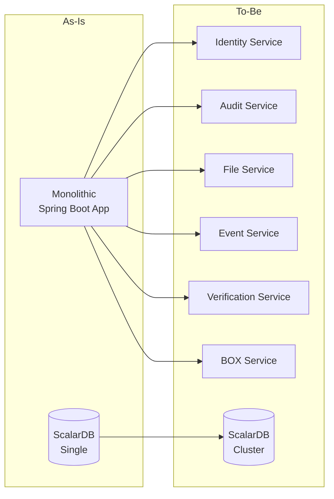
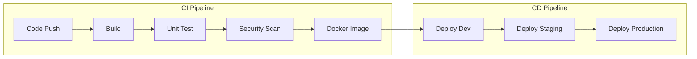
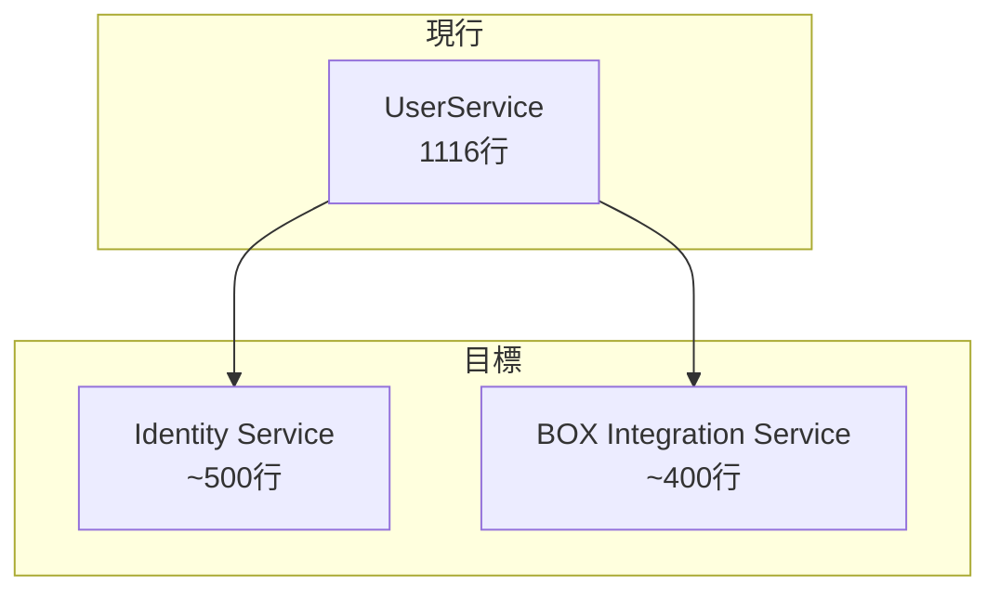
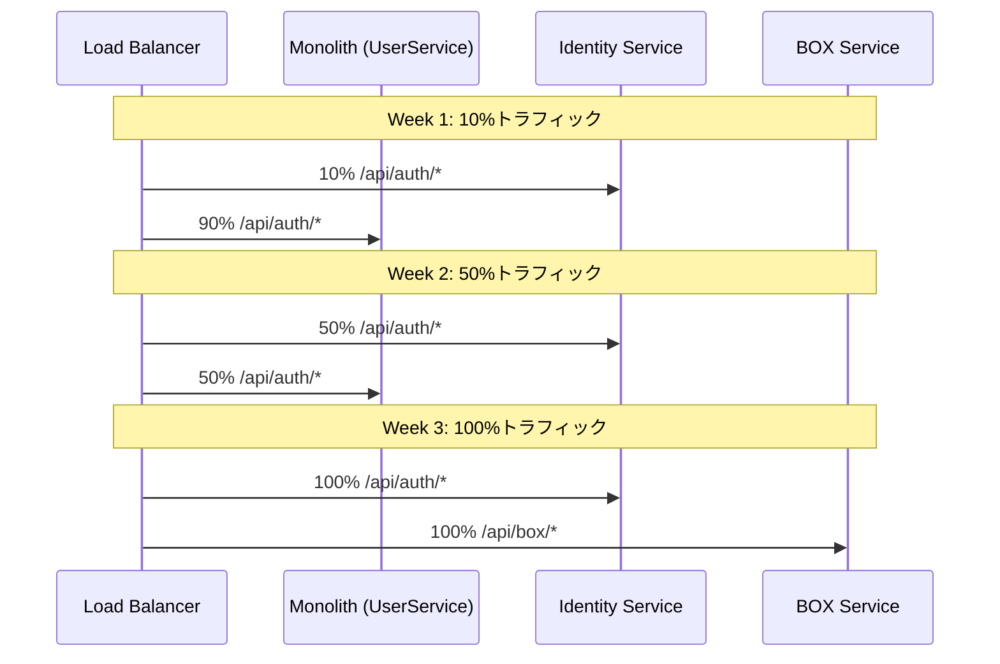
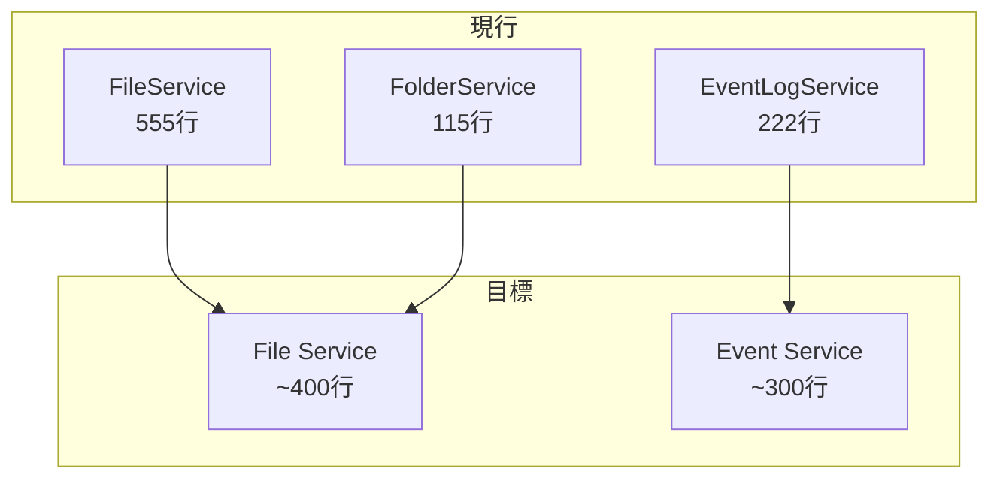
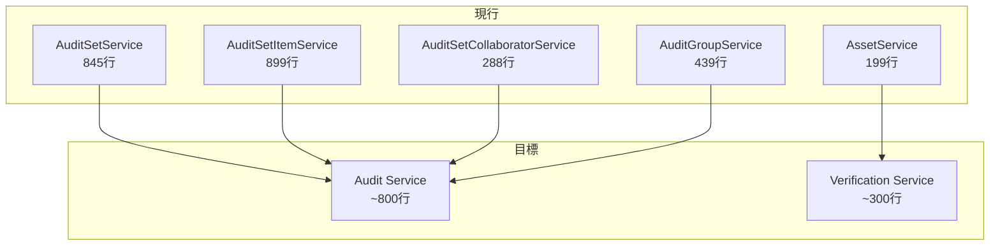
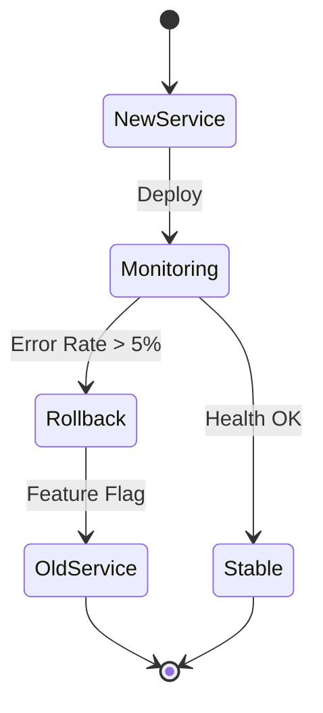
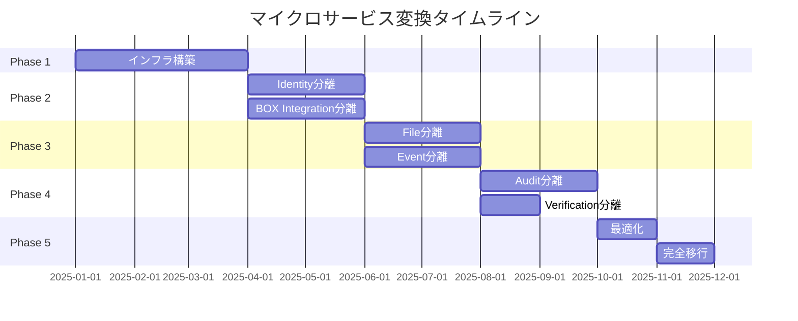

# 変換計画 (Transformation Plan)

## 1. 変換概要

### 1.1 現状 → 目標



### 1.2 変換戦略

| 戦略 | 適用 | 理由 |
|------|------|------|
| **Strangler Fig** | サービス分離 | 段階的移行でリスク軽減 |
| **Branch by Abstraction** | DB移行 | 並行運用可能 |
| **Change Data Capture** | データ同期 | リアルタイム同期 |

### 1.3 フェーズ概要

| Phase | 期間 | 主要タスク | 成果物 |
|-------|------|-----------|--------|
| Phase 1 | 3ヶ月 | インフラ・基盤構築 | K8s環境、CI/CD |
| Phase 2 | 4ヶ月 | Identity & BOX分離 | 2サービス稼働 |
| Phase 3 | 4ヶ月 | File & Event分離 | 4サービス稼働 |
| Phase 4 | 3ヶ月 | Audit & Verification分離 | 6サービス稼働 |
| Phase 5 | 2ヶ月 | 最適化・完全移行 | 本番運用開始 |

---

## 2. Phase 1: インフラ・基盤構築（3ヶ月）

### 2.1 タスク一覧

| # | タスク | 担当 | 工数 |
|---|-------|------|------|
| 1.1 | Kubernetes環境構築 | Infra | 2週間 |
| 1.2 | CI/CDパイプライン構築 | DevOps | 2週間 |
| 1.3 | ScalarDB Cluster構築 | Infra | 2週間 |
| 1.4 | 監視・ログ基盤構築 | DevOps | 2週間 |
| 1.5 | API Gateway導入 | Infra | 1週間 |
| 1.6 | メッセージキュー導入 | Infra | 1週間 |
| 1.7 | 共通ライブラリ作成 | Dev | 2週間 |

### 2.2 Kubernetes環境

```yaml
# 環境構成
environments:
  development:
    cluster: dev-cluster
    nodes: 3
    resources: small

  staging:
    cluster: stg-cluster
    nodes: 5
    resources: medium

  production:
    cluster: prod-cluster
    nodes: 10
    resources: large
    ha: true
```

### 2.3 CI/CDパイプライン



### 2.4 共通ライブラリ

```
auditor-commons/
├── auditor-common-core/         # 共通ユーティリティ
├── auditor-common-security/     # JWT、認証
├── auditor-common-scalardb/     # ScalarDB設定
├── auditor-common-messaging/    # イベント発行
├── auditor-common-logging/      # ログ設定
└── auditor-common-testing/      # テストユーティリティ
```

### 2.5 成果物

- [ ] Kubernetes本番クラスタ稼働
- [ ] CI/CDパイプライン稼働
- [ ] ScalarDB Cluster稼働
- [ ] Prometheus + Grafana稼働
- [ ] ELK Stack稼働
- [ ] Kong API Gateway稼働
- [ ] RabbitMQ稼働
- [ ] 共通ライブラリv1.0リリース

---

## 3. Phase 2: Identity & BOX分離（4ヶ月）

### 3.1 分離対象

**現行UserService (1116行) → 2サービスに分割**



### 3.2 タスク一覧

| # | タスク | 担当 | 工数 |
|---|-------|------|------|
| 2.1 | Identity Serviceプロジェクト作成 | Dev | 1週間 |
| 2.2 | 認証機能移行 | Dev | 2週間 |
| 2.3 | ユーザー管理機能移行 | Dev | 2週間 |
| 2.4 | BOX Integration Service作成 | Dev | 1週間 |
| 2.5 | BOX OAuth機能移行 | Dev | 2週間 |
| 2.6 | BOX API連携機能移行 | Dev | 2週間 |
| 2.7 | Anti-corruption Layer実装 | Dev | 2週間 |
| 2.8 | 統合テスト | QA | 2週間 |
| 2.9 | 段階的切り替え | DevOps | 2週間 |

### 3.3 Identity Service実装

```java
// 新Identity Serviceの構造
identity-service/
├── src/main/java/com/scalar/auditor/identity/
│   ├── api/
│   │   ├── AuthController.java
│   │   ├── UserController.java
│   │   └── OrganizationController.java
│   ├── application/
│   │   ├── AuthenticationService.java
│   │   ├── UserManagementService.java
│   │   └── PasswordResetService.java
│   ├── domain/
│   │   ├── User.java
│   │   ├── UserToken.java
│   │   └── Organization.java
│   ├── infrastructure/
│   │   ├── ScalarDbUserRepository.java
│   │   └── JwtTokenProvider.java
│   └── config/
│       └── SecurityConfig.java
└── src/test/
```

### 3.4 BOX Integration Service実装

```java
// ACL (Anti-corruption Layer) 設計
box-integration-service/
├── src/main/java/com/scalar/auditor/box/
│   ├── api/
│   │   └── BoxController.java
│   ├── application/
│   │   ├── BoxOAuthService.java
│   │   ├── BoxFileService.java
│   │   └── BoxEventService.java
│   ├── infrastructure/
│   │   ├── acl/
│   │   │   ├── BoxApiClient.java      # BOX SDK wrapper
│   │   │   └── BoxModelMapper.java    # BOX → Domain変換
│   │   └── BoxConnectionManager.java
│   └── config/
│       └── BoxConfig.java
```

### 3.5 切り替え戦略



### 3.6 成果物

- [ ] Identity Service本番稼働
- [ ] BOX Integration Service本番稼働
- [ ] 旧UserServiceの認証・BOX機能廃止
- [ ] API Gateway経由のルーティング

---

## 4. Phase 3: File & Event分離（4ヶ月）

### 4.1 分離対象



### 4.2 タスク一覧

| # | タスク | 担当 | 工数 |
|---|-------|------|------|
| 3.1 | File Serviceプロジェクト作成 | Dev | 1週間 |
| 3.2 | ファイル情報取得機能移行 | Dev | 2週間 |
| 3.3 | フォルダ機能統合 | Dev | 1週間 |
| 3.4 | 監視ステータス機能移行 | Dev | 2週間 |
| 3.5 | Event Serviceプロジェクト作成 | Dev | 1週間 |
| 3.6 | イベント検索機能移行 | Dev | 2週間 |
| 3.7 | 監査ログ機能移行 | Dev | 1週間 |
| 3.8 | Cassandraへのイベント移行 | Dev | 2週間 |
| 3.9 | 統合テスト | QA | 2週間 |
| 3.10 | 段階的切り替え | DevOps | 2週間 |

### 4.3 File Service実装

```java
// File Service構造
file-service/
├── src/main/java/com/scalar/auditor/file/
│   ├── api/
│   │   ├── FileController.java
│   │   ├── FolderController.java
│   │   └── ItemController.java
│   ├── application/
│   │   ├── FileInfoService.java
│   │   ├── FileVersionService.java
│   │   └── MonitoringStatusService.java
│   ├── domain/
│   │   ├── Item.java
│   │   ├── ItemMonitoringStatus.java
│   │   └── FileVersion.java
│   └── infrastructure/
│       ├── ScalarDbItemRepository.java
│       └── BoxIntegrationClient.java  # BOX Service呼び出し
```

### 4.4 Event Service実装（Cassandra対応）

```java
// Event Service構造
event-service/
├── src/main/java/com/scalar/auditor/event/
│   ├── api/
│   │   ├── EventController.java
│   │   └── AuditorLogController.java
│   ├── application/
│   │   ├── EventSearchService.java
│   │   ├── EventSyncService.java
│   │   └── AuditorLogService.java
│   ├── domain/
│   │   ├── Event.java
│   │   ├── AuditorLog.java
│   │   └── PositionTracker.java
│   └── infrastructure/
│       ├── ScalarDbEventRepository.java  # Cassandra経由
│       └── BoxIntegrationClient.java
```

### 4.5 成果物

- [ ] File Service本番稼働
- [ ] Event Service本番稼働（Cassandra）
- [ ] イベントデータCassandra移行完了
- [ ] 旧サービス機能廃止

---

## 5. Phase 4: Audit & Verification分離（3ヶ月）

### 5.1 分離対象



### 5.2 タスク一覧

| # | タスク | 担当 | 工数 |
|---|-------|------|------|
| 4.1 | Audit Serviceプロジェクト作成 | Dev | 1週間 |
| 4.2 | 監査セット機能移行 | Dev | 3週間 |
| 4.3 | 循環依存解消 | Dev | 2週間 |
| 4.4 | コラボレーター機能移行 | Dev | 2週間 |
| 4.5 | 監査グループ機能移行 | Dev | 2週間 |
| 4.6 | Verification Service作成 | Dev | 1週間 |
| 4.7 | ScalarDL連携移行 | Dev | 2週間 |
| 4.8 | Sagaパターン実装 | Dev | 2週間 |
| 4.9 | 統合テスト | QA | 2週間 |
| 4.10 | 段階的切り替え | DevOps | 2週間 |

### 5.3 循環依存解消

```java
// Before: 循環依存
AuditSetItemService --> AuditSetService
AuditSetService --> AuditSetItemRepository (直接利用)

// After: インターフェース分離
interface AuditSetQueryPort {
    boolean isItemExist(String auditSetId, Long itemId);
    AuditSet findById(String auditSetId);
}

class AuditSetQueryAdapter implements AuditSetQueryPort {
    // AuditSetRepositoryを直接利用
}

class AuditSetItemService {
    private final AuditSetQueryPort auditSetQuery;  // 依存逆転
}
```

### 5.4 Audit Service実装

```java
// Audit Service構造
audit-service/
├── src/main/java/com/scalar/auditor/audit/
│   ├── api/
│   │   ├── AuditSetController.java
│   │   ├── AuditSetItemController.java
│   │   ├── CollaboratorController.java
│   │   └── AuditGroupController.java
│   ├── application/
│   │   ├── AuditSetService.java
│   │   ├── AuditSetItemService.java
│   │   ├── CollaboratorService.java
│   │   ├── AuditGroupService.java
│   │   └── saga/
│   │       └── AuditSetDeletionSaga.java
│   ├── domain/
│   │   ├── AuditSet.java
│   │   ├── AuditSetItem.java
│   │   ├── Collaborator.java
│   │   └── AuditGroup.java
│   └── infrastructure/
│       ├── ScalarDbAuditSetRepository.java
│       ├── IdentityServiceClient.java
│       ├── FileServiceClient.java
│       └── VerificationServiceClient.java
```

### 5.5 Verification Service実装

```java
// Verification Service構造
verification-service/
├── src/main/java/com/scalar/auditor/verification/
│   ├── api/
│   │   └── VerificationController.java
│   ├── application/
│   │   ├── AssetRegistrationService.java
│   │   ├── TamperDetectionService.java
│   │   └── VerificationHistoryService.java
│   ├── domain/
│   │   ├── Asset.java
│   │   ├── VerificationResult.java
│   │   └── TamperingStatus.java
│   └── infrastructure/
│       ├── ScalarDlClient.java
│       └── FileServiceClient.java
```

### 5.6 成果物

- [ ] Audit Service本番稼働
- [ ] Verification Service本番稼働
- [ ] 循環依存完全解消
- [ ] Sagaパターン稼働

---

## 6. Phase 5: 最適化・完全移行（2ヶ月）

### 6.1 タスク一覧

| # | タスク | 担当 | 工数 |
|---|-------|------|------|
| 5.1 | パフォーマンスチューニング | Dev | 2週間 |
| 5.2 | セキュリティ監査 | Security | 1週間 |
| 5.3 | 負荷テスト | QA | 2週間 |
| 5.4 | DR訓練 | Ops | 1週間 |
| 5.5 | 旧モノリス廃止 | DevOps | 1週間 |
| 5.6 | ドキュメント整備 | All | 1週間 |

### 6.2 パフォーマンスチューニング

```yaml
# チューニング項目
performance:
  - name: Connection Pool
    current: 50
    target: 100
    tuning: "ScalarDB connection pool max"

  - name: Cache Hit Rate
    current: 60%
    target: 90%
    tuning: "Redis caching for user/file info"

  - name: Query Optimization
    current: P99 500ms
    target: P99 200ms
    tuning: "Secondary index追加、N+1解消"

  - name: Async Processing
    current: Sync
    target: Async
    tuning: "イベント発行の非同期化"
```

### 6.3 最終検証

| 検証項目 | 基準 | 結果 |
|---------|------|------|
| レスポンスタイム P99 | < 500ms | - |
| スループット | > 1000 TPS | - |
| 可用性 | 99.9% | - |
| エラー率 | < 0.1% | - |
| データ整合性 | 100% | - |

### 6.4 成果物

- [ ] 全サービス最適化完了
- [ ] セキュリティ監査合格
- [ ] 負荷テスト合格
- [ ] DR訓練完了
- [ ] 旧モノリス廃止
- [ ] 運用ドキュメント完成

---

## 7. リスク管理

### 7.1 リスク一覧

| リスク | 確率 | 影響 | 対策 |
|-------|------|------|------|
| 機能退行 | 高 | 高 | 包括的テスト、段階的移行 |
| パフォーマンス劣化 | 中 | 高 | ベンチマーク継続、キャッシュ導入 |
| データ不整合 | 中 | 高 | ScalarDB TX、データ検証バッチ |
| スケジュール遅延 | 中 | 中 | バッファ確保、優先順位付け |
| チーム習熟度 | 中 | 中 | トレーニング、ペアプログラミング |

### 7.2 ロールバック計画



---

## 8. タイムライン



---

*Generated: 2025-12-26*
*Source: scalar-event-log-fetcher-main*
