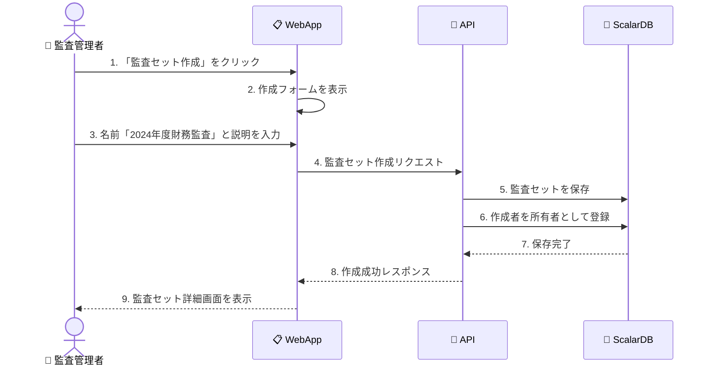
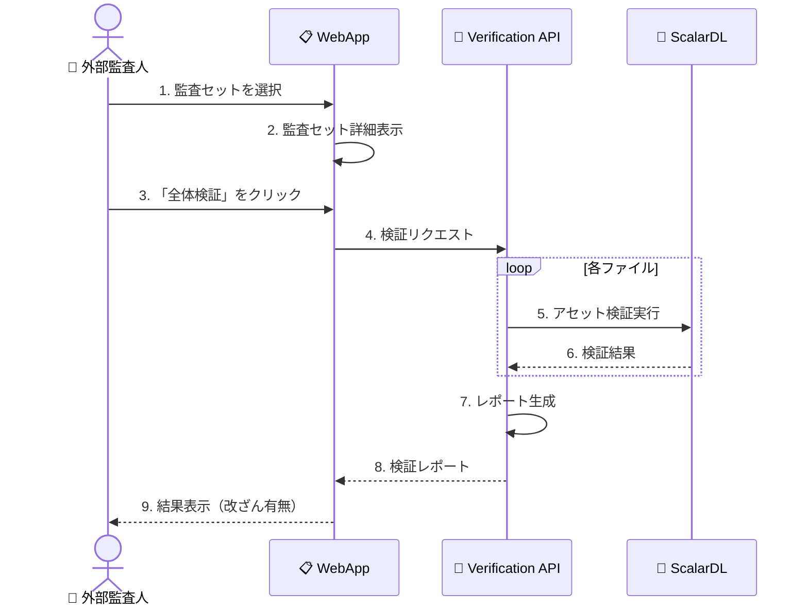
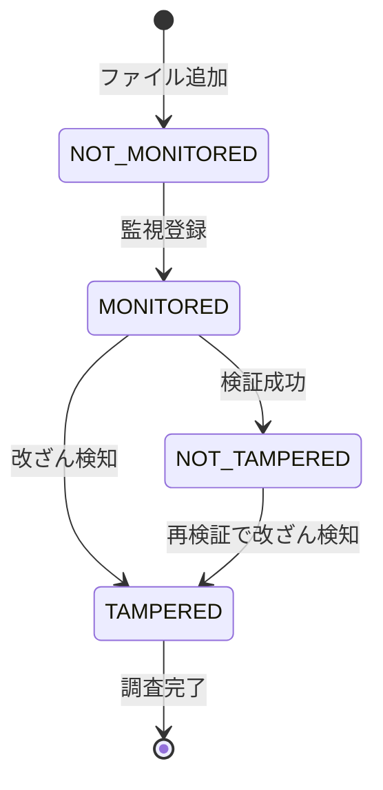
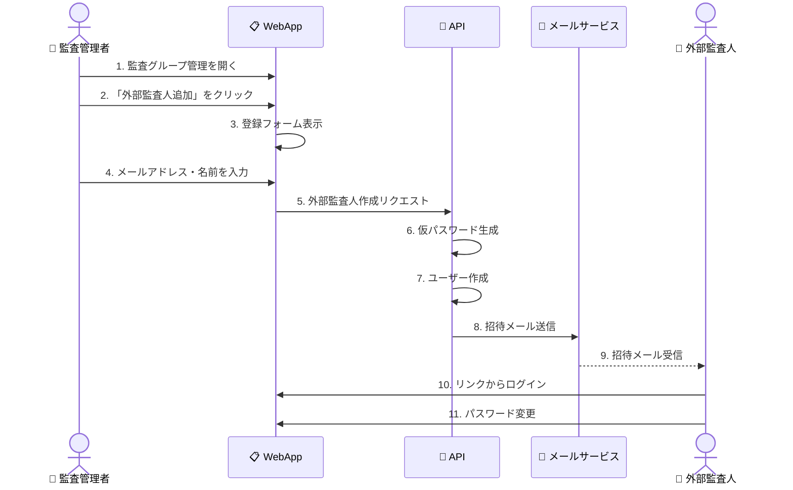
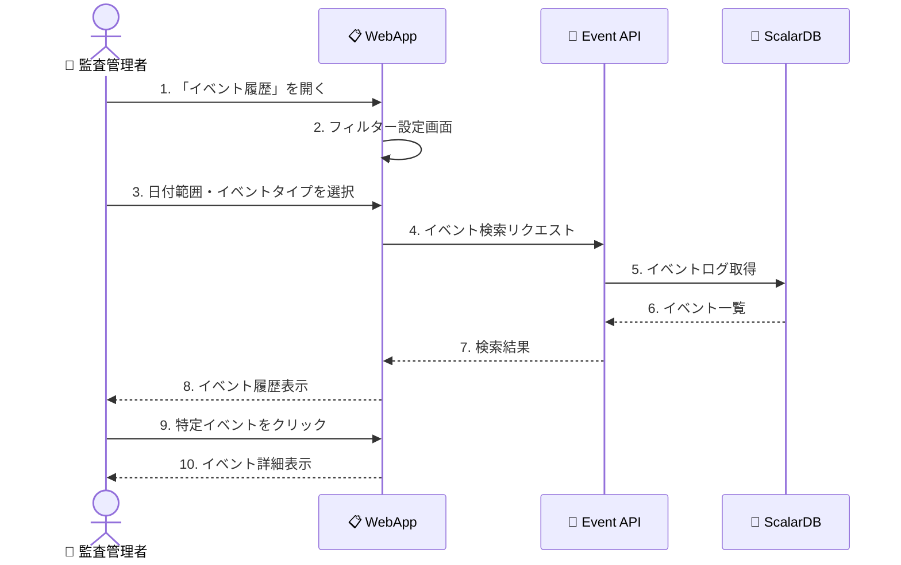

# ドメインストーリー: 監査セット管理

## 概要

監査セット管理ドメインにおける主要なビジネスプロセスをドメインストーリーテリング形式で可視化します。

---

## ストーリー1: 監査セットの作成

### シナリオ
監査管理者が新しい財務監査のための監査セットを作成する。

### 登場人物・オブジェクト
- 👤 監査管理者（Audit Admin）
- 📁 監査セット（Audit Set）
- 📋 Scalar Auditor WebApp
- 💾 ScalarDB

### ストーリー図



### アクティビティ記述

| # | アクター | アクション | オブジェクト | 結果 |
|---|---------|-----------|-------------|------|
| 1 | 監査管理者 | クリック | 監査セット作成ボタン | フォーム表示 |
| 2 | 監査管理者 | 入力 | 監査セット情報 | データ準備 |
| 3 | WebApp | 送信 | 作成リクエスト | API呼び出し |
| 4 | API | 保存 | 監査セット | DB永続化 |
| 5 | API | 登録 | 所有者コラボレーター | 権限設定 |
| 6 | WebApp | 表示 | 監査セット詳細 | 作成完了 |

---

## ストーリー2: ファイルを監査セットに追加

### シナリオ
一般ユーザーがBOX統合メニューからファイルを監査セットに追加する。

### 登場人物・オブジェクト
- 👤 一般ユーザー（General User）
- 📄 ファイル（File）
- 📁 監査セット（Audit Set）
- 🔗 BOX統合メニュー
- 🔐 ScalarDL

### ストーリー図

```mermaid
sequenceDiagram
    actor GU as 👤 一般ユーザー
    participant BOX as 📦 BOX
    participant MENU as 🔗 統合メニュー
    participant API as 🔧 API
    participant DL as 🔐 ScalarDL
    
    GU->>BOX: 1. ファイルを選択
    BOX->>MENU: 2. 統合メニューを開く
    GU->>MENU: 3. 「監査セットに追加」を選択
    MENU->>MENU: 4. 監査セット一覧を表示
    GU->>MENU: 5. 対象の監査セットを選択
    MENU->>API: 6. ファイル追加リクエスト
    API->>API: 7. 権限チェック
    API->>API: 8. ファイル情報取得
    API->>DL: 9. ファイルを監視対象として登録
    DL-->>API: 10. 登録完了
    API-->>MENU: 11. 追加成功
    MENU-->>GU: 12. 成功メッセージ表示
```

### ビジネスルール

1. **権限チェック**: ユーザーは監査セットへのMEMBER以上の権限が必要
2. **重複チェック**: 同一ファイルの重複追加は不可
3. **監視登録**: 追加時にScalarDLへの自動登録

---

## ストーリー3: 監査セットの検証実行

### シナリオ
外部監査人が監査セット全体のファイル整合性を検証する。

### 登場人物・オブジェクト
- 👤 外部監査人（External Auditor）
- 📁 監査セット（Audit Set）
- 📄 ファイル（Files）
- 🔐 ScalarDL
- 📊 検証レポート

### ストーリー図



### 検証ステータス



---

## ストーリー4: 外部監査人の招待

### シナリオ
監査管理者が外部監査人を監査セットに招待する。

### ストーリー図



---

## ストーリー5: イベント履歴の確認

### シナリオ
監査管理者がファイルの変更履歴を確認する。

### ストーリー図



---

## ドメイン語彙（このストーリーで使用）

| 用語 | 定義 | 使用箇所 |
|------|------|---------|
| 監査セット | 監査対象ファイルのグループ | 全ストーリー |
| コラボレーター | 監査セットへのアクセス権を持つユーザー | ストーリー1, 2 |
| 検証 | ScalarDLによる改ざんチェック | ストーリー3 |
| 外部監査人 | 外部組織からの監査担当者 | ストーリー3, 4 |
| イベント | BOXでの操作履歴 | ストーリー5 |

---

## 次のステップ

1. 各ストーリーの詳細化（例外フロー、エラーケース）
2. UIモックアップとの対応付け
3. API設計との整合性確認
