# ドメインストーリー集

## 概要

本ドキュメントは、Scalar Auditor for BOXシステムの6つの境界づけられたコンテキストにおける主要なビジネスプロセスをドメインストーリーテリング形式で記述します。

### 表記法

```
[アクター] が {ワークオブジェクト} を 《アクティビティ》 する
→ [次のアクター/システム] へ渡す
```

---

## 1. Identity & Access Context (認証・アクセス管理)

### Story 1.1: ユーザー認証フロー

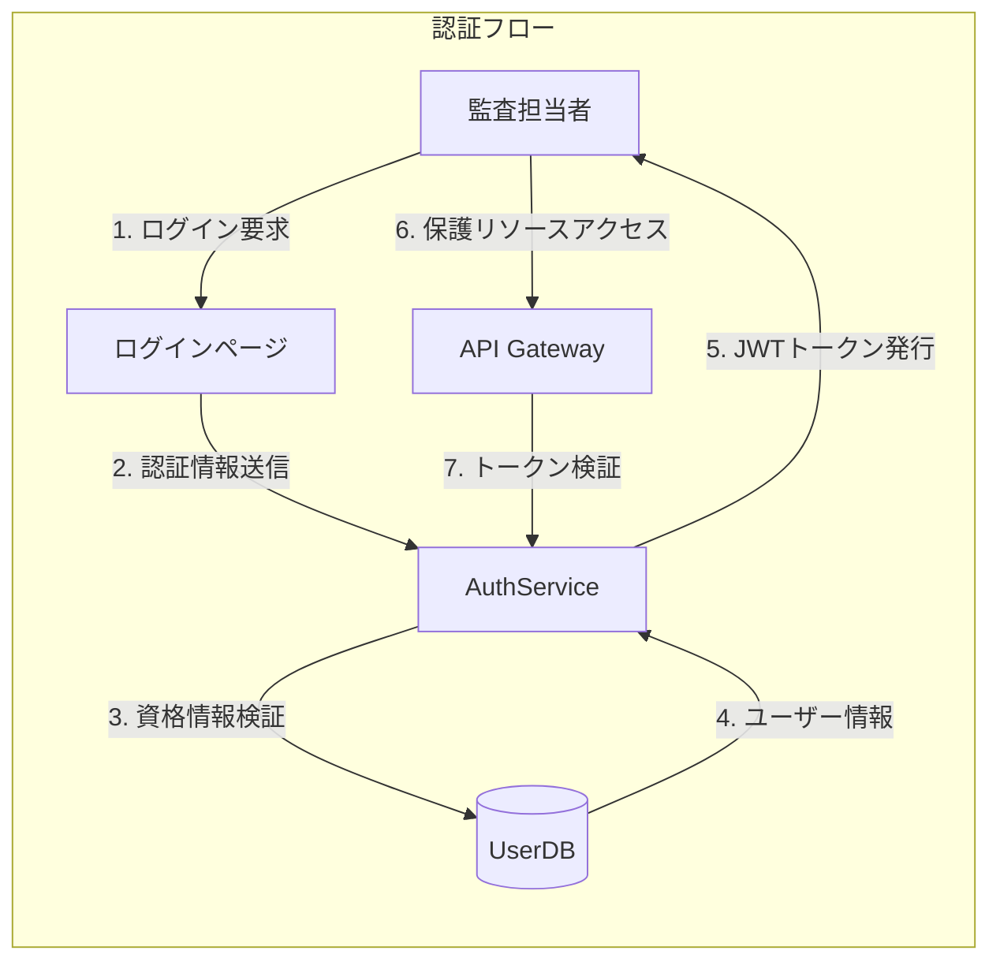

**ナラティブ:**

1. **[監査担当者]** が {ログインフォーム} に《認証情報を入力》する
2. **[AuthService]** が {認証情報} を《検証》する
3. **[AuthService]** が {JWTトークン} を《発行》して [監査担当者] へ渡す
4. **[監査担当者]** が {JWTトークン} を使用して《保護リソースにアクセス》する
5. **[API Gateway]** が {JWTトークン} を《検証》して [バックエンドサービス] へ転送する

**ビジネスルール:**
- トークン有効期限: 8時間
- リフレッシュトークン: 7日間
- 3回連続失敗でアカウントロック

---

### Story 1.2: ロール・権限管理

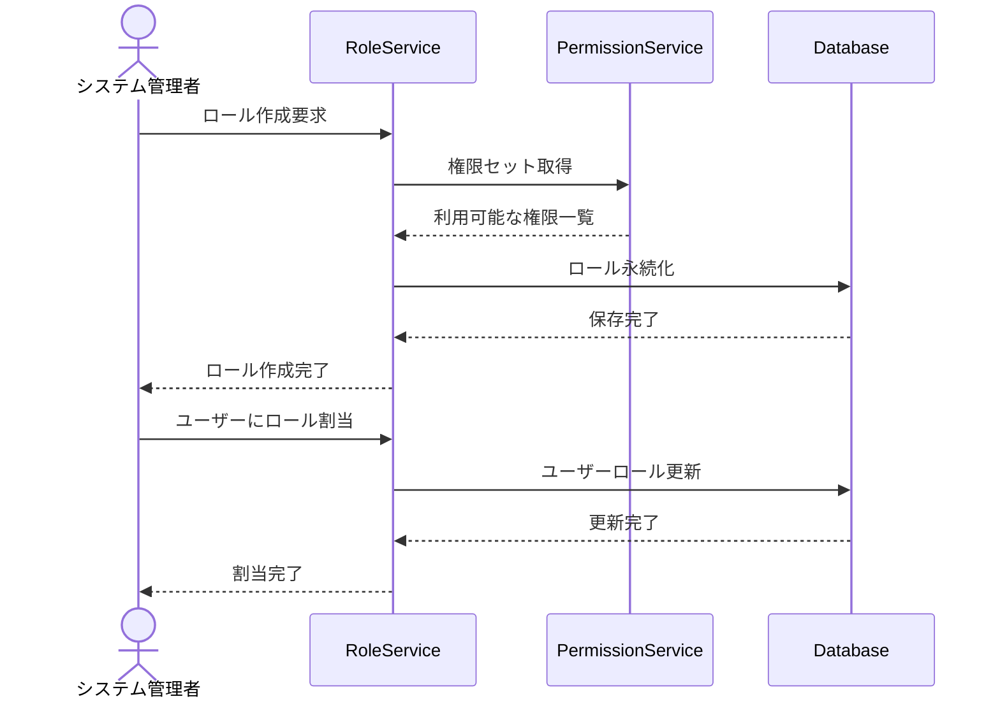

**ナラティブ:**

1. **[システム管理者]** が {新規ロール} を《定義》する
2. **[RoleService]** が {権限セット} を《ロールに紐付け》する
3. **[システム管理者]** が {ユーザー} に《ロールを割り当て》る
4. **[PermissionService]** が {アクセス要求} を《権限チェック》する

**ビジネスルール:**
- 最小権限の原則
- ロール階層: Admin > Manager > Auditor > Viewer
- 権限の継承は上位ロールのみ

---

## 2. Audit Management Context (監査管理)

### Story 2.1: 監査セット作成

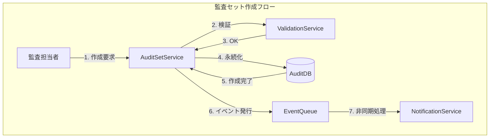

**ナラティブ:**

1. **[監査担当者]** が {監査セット名と説明} を《入力》する
2. **[AuditSetService]** が {入力データ} を《バリデーション》する
3. **[AuditSetService]** が {監査セット} を《作成》してDBに保存する
4. **[EventPublisher]** が {AuditSetCreatedイベント} を《発行》する
5. **[NotificationService]** が {関係者} に《通知》する

**ビジネスルール:**
- 監査セット名は一意である必要がある
- 作成者は自動的にオーナーとなる
- 監査セットには最低1つの監査アイテムが必要（後から追加可）

---

### Story 2.2: 監査アイテム追加

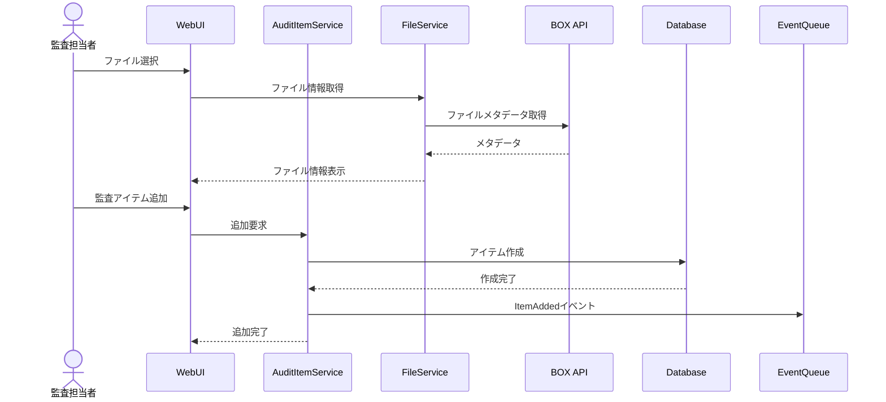

**ナラティブ:**

1. **[監査担当者]** が {BOXファイル} を《選択》する
2. **[FileService]** が {ファイルメタデータ} を《BOXから取得》する
3. **[監査担当者]** が {監査アイテム} を《監査セットに追加》する
4. **[AuditItemService]** が {監査アイテム} を《作成》してDBに保存する
5. **[EventPublisher]** が {ItemAddedイベント} を《発行》する

**ビジネスルール:**
- 同一ファイルの重複追加は不可
- ファイルの現在バージョンがスナップショットとして保存される
- 監査アイテムステータス: Pending → InProgress → Completed

---

### Story 2.3: 監査セット削除（Saga）

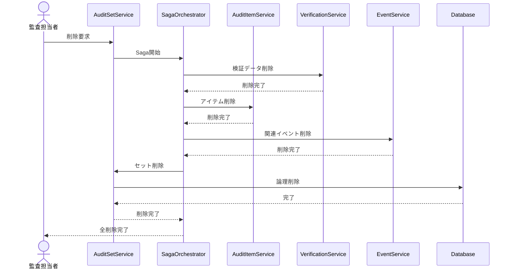

**ナラティブ:**

1. **[監査担当者]** が {監査セット} の《削除を要求》する
2. **[SagaOrchestrator]** が {削除Saga} を《開始》する
3. **[VerificationService]** が {関連する検証データ} を《削除》する
4. **[AuditItemService]** が {すべての監査アイテム} を《削除》する
5. **[EventService]** が {関連イベント} を《アーカイブ》する
6. **[AuditSetService]** が {監査セット} を《論理削除》する
7. **[SagaOrchestrator]** が {完了ステータス} を《報告》する

**補償トランザクション:**
- 各ステップで失敗した場合、前のステップをロールバック
- 削除は論理削除で、30日後に物理削除

---

## 3. File Management Context (ファイル管理)

### Story 3.1: ファイル同期

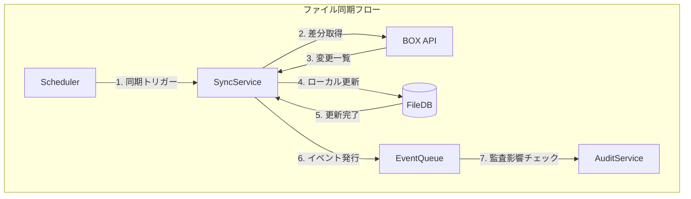

**ナラティブ:**

1. **[Scheduler]** が {同期ジョブ} を《定期実行》する（5分間隔）
2. **[SyncService]** が {BOX} から《変更差分を取得》する
3. **[SyncService]** が {ファイルメタデータ} を《ローカルDBに同期》する
4. **[EventPublisher]** が {FileSyncedイベント} を《発行》する
5. **[AuditService]** が {監査対象ファイルの変更} を《検出》して通知する

**ビジネスルール:**
- 削除されたファイルは論理削除として保持
- バージョン履歴は最大100世代保持
- ファイルサイズ上限: 5GB

---

### Story 3.2: コラボレーター管理

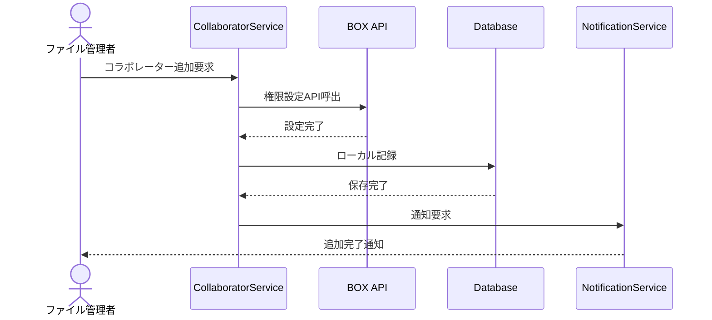

**ナラティブ:**

1. **[ファイル管理者]** が {ユーザー} を《コラボレーターとして追加》する
2. **[CollaboratorService]** が {BOX API} 経由で《権限を設定》する
3. **[CollaboratorService]** が {コラボレーター情報} を《ローカルDBに記録》する
4. **[NotificationService]** が {新規コラボレーター} に《招待通知》する

**ビジネスルール:**
- 権限レベル: Owner > Editor > Viewer
- 継承権限のオーバーライドは明示的に行う
- 監査対象ファイルの権限変更はログ記録

---

## 4. Event Tracking Context (イベント追跡)

### Story 4.1: BOXイベント取得

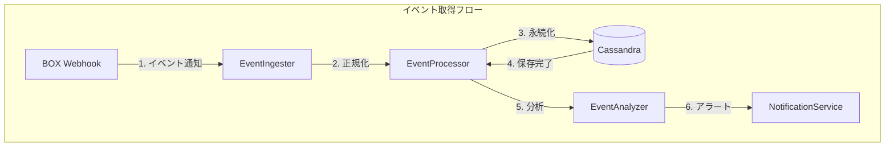

**ナラティブ:**

1. **[BOX Webhook]** が {イベント} を《システムに通知》する
2. **[EventIngester]** が {生イベント} を《正規化》する
3. **[EventProcessor]** が {正規化イベント} を《Cassandraに永続化》する
4. **[EventAnalyzer]** が {イベントパターン} を《分析》する
5. **[NotificationService]** が {異常検知時} に《アラート》する

**ビジネスルール:**
- イベントは追記のみ（不変）
- 保持期間: 監査イベント=7年、一般イベント=1年
- 毎秒1000イベントの処理能力

---

### Story 4.2: イベント検索・フィルタリング

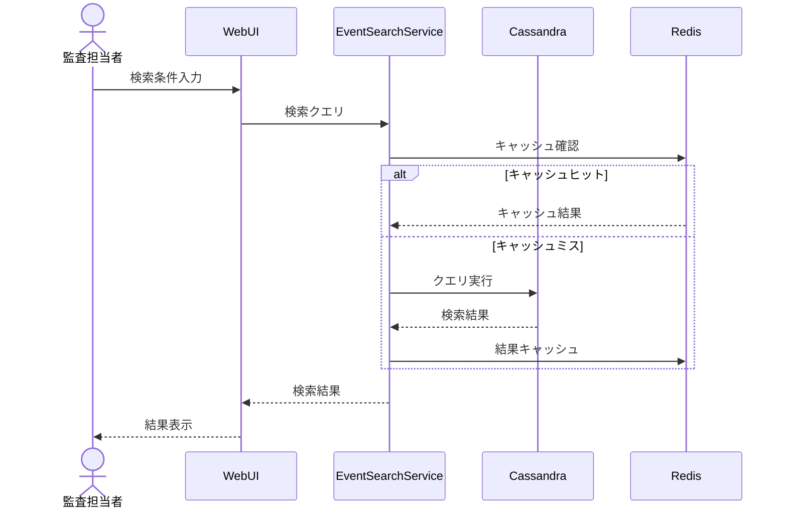

**ナラティブ:**

1. **[監査担当者]** が {検索条件（期間、ファイル、アクション）} を《入力》する
2. **[EventSearchService]** が {キャッシュ} を《確認》する
3. **[EventSearchService]** が {Cassandra} から《イベントを検索》する
4. **[EventSearchService]** が {検索結果} を《フィルタリング・ソート》する
5. **[WebUI]** が {イベント一覧} を《表示》する

**ビジネスルール:**
- 検索結果は最大10,000件まで
- ページネーション: 100件/ページ
- 頻繁なクエリは5分間キャッシュ

---

## 5. Integrity Verification Context (整合性検証)

### Story 5.1: ハッシュ計算と登録

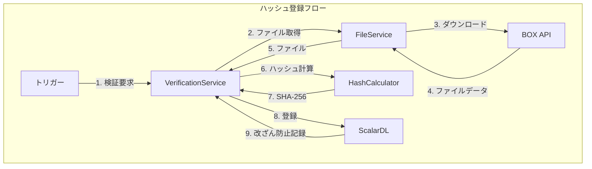

**ナラティブ:**

1. **[監査担当者/システム]** が {ファイル} の《検証を要求》する
2. **[VerificationService]** が {ファイル} を《BOXから取得》する
3. **[HashCalculator]** が {ファイルコンテンツ} の《SHA-256ハッシュを計算》する
4. **[VerificationService]** が {ハッシュ値} を《ScalarDLに登録》する
5. **[ScalarDL]** が {登録証明} を《発行》する

**ビジネスルール:**
- ハッシュアルゴリズム: SHA-256
- 同一ファイルの再登録は新バージョンとして記録
- ScalarDLによる改ざん防止保証

---

### Story 5.2: 整合性検証実行

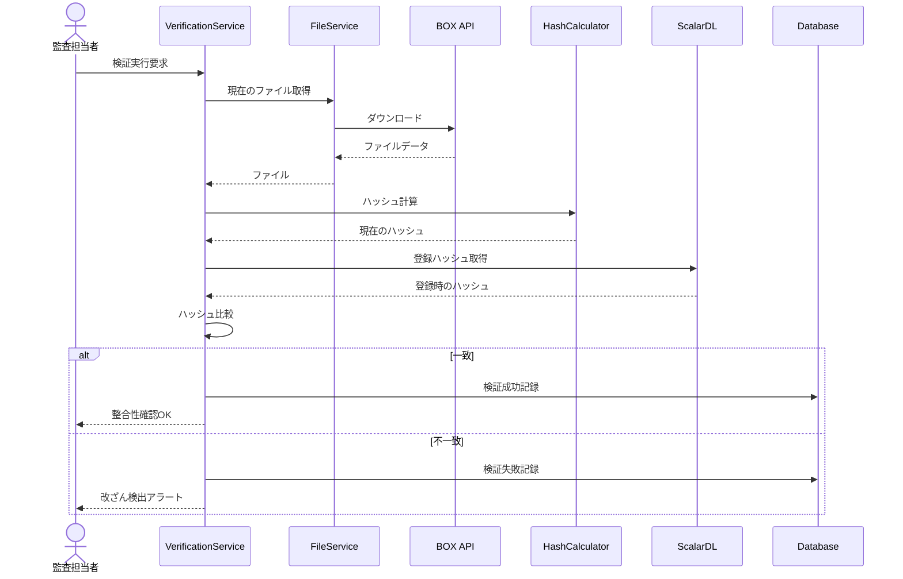

**ナラティブ:**

1. **[監査担当者]** が {監査アイテム} の《整合性検証を実行》する
2. **[VerificationService]** が {現在のファイル} を《BOXから取得》する
3. **[HashCalculator]** が {現在のハッシュ} を《計算》する
4. **[VerificationService]** が {登録時のハッシュ} を《ScalarDLから取得》する
5. **[VerificationService]** が {ハッシュを比較} して《検証結果を判定》する
6. **[VerificationService]** が {検証結果} を《記録》する
7. 不一致の場合、**[NotificationService]** が《アラート》する

**ビジネスルール:**
- 検証結果: Verified / Tampered / NotRegistered / Error
- 改ざん検出時は即時アラート
- 検証履歴は永久保持

---

## 6. BOX Integration Context (BOX連携)

### Story 6.1: OAuth認証フロー

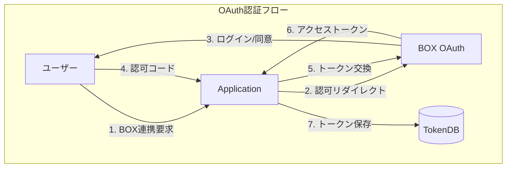

**ナラティブ:**

1. **[ユーザー]** が {BOX連携} を《開始》する
2. **[Application]** が {認可リクエスト} を《BOXに送信》する
3. **[ユーザー]** が {BOXログイン画面} で《認証・同意》する
4. **[BOX]** が {認可コード} を《Applicationに返却》する
5. **[Application]** が {認可コード} を《アクセストークンに交換》する
6. **[TokenService]** が {トークン} を《暗号化して保存》する

**ビジネスルール:**
- アクセストークン有効期限: 60分
- リフレッシュトークン有効期限: 60日
- トークンはAES-256で暗号化保存

---

### Story 6.2: Webhookイベント処理

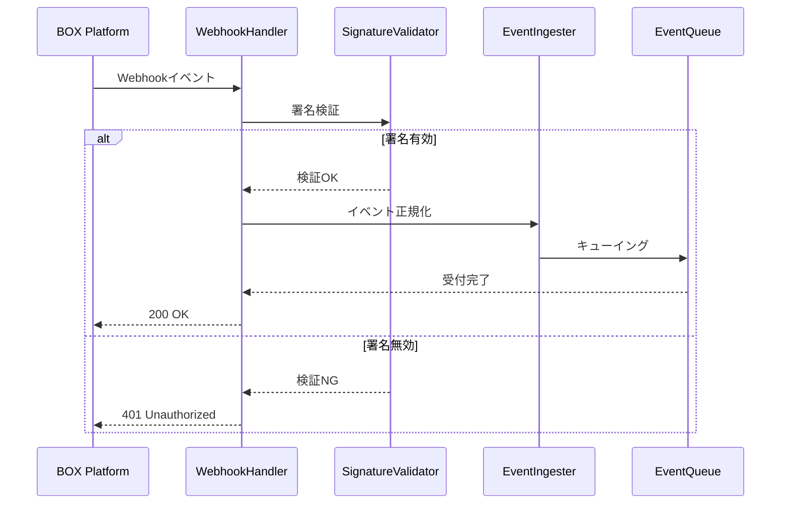

**ナラティブ:**

1. **[BOX Platform]** が {Webhookイベント} を《エンドポイントに送信》する
2. **[WebhookHandler]** が {リクエスト署名} を《検証》する
3. **[EventIngester]** が {イベントペイロード} を《正規化》する
4. **[EventQueue]** が {イベント} を《非同期処理キューに追加》する
5. **[WebhookHandler]** が {200 OK} を《即座に返却》する

**ビジネスルール:**
- Webhook署名はHMAC-SHA256で検証
- 応答は3秒以内（タイムアウト対策）
- リトライ: 最大5回（指数バックオフ）

---

### Story 6.3: API レート制限対応

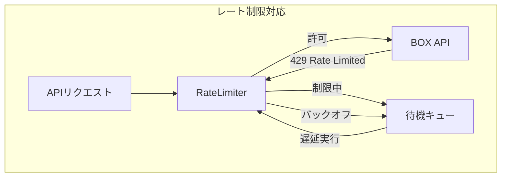

**ナラティブ:**

1. **[Application]** が {APIリクエスト} を《発行》する
2. **[RateLimiter]** が {レート制限状態} を《確認》する
3. 制限内の場合、**[RateLimiter]** が {リクエスト} を《BOX APIに転送》する
4. 429応答の場合、**[RateLimiter]** が {リクエスト} を《待機キューに追加》する
5. **[RateLimiter]** が {指数バックオフ} で《リトライ》する

**ビジネスルール:**
- BOX APIレート: 1000リクエスト/分
- ローカルレート制限: 800リクエスト/分（バッファ）
- バックオフ: 1秒 → 2秒 → 4秒 → ... 最大60秒

---

## 7. クロスコンテキストシナリオ

### Story 7.1: 監査完了レポート生成

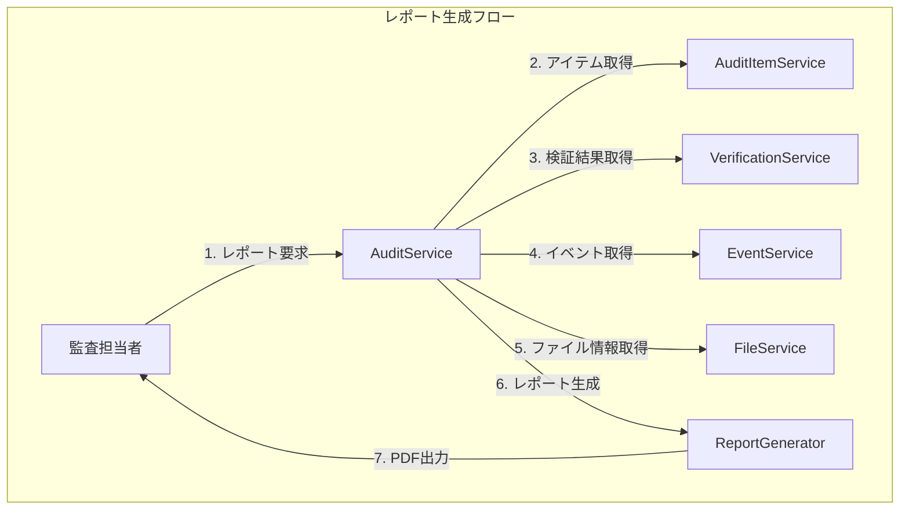

**ナラティブ:**

1. **[監査担当者]** が {監査セット} の《レポート生成を要求》する
2. **[AuditService]** が {各サービス} から《必要データを収集》する
3. **[ReportGenerator]** が {収集データ} を《レポート形式に整形》する
4. **[ReportGenerator]** が {PDF/Excel} として《エクスポート》する

---

### Story 7.2: ファイル変更検知と監査影響通知

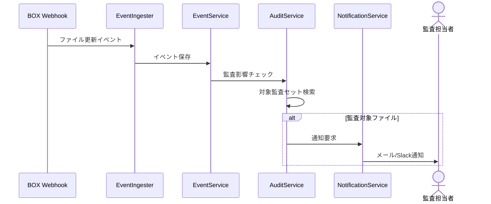

**ナラティブ:**

1. **[BOX]** が {ファイル更新イベント} を《Webhookで通知》する
2. **[EventService]** が {イベント} を《記録》する
3. **[AuditService]** が {監査対象かどうか} を《チェック》する
4. 監査対象の場合、**[NotificationService]** が {担当者} に《通知》する

---

## 8. ドメイン用語集

| 用語 | 日本語 | 定義 |
|------|--------|------|
| Audit Set | 監査セット | 監査対象ファイルをグループ化したコンテナ |
| Audit Item | 監査アイテム | 監査セット内の個別監査対象 |
| Verification | 検証 | ファイルの整合性を確認するプロセス |
| Hash | ハッシュ | ファイルの一意識別子（SHA-256） |
| Collaborator | コラボレーター | ファイルへのアクセス権を持つユーザー |
| Webhook | ウェブフック | BOXからのリアルタイムイベント通知 |
| ScalarDL | スカラーDL | 改ざん防止ストレージ |

---

*Generated: 2025-12-26*
*Version: 1.0.0*
*Source: Scalar Auditor for BOX Domain Analysis*
