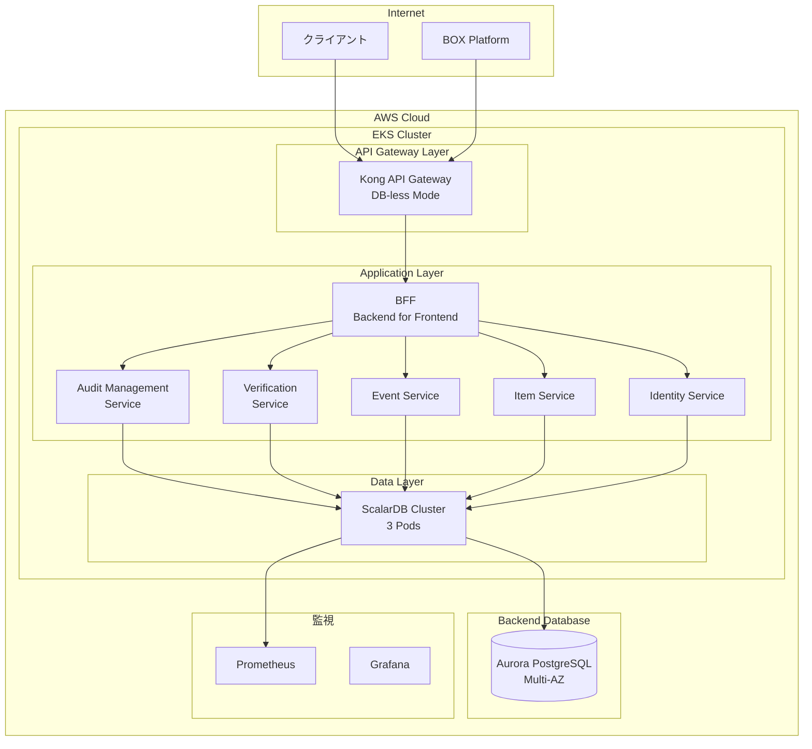
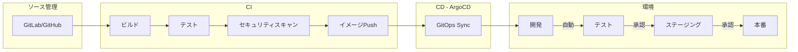
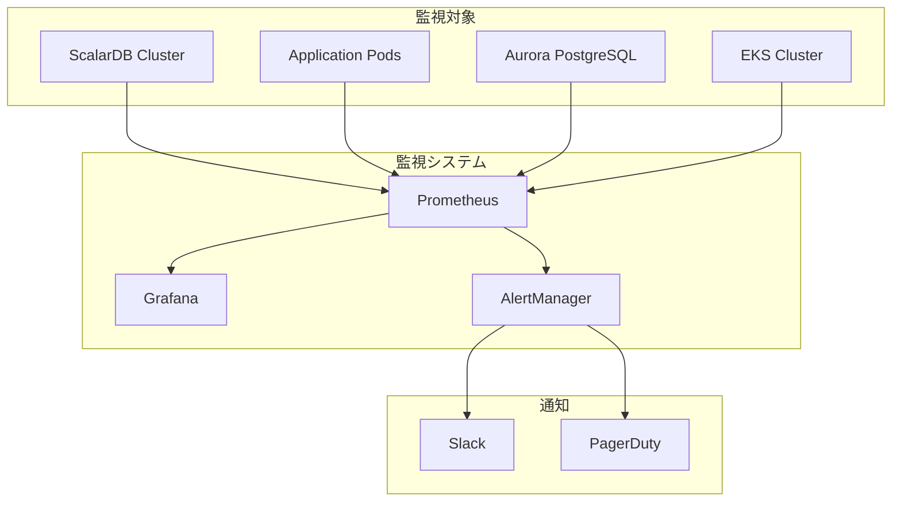

# ScalarDB Cluster サイジング見積もり

## 1. エグゼクティブサマリー

### 要件概要

| 項目 | 値 |
|------|-----|
| 対象システム | Scalar Auditor for BOX |
| 環境構成 | 全環境セット（開発/テスト/ステージング/本番 + CI/CD） |
| 想定TPS | 〜500 TPS |
| 目標可用性 | 99.9%（年間ダウンタイム8.76時間まで） |
| ScalarDB Analytics | 使用しない |
| クラウド | AWS |

### 費用サマリー（月額）

| 環境 | ScalarDBライセンス | インフラ | 合計 |
|------|-------------------|---------|------|
| 開発 | ¥200,000 | ¥45,000 | **¥245,000** |
| テスト | ¥300,000 | ¥85,000 | **¥385,000** |
| ステージング | ¥300,000 | ¥120,000 | **¥420,000** |
| 本番 | ¥300,000 | ¥180,000 | **¥480,000** |
| **全環境合計** | **¥1,100,000** | **¥430,000** | **¥1,530,000/月** |

※ ScalarDB Standard ライセンス（¥100,000/Pod/月）を想定
※ 為替レート: 1 USD = 150 JPY

---

## 2. アーキテクチャ構成

### 全体アーキテクチャ



### アーキテクチャ選定根拠

| 選択 | 根拠 |
|------|------|
| Kong DB-less | GitOps親和性、設定のバージョン管理、Admin API不要 |
| Aurora PostgreSQL | 高可用性、自動フェイルオーバー、ScalarDB公式サポート |
| Prometheus + Grafana | OSS・コスト効率、ScalarDB公式メトリクス対応 |

---

## 3. ScalarDB Cluster サイジング

### 3.1 Pod数計算

#### 性能要件からの計算

```
目標TPS: 500 TPS
ワークロード: バランス型（読み書き混在）
TPS/Pod（v3.17最適化有効）: 900〜2,400 TPS

必要Pod数 = ceil(500 / 1,000) = 1 pod
```

#### 可用性要件からの計算

```
目標可用性: 99.9%
障害許容: 1 Pod障害でもサービス継続

Raft構成の最小クォーラム: 3 Pods
障害時の稼働Pod: 2 Pods
2 Pods × 1,000 TPS = 2,000 TPS（500 TPSを十分カバー）

必要Pod数 = 3 pods
```

#### 最終決定

```
本番Pod数 = max(性能要件1, 可用性要件3, 最小3) = 3 pods
```

### 3.2 環境別ScalarDB構成

| 環境 | Pod数 | CPU/Pod | Memory/Pod | 根拠 |
|------|-------|---------|------------|------|
| 開発 | 2 | 500m | 1Gi | 最小構成、開発テスト用 |
| テスト | 3 | 1 | 2Gi | HA構成、結合テスト用 |
| ステージング | 3 | 2 | 4Gi | 本番同等、性能検証用 |
| 本番 | 3 | 2 | 4Gi | 500 TPS + 99.9%可用性 |

### 3.3 ScalarDB v3.17 最適化設定

```yaml
# クライアント側設定（推奨）
scalar.db.cluster.client.piggyback_begin.enabled: true
scalar.db.cluster.client.write_buffering.enabled: true

# サーバー側設定（推奨）
scalar.db.consensus_commit.async_commit.enabled: true
scalar.db.consensus_commit.one_phase_commit.enabled: true  # 単一DB時
```

**期待効果**: 従来比1.5〜2倍の性能向上

---

## 4. Kubernetes サイジング

### 4.1 Node数計算

#### 本番環境

```
ScalarDB: 3 pods × 2 vCPU = 6 vCPU
Application: 6 services × 2 pods × 1 vCPU = 12 vCPU
Kong: 2 pods × 0.5 vCPU = 1 vCPU
Monitoring: 2 vCPU

Total: 21 vCPU
Node Type: m6i.xlarge (4 vCPU)
必要Node数 = ceil(21/4) × 1.3（冗長係数） = 7 nodes
→ 3 AZ分散のため 9 nodes（3 × 3）
```

### 4.2 環境別Kubernetes構成

| 環境 | Node数 | Instance Type | 合計vCPU | 合計Memory |
|------|--------|---------------|----------|------------|
| 開発 | 2 | t3.medium | 4 vCPU | 8 GB |
| テスト | 3 | m6i.large | 6 vCPU | 24 GB |
| ステージング | 5 | m6i.xlarge | 20 vCPU | 80 GB |
| 本番 | 9 | m6i.xlarge | 36 vCPU | 144 GB |

### 4.3 Node Pool構成（本番）

```yaml
nodePools:
  - name: scalardb-pool
    instanceType: r6i.xlarge  # 4 vCPU, 32 GB（メモリ重視）
    count: 3
    labels:
      workload: scalardb
    taints:
      - key: dedicated
        value: scalardb
        effect: NoSchedule

  - name: application-pool
    instanceType: m6i.xlarge  # 4 vCPU, 16 GB
    count: 4
    labels:
      workload: application

  - name: system-pool
    instanceType: m6i.large  # 2 vCPU, 8 GB
    count: 2
    labels:
      workload: system
```

---

## 5. バックエンドデータベースサイジング

### 5.1 Aurora PostgreSQL構成

| 環境 | Instance Class | Storage | Multi-AZ | Read Replica |
|------|---------------|---------|----------|--------------|
| 開発 | db.t4g.medium | 20 GB | No | No |
| テスト | db.r6g.large | 50 GB | No | No |
| ステージング | db.r6g.xlarge | 100 GB | Yes | No |
| 本番 | db.r6g.xlarge | 200 GB | Yes | 1 |

### 5.2 データベースサイジング根拠

```
想定データ量:
- 監査セット: 〜10,000件
- ファイル/フォルダ: 〜1,000,000件
- イベントログ: 〜100,000,000件/年

ストレージ計算:
- レコードあたり平均サイズ: 1KB
- ScalarDBオーバーヘッド: +30%
- 年間増加量: 100GB
- 5年運用想定: 500GB

本番ストレージ = 200GB（初期）+ Auto Scaling
```

### 5.3 IOPS計算

```
TPS: 500
ScalarDB I/Oパターン: 1トランザクションあたり約5 I/O
必要IOPS = 500 × 5 = 2,500 IOPS

db.r6g.xlarge: 最大12,500 IOPS → 十分な余裕
```

---

## 6. 費用詳細

### 6.1 ScalarDBライセンス費用（月額）

| 環境 | Pod数 | 単価/Pod | 月額 |
|------|-------|----------|------|
| 開発 | 2 | ¥100,000 | ¥200,000 |
| テスト | 3 | ¥100,000 | ¥300,000 |
| ステージング | 3 | ¥100,000 | ¥300,000 |
| 本番 | 3 | ¥100,000 | ¥300,000 |
| **合計** | **11** | | **¥1,100,000** |

### 6.2 AWSインフラ費用（月額）

| コンポーネント | 開発 | テスト | ステージング | 本番 |
|--------------|------|--------|-------------|------|
| EKS Cluster | $73 | $73 | $73 | $73 |
| EC2 (Nodes) | $150 | $300 | $500 | $900 |
| Aurora PostgreSQL | $50 | $150 | $300 | $500 |
| ALB | $20 | $30 | $50 | $80 |
| EBS Storage | $5 | $10 | $30 | $50 |
| Data Transfer | $2 | $5 | $20 | $50 |
| CloudWatch | $5 | $10 | $20 | $50 |
| **USD小計** | **$305** | **$578** | **$993** | **$1,703** |
| **JPY小計** | **¥45,750** | **¥86,700** | **¥148,950** | **¥255,450** |

※ 為替レート: 1 USD = 150 JPY

### 6.3 総費用サマリー（月額）

| 環境 | ライセンス | インフラ | 合計 |
|------|-----------|---------|------|
| 開発 | ¥200,000 | ¥45,750 | ¥245,750 |
| テスト | ¥300,000 | ¥86,700 | ¥386,700 |
| ステージング | ¥300,000 | ¥148,950 | ¥448,950 |
| 本番 | ¥300,000 | ¥255,450 | ¥555,450 |
| **全環境合計** | **¥1,100,000** | **¥537,850** | **¥1,637,850** |

### 6.4 年間費用

| 項目 | 月額 | 年額 |
|------|------|------|
| ScalarDBライセンス | ¥1,100,000 | ¥13,200,000 |
| AWSインフラ | ¥537,850 | ¥6,454,200 |
| **合計** | **¥1,637,850** | **¥19,654,200** |

---

## 7. CI/CD パイプライン構成



### CI/CDツール構成

| コンポーネント | ツール | 費用/月 |
|--------------|--------|---------|
| ソース管理 | GitLab (SaaS) | $19/user |
| CI | GitLab CI | 含む |
| CD | ArgoCD (OSS) | $0 |
| コンテナレジストリ | ECR | 〜$10 |
| Helm Charts | ScalarDB Helm Charts | 含む |

---

## 8. 監視・アラート構成

### 8.1 監視スタック



### 8.2 ScalarDB メトリクス

| メトリクス | 説明 | アラート閾値 |
|-----------|------|-------------|
| scalardb_cluster_transaction_latency | トランザクションレイテンシ | P99 > 500ms |
| scalardb_cluster_active_transactions | アクティブトランザクション数 | > 1000 |
| scalardb_cluster_commit_rate | コミット成功率 | < 99% |
| scalardb_cluster_retry_count | リトライ回数 | > 100/min |

---

## 9. 推奨事項

### 9.1 段階的導入

1. **Phase 1（1-2ヶ月）**: 開発環境構築、PoC実施
2. **Phase 2（2-3ヶ月）**: テスト環境構築、結合テスト
3. **Phase 3（3-4ヶ月）**: ステージング環境、性能テスト
4. **Phase 4（4-5ヶ月）**: 本番環境構築、移行

### 9.2 コスト最適化オプション

| オプション | 削減率 | 適用環境 |
|-----------|--------|---------|
| Reserved Instances (1年) | 30-40% | 本番・ステージング |
| Savings Plans | 20-30% | 全環境 |
| Spot Instances | 60-70% | 開発・テスト |
| 開発環境の夜間停止 | 50% | 開発 |

### 9.3 将来の拡張性

- **TPS増加時**: Pod数を段階的に追加（〜2,000 TPSまで3 Podsで対応可能）
- **可用性向上時**: Multi-Region構成への拡張
- **分析要件時**: ScalarDB Analytics (EMR/Databricks) 追加

---

## 10. 前提条件・制約事項

### 前提条件

- AWS東京リージョン (ap-northeast-1) を使用
- ScalarDB v3.17以上を使用
- Kubernetes v1.28以上を使用
- ネットワークレイテンシ: 同一リージョン内 < 1ms

### 制約事項

- ScalarDBライセンス費用は参考値（正式見積もりはScalar社へ）
- AWS費用は2024年1月時点の価格
- 為替レート変動により費用は変動する可能性あり

---

*見積もり作成日: 2026年1月*
*為替レート: 1 USD = 150 JPY*
